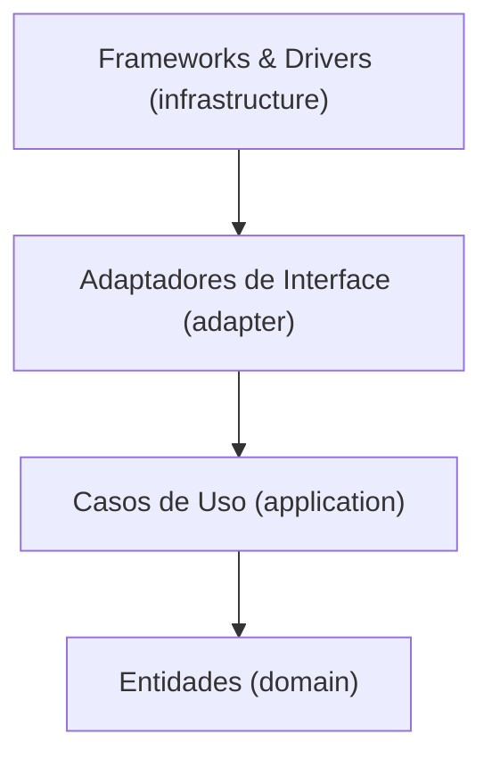

# Sistema de Gestão de Restaurantes — Tech Challenge Fase 2

Sistema back-end para gestão compartilhada de restaurantes, desenvolvido como parte do **Tech Challenge** da Pós-Tech em Arquitetura e Desenvolvimento Java. O projeto nasce da proposta de um grupo de restaurantes que decidiu unir forças e construir uma plataforma única — em vez de manter sistemas individuais caros — permitindo que clientes escolham onde comer pela qualidade da comida, não pela qualidade do sistema.

A entrega é feita em fases incrementais. Esta fase (Fase 2) expande a base construída na Fase 1 com gestão de tipos de usuário, cadastro de restaurantes e cadastro de itens de cardápio, reforçando práticas de código limpo, testes automatizados e infraestrutura Docker.

## Funcionalidades desta fase

- **Tipo de Usuário** — CRUD de tipos (ex.: Dono de Restaurante, Cliente) e associação com usuários existentes.
- **Cadastro de Restaurante** — CRUD completo com nome, endereço, tipo de cozinha, horário de funcionamento e dono (usuário responsável).
- **Cadastro de Itens do Cardápio** — CRUD completo com nome, descrição, preço, disponibilidade exclusiva para consumo no local e caminho de armazenamento da foto do prato.

## Arquitetura

O projeto segue a **Clean Architecture** (Robert C. Martin), organizada em quatro camadas concêntricas, com a regra de dependência sempre apontando para dentro:



| Camada | Pacote | Responsabilidade |
|---|---|---|
| Entidades | `domain/entity`, `domain/vo`, `domain/exception` | Regras de negócio e invariantes, sem dependência de frameworks |
| Casos de Uso | `application/usecase`, `application/gateway`, `application/dto` | Orquestração das regras de aplicação via interfaces de gateway |
| Adaptadores de Interface | `adapter/controller`, `adapter/gateway`, `adapter/datasource`, `adapter/presenter` | Tradução entre o núcleo e o mundo externo |
| Frameworks & Drivers | `infrastructure/web`, `infrastructure/persistence`, `infrastructure/security`, `infrastructure/mail`, `infrastructure/config` | Spring, JPA, JWT, banco de dados — únicos detalhes técnicos do sistema |

Cada pacote tem um `package-info.java` descrevendo sua regra de dependência. Dentro das camadas, o código é agrupado por agregado/feature (`user`, `auth`, `address`...), para que a estrutura revele o domínio e não só o padrão arquitetural. A regra é validada automaticamente em build por testes de arquitetura com **ArchUnit**: nenhum tipo fora de `infrastructure` pode importar Spring, JPA ou Hibernate.

## Stack tecnológica

| Tecnologia | Uso |
|---|---|
| Java 21 (LTS) | Linguagem |
| Spring Boot 3.5.x | Framework base |
| Spring Data JPA / Hibernate | Persistência |
| Spring Security + JWT (jjwt) | Autenticação e autorização |
| Spring HATEOAS | Links de navegação nas respostas REST |
| PostgreSQL 16 | Banco de dados relacional |
| Flyway | Versionamento de schema |
| springdoc-openapi | Documentação Swagger |
| JUnit 5 + Mockito | Testes unitários |
| Testcontainers | Testes de integração com PostgreSQL real |
| ArchUnit | Testes da regra de dependência arquitetural |
| JaCoCo | Cobertura de testes unitários — build falha abaixo de 100% |
| Docker Compose | Orquestração de execução local |

## Pré-requisitos

- JDK 21 e Maven 3.9+
- Docker e Docker Compose (para o banco, para `docker compose up` e para os testes de integração)

## Como executar

```bash
# 1. (Opcional) criar o .env a partir do exemplo
cp .env.example .env

# 2. Subir apenas o banco (útil durante o desenvolvimento)
docker compose up -d db

# 3. Subir aplicação + banco juntos
docker compose up --build

# 4. Encerrar (adicione -v para apagar os dados do banco)
docker compose down
```

Aplicação: `http://localhost:8080`
Swagger UI: `http://localhost:8080/swagger-ui.html`
OpenAPI JSON: `http://localhost:8080/v3/api-docs`

## Testes

A suíte cobre cada camada isoladamente:

- **Entidades** — JUnit 5, sem mocks, um teste por invariante.
- **Casos de uso** — JUnit 5 + Mockito, mocks das interfaces de gateway.
- **Adaptadores** — JUnit 5 + Mockito, mocks das interfaces de origem de dados.
- **Persistência** — Testcontainers (PostgreSQL 16), migrations reais.
- **Arquitetura** — ArchUnit, valida a regra de dependência a cada build.

```bash
mvn test      # unitários + ArchUnit (sem Docker)
mvn verify    # + integração com Testcontainers + verificação de 100% de cobertura (JaCoCo)
```

Relatório de cobertura: `target/site/jacoco/index.html`.

## Entregáveis

- Coleção Postman (`postman/`) com um request por caso de sucesso e erro de cada endpoint.
- Documentação Swagger/OpenAPI.
- `docker-compose.yml` para subir aplicação e banco de dados.
- Relatório técnico em [`relatorios/`](relatorios/), organizado por etapa de desenvolvimento.
- Este README, com arquitetura, endpoints e instruções de execução.