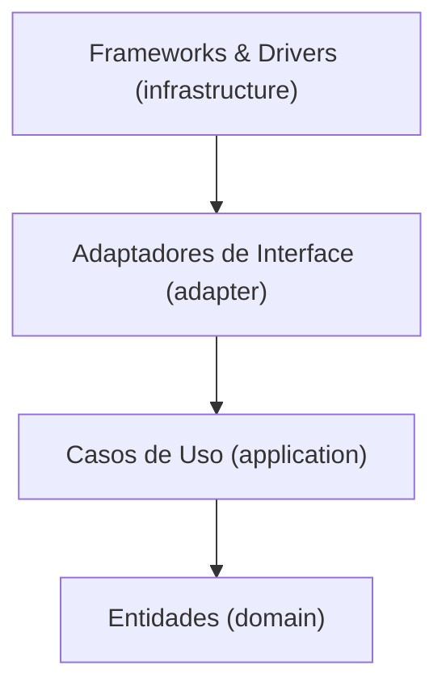

# Sistema de Gestão de Restaurantes — Tech Challenge Fase 2

Back-end para a gestão compartilhada de restaurantes, desenvolvido no **Tech Challenge** da
Pós-Tech em Arquitetura e Desenvolvimento Java. Um grupo de restaurantes decidiu construir uma
plataforma única, em vez de manter sistemas individuais caros, para que o cliente escolha onde
comer pela qualidade da comida, não pela do sistema.

A Fase 2 reconstrói a base em **Clean Architecture**, com testes automatizados em dois níveis e
execução completa em Docker Compose. O relatório técnico, organizado por etapa de
desenvolvimento, está em [`relatorios/`](relatorios/).

## Estado da entrega

| Funcionalidade | Estado |
| --- | --- |
| Cadastro de usuários (autocadastro, consulta, listagem, atualização, exclusão, troca de senha) | ✅ Implementado |
| Autenticação JWT, autorização por posse e papel de administrador | ✅ Implementado |
| Recuperação de senha por e-mail (token de uso único com validade) | ✅ Implementado |
| Tipos de usuário | ✅ Catálogo fixo — dono de restaurante, cliente e administrador — associado no cadastro. CRUD do catálogo: pendente |
| Cadastro de restaurantes | ⏳ Pendente |
| Cadastro de itens de cardápio | ⏳ Pendente |

## Arquitetura

Quatro camadas concêntricas (Robert C. Martin), com a dependência sempre apontando para dentro:



| Camada | Pacote | Responsabilidade |
|---|---|---|
| Entidades | `domain/entity`, `domain/vo`, `domain/exception` | Regras de negócio e invariantes, sem nenhuma dependência de biblioteca |
| Casos de Uso | `application/usecase`, `application/gateway`, `application/dto` | Uma intenção do ator por classe (`create` + `run`), dependendo só de interfaces |
| Adaptadores de Interface | `adapter/controller`, `adapter/gateway`, `adapter/datasource`, `adapter/presenter` | Tradução entre o núcleo e o mundo externo |
| Frameworks & Drivers | `infrastructure/web`, `persistence`, `security`, `mail`, `config` | Spring, JPA, JWT, SMTP — os únicos detalhes técnicos do sistema |

Dentro de cada camada o código é agrupado por agregado (`user`, `auth`, `address`…), para que a
estrutura revele o domínio. A regra de dependência é **verificada no build** pelo ArchUnit
(14 regras): nenhum tipo fora de `infrastructure` importa Spring, JPA, Hibernate, jjwt ou
Bean Validation.

## Stack

| Tecnologia | Versão | Uso |
|---|---|---|
| Java | 21 | Linguagem |
| Spring Boot | 3.5.11 | Web, Security, Data JPA, Validation, Mail, HATEOAS, Actuator |
| PostgreSQL | 16.15 | Banco de dados |
| Flyway | (Boot) | Versionamento do schema e seed de demonstração |
| jjwt | 0.12.6 | Tokens JWT |
| springdoc-openapi | 2.8.17 | Documentação OpenAPI / Swagger UI |
| Mailpit | 1.31.2 | SMTP de testes com caixa de entrada web |
| JUnit 5, Mockito, Testcontainers, ArchUnit, JaCoCo | (Boot) | Testes unitários, de integração, de arquitetura e cobertura |
| Docker Compose | v2 | Execução local |

## Pré-requisitos

- **Para executar:** Docker com Docker Compose v2. Nada mais — a imagem compila o projeto.
- **Para desenvolver e rodar os testes:** JDK 21, Maven 3.9+ e Docker (os testes de integração
  sobem um PostgreSQL pelo Testcontainers).
- **Para rodar a coleção Postman pela linha de comando:** Node.js (o Newman vem pelo `npx`).

## Execução com Docker Compose

**1. Crie o `.env` e gere um segredo JWT próprio.** O valor do `.env.example` é um marcador e é
**recusado** na subida, de propósito: um segredo publicado no repositório permitiria a qualquer
um assinar um token de administrador.

```bash
cp .env.example .env
```

Gere o segredo com um dos comandos abaixo e cole o resultado em `JWT_SECRET=` no `.env`:

```bash
openssl rand -base64 48
```

```powershell
$b = New-Object byte[] 48; [Security.Cryptography.RandomNumberGenerator]::Create().GetBytes($b); [Convert]::ToBase64String($b)
```

**2. Suba a aplicação, o banco e o Mailpit.** O primeiro build leva alguns minutos (baixa as
dependências dentro da imagem); os seguintes, segundos.

```bash
docker compose up --build
```

**3. Acesse.**

| O quê | Endereço |
|---|---|
| API | `http://localhost:8080/api/v1` |
| Swagger UI | `http://localhost:8080/swagger-ui.html` |
| OpenAPI (JSON) | `http://localhost:8080/v3/api-docs` |
| Saúde | `http://localhost:8080/actuator/health` |
| Caixa de e-mails (Mailpit) | `http://localhost:8025` |

**4. Encerre.** `docker compose down` mantém os dados; `docker compose down -v` apaga o volume
do banco (`restaurantes-fase2_postgres_data`).

Todas as portas são publicadas só em `127.0.0.1`. Se alguma já estiver ocupada na sua máquina,
troque-a no `.env` (`APP_PORT`, `DB_PORT`, `MAIL_PORT`, `MAILPIT_UI_PORT`).

### Rodando a aplicação fora do Docker

Para depurar na IDE, suba só os serviços de apoio e rode a aplicação com as variáveis do `.env`
(os valores `localhost` do exemplo já apontam para eles):

```bash
docker compose up -d db mailpit
mvn spring-boot:run      # com JWT_SECRET definido no ambiente
```

## Variáveis de ambiente

| Variável | Padrão | Descrição |
|---|---|---|
| `JWT_SECRET` | **obrigatória, sem padrão** | Segredo de assinatura do JWT, ≥ 256 bits; valores de exemplo são recusados |
| `JWT_EXPIRATION` | `3600000` | Validade do token, em milissegundos |
| `DB_NAME` / `DB_USER` / `DB_PASSWORD` | `restaurantes-app` / `postgres` / `postgres` | Banco, usuário e senha (valem para o container e para a aplicação) |
| `MAIL_FROM` | `no-reply@restaurantes.postech` | Remetente dos e-mails |
| `MAIL_RESET_TOKEN_EXPIRATION_MINUTES` | `30` | Validade do token de redefinição de senha |
| `APP_PORT` / `DB_PORT` / `MAIL_PORT` / `MAILPIT_UI_PORT` | `8080` / `5432` / `1025` / `8025` | Portas no host |
| `DB_HOST` / `MAIL_HOST` | `localhost` | Só fora do Docker; no Compose os serviços se acham pelo nome |
| `MAIL_USERNAME`, `MAIL_PASSWORD`, `MAIL_SMTP_AUTH`, `MAIL_SMTP_STARTTLS` | vazios / `false` | SMTP real, só fora do Docker; no Compose o e-mail vai sempre para o Mailpit |

## Usuários de demonstração

Criados pela migration `V2`. O administrador só existe por aqui: o autocadastro recusa
`ROLE_ADMIN`.

| Login | Senha | Papel |
|---|---|---|
| `admin.demo` | `admin12345` | `ROLE_ADMIN` |
| `dono.restaurante` | `dono12345` | `ROLE_OWNER` |
| `cliente.demo` | `cliente12345` | `ROLE_CUSTOMER` |

## Autenticação e autorização

1. `POST /api/v1/auth/login` com `login` e `password` devolve `{ "token", "type": "Bearer", "expiresAt" }`.
2. As demais chamadas enviam `Authorization: Bearer <token>`. No Swagger UI, use o botão
   **Authorize**.
3. Regras de acesso:
   - Cada usuário lê, altera e exclui **apenas o próprio cadastro**. O administrador acessa qualquer um.
   - A **listagem** de cadastros é exclusiva do administrador, porque expõe dados pessoais de todos.
   - O autocadastro é público, mas não concede `ROLE_ADMIN`.
4. **Recuperação de senha:** `POST /api/v1/auth/forgot-password` responde `202` sempre, exista ou
   não o e-mail (a API não revela quais e-mails têm conta). O token chega **só por e-mail**: abra
   o Mailpit em `http://localhost:8025`, copie o token e envie em
   `POST /api/v1/auth/reset-password`. Ele vale uma vez e expira em 30 minutos.

## Endpoints

| Método | Rota | Acesso | Sucesso |
|---|---|---|---|
| `POST` | `/api/v1/auth/login` | público | `200` token |
| `POST` | `/api/v1/auth/forgot-password` | público | `202` |
| `POST` | `/api/v1/auth/reset-password` | público | `204` |
| `POST` | `/api/v1/users` | público | `201` + `Location` |
| `GET` | `/api/v1/users?name=&page=&size=&sort=` | administrador | `200` página com links de navegação |
| `GET` | `/api/v1/users/{id}` | dono ou administrador | `200` |
| `PUT` | `/api/v1/users/{id}` | dono ou administrador | `200` |
| `PATCH` | `/api/v1/users/{id}/password` | dono ou administrador | `204` |
| `DELETE` | `/api/v1/users/{id}` | dono ou administrador | `204` |

**Erros** seguem o `ProblemDetail` da RFC 9457 (`application/problem+json`), com `type`, `title`,
`status`, `detail`, `instance` e `timestamp`. O `type` identifica a categoria e é estável — é nele
que o cliente deve se apoiar:

| `type` (`urn:restaurantes:problema:…`) | Status | Quando |
|---|---|---|
| `requisicao-invalida` | 400 | Campo inválido (com o mapa `errors` por campo), JSON malformado, id que não é UUID |
| `senha-invalida` | 400 | Senha atual incorreta ou confirmação divergente |
| `token-invalido` | 400 | Token de redefinição desconhecido, vencido ou já usado |
| `falha-na-autenticacao` | 401 | Login ou senha incorretos (mesma resposta para os dois) |
| `nao-autenticado` | 401 | Sem token ou token inválido/expirado |
| `operacao-nao-permitida` | 403 | Autocadastro pedindo `ROLE_ADMIN` |
| `acesso-negado` | 403 | Cadastro de outro usuário; listagem por não administrador |
| `recurso-nao-encontrado` | 404 | Usuário inexistente |
| `conflito-de-dados` | 409 | E-mail ou login já cadastrado |
| `erro-inesperado` | 500 | Falha não prevista (detalhe genérico; a causa vai para o log) |

A documentação completa, com exemplos de cada resposta, está no Swagger UI.

## Coleção Postman

[`postman/Restaurantes.postman_collection.json`](postman/Restaurantes.postman_collection.json)
(formato v2.1) tem **50 requests em 9 pastas**: um por caso de cada endpoint — o sucesso e cada
erro previsto —, na ordem em que rodam de cima a baixo. Os scripts de teste conferem o status e
o `type` de cada erro e guardam `{{adminToken}}`, `{{token}}` e `{{userId}}` para as requisições
seguintes. A pasta de recuperação de senha lê o token **na caixa do Mailpit**, pela API dele,
como o usuário faria. Cada execução cria um usuário novo, então a coleção pode rodar quantas
vezes quiser contra o mesmo banco.

- **No Postman:** *Import* → escolha o arquivo → *Run collection*. As variáveis `baseUrl`
  (`http://localhost:8080`) e `mailpitUrl` (`http://localhost:8025`) ficam na própria coleção.
- **Na linha de comando**, com a pilha no ar:

```bash
npx newman run postman/Restaurantes.postman_collection.json
```

Se você mudou as portas no `.env`, sobrescreva as variáveis:
`--env-var baseUrl=http://localhost:8081 --env-var mailpitUrl=http://localhost:8026`.

Os **prints** de cada request estão em [`postman/prints/`](postman/prints/), numerados na ordem da
coleção. Foram gerados a partir de uma única execução do Newman contra a pilha do Docker
Compose: cada imagem mostra o request, a resposta e os testes daquela chamada (tokens JWT
aparecem abreviados).

## Testes

```bash
mvn test      # unitários + regras ArchUnit — segundos, sem Docker
mvn verify    # + testes de integração (Testcontainers) + gate de 100% de cobertura
```

- **Unitários (422):** entidades sem mocks; casos de uso com mocks das portas; adaptadores com
  mocks das origens de dados; infraestrutura com lógica instanciada diretamente. Nenhum sobe
  contexto Spring nem toca em banco.
- **Integração (89):** contexto Spring completo, PostgreSQL real, migrations do Flyway,
  segurança JWT ativa e chamadas HTTP de verdade. Nenhum bean é substituído, exceto o envio de
  e-mail.
- **Cobertura:** o build **falha** abaixo de 100% de linhas e ramos **dos testes unitários**. A
  integração é medida à parte, só para informação. Relatórios: `target/site/jacoco/index.html`
  (unitários) e `target/site/jacoco-it/index.html` (integração).
- **Arquitetura e convenções:** o ArchUnit verifica a regra de dependência (14 regras) e as
  convenções da própria suíte (7 regras: `@DisplayName` em todo teste, nome `deve…`, unitário
  sem contexto Spring, integração sem dublê de bean da aplicação…).

## Estrutura do repositório

```
src/main/java/com/postech/restaurantes/
  domain/          entidades, objetos de valor e exceções de negócio
  application/     casos de uso, portas (gateways) e DTOs do núcleo
  adapter/         controllers, gateways, origens de dados e presenters
  infrastructure/  web (REST, erros, OpenAPI), persistence (JPA), security (JWT), mail, config
src/main/resources/db/migration/   V1 (schema) e V2 (seed de demonstração)
postman/                           coleção e prints
relatorios/                        relatório técnico por etapa (Markdown e PDF)
```
