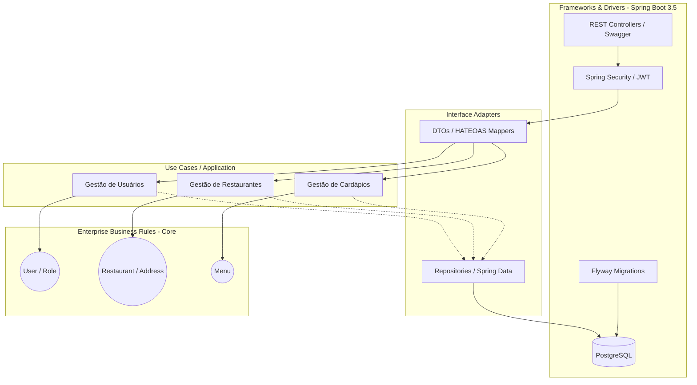

# Arquitetura Lógica - Tech Challenge Fase 2

```mermaid
graph TD
    subgraph Camada_Frameworks_Drivers [Frameworks & Drivers - Spring Boot 3.5]
        API[REST Controllers / Swagger]
        SEC[Spring Security / JWT]
        DB[(PostgreSQL)]
        MIG[Flyway Migrations]
    end

    subgraph Camada_Interface_Adapters [Interface Adapters]
        REP[Repositories / Spring Data]
        DTO[DTOs / HATEOAS Mappers]
    end

    subgraph Camada_UseCases [Use Cases / Application]
        UC1[Gestão de Usuários]
        UC2[Gestão de Restaurantes]
        UC3[Gestão de Cardápios]
    end

    subgraph Camada_Entities [Enterprise Business Rules - Core]
        E1((User / Role))
        E2((Restaurant / Address))
        E3((Menu))
    end

    %% Fluxo de entrada
    API --> SEC
    SEC --> DTO
    DTO --> UC1
    DTO --> UC2
    DTO --> UC3

    %% Injeção de dependência e regras de negócio
    UC1 --> E1
    UC2 --> E2
    UC3 --> E3

    %% Persistência
    UC1 -.-> REP
    UC2 -.-> REP
    UC3 -.-> REP
    REP --> DB
    MIG --> DB
```
