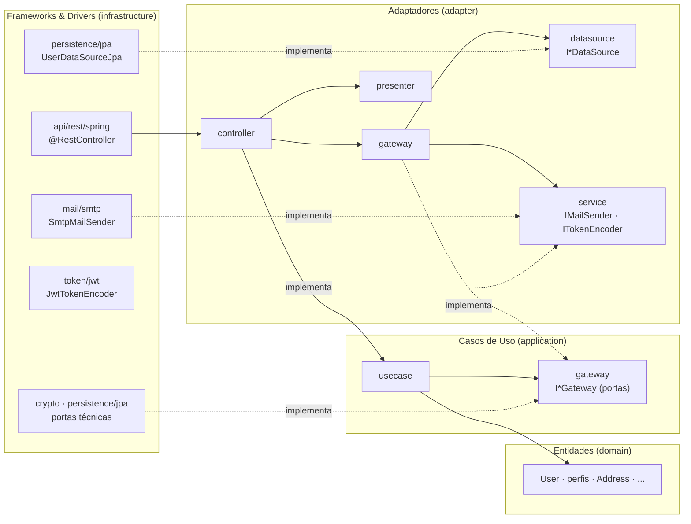

# 0. Visão geral — as quatro camadas

[← Índice](README.md) · Próximo: [Entidades →](01-entidades.md)

## 1. O que a aula ensina

- **Aula 01** apresenta a Clean Architecture como uma forma de organizar componentes em torno das
  regras de negócio, que são consumidas por interfaces que ao mesmo tempo as isolam e disciplinam
  o acesso a elas (p. 3). As dependências vão sempre de fora para dentro: interface de usuário e
  origens de dados dependem das regras, nunca o contrário (p. 6). O benefício prometido é poder
  trocar banco de dados ou framework com impacto mínimo nas regras e testar cada componente
  isoladamente (p. 6). A aula também situa os quatro livros de Martin que formam a base da
  disciplina (pp. 7–8).
- **Aula 02** define as quatro camadas — Entidades, Casos de Uso, Adaptadores de Interface e
  Infraestrutura (*Frameworks & Drivers*) — e o papel de cada uma (pp. 5–9), com o diagrama
  clássico de círculos (p. 6). Na infraestrutura ficam os "detalhes": banco, arquivos, rede,
  API REST (p. 9). O uso de frameworks como o Spring deve ficar restrito a essa camada (p. 11).
- **Aula 07** revisa o conjunto: Entidades e Casos de Uso são a razão de existir da aplicação; os
  Adaptadores protegem essas duas camadas disciplinando a comunicação; controllers orquestram,
  gateways traduzem, presenters formatam (pp. 5–8).

## 2. O que os autores dizem

- **Martin, *Clean Architecture***
  - cap. 1–2: o objetivo da arquitetura é minimizar o esforço humano para construir e manter o
    sistema, e o comportamento vale menos que a facilidade de mudá-lo;
  - cap. 21, *Screaming Architecture*: a estrutura deve revelar o domínio, não o framework;
  - cap. 22, *The Clean Architecture*: os anéis concêntricos e a **regra de dependência** —
    código-fonte só aponta para dentro, e nada de um círculo interno conhece nomes de um externo.

## 3. Como o projeto implementa

| Camada (aula) | Pacote | O que contém |
|---|---|---|
| Entidades | [`domain`](../../src/main/java/com/postech/restaurantes/domain) | `User` e os perfis (`OwnerProfile`, `ClientProfile`, `CourierProfile`, `AdminProfile`), `RoleName`, `Address`, `PasswordResetToken`, VOs (`Email`, `ZipCode`, `Cpf`, `Cnpj`, `Phone`, `LicensePlate`, `DriverLicense`), exceções de negócio, `Guard` |
| Casos de Uso | [`application`](../../src/main/java/com/postech/restaurantes/application) | 9 casos de uso (`create` + `run`), as portas (`I*Gateway`) e os DTOs de entrada |
| Adaptadores de Interface | [`adapter`](../../src/main/java/com/postech/restaurantes/adapter) | controllers, gateways, interfaces de origem de dados e de serviços externos, presenters e views |
| Frameworks & Drivers | [`infrastructure`](../../src/main/java/com/postech/restaurantes/infrastructure) | módulos `main`, `api/rest/spring`, `persistence/jpa`, `token/jwt`, `crypto`, `mail/smtp` — o único lugar com Spring |

Dentro de cada camada o código é agrupado por **agregado ou feature** (`user`, `auth`, `address`):
uma feature nova, como restaurante ou cardápio, ganha o seu subpacote em cada camada.

### O fluxo de uma requisição (cadastro de usuário)

```
POST /api/v1/users
   │
[UserRestController.register]            api/rest/spring/controller   — valida a sintaxe (Bean Validation)
   │  NewUserRequest.toDTO()  →  NewUserDTO
   ▼
[UserController.register]                 adapter/controller           — o "maestro"
   │  cria UserGateway.create(userDataSource)
   │  cria RegisterUserUseCase.create(userGateway, passwordEncoder, clock)
   │  executa run(dto) dentro de IUnitOfWork.execute(...)       — atomicidade
   ▼
[RegisterUserUseCase.run]                 application/usecase/user     — regras de aplicação
   │  User.create(...)                     domain                       — invariantes
   │  userGateway.insert(user)
   ▼
[UserGateway]                              adapter/gateway              — traduz User ↔ UserData
   │  IUserDataSource.insert(userData)
   ▼
[UserDataSourceJpa]                        infrastructure/persistence/jpa — JPA / PostgreSQL
   │
   ▼  (volta)
[UserPresenter.toView(user)]               adapter/presenter            — o que pode sair (sem senha)
   ▼
[UserModelAssembler / UserResponse]        api/rest/spring/assembler, dto/response — JSON + links HATEOAS, 201 + Location
```

Um erro em qualquer ponto é uma exceção de domínio que sobe até o
`GlobalExceptionHandler` (infraestrutura) e vira um `ProblemDetail` (RFC 9457). Nenhuma camada
interna sabe que HTTP existe.



As setas sólidas são dependências de código; as tracejadas, implementação de interface. Todas
apontam para dentro. As **portas técnicas** (hash de senha, geração de token seguro, unidade de
trabalho) são as únicas implementadas direto pela infraestrutura — ver
[Adaptadores, desvios conscientes](03-adaptadores.md#5-desvios-conscientes).

## 4. Padrões adotados e por quê

| Padrão | Onde | Problema que resolve |
|---|---|---|
| Camadas concêntricas com regra de dependência | pacotes `domain` → `application` → `adapter` → `infrastructure` | regras de negócio independentes de framework, banco e UI (Aulas 01, 02, 06) |
| *Screaming architecture* | subpacotes por feature em cada camada | a estrutura mostra "usuário", "autenticação" — não "controller", "service" |
| Duas fronteiras de mapeamento | `*JpaEntity` ≠ entidade de domínio; `*Request`/`*Response` ≠ DTO do caso de uso | nenhuma anotação de framework atravessa para dentro |
| Composição num ponto só (Main) | `infrastructure/main/CompositionConfig` | só a composição conhece todas as peças (ver [Frameworks & Drivers](04-frameworks-drivers.md)) |

## 5. Desvios conscientes

- O diagrama da aula mostra *Input Port*/*Output Port* do caso de uso (Aula 02, p. 6). O projeto
  segue o formato que as próprias aulas implementam (Aulas 03 e 05): o caso de uso **devolve** a
  entidade, e o controller a entrega ao presenter. Não há interface de saída (*output boundary*):
  com um único canal de entrega (REST), ela seria indireção sem uso.
- Os presenters devolvem *views* (`UserView`), e não "DTOs", como nas aulas: o nome separa o que
  **sai** do núcleo dos DTOs que **entram** nos casos de uso.

## 6. Como o build verifica

[`ArchitectureTest`](../../src/test/java/com/postech/restaurantes/ArchitectureTest.java) (17 regras)
quebra o build se a regra de dependência for violada: camadas concêntricas pelo DSL de *onion
architecture*; `domain` sem dependência de outro pacote; `application` só com `domain`; `adapter`
sem `infrastructure`; Spring, JPA, Hibernate, jjwt, Bean Validation, Jakarta Mail e Flyway só em
`infrastructure`. O
[`InfrastructureModulesTest`](../../src/test/java/com/postech/restaurantes/InfrastructureModulesTest.java)
acrescenta: nenhum ciclo entre pacotes em todo o projeto.
