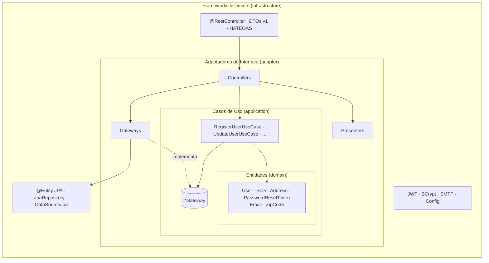
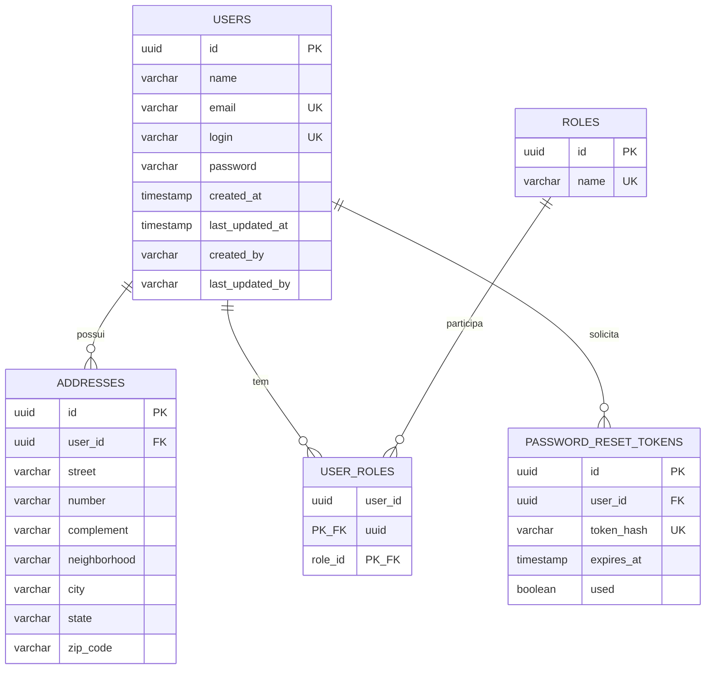

# Relatório Técnico — Tech Challenge Fase 2

## Sistema de Gestão de Restaurantes

**Aluno:**

- Felipe Dias Mac Dowell

**Curso:** Pós-Tech — Arquitetura e Desenvolvimento Java
**Stack:** Java 21 · Spring Boot 3.5.x · Spring Data JPA · PostgreSQL · Docker
**Arquitetura:** Clean Architecture
**Versão do relatório:** 1.0

> Documento vivo, organizado pelas etapas de desenvolvimento. Cada etapa do Sumário de
> Progresso abaixo corresponde a uma seção homônima neste relatório.
>
> Esta é a **primeira versão** do relatório da Fase 2. Ela define a arquitetura, o modelo de
> domínio e as decisões técnicas de um **projeto novo**, construído desde o início sobre a
> **Clean Architecture** de Robert C. Martin. As seções descrevem o desenho acordado pela
> equipe; à medida que cada etapa for concluída, o texto correspondente passa a refletir o
> código entregue.

---

## Sumário de Progresso

| #   | Etapa                                              | Status |
| --- | -------------------------------------------------- | ------ |
| 1   | Setup do Projeto e Estrutura de Pacotes            | ✅     |
| 2   | Camada de Entidades (domínio)                      | ✅     |
| 3   | Camada de Casos de Uso e Gateways                  | ✅     |
| 4   | Adaptadores de Interface (Controllers, Gateways, Presenters) | ✅ |
| 5   | Persistência com JPA (infraestrutura)              | ✅     |
| 6   | Migrations e Seeds (Flyway)                        | ✅     |
| 7   | API REST, Segurança e JWT (infraestrutura)         | ✅     |
| 8   | Tratamento de Erros (ProblemDetail)                | ✅     |
| 9   | Documentação Swagger                               | ✅     |
| 10  | Execução com Docker Compose                        | ✅     |
| 11  | Testes — unitários (100% cobertura) e de integração | ⏳    |
| 12  | Entregáveis (Postman, README)                      | ⏳     |

**Progresso:** 10 de 12 etapas concluídas.
**Legenda:** ✅ concluída · 🔄 em andamento · ⏳ pendente.

---

## Mapa dos Entregáveis Obrigatórios

| Entregável obrigatório                    | Onde encontrar               |
| ----------------------------------------- | ---------------------------- |
| Descrição detalhada da arquitetura        | Visão Geral da Arquitetura   |
| Modelagem das entidades e relacionamentos | Etapas 2 e 5                 |
| Estrutura do banco de dados (tabelas)     | Etapas 5 e 6                 |
| Descrição dos endpoints (com exemplos)    | Etapa 7                      |
| Documentação Swagger                      | Etapa 9                      |
| Coleção Postman                           | Etapa 12                     |
| Passo a passo com Docker Compose          | Etapa 10                     |

---

## Visão Geral da Arquitetura

### Padrão arquitetural adotado

O projeto adota a **Clean Architecture**, conforme descrita por Robert C. Martin em
*Clean Architecture: A Craftsman's Guide to Software Structure and Design* (2017). A ideia
central é organizar o sistema em **camadas concêntricas**, em que as camadas internas contêm
as regras de negócio e as externas contêm os detalhes técnicos — interface HTTP, banco de
dados, frameworks — e garantir que **as dependências apontem sempre para dentro**.

A escolha se justifica por três razões:

1. **Independência de framework.** As regras de negócio e a camada que as adapta não
   importam nada do Spring, do JPA ou do Hibernate. O núcleo compila e é testado sem
   framework no classpath; o Spring existe apenas na camada mais externa.
2. **Regras de negócio no domínio.** As entidades são responsáveis pela própria consistência:
   é a entidade que recusa um e-mail inválido, um nome em branco ou um usuário sem papel —
   não um objeto de transporte da API nem uma anotação de validação.
3. **Banco de dados como detalhe.** A persistência é uma implementação atrás de uma interface
   definida pelo núcleo. O JPA é usado com todas as suas facilidades — mapeamento,
   cascade, auditoria — mas confinado à infraestrutura, com entidades JPA separadas das
   entidades de domínio.

### As quatro camadas

| Camada                         | Pacote                                                                                  | Responsabilidade                                                                                                                                                                                                                          |
| ------------------------------ | --------------------------------------------------------------------------------------- | ----------------------------------------------------------------------------------------------------------------------------------------------------------------------------------------------------------------------------------------- |
| **Entidades** (Entities)       | `domain/entity`, `domain/vo`, `domain/exception`                                        | Objetos de negócio com seus invariantes. Criados por fábrica estática `create(...)` que valida os dados. VOs de valor (`Email`, `ZipCode`). Exceções de domínio. **Nenhuma dependência além do JDK.**                                    |
| **Casos de Uso** (Use Cases)   | `application/usecase`, `application/gateway`, `application/dto`                         | Uma classe por ação que o sistema oferece, com `create(gateways...)` e `run(dto)`. Orquestram as entidades e requisitam dados pelas **interfaces de gateway**, declaradas aqui porque é o caso de uso quem define o que precisa.        |
| **Adaptadores de Interface**   | `adapter/controller`, `adapter/gateway`, `adapter/presenter`                            | **Controllers** coordenam: instanciam o gateway com a origem de dados recebida, instanciam o caso de uso, entregam o resultado ao presenter. **Gateways** implementam as interfaces do núcleo e traduzem entidade ↔ dados externos, dependendo apenas de uma interface de origem de dados. **Presenters** preparam a saída para o cliente. |
| **Frameworks & Drivers**       | `infrastructure/web`, `infrastructure/persistence`, `infrastructure/security`, `infrastructure/mail`, `infrastructure/config` | Os detalhes: `@RestController`, DTOs HTTP, HATEOAS, handler de erros; entidades JPA, `JpaRepository` e a implementação da origem de dados; JWT, BCrypt, SMTP; configuração do Spring, OpenAPI e Flyway. **Só aqui existe Spring.**        |



### A regra de dependência

**O código só pode apontar para dentro.** Camadas internas não conhecem as externas; as
externas dependem de abstrações definidas nas internas (inversão de dependência). Na prática:

- `domain` não importa nada do projeto nem de bibliotecas;
- `application` importa apenas `domain`;
- `adapter` importa `application` e `domain`;
- `infrastructure` importa qualquer camada — é a única que conhece Spring, JPA e Hibernate.

Essa regra não é convenção: é verificada em build por testes de arquitetura (Etapa 11).

### Fluxo de uma requisição

```
Cliente HTTP
    │
    ▼
[@RestController]  ─UserRegistrationRequest→DTO─►  [UserController]  (adapter)
 (infrastructure/web)                                   │
                                                        │ cria UserGateway(IUserDataSource)
                                                        │ cria RegisterUserUseCase.create(gateway)
                                                        ▼
                                              [RegisterUserUseCase].run(dto)
                                                        │
                                                        │ User.create(...) ── valida invariantes
                                                        │ gateway.findByEmail / insert
                                                        ▼
                                                  [UserGateway]  (adapter)
                                                        │ traduz entidade ↔ DTO
                                                        ▼
                                              [UserDataSourceJpa]  (infrastructure)
                                                        │ JpaRepository / Hibernate
                                                        ▼
                                                   PostgreSQL
                                                        │
    ┌───────────────────────────────────────────────────┘
    ▼
[UserPresenter.toDTO]  ──►  [UserController]  ──►  [@RestController] monta UserResponse + links
```

Em caso de erro em qualquer ponto, a exceção de domínio sobe até o handler global da
infraestrutura e é convertida em uma resposta padronizada `ProblemDetail` (Etapa 8).

---

## Etapa 1 — Setup do Projeto e Estrutura de Pacotes

### Stack e dependências

| Tecnologia            | Versão       | Uso                                                     | Camada           |
| --------------------- | ------------ | ------------------------------------------------------- | ---------------- |
| Java                  | 21 (LTS)     | Linguagem                                               | todas            |
| Spring Boot           | 3.5.x        | Framework base                                          | `infrastructure` |
| Spring Web            | (gerenciado) | API REST                                                | `infrastructure` |
| Spring Data JPA       | (gerenciado) | Persistência (Hibernate)                                | `infrastructure` |
| Spring Validation     | (gerenciado) | Validação sintática dos DTOs HTTP                       | `infrastructure` |
| Spring Security       | (gerenciado) | Autenticação JWT                                        | `infrastructure` |
| Spring Mail           | (gerenciado) | E-mail de recuperação de senha                          | `infrastructure` |
| Spring HATEOAS        | (gerenciado) | Links de navegação nas respostas REST                   | `infrastructure` |
| Spring Boot Actuator  | (gerenciado) | Observabilidade (health, info, metrics)                 | `infrastructure` |
| PostgreSQL            | 16           | Banco relacional                                        | `infrastructure` |
| Flyway                | (gerenciado) | Migração e versionamento de schema                      | `infrastructure` |
| springdoc-openapi     | 2.8.x        | Documentação Swagger                                    | `infrastructure` |
| jjwt                  | 0.12.x       | Geração/validação de JWT                                | `infrastructure` |
| JUnit 5 + Mockito     | (gerenciado) | Testes unitários                                        | testes           |
| Testcontainers        | 1.20.x       | Testes de integração da persistência com PostgreSQL real | testes          |
| ArchUnit              | 1.4.x        | Testes automatizados da regra de dependência            | testes           |
| JaCoCo                | 0.8.x        | Cobertura de testes unitários — build falha abaixo de 100% | testes        |
| Maven Surefire / Failsafe | (gerenciado) | Separação entre testes unitários (`test`) e de integração (`integration-test`) | testes |

A coluna "Camada" registra o compromisso central do projeto: **toda biblioteca de framework
é dependência exclusiva de `infrastructure`**. `domain`, `application` e `adapter` compilam
apenas com o JDK. Não há Lombok nem geradores de código no núcleo — construtores, fábricas
e acessores são escritos à mão, o que mantém as regras de negócio legíveis sem processador de
anotações.

### Estrutura de pacotes

Raiz: `com.postech.restaurantes`

```
src/main/java/com/postech/restaurantes/
├── RestaurantesApplication.java
│
├── domain/                        # ENTIDADES — zero dependências
│   ├── entity/
│   │   ├── user/                  # User (raiz), Role, RoleName, PasswordResetToken
│   │   └── address/               # Address (compartilhado por usuário e, adiante, restaurante)
│   ├── vo/                        # Email, ZipCode
│   └── exception/                 # DuplicateResourceException, ResourceNotFoundException, ...
│
├── application/                   # CASOS DE USO — depende só de domain
│   ├── usecase/
│   │   ├── user/                  # RegisterUserUseCase, UpdateUserUseCase, SearchUsersUseCase, ...
│   │   └── auth/                  # AuthenticateUseCase, ForgotPasswordUseCase, ResetPasswordUseCase
│   ├── gateway/                   # IUserGateway, IRoleGateway, IPasswordEncoder, IMailGateway, ...
│   └── dto/
│       ├── common/                # PageRequest, PageResult, SortDirection, AddressDTO
│       ├── user/                  # NewUserDTO, UpdateUserDTO, ChangePasswordDTO
│       └── auth/                  # CredentialsDTO, ResetPasswordDTO, IssuedToken
│
├── adapter/                       # ADAPTADORES DE INTERFACE — depende de application e domain
│   ├── controller/                # UserController, AuthController (orquestração)
│   ├── gateway/                   # UserGateway, RoleGateway, PasswordResetTokenGateway (implementam I*Gateway)
│   ├── datasource/                # IUserDataSource, IRoleDataSource, IPasswordResetTokenDataSource
│   │   └── data/                  # UserData, RoleData, AddressData, PasswordResetTokenData (records)
│   └── presenter/                 # UserPresenter, AuthPresenter
│       └── view/                  # UserView, RoleView, AddressView, AuthView (records de saída)
│
└── infrastructure/                # FRAMEWORKS & DRIVERS — único lugar com Spring/JPA
    ├── web/
    │   ├── error/                 # GlobalExceptionHandler, ProblemDetailFactory, ProblemType
    │   ├── validation/            # @ValidPassword
    │   ├── doc/                   # ErrorResponse, ProblemDetailOpenApiCustomizer, ErrorResponseOperationCustomizer
    │   ├── user/                  # UserRestController, Request/Response, UserModelAssembler
    │   └── auth/                  # AuthRestController, Request/Response
    ├── persistence/               # AuditableJpaEntity, TransactionalUnitOfWork, AuthenticatedAuditorAware
    │   ├── user/                  # UserJpaEntity, RoleJpaEntity, PasswordResetTokenJpaEntity, SpringData*Repository, *DataSourceJpa
    │   └── address/               # AddressJpaEntity
    ├── security/                  # JwtTokenIssuer, JwtAuthenticationFilter, BCryptPasswordAdapter, UserSecurity, JwtAuthenticationEntryPoint
    ├── mail/                      # SmtpMailGateway, MailProperties
    └── config/                    # SecurityConfig, PersistenceConfig, OpenApiConfig, CompositionConfig (raiz de composição)
```

Cada pacote nasce com um `package-info.java` que documenta sua regra de dependência — o
que faz a estrutura compilar vazia e deixa a intenção de cada camada registrada no código,
não só neste relatório.

Dentro de cada camada, entidades, casos de uso e DTOs são agrupados **por agregado ou
feature** (`user`, `auth`, `address`; depois `restaurant`, `menu`). É a *screaming
architecture* de Martin: a estrutura deve revelar o domínio, não apenas o padrão
arquitetural. As regras de ArchUnit usam padrões `..usecase..`/`..gateway..`, então continuam
válidas para qualquer subpacote.

### O que foi entregue nesta etapa

Projeto em `fase-02/restaurantes/`:

| Artefato | Conteúdo |
| -------- | -------- |
| `pom.xml` | Dependências da tabela acima; Surefire executando os unitários (exclui `*IT`) e Failsafe executando os `*IT` na fase `integration-test`; JaCoCo com `prepare-agent`, relatório na fase `test` e `check` na fase `verify` exigindo **100% de linhas e ramos** (exclusões: `RestaurantesApplication` e `infrastructure/config/*Config`). |
| `src/main/java` | `RestaurantesApplication` e os 19 pacotes da estrutura, cada um com `package-info.java`. |
| `src/test/java` | `ArchitectureTest` (ArchUnit) com **8 regras**, ativas desde o primeiro build graças a `allowEmptyShould(true)`: arquitetura em anéis (`onionArchitecture`), `domain` sem dependências do projeto, `application` só de `domain`, `adapter` nunca de `infrastructure`, nenhum framework fora de `infrastructure`, sufixo `UseCase`, prefixo `I` em `application.gateway` e `adapter.datasource`. |
| `application.yml` | Datasource PostgreSQL por variáveis de ambiente; JPA com `ddl-auto: validate` e `open-in-view: false`; Flyway; JWT; mail; springdoc; Actuator com exposição controlada. |
| `Dockerfile`, `docker-compose.yml`, `.env.example`, `.dockerignore`, `.gitignore` | Build multi-stage (Maven → JRE 21 Alpine), serviço `db` (postgres:16-alpine com healthcheck) e `app`, variáveis documentadas. |
| `README.md`, `CHANGELOG.md` | Instruções de execução e teste; histórico por etapa. |

**Verificação.** `mvn verify` com JDK 21: compilação limpa, 8 regras de ArchUnit verdes,
Failsafe sem ITs ainda, JaCoCo `check` aprovado — **BUILD SUCCESS**. A regra de
dependência está, portanto, protegendo o projeto antes de existir a primeira classe de
negócio. A primeira execução da regra revelou um detalhe útil: o ArchUnit enxerga os
`package-info` como classes, então as regras de nomenclatura os excluem explicitamente.

---

## Etapa 2 — Camada de Entidades (domínio)

### Princípio

Cada entidade é responsável pela própria consistência. Não existe, em nenhum ponto do
sistema, uma instância de `User` com e-mail inválido ou sem papel — porque a única forma de
obter uma é pela fábrica `create(...)`, e ela recusa dados inválidos lançando
`InvariantViolationException` — uma `IllegalArgumentException` cuja mensagem é escrita para o
usuário e, por isso, pode chegar à resposta HTTP (Etapa 8). Os setters aplicam a mesma
validação, de modo que a entidade não pode ser corrompida depois de criada.

### Entidades

| Entidade             | Invariantes garantidos pela própria entidade                                                                                  |
| -------------------- | ----------------------------------------------------------------------------------------------------------------------------- |
| `User`               | nome não vazio; e-mail válido e normalizado (`Email`); login não vazio; hash de senha presente; **ao menos um papel**; endereços válidos |
| `Role`               | nome pertence ao conjunto `ROLE_OWNER`, `ROLE_CUSTOMER`, `ROLE_ADMIN`                                                          |
| `Address`            | rua, cidade e UF obrigatórios; UF com 2 letras; CEP válido e normalizado (`ZipCode`)                                          |
| `PasswordResetToken` | hash do token presente; expiração no futuro na criação; `markUsed()` só pode ser chamado uma vez                                |

`User` é a **raiz do agregado**: carrega `Set<Role>` e `List<Address>`, e é através dele que
endereços são substituídos (`replaceAddresses`) e papéis atribuídos (`replaceRoles`).

### VOs de valor

| VO         | Invariante                                    |
| ---------- | --------------------------------------------- |
| `Email`    | formato válido; normalizado para minúsculas   |
| `ZipCode`  | 8 dígitos; formatação `00000-000` sob demanda |

A normalização do e-mail para minúsculas dentro de `Email.of(...)` é o que torna a regra de
e-mail único correta por construção: `Joao@x.com` e `joao@x.com` produzem o mesmo valor
antes de qualquer consulta.

### Exemplo

```java
// domain/entity/User.java — sem Spring, sem JPA, sem Lombok (trecho)
public final class User {
    private final UUID id;
    private String name;
    private Email email;
    private String login;
    private String passwordHash;
    private final Set<Role> roles = new LinkedHashSet<>();
    private final List<Address> addresses = new ArrayList<>();
    private final LocalDateTime createdAt;
    private final LocalDateTime lastUpdatedAt;

    private User(UUID id, LocalDateTime createdAt, LocalDateTime lastUpdatedAt) { ... }

    /** Usuário novo, ainda sem id nem auditoria. */
    public static User create(String name, String email, String login, String passwordHash,
                              Set<Role> roles, List<Address> addresses) {
        return fill(new User(null, null, null), name, email, login, passwordHash, roles, addresses);
    }

    /** Usuário reconstruído a partir da origem de dados, com id e auditoria conhecidos. */
    public static User restore(UUID id, String name, String email, String login, String passwordHash,
                               Set<Role> roles, List<Address> addresses,
                               LocalDateTime createdAt, LocalDateTime lastUpdatedAt) {
        User user = new User(Guard.requireNonNull(id, "Id do usuário inválido"), createdAt, lastUpdatedAt);
        return fill(user, name, email, login, passwordHash, roles, addresses);
    }

    private static User fill(User user, String name, String email, String login, String passwordHash,
                             Set<Role> roles, List<Address> addresses) {
        user.setName(name);
        user.setEmail(Email.of(email));      // valida formato e normaliza para minúsculas
        user.setLogin(login);
        user.changePasswordHash(passwordHash);
        user.replaceRoles(roles);            // exige ao menos um papel
        user.replaceAddresses(addresses);
        return user;
    }

    public void setName(String name) {
        this.name = Guard.requireNonBlank(name, "Nome inválido");
    }

    public void replaceRoles(Set<Role> newRoles) {
        Guard.require(newRoles != null && !newRoles.isEmpty(), "Usuário deve ter ao menos um papel");
        Guard.require(newRoles.stream().noneMatch(Objects::isNull), "Papel inválido");
        roles.clear();
        roles.addAll(newRoles);
    }
    // demais setters validam do mesmo modo; getters devolvem visões imutáveis das coleções
}
```

`create` é usado para entidades novas (sem id); `restore` reconstrói uma entidade a partir
da origem de dados, com id conhecido. Ambos passam pela mesma validação.

### Exceções de domínio

| Exceção                          | Situação                                                  |
| -------------------------------- | --------------------------------------------------------- |
| `ResourceNotFoundException`      | usuário ou papel inexistente                               |
| `DuplicateResourceException`     | e-mail ou login já cadastrado                              |
| `InvalidPasswordException`       | senha atual incorreta ou confirmação divergente            |
| `ForbiddenOperationException`    | autocadastro solicitando papel privilegiado (`ROLE_ADMIN`) |
| `InvalidOrExpiredTokenException` | token de redefinição inexistente, expirado ou já usado     |
| `InvalidCredentialsException`    | login ou senha incorretos                                  |

São exceções não verificadas, sem nenhuma anotação: quem as traduz para HTTP é a
infraestrutura (Etapa 8). Todas estendem a base abstrata `DomainException`, o que permite ao
handler tratá-las por família quando conveniente.

### O que foi entregue nesta etapa

Pacote `domain` completo, com **15 classes e zero imports** fora do JDK:

| Tipo | Decisões de implementação |
| ---- | ------------------------- |
| `Guard` | Utilitário de invariantes (`requireNonNull`, `requireNonBlank`, `require`, `trimToNull`). Concentra as verificações para que as entidades leiam como regras, não como `if`s. Toda violação é `IllegalArgumentException`. |
| `Email`, `ZipCode` | `record`s com construtor compacto: validam e normalizam na construção (minúsculas / só dígitos), então a igualdade por valor do record já embute a normalização — `Email.of("Joao@x.com").equals(Email.of("joao@x.com"))` é verdadeiro. |
| `RoleName` | Enum com `from(String)` tolerante a caixa e `isPrivileged()` (só `ROLE_ADMIN`). |
| `Role` | Identidade de negócio pelo nome: `equals`/`hashCode` ignoram o id, permitindo comparar um papel recém-criado com um restaurado do banco dentro de um `Set`. |
| `Address` | Rua, cidade, UF (2 letras, normalizada para maiúsculas) e CEP obrigatórios; número, complemento e bairro opcionais com "em branco vira ausente". |
| `User` | Raiz do agregado. `create` (sem id/auditoria) e `restore` (com id, `createdAt`, `lastUpdatedAt`) passam pelo mesmo `fill`, então não há caminho que produza instância inválida. `replaceRoles`/`replaceAddresses` substituem as coleções por completo; `getRoles`/`getAddresses` devolvem visões imutáveis. O domínio recebe o **hash** da senha — nunca a senha nem o algoritmo. |
| `PasswordResetToken` | Guarda só o hash do token. O instante de referência é parâmetro (`create(..., now)`, `isExpired(now)`, `isUsable(now)`), mantendo a entidade sem relógio e os testes determinísticos. `markUsed()` é de uso único e a segunda chamada é `IllegalStateException` — violação de estado, não de argumento. |
| `DomainException` + 6 subclasses | `RuntimeException` com mensagem; sem anotação e sem código HTTP. |

**Testes unitários — 111 casos em 8 classes** (`GuardTest`, `EmailTest`, `ZipCodeTest`,
`RoleNameTest`, `RoleTest`, `AddressTest`, `UserTest`, `PasswordResetTokenTest`,
`DomainExceptionsTest`), sem mocks e sem Spring. Cada invariante tem um teste que prova a
recusa (`assertThrows`) e um que prova a aceitação; os casos de "em branco" usam
`@ParameterizedTest` com `@NullAndEmptySource`. Cobertura medida pelo JaCoCo no pacote
`domain`: **170/170 linhas, 44/44 ramos, 83/83 métodos** — 100%.

**Verificação.** `mvn verify`: 119 testes (111 unitários + 8 regras de ArchUnit), **BUILD
SUCCESS**, regra de cobertura aprovada. Os testes pegaram um defeito real antes do primeiro
uso: a verificação "nenhum elemento nulo" usava `contains(null)`, que em coleções imutáveis
(`Set.of`, `List.of`) lança `NullPointerException` em vez de responder `false`. Foi trocada
por `stream().noneMatch(Objects::isNull)`.

---

## Etapa 3 — Camada de Casos de Uso e Gateways

### Casos de uso

Cada ação que o sistema oferece é uma classe própria, instanciada por `create(...)` com as
interfaces de que depende e executada por `run(...)`. O caso de uso **orquestra**: consulta
gateways, cria ou altera entidades, aplica as regras de aplicação e devolve a entidade
resultante. Ele não sabe de HTTP, de JSON nem de banco de dados.

| Caso de uso              | Regras aplicadas                                                                                                                                               |
| ------------------------ | -------------------------------------------------------------------------------------------------------------------------------------------------------------- |
| `RegisterUserUseCase`    | rejeita `ROLE_ADMIN` no autocadastro (`ForbiddenOperationException`); garante unicidade de e-mail e login; aplica hash na senha via `IPasswordEncoder`; resolve papéis via `IRoleGateway`; cria `User` |
| `UpdateUserUseCase`      | atualiza nome, e-mail e login (revalidando unicidade, ignorando o próprio registro) e substitui endereços; **não** altera senha                                |
| `ChangePasswordUseCase`  | confere a senha atual, valida que nova senha e confirmação coincidem, grava o novo hash                                                                        |
| `DeleteUserUseCase`      | remove o usuário (endereços, tokens e vínculos de papel caem por cascade)                                                                                       |
| `FindUserByIdUseCase`    | consulta por id; `ResourceNotFoundException` se inexistente                                                                                                    |
| `SearchUsersUseCase`     | listagem paginada, com busca parcial por nome sem diferenciar maiúsculas; ordenação por propriedades permitidas                                                |
| `AuthenticateUseCase`    | busca por login, compara hash via `IPasswordEncoder`, emite token via `ITokenIssuer`; `InvalidCredentialsException` em falha — com a **mesma mensagem e o mesmo custo de tempo** para login inexistente e senha incorreta |
| `ForgotPasswordUseCase`  | se o e-mail existir, gera token de uso único, persiste o hash e envia por `IMailGateway`; **resposta idêntica exista ou não o e-mail**                          |
| `ResetPasswordUseCase`   | valida token (existe, não expirou, não usado), confere confirmação, **invalida o token e só então** grava o novo hash                                            |

### Regra de negócio × regra de aplicação

A distinção orienta onde cada regra mora:

- **Regra de negócio** (vale em qualquer contexto): e-mail válido, ao menos um papel, CEP com
  8 dígitos → **na entidade**.
- **Regra de aplicação** (depende do ponto de entrada): `ROLE_ADMIN` proibido *no autocadastro
  público*, resposta idêntica no "esqueci minha senha" → **no caso de uso**.

### Gateways (interfaces)

Declaradas em `application/gateway`, em termos de domínio — recebem e devolvem entidades e
VOs, nunca tipos de framework:

| Interface                      | Operações                                                                                        |
| ------------------------------ | ------------------------------------------------------------------------------------------------ |
| `IUserGateway`                 | `findById`, `findByLogin`, `findByEmail`, `search(name, PageRequest)`, `insert`, `update`, `delete` |
| `IRoleGateway`                 | `findByNames(Set<RoleName>)`                                                                     |
| `IPasswordResetTokenGateway`   | `findByTokenHash`, `insert`, `update`                                                            |
| `IPasswordEncoder`             | `encode`, `matches`, `simulateMatch` (gasta o tempo de uma comparação quando não há hash real — o núcleo não conhece o algoritmo) |
| `ITokenIssuer`                 | `issue(User)` → `IssuedToken(token, expiresAt)`                                                  |
| `IMailGateway`                 | `sendPasswordReset(Email, rawToken)`                                                             |
| `ISecureTokenGenerator`        | `generate()` → token aleatório em claro; `hash(rawToken)` → hash determinístico para persistir e consultar |
| `IUnitOfWork`                  | `execute(Supplier)` / `execute(Runnable)` — executa um bloco de forma atômica; usada pelo controller de adaptação ao invocar um caso de uso |

A paginação é expressa por tipos próprios de `application/dto` (`PageRequest`, `PageResult<T>`),
não por `Pageable`/`Page` do Spring — a tradução acontece na infraestrutura.

`ISecureTokenGenerator` existe por dois motivos: a escolha de algoritmo (`SecureRandom`,
SHA-256) é detalhe de infraestrutura, e o token gerado precisa ser **determinístico nos
testes** dos casos de uso — com um mock, o teste sabe exatamente qual hash deve ter sido
persistido e qual valor em claro deve ter ido para o e-mail.

### Exemplo

```java
// application/usecase/RegisterUserUseCase.java
public final class RegisterUserUseCase {
    private final IUserGateway userGateway;
    private final IRoleGateway roleGateway;
    private final IPasswordEncoder passwordEncoder;

    private RegisterUserUseCase(IUserGateway userGateway, IRoleGateway roleGateway,
                                IPasswordEncoder passwordEncoder) { ... }

    public static RegisterUserUseCase create(IUserGateway userGateway, IRoleGateway roleGateway,
                                             IPasswordEncoder passwordEncoder) {
        return new RegisterUserUseCase(userGateway, roleGateway, passwordEncoder);
    }

    public User run(NewUserDTO dto) {
        Guard.requireNonNull(dto, "Dados de cadastro inválidos");
        Set<RoleName> roleNames = dto.roles();
        Guard.require(roleNames != null && !roleNames.isEmpty(), "Usuário deve ter ao menos um papel");
        if (roleNames.stream().anyMatch(RoleName::isPrivileged)) {
            throw new ForbiddenOperationException("Autocadastro não pode conceder papel de administrador");
        }
        Email email = Email.of(dto.email());
        if (userGateway.findByEmail(email).isPresent()) {
            throw new DuplicateResourceException("E-mail já cadastrado");
        }
        String login = Guard.requireNonBlank(dto.login(), "Login inválido");
        if (userGateway.findByLogin(login).isPresent()) {
            throw new DuplicateResourceException("Login já cadastrado");
        }
        Set<Role> roles = roleGateway.findByNames(roleNames);
        if (roles.size() != roleNames.size()) {
            throw new ResourceNotFoundException("Papel inexistente");
        }
        String rawPassword = Guard.requireNonBlank(dto.password(), "Senha inválida");
        User user = User.create(dto.name(), email.value(), login, passwordEncoder.encode(rawPassword),
                roles, AddressDTO.toEntities(dto.addresses()));
        return userGateway.insert(user);
    }
}
```

A conversão de endereços fica em `AddressDTO.toEntities(...)` — na camada de aplicação, que
conhece o domínio — e não em um `Address.fromDTOs(...)`, que faria o domínio conhecer um DTO
de fora e violaria a regra de dependência.

### O que foi entregue nesta etapa

Pacote `application` completo — **10 DTOs, 7 interfaces de gateway e 9 casos de uso** —
importando apenas `domain` e o JDK:

| Componente | Decisões de implementação |
| ---------- | ------------------------- |
| `PageRequest` / `PageResult<T>` | Records próprios de paginação: página base 0, tamanho 1–100, ordenação opcional. `PageResult.map(...)` permite ao presenter converter o conteúdo sem perder os metadados; o conteúdo é copiado e imutável. |
| `AddressDTO`, `NewUserDTO`, `UpdateUserDTO`, `ChangePasswordDTO`, `CredentialsDTO`, `ResetPasswordDTO`, `IssuedToken`, `SortDirection` | Records de transporte. Só `IssuedToken` valida (token não vazio, expiração presente); os demais são validados por quem os consome. |
| Casos de uso | Todos `final`, com construtor privado, `create(...)` recebendo apenas interfaces e `run(...)`. Nenhum `@Service`, nenhum `@Transactional`: a transação é aberta pela origem de dados, na infraestrutura. |
| `RegisterUserUseCase` | Rejeita papel privilegiado **antes** de qualquer consulta; unicidade de e-mail (já normalizado pelo VO) e de login; confere que todos os papéis pedidos existem (`ResourceNotFoundException` se algum faltar); a senha só chega ao `IPasswordEncoder` depois de validada. |
| `UpdateUserUseCase` | Unicidade revalidada com `Optional.filter(other -> !other.getId().equals(id))` — o próprio registro não conta como duplicata. Senha intocada. |
| `ChangePasswordUseCase` / `ResetPasswordUseCase` | Ordem das verificações escolhida para falhar cedo e barato: senha atual (ou token) → nova senha não vazia → confirmação → só então o hash e a gravação. |
| `SearchUsersUseCase` | Lista fixa `SORTABLE_PROPERTIES`; propriedade fora dela (inclusive `password`) cai em `name ASC` em vez de erro, preservando o contrato de `200` para `sort` desconhecido. |
| `AuthenticateUseCase` | Login inexistente e senha incorreta lançam a mesma `InvalidCredentialsException` com a mesma mensagem, para não revelar quais logins existem. |
| `ForgotPasswordUseCase` | Recebe `Duration` de validade e `Clock` na criação (validados). E-mail inexistente retorna em silêncio sem tocar nos gateways de token e e-mail — a resposta é idêntica ao caso de sucesso. Persiste só o hash; o valor em claro vai apenas para `IMailGateway`. |

**Testes unitários — 70 casos em 10 classes** (`PageRequestTest`, `PageResultTest`, `DtoTest`,
`RegisterUserUseCaseTest`, `UpdateUserUseCaseTest`, `ChangePasswordUseCaseTest`,
`UserQueryUseCasesTest` com `@Nested` para Find/Delete/Search, `AuthenticateUseCaseTest`,
`ForgotPasswordUseCaseTest`, `ResetPasswordUseCaseTest`), com **Mockito** para as interfaces
de gateway e `Clock.fixed` para o tempo — sem contexto Spring, sem banco. `ArgumentCaptor`
verifica o que foi entregue aos gateways (o hash persistido, o token em claro enviado, a
ordenação sanitizada). Uma armadilha do JUnit 5 documentada no código: em classes `@Nested` o
inicializador de campo roda **antes** do `@BeforeEach` externo, então o caso de uso é criado
em um `@BeforeEach` aninhado.

**Revisão de código da etapa.** Antes de fechar, o diff passou por uma revisão focada em
falhas reais, que apontou cinco problemas — todos corrigidos com teste correspondente:

| Achado | Correção |
| ------ | -------- |
| `ResetPasswordUseCase` gravava a senha **antes** de marcar o token como usado. Como cada gateway é a própria transação, uma falha entre as duas escritas deixaria a senha trocada e o token reutilizável. | Ordem invertida: o token é invalidado e persistido primeiro; se a gravação da senha falhar, o efeito é "peça um novo token". Teste com `InOrder` e um teste em que `tokenGateway.update` lança e a senha permanece intacta. |
| `RegisterUserUseCase`: `"roles": [null]` passava pela checagem nulo/vazio e estourava `NullPointerException` (500) em `RoleName::isPrivileged`. | `Guard.require(roleNames.stream().noneMatch(Objects::isNull), ...)` → 400. |
| `AddressDTO.toEntities`: `"addresses": [null]` produzia NPE (500) no `map`. | Mesma guarda → `IllegalArgumentException("Endereço inválido")` → 400. |
| `AuthenticateUseCase`: login inexistente retornava **sem** executar o BCrypt; a diferença de latência (~1 ms × ~100 ms) permitia enumerar logins apesar da mensagem única. | Quando o login não existe, a senha é comparada contra um hash BCrypt fixo (`DUMMY_HASH`), igualando o custo dos dois caminhos; o resultado dessa comparação é ignorado. |
| Senha nula chegava ao `IPasswordEncoder`; o `BCryptPasswordEncoder` lança `IllegalArgumentException("rawPassword cannot be null")`, que viraria 400 com mensagem interna em vez de 401 — e, no login, revelaria que o login existe. | `AuthenticateUseCase` trata login/senha em branco como `InvalidCredentialsException` antes de qualquer consulta; `ChangePasswordUseCase` trata senha atual em branco como `InvalidPasswordException`. |

**Revisão de arquitetura da etapa.** Em seguida o código foi confrontado com as referências
deste relatório (regra de dependência, entidades donas dos invariantes, "frameworks e banco
são detalhes", *screaming architecture*). Conformidades verificadas por grep e ArchUnit: zero
imports fora do JDK em `domain`/`application`, nenhum `now()` no domínio, casos de uso sem
anotação. Dois ajustes saíram da revisão:

| Achado | Correção |
| ------ | -------- |
| A correção do tempo constante no login tinha colocado um **hash BCrypt** constante dentro do caso de uso — o núcleo passou a conhecer o algoritmo, contrariando a própria documentação de `IPasswordEncoder`. Trocar o encoder (Argon2, PBKDF2) quebraria o efeito silenciosamente. | `IPasswordEncoder.simulateMatch(rawPassword)`: a interface promete "gaste o mesmo tempo"; a implementação, na infraestrutura, sabe qual hash fictício usar. O caso de uso volta a não saber nada de BCrypt. |
| Estrutura "gritava" Clean Architecture, não o domínio: nove casos de uso num só pacote, e o escopo da fase (restaurantes, cardápio) triplicaria isso. | Subpacotes por agregado/feature em cada camada (`domain/entity/user`, `application/usecase/auth`, ...), com `package-info` próprio. Regras de ArchUnit inalteradas. |

Dois pontos ficaram registrados como decisões conscientes, sem mudança: a auditoria
(`createdAt`/`lastUpdatedAt`) vive na entidade de domínio apenas para leitura, porque a API a
expõe; e a lista `SORTABLE_PROPERTIES` usa os nomes dos atributos do domínio — o data source
JPA deve **traduzi-los**, não repassá-los. Um terceiro ponto foi encaminhado para a Etapa 4:
casos de uso com mais de uma escrita (`ResetPasswordUseCase`) precisam de uma porta de
unidade de trabalho (`IUnitOfWork`) usada pelo controller de adaptação, já que
`@Transactional` fica confinado ao data source.

**Verificação.** `mvn verify`: 196 testes (188 unitários + 8 regras de ArchUnit), **BUILD
SUCCESS**. Cobertura acumulada (`domain` + `application`): 100% de linhas, ramos e
métodos.

---

## Etapa 4 — Adaptadores de Interface (Controllers, Gateways, Presenters)

Esta camada disciplina a comunicação entre o núcleo e o mundo exterior. Ela **não contém
regra de negócio**; contém tradução e orquestração.

### Controllers (adapter/controller)

O controller de adaptação é o ponto de entrada do núcleo. Ele recebe uma **origem de dados
por interface** (`IUserDataSource`), e com ela:

1. instancia o gateway (`UserGateway.create(dataSource)`);
2. instancia o caso de uso (`RegisterUserUseCase.create(gateway, ...)`);
3. executa `run(dto)`;
4. entrega a entidade ao presenter e devolve o DTO de saída.

É o controller quem "sabe quem sabe": conhece os componentes e a ordem em que se
combinam, mas não a lógica de nenhum deles. Como recebe a origem de dados de fora, o mesmo
controller funciona com JPA, com um mapa em memória nos testes, ou com qualquer outra
implementação.

```java
// adapter/controller/UserController.java (trecho)
public final class UserController {
    private final IUserDataSource userDataSource;
    private final IRoleDataSource roleDataSource;
    private final IPasswordEncoder passwordEncoder;
    private final IUnitOfWork unitOfWork;

    public static UserController create(IUserDataSource userDataSource, IRoleDataSource roleDataSource,
                                        IPasswordEncoder passwordEncoder, IUnitOfWork unitOfWork) { ... }

    public UserView register(NewUserDTO dto) {
        var useCase = RegisterUserUseCase.create(userGateway(), RoleGateway.create(roleDataSource), passwordEncoder);
        return UserPresenter.toView(unitOfWork.execute(() -> useCase.run(dto)));
    }

    public void changePassword(UUID id, ChangePasswordDTO dto) {
        var useCase = ChangePasswordUseCase.create(userGateway(), passwordEncoder);
        unitOfWork.execute(() -> useCase.run(id, dto));
    }

    private UserGateway userGateway() {
        return UserGateway.create(userDataSource);
    }
}
```

O `execute` da unidade de trabalho envolve **cada** `run`: é o controller — e não o caso de uso — que
demarca a atomicidade, porque o caso de uso não deve saber que existe transação; e é
`IUnitOfWork`, e não `@Transactional`, porque o adaptador não pode conhecer o Spring.

### Gateways (adapter/gateway)

Implementam as interfaces `I*Gateway` do núcleo. São **tradutores**: recebem uma entidade,
convertem para o DTO que a origem de dados entende, chamam a interface `I*DataSource` e
reconstroem a entidade (`User.restore(...)`) com o resultado. O gateway não sabe se a origem
de dados é um banco relacional, um serviço remoto ou memória — ele depende apenas da interface.

### Interfaces de origem de dados (adapter/datasource)

`IUserDataSource`, `IRoleDataSource` e `IPasswordResetTokenDataSource` definem, em termos de
DTOs simples (records), as operações que a infraestrutura precisa oferecer. É o contrato que
a Etapa 5 implementa com JPA.

### Presenters (adapter/presenter)

Preparam a saída. `UserPresenter.toView(user)` produz a `UserView` que o cliente pode consumir —
e é o único lugar onde se decide o que **não** sai: a senha (hash) nunca cruza para fora.
Os modelos de saída chamam-se *views* (`UserView`, `RoleView`, `AddressView`, `AuthView`)
para não se confundirem com os DTOs de **entrada** dos casos de uso. O
presenter retira do controller a obrigação de adaptar entidades e garante um formato padrão
de retorno, independentemente de quem consome (REST hoje, outro canal amanhã).

### Unidade de trabalho (decisão desta etapa)

A revisão de arquitetura da Etapa 3 deixou registrado que casos de uso com mais de uma
escrita (`ResetPasswordUseCase`) não eram atômicos, porque `@Transactional` fica confinado ao
data source. Pelo princípio orientador, a solução tinha de ser consistente com a
arquitetura: a **transação** é detalhe de infraestrutura (Martin), mas a **demarcação** —
"estas escritas acontecem juntas ou nenhuma" — é regra de aplicação. Por isso:

- a porta `IUnitOfWork` é declarada em `application/gateway`, ao lado das demais;
- quem a usa é o **controller de adaptação**, envolvendo cada `run` — o caso de uso continua
  sem saber que transação existe;
- a implementação (Etapa 5) usa o `TransactionTemplate` do Spring, em `infrastructure`.

A ordem "token antes da senha" adotada na Etapa 3 permanece como defesa em profundidade.

### O que foi entregue nesta etapa

Pacote `adapter` completo — **3 interfaces de origem de dados + 4 records, 3 gateways, 2
presenters + 4 views, 2 controllers** — importando apenas `application`, `domain` e o JDK:

| Componente | Decisão e conceito que a sustenta |
| ---------- | --------------------------------- |
| `adapter/datasource` (`IUserDataSource`, `IRoleDataSource`, `IPasswordResetTokenDataSource`) | Contrato em termos de **records simples** (`UserData`, `RoleData`, `AddressData`, `PasswordResetTokenData`), sem entidade de domínio nem tipo de framework. É a interface que o gateway consome e a infraestrutura implementa — inversão de dependência (SOLID/DIP): o detalhe depende da abstração. |
| `adapter/gateway` (`UserGateway`, `RoleGateway`, `PasswordResetTokenGateway`) | Implementam `I*Gateway` do núcleo e **traduzem** entidade ↔ record: `toData` desmonta o agregado (e-mail já normalizado, CEP sem máscara, papéis pelo nome), `toEntity` reconstrói com `restore(...)`, que revalida os invariantes — um registro corrompido no banco não vira entidade inválida em memória. Recebem a origem de dados por `create(dataSource)`, como o curso prescreve. |
| `adapter/presenter` (`UserPresenter`, `AuthPresenter`) | Únicos pontos que decidem o que sai. `UserView` não tem campo para o hash — a omissão é estrutural, não um `if`. `PageResult.map` preserva os metadados da página. `AuthPresenter` acrescenta o esquema `Bearer`: convenção de apresentação, não do núcleo. |
| `adapter/controller` (`UserController`, `AuthController`) | O "maestro": recebe origens de dados e serviços técnicos **por interface**, monta gateway + caso de uso por operação, executa em `IUnitOfWork` e entrega ao presenter. Nenhuma regra de negócio; todas as dependências validadas na criação. |
| `IUnitOfWork` | Porta de unidade de trabalho (ver acima). |
| ArchUnit | Três regras novas: records de `adapter.datasource.data` terminam em `Data`; views terminam em `View`; **toda classe em `adapter.gateway` implementa uma interface de `application.gateway`** — um gateway sem porta no núcleo não compila o build. A regra de prefixo `I` passou a mirar exatamente o pacote `adapter.datasource` (os records ficam em `data`). |

**Testes unitários — 45 casos em 5 classes** (`UserGatewayTest`, `RoleAndTokenGatewaysTest`,
`PresentersTest`, `UserControllerTest`, `AuthControllerTest`). Gateways e presenters com
mocks de `I*DataSource`; os controllers são testados "de ponta a ponta dentro do núcleo" — origens
de dados mockadas, mas casos de uso, gateways e presenters **reais** — provando a
orquestração sem repetir os testes de regra. Uma `CountingUnitOfWork` de teste confirma que cada
operação passa exatamente uma vez pela unidade de trabalho.

**Verificação.** `mvn verify`: 242 testes (231 unitários + 11 regras de ArchUnit), **BUILD
SUCCESS**. Cobertura acumulada (`domain` + `application` + `adapter`): **487/487 linhas,
126/126 ramos, 211/211 métodos, 50 classes** — 100%.

---

## Etapa 5 — Persistência com JPA (infraestrutura)

### Entidades JPA separadas das entidades de domínio

Anotar as entidades de domínio com `@Entity` acoplaria o núcleo ao Hibernate e faria as regras
de negócio dependerem do ciclo de vida do ORM. Por isso a persistência tem **as próprias
classes**: `UserJpaEntity`, `RoleJpaEntity`, `PasswordResetTokenJpaEntity` em
`infrastructure/persistence/user` e `AddressJpaEntity` em `infrastructure/persistence/address`
— os subpacotes espelham `domain/entity/user` e `domain/entity/address`, de modo que cada
agregado novo (restaurante, cardápio) ganhe o seu também aqui. Elas não têm nenhuma invariante:
são mapeamento e nada mais. A tradução entre elas e os records da origem de dados é
responsabilidade dos `*DataSourceJpa`.

### Decisões de mapeamento

| Decisão | Detalhe |
| ------- | ------- |
| **Relacionamentos declarativos** | `@OneToMany(mappedBy = "user", cascade = ALL, orphanRemoval = true)` para endereços; `@ManyToMany` + `@JoinTable(name = "user_roles")` para papéis. `replaceAddresses` troca a coleção inteira e o `orphanRemoval` apaga os que saíram — é a tradução literal de `User.replaceAddresses`, que também substitui a lista como um todo. Consequência assumida: endereço trocado recebe um id novo. |
| **Papéis são catálogo** | O vínculo N:M aponta para linhas que já existem em `roles` (resolvidas por id antes de gravar); a origem de dados nunca cria um papel. |
| **Identificadores UUID** | Chaves primárias `UUID`. A entidade JPA declara `@Id @GeneratedValue(strategy = GenerationType.UUID)` — nas linhas criadas pela aplicação quem emite o valor é o Hibernate, antes do `INSERT`; o `DEFAULT gen_random_uuid()` da migration atende seeds e inserções manuais. Ids aleatórios evitam enumeração de recursos pela API. |
| **Auditoria é de quem grava** | `AuditableJpaEntity` (`@MappedSuperclass` + `@EntityListeners(AuditingEntityListener.class)`) concentra as quatro colunas, todas preenchidas pelo listener. Auditoria é **metadado de gravação**, não regra: nenhuma invariante depende de quando ou por quem uma linha foi escrita, e `User.create` sequer recebe um instante — quem recebe é `PasswordResetToken`, porque ali o tempo **é** regra (o token vence). O **instante** vem do `ClockDateTimeProvider`, ligado ao mesmo `Clock` injetado nos casos de uso, para que a aplicação tenha um relógio só; o **autor** vem do `AuthenticatedAuditorAware` — login autenticado, ou `"system"` para requisição anônima, migration e seed. A origem de dados **não** escreve essas colunas, e há teste guardando isso. |
| **Schema é do Flyway** | `spring.jpa.hibernate.ddl-auto: validate` — o Hibernate confere o mapeamento contra o schema migrado e nunca o altera. |
| **Sem sessão aberta na view** | `spring.jpa.open-in-view: false`. Todo mapeamento JPA → record acontece dentro da transação da origem de dados. |
| **N+1 e paginação, sem escolher entre os dois** | Paginar e fazer `join fetch` na mesma consulta faz o Hibernate trazer todas as linhas e recortar a página em memória. Por isso a busca usa **duas consultas**: a primeira pagina só os ids no banco; a segunda carrega os usuários daquela página com `@EntityGraph(attributePaths = {"roles", "addresses"})`, em um único `select`. `findById`, `findByLogin` e `findByEmail` usam o mesmo grafo. |
| **Senha fora da resposta, por construção** | A leitura traz o registro inteiro, hash inclusive: o gateway reconstrói o agregado com `User.restore(...)`, e hash de senha é invariante — uma projeção sem ele exigiria afrouxar a entidade para acomodar uma otimização de consulta, que é exatamente o detalhe mandando na regra. Quem decide o que sai é o presenter, e `UserView` **não tem campo** de senha: a garantia é estrutural, não depende de lembrar de projetar. |
| **Ordenação é traduzida, não repassada** | A origem de dados mantém um mapa `propriedade do núcleo → atributo JPA` e monta o `Sort` a partir dele. Propriedade fora do mapa — `password` inclusive — cai em `name`: o caso de uso já filtra, e a origem de dados filtra de novo, porque é ela quem emite o `ORDER BY`. |
| **Transação** | `@Transactional` fica nos `*DataSourceJpa` e em `TransactionalUnitOfWork` — os únicos componentes que conhecem a unidade de trabalho do Hibernate. Nenhum caso de uso é anotado. |

### Modelo relacional

| Tabela                  | Tipo                     | Responsabilidade                                                   |
| ----------------------- | ------------------------ | ------------------------------------------------------------------ |
| `users`                 | Entidade forte           | Identidade e credenciais do usuário                                |
| `roles`                 | Entidade forte (lookup)  | Papéis de autorização                                              |
| `user_roles`            | Tabela associativa       | Resolve o N:M entre usuários e papéis                              |
| `addresses`             | Entidade                 | Endereços do usuário (1:N)                                         |
| `password_reset_tokens` | Entidade                 | Tokens de uso único para redefinição de senha (1:N com `users`)    |

Esquema normalizado até a 3ª Forma Normal / BCNF: papéis e endereços em tabelas próprias
(1FN), sem dependências parciais na única chave composta (`user_roles`, 2FN), sem dependências
transitivas em `users` (3FN), e todo determinante (`email`, `login`) é chave candidata (BCNF).



Todas as FKs usam `ON DELETE CASCADE`: remover um usuário remove endereços, tokens e vínculos
de papel sem deixar órfãos — no banco, independentemente do cascade do ORM.

### Unidade de trabalho: a implementação da porta da Etapa 4

`TransactionalUnitOfWork` implementa `IUnitOfWork` com o `TransactionTemplate` do Spring.
A divisão fecha o desenho começado na etapa anterior: a **demarcação** ("estas escritas
acontecem juntas ou nenhuma") é regra de aplicação e vive no controlador de adaptação; o
**mecanismo** — transação JDBC, propagação, rollback — é detalhe e vive aqui. É por isso que
nenhum caso de uso leva `@Transactional`: a anotação arrastaria o Spring para dentro do núcleo,
e o núcleo deixaria de compilar sem o framework.

### O que foi entregue nesta etapa

Pacote `infrastructure/persistence` completo — **1 superclasse de auditoria + 4 entidades JPA,
3 repositórios Spring Data, 3 origens de dados, a unidade de trabalho e o `AuditorAware`** —
e, com ele, a primeira implementação concreta das interfaces que o adaptador declarou:

| Componente | Decisão e conceito que a sustenta |
| ---------- | --------------------------------- |
| `UserJpaEntity`, `RoleJpaEntity`, `AddressJpaEntity`, `PasswordResetTokenJpaEntity` | Classes **separadas** das entidades de domínio, com todas as anotações do ORM e nenhuma regra. O banco é detalhe (Martin): trocar o Hibernate por outra coisa reescreve este pacote e não toca em nenhuma camada de dentro. O token referencia o dono **por identidade** (`user_id`), como o domínio o modela, em vez de inventar uma associação navegável que ninguém percorre. |
| `SpringData*Repository` | Detalhe de acesso, invisível para o núcleo. A busca paginada é deliberadamente dividida em duas consultas para não pagar paginação em memória (ver acima). |
| `UserDataSourceJpa`, `RoleDataSourceJpa`, `PasswordResetTokenDataSourceJpa` | Implementam as interfaces de `adapter/datasource` — inversão de dependência na prática: a seta de código aponta para dentro, contra a seta do fluxo de controle. São o único lugar que sabe que existe um banco relacional, e traduzem record ↔ entidade JPA. |
| `AuditableJpaEntity` + `AuthenticatedAuditorAware` | Auditoria é da camada que grava (ver acima). Consultar o `SecurityContextHolder` é assunto do contexto de execução, e por isso fica confinado à infraestrutura. |
| `TransactionalUnitOfWork` | Implementa `IUnitOfWork` da Etapa 4 (ver acima). |
| `PersistenceConfig` | Só liga a auditoria (`@EnableJpaAuditing`). Configuração puramente declarativa, sem regra — por isso fica fora da medição de cobertura. |
| ArchUnit | Três regras novas: classe anotada com `@Entity` **só existe em `infrastructure.persistence`** e termina em `JpaEntity`; o sufixo `JpaEntity` é exclusivo desse pacote; toda implementação de uma interface de `adapter.datasource` mora ali e termina em `DataSourceJpa`. Uma anotação de ORM numa entidade de domínio passa a quebrar o build, e não apenas a revisão. |

**Correção na regra de anéis concêntricos.** Com `infrastructure` finalmente povoado, a regra
de *onion architecture* acusou 53 violações — ela tratava `adapter` e `infrastructure` como
dois adaptadores **irmãos**, e o DSL proíbe que irmãos se conheçam. O desenho correto é o dos
anéis: Frameworks & Drivers é o anel externo e depende, para dentro, dos Adaptadores de
Interface. A regra passou a declarar `infrastructure` como o único adaptador, com `adapter`
no anel interno; a fronteira entre `application` e `adapter` continua garantida pelas regras
explícitas, que são mais precisas que o DSL.

**Testes unitários — 48 casos em 5 classes** (`JpaEntitiesTest`, `UserDataSourceJpaTest`,
`RoleAndTokenDataSourcesJpaTest`, `TransactionalUnitOfWorkTest`,
`AuthenticatedAuditorAwareTest`). Repositórios Spring Data mockados: nenhum teste desta etapa
sobe contexto nem banco. Verificam a tradução nos dois sentidos, a tradução da ordenação
(inclusive a recusa de `password`), a segunda consulta que não acontece quando a página vem
vazia, e que a unidade de trabalho confirma no sucesso e desfaz na falha.

**Verificação.** `mvn verify`: 290 testes (276 unitários + 14 regras de ArchUnit), **BUILD
SUCCESS**. Cobertura acumulada (`domain` + `application` + `adapter` + `infrastructure`):
**670/670 linhas, 140/140 ramos, 300/300 métodos, 60 classes** — 100%.

> Os **testes de integração** com Testcontainers, que provam este mapeamento contra um
> PostgreSQL real, são entregues na Etapa 6 — antes das migrations não existe schema para o
> `ddl-auto: validate` conferir.

---

## Etapa 6 — Migrations e Seeds (Flyway)

O schema é **gerenciado exclusivamente pelo Flyway**, por scripts SQL versionados em
`src/main/resources/db/migration`, aplicados na inicialização. O Hibernate apenas valida.

| Versão | Arquivo                                  | Conteúdo                                                                                      |
| ------ | ---------------------------------------- | --------------------------------------------------------------------------------------------- |
| V1     | `V1__create_schema.sql`                  | DDL de `users`, `roles`, `user_roles`, `addresses`, `password_reset_tokens` (PKs `UUID`, colunas de auditoria, FKs com cascade), três índices e o seed do catálogo de papéis |
| V2     | `V2__seed_demo_users.sql`                | Usuários de demonstração: um dono, um cliente e um administrador, com senhas em hash BCrypt, seus vínculos de papel e um endereço |

Índices criados em V1: `LOWER(name)` em `users` — a expressão exata que a busca paginada usa —
e as duas FKs mais percorridas (`addresses.user_id`, `password_reset_tokens.user_id`).

| Login              | Senha           | Papel            |
| ------------------ | --------------- | ---------------- |
| `dono.restaurante` | `dono12345`     | `ROLE_OWNER`     |
| `cliente.demo`     | `cliente12345`  | `ROLE_CUSTOMER`  |
| `admin.demo`       | `admin12345`    | `ROLE_ADMIN`     |

> Os seeds são apenas para teste; remova-os antes de um ambiente real. O `admin.demo` existe
> porque `ROLE_ADMIN` não pode ser obtido pelo autocadastro público — a seed é a via legítima
> de criar um administrador nesta fase.

Regras: migrations aplicadas são imutáveis (o Flyway valida o checksum); toda mudança entra
como uma nova migration `V<n>__descricao.sql`; o histórico fica em `flyway_schema_history` e
no `CHANGELOG.md` do módulo.

### Testes de integração: a outra metade da rede de proteção

Com o schema existindo, entra o segundo nível de teste exigido pelo projeto. Um PostgreSQL
`postgres:16-alpine` real sobe pelo Testcontainers, o Flyway aplica as migrations e o contexto
Spring inteiro é levantado — **nenhum bean da aplicação é mockado**. O `ddl-auto: validate` faz
dessa subida uma verificação em si: qualquer divergência entre as entidades JPA da Etapa 5 e o
DDL desta etapa impede o contexto de iniciar, e toda a suíte falha.

| Classe | O que prova |
| ------ | ----------- |
| `SchemaMigrationIT` | As duas migrations aplicadas e registradas no histórico; exatamente as cinco tabelas do modelo; o catálogo com os três papéis de `RoleName`; os três usuários de demonstração com o papel previsto, senha em hash e `created_by = system`; o endereço da seed lido junto com o agregado; e o `ON DELETE CASCADE` agindo **no banco**, por comando SQL direto, sem passar pelo ORM. |
| `UserPersistenceIT` | O agregado de usuário de ponta a ponta: gravação e leitura completa, reconstrução da entidade de domínio pelo gateway, consulta por login e por e-mail, autor da auditoria preenchido, substituição de endereços removendo os órfãos, troca de papel sem tocar no catálogo, identidade e data de criação preservadas na atualização, busca paginada sem diferenciar caixa, ordenação chegando ao `ORDER BY`, propriedade não permitida caindo no padrão, e exclusão em cascata. |
| `PasswordResetTokenPersistenceIT` | Gravação e recuperação pelo hash, consumo registrado sem reescrever o resto, unicidade do hash imposta pelo banco e tokens apagados junto com o dono. |
| `TransactionalUnitOfWorkIT` | A promessa da unidade de trabalho onde ela é observável: bloco concluído confirma tudo; exceção no meio desfaz inclusive o que já havia sido gravado. |

**Container único.** As classes compartilham um único container, iniciado no carregamento de
`IntegrationTestSupport` e removido pelo Ryuk ao fim da execução. Com `@Testcontainers` +
`@Container`, a extensão do JUnit encerra o container ao fim da **primeira** classe, enquanto o
Spring reaproveita o contexto em cache — as classes seguintes passam a apontar para um banco
morto. Os testes são escritos para conviver com o banco compartilhado: cada um cria seus
próprios dados com marcas únicas, em vez de depender do estado deixado por outro.

### O que foi entregue nesta etapa

| Componente | Decisão e conceito que a sustenta |
| ---------- | --------------------------------- |
| `V1__create_schema.sql` | O schema é do Flyway, versionado e imutável — o mesmo DDL em toda máquina e em todo ambiente. O Hibernate valida e nunca altera: sem `ddl-auto: update`, não há schema que dependa de qual código subiu primeiro. |
| `V2__seed_demo_users.sql` | Seeds de demonstração com senha **em hash**: o valor em claro não é persistido nem em migration. `admin.demo` existe porque `ROLE_ADMIN` é proibido no autocadastro público — a migration é a via legítima de criar um administrador nesta fase. O vínculo de papel é resolvido pelo **nome**, não pelo id gerado em V1, então a migration não depende de valores que ela não controla. |
| `IntegrationTestSupport` + 4 classes `*IT` | O segundo nível de teste (ver acima). Rodam só no `mvn verify`, pelo Failsafe, e exigem Docker; o `mvn test` continua rápido e sem dependência externa. |

**Verificação.** `mvn verify`: **290 testes unitários** (276 + 14 regras de ArchUnit) e
**27 testes de integração** contra PostgreSQL real — **BUILD SUCCESS**. Cobertura pelos testes
unitários, sem contar os de integração: **670/670 linhas, 140/140 ramos, 300/300 métodos** — 100%.

---

## Etapa 7 — API REST, Segurança e JWT (infraestrutura)

### Endpoints

A camada HTTP (`infrastructure/web`) é fina: valida sintaticamente o DTO de entrada (Bean
Validation), converte para o DTO do caso de uso, chama o controller de adaptação e monta a
resposta com links HATEOAS. Versionamento por path (`/api/v1/...`).

| Método   | Rota                              | Caso de uso              | Sucesso                    | Autorização                |
| -------- | --------------------------------- | ------------------------ | -------------------------- | -------------------------- |
| `POST`   | `/api/v1/auth/login`              | `AuthenticateUseCase`    | `200 OK` + token           | Pública                    |
| `POST`   | `/api/v1/auth/forgot-password`    | `ForgotPasswordUseCase`  | `202 Accepted`             | Pública                    |
| `POST`   | `/api/v1/auth/reset-password`     | `ResetPasswordUseCase`   | `204 No Content`           | Pública                    |
| `POST`   | `/api/v1/users`                   | `RegisterUserUseCase`    | `201 Created` + `Location` | Pública (sem `ROLE_ADMIN`) |
| `GET`    | `/api/v1/users/{id}`              | `FindUserByIdUseCase`    | `200 OK`                   | Dono ou `ROLE_ADMIN`       |
| `GET`    | `/api/v1/users?name=&page=&size=&sort=` | `SearchUsersUseCase` | `200 OK` (`PagedModel`)    | `ROLE_ADMIN`               |
| `PUT`    | `/api/v1/users/{id}`              | `UpdateUserUseCase`      | `200 OK`                   | Dono ou `ROLE_ADMIN`       |
| `PATCH`  | `/api/v1/users/{id}/password`     | `ChangePasswordUseCase`  | `204 No Content`           | Dono ou `ROLE_ADMIN`       |
| `DELETE` | `/api/v1/users/{id}`              | `DeleteUserUseCase`      | `204 No Content`           | Dono ou `ROLE_ADMIN`       |

**Exemplo — cadastro** (`POST /api/v1/users`):

```json
{
  "name": "João Silva",
  "email": "joao.silva@email.com",
  "login": "joao.silva",
  "password": "senhaSegura123",
  "roles": ["ROLE_CUSTOMER"],
  "addresses": [
    {
      "street": "Rua das Flores",
      "number": "100",
      "complement": "Apto 21",
      "neighborhood": "Centro",
      "city": "São Paulo",
      "state": "SP",
      "zipCode": "01001-000"
    }
  ]
}
```

Resposta `201 Created`:

```json
{
  "id": "7295577e-afe6-4875-8bbf-d21c21860711",
  "name": "João Silva",
  "email": "joao.silva@email.com",
  "login": "joao.silva",
  "roles": [{ "id": "e19edd91-3b6e-4225-a721-ebfd6a5a576b", "name": "ROLE_CUSTOMER" }],
  "addresses": [{ "id": "a0d64f5e-e511-4b52-871d-582d7a8b18d0", "street": "Rua das Flores",
                  "number": "100", "complement": "Apto 21", "neighborhood": "Centro",
                  "city": "São Paulo", "state": "SP", "zipCode": "01001000" }],
  "createdAt": "2026-09-15T10:00:00",
  "lastUpdatedAt": "2026-09-15T10:00:00",
  "_links": {
    "self":  { "href": "http://localhost:8080/api/v1/users/7295577e-afe6-4875-8bbf-d21c21860711" },
    "users": { "href": "http://localhost:8080/api/v1/users" }
  }
}
```

**Exemplo — login** (`POST /api/v1/auth/login`):

```json
{ "login": "joao.silva", "password": "senhaSegura123" }
```

Resposta `200 OK`:

```json
{
  "token": "eyJhbGciOiJIUzI1NiJ9...",
  "type": "Bearer",
  "expiresAt": "2026-09-15T11:00:00"
}
```

A expiração sai como **instante absoluto**, e não como "vale por N milissegundos": um prazo
relativo depende de quando a resposta chegou e de o relógio do cliente estar certo. É o
presenter quem decide isso — a `AuthView` já carrega `expiresAt`, e a borda HTTP só o repassa.

### Segurança

Autenticação **stateless** com JWT assinado em HMAC-SHA256 (`JWT_SECRET` com no mínimo
256 bits, expiração via `JWT_EXPIRATION`). A regra de login vive no `AuthenticateUseCase`;
a infraestrutura fornece `IPasswordEncoder` (BCrypt) e `ITokenIssuer` (jjwt), e o
`JwtAuthenticationFilter` valida o `Bearer` a cada requisição e popula o contexto de segurança.

**Autorização por posse.** Operações por id aplicam
`@PreAuthorize("hasRole('ADMIN') or @userSecurity.isSelf(#id, authentication)")`: um usuário
comum só lê, altera ou exclui o próprio cadastro (`403` caso contrário); `ROLE_ADMIN` acessa
qualquer um. Isso fecha a falha de referência direta a objeto (IDOR); o UUID aleatório
complementa a defesa dificultando a descoberta de ids, mas não a substitui.

**Recuperação de senha.** Token de 32 bytes de `SecureRandom` em Base64 URL, enviado por
e-mail; o banco guarda apenas o hash SHA-256. Uso único e com expiração. A resposta do
"esqueci minha senha" é idêntica exista ou não o e-mail, para não revelar quais endereços
estão cadastrados. SHA-256 puro, e não BCrypt, porque o segredo já tem 256 bits de entropia:
não há dicionário a encarecer, e a consulta pelo hash precisa ser determinística.

**401 e 403 querem dizer coisas diferentes.** Sem credenciais a resposta é `401`
("identifique-se"); com credenciais válidas mas sem direito ao recurso, `403` ("você não
pode"). O padrão do Spring, sem login por formulário nem básico, devolveria `403` nos dois
casos — um `HttpStatusEntryPoint` corrige isso.

### O que foi entregue nesta etapa

| Componente | Decisão e conceito que a sustenta |
| ---------- | --------------------------------- |
| `infrastructure/web/user` e `.../auth` | Dois `@RestController` finos: validam a sintaxe do corpo, convertem para o DTO do caso de uso, delegam ao controller de adaptação e devolvem a representação. Nenhuma regra de negócio — trocar REST por outro canal não reescreve nada de dentro. Subpacotes por feature, como nas demais camadas. |
| `*Request` / `*Response` separados dos DTOs do núcleo | A segunda fronteira de mapeamento prometida no desenho. Bean Validation (`@NotBlank`, `@Email`, `@Size`) vive **só** aqui: é validação **sintática**, e a consistência continua sendo do domínio — "as duas senhas conferem" é regra e ficou no caso de uso, não em uma anotação. Papel desconhecido é convertido por `RoleName.from`, para que o erro seja a mensagem do domínio e não um erro de formato do Jackson. |
| `UserResponse.from(UserView)` | A resposta nasce da view, que não tem campo de senha: não existe caminho de código capaz de serializar o hash. |
| `UserModelAssembler` | HATEOAS é característica do canal REST, não do caso de uso — por isso nenhum rastro dele chega à `UserView`. `PagedModel` preserva os metadados do `PageResult` do núcleo. |
| `BCryptPasswordAdapter` | Implementa `IPasswordEncoder`; é o único lugar que conhece BCrypt. `simulateMatch` gasta o tempo de uma comparação real contra um hash descartável, de modo que "login inexistente" não responda mais rápido que "senha errada". |
| `JwtTokenIssuer` | Implementa `ITokenIssuer` e também **lê** o token: emitir e validar o mesmo formato é uma responsabilidade só. Para o núcleo o token é texto opaco com uma expiração. O instante vem do `Clock` injetado, o que torna a expiração verificável em teste. Recusa devolve vazio sem dizer o motivo — a explicação só ajudaria quem está sondando. |
| `JwtAuthenticationFilter` | Apenas **traduz** o `Bearer` em contexto de segurança; nunca decide se a requisição passa. Token inválido segue anônimo, e quem recusa é a configuração — assim a regra de "o que exige autenticação" fica em um lugar só. |
| `UserSecurity` + `@PreAuthorize` | Fecha a referência direta a objeto (IDOR): conhecer o id de outra pessoa não dá acesso a ela. O UUID aleatório dificulta descobrir ids — dificultar não é impedir, e a verificação é o que impede. |
| `SecureRandomTokenGenerator`, `SmtpMailGateway` | Implementam `ISecureTokenGenerator` e `IMailGateway`. O token em claro existe em um lugar só: o corpo do e-mail. |
| `CompositionConfig` | A raiz de composição — o único ponto onde o núcleo é amarrado às implementações concretas. Os controllers de adaptação são objetos comuns, criados pelas fábricas estáticas e recebendo tudo por interface: não são componentes do Spring e não sabem que ele existe. É aqui que a inversão de dependência deixa de ser desenho e vira montagem. |

**Correção na auditoria (Etapa 5).** O primeiro `POST /api/v1/users` de verdade falhou com
`created_at` nulo, e o defeito era de desenho, não de código: a Etapa 5 dizia que o instante
"vem do núcleo", mas `User.create` nunca recebeu instante nenhum — só `restore` os carrega, ao
reconstruir o que já estava gravado. Auditoria é metadado de gravação, e passou a ser escrita
inteiramente pelo listener, com o instante vindo do mesmo `Clock` da aplicação. A tabela da
Etapa 5 foi reescrita, e um teste impede que a origem de dados volte a carimbar essas colunas.

**Testes unitários — 57 casos em 7 classes**, com o controller de adaptação mockado: provam a
delegação, a conversão nas duas bordas, a montagem dos links, a emissão e leitura do token
(inclusive expirado, adulterado e com outra assinatura), o filtro, a regra de posse e o e-mail.

**Testes de integração — 18 casos em 2 classes**, por HTTP de verdade, com a cadeia de filtros
inteira: é a única forma de provar que o `@PreAuthorize` está mesmo ligado — um teste de
unidade do controller passaria igual com a anotação apagada. `UserApiIT` cobre cadastro
público, `401` sem token, `403` no cadastro alheio, acesso do administrador, listagem paginada,
atualização, troca de senha e exclusão. `AuthApiIT` cobre o ciclo completo de recuperação:
pedir, capturar o token no e-mail (único bean mockado), redefinir, entrar com a senha nova e
ver o mesmo token ser recusado na segunda vez.

**Revisão de código da etapa.** Antes de fechar, o diff passou por uma revisão focada em
falhas reais, que apontou seis problemas — dois de segurança. Conferidas as etapas seguintes,
nenhuma resolveria cinco deles: a Etapa 8 traduz exceções para `ProblemDetail`, o que melhora
o corpo da resposta sem corrigir causa nenhuma. Todos foram corrigidos aqui, com teste
correspondente:

| Achado | Correção |
| ------ | -------- |
| **`GET /api/v1/users` aberto a qualquer autenticado.** Devolvia e-mail, login e endereço residencial de todos os cadastros — entregando de uma vez o que a regra de posse recusava um a um nas operações por id. | `@PreAuthorize("hasRole('ADMIN')")`. Listar o conjunto de cadastros é operação administrativa; um usuário comum enxerga o próprio cadastro e nada mais — a mesma regra, aplicada com consistência. Teste de integração: `403` para usuário comum, `200` para administrador. |
| **Segredo do JWT padrão, versionado e aceito na subida.** A validação conferia só o tamanho, e o valor de exemplo tinha 60 bytes. Quem subisse sem `JWT_SECRET` ficava com um segredo público, e quem conhece o segredo assina um token com `ROLE_ADMIN`. | `application.yml` sem valor padrão; `JwtProperties` recusa também os valores de exemplo publicados, com mensagem que diz como gerar um segredo. Verificado com a aplicação empacotada: sem `JWT_SECRET` e com o valor de exemplo, **a subida falha**; com um segredo próprio, sobe. Os testes de integração fornecem o próprio segredo (`IntegrationTestProperties`). |
| **`@Size(max = 72)` conta caracteres; o BCrypt limita 72 bytes.** Senha de 40 caracteres acentuados (80 bytes) passava na borda e fazia o codificador lançar `IllegalArgumentException` — o usuário não conseguia se cadastrar. | `@ValidPassword`: mínimo de 8 caracteres e máximo de **72 bytes em UTF-8**, com mensagem que explica o limite. O limite é detalhe do BCrypt e fica onde o BCrypt vive, na infraestrutura; aplicado aos três campos de senha nova. Testado com o motor de Bean Validation real e por HTTP (`400`, não `500`). |
| **`PUT` respondia com o `lastUpdatedAt` anterior à edição.** O listener carimba o instante só no flush, e o registro era traduzido de volta antes disso. A asserção que pegaria o defeito tinha sido removida ao corrigir a precisão de nanossegundos. | `saveAndFlush` na origem de dados, para que a auditoria esteja aplicada quando o registro volta. O teste novo expôs ainda um desvio de 1 µs: o PostgreSQL guarda microssegundos e arredonda, e a resposta levava os nanossegundos do Java — por isso o `ClockDateTimeProvider` passou a carimbar já em microssegundos. Teste de integração: o instante devolvido é posterior ao anterior e **exatamente** igual ao gravado. |
| **Falha de SMTP transformava o "esqueci minha senha" em oráculo de contas.** Só há envio quando o e-mail existe; com o SMTP fora do ar, e-mail cadastrado dava `500` e desconhecido dava `202`. | O contrato foi declarado na porta `IMailGateway` — falha de transporte não se propaga — e honrado por `SmtpMailGateway`, que registra em ERROR sem o destinatário no log. Resposta vaga para o cliente, registro detalhado para quem opera. Verificado com a aplicação real e SMTP inexistente: `202` nos dois casos. |
| **`JwtTokenIssuer.read` lançava `NullPointerException` em token assinado sem `sub`.** O `catch` cobria `JwtException` e `IllegalArgumentException`, e `UUID.fromString(null)` escapava — `500` onde deveria ser `401`. | `sub` e `login` passam a ser obrigatórios: ausência de qualquer um devolve vazio, como toda outra recusa. Testes com token assinado sem cada um deles. |

Um resíduo ficou registrado como decisão consciente: o e-mail é enviado **dentro** da unidade
de trabalho, então uma falha de commit depois do envio deixa o usuário com um token que não
valida. É incômodo — basta pedir outro —, não é brecha, e o custo de um gancho pós-commit não
se justifica nesta fase.

**Verificação.** `mvn verify`: **363 testes unitários** e **50 de integração** — **BUILD
SUCCESS**. Cobertura pelos testes unitários: **848/848 linhas, 196/196 ramos, 372/372
métodos** — 100%.

> Exceção de domínio ainda responde `500`: a tradução para `ProblemDetail` é a Etapa 8. Os
> testes de integração registram isso explicitamente onde esbarram no assunto.

---

## Etapa 8 — Tratamento de Erros (ProblemDetail)

O `GlobalExceptionHandler` (`@RestControllerAdvice`, em `infrastructure/web/error`) traduz as
exceções de domínio e as do próprio Spring para **ProblemDetail (RFC 9457, sucessora da
7807)**, com `timestamp` e um `type` próprio por categoria. Um `JwtAuthenticationEntryPoint`
estende o padrão ao 401 de acesso sem token.

| Exceção / situação                                       | HTTP | `type` (`urn:restaurantes:problema:…`) | Detalhe na resposta |
| -------------------------------------------------------- | ---- | -------------------------------------- | ------------------- |
| `MethodArgumentNotValidException` (Bean Validation)      | 400  | `requisicao-invalida`   | fixo, mais o mapa `errors` por campo |
| `MethodArgumentTypeMismatchException` (`{id}` não é UUID) | 400 | `requisicao-invalida`   | cita o parâmetro, nunca o valor |
| `HttpMessageNotReadableException` (corpo malformado)     | 400  | `requisicao-invalida`   | fixo — a mensagem do parser não sai |
| `InvariantViolationException` (invariante de entidade/VO) | 400 | `requisicao-invalida`   | a mensagem do domínio |
| outra `IllegalArgumentException` (biblioteca)            | 400  | `requisicao-invalida`   | fixo; exceção no log em WARN |
| `InvalidPasswordException`                               | 400  | `senha-invalida`        | a mensagem do domínio |
| `InvalidOrExpiredTokenException`                         | 400  | `token-invalido`        | a mensagem do domínio |
| `InvalidCredentialsException`                            | 401  | `falha-na-autenticacao` | a mensagem do domínio (a mesma para login e senha) |
| acesso sem token (entry point)                           | 401  | `nao-autenticado`       | fixo, igual para token ausente, expirado ou adulterado |
| `ForbiddenOperationException`                            | 403  | `operacao-nao-permitida`| a mensagem do domínio |
| `AccessDeniedException` (recurso de outro usuário)       | 403  | `acesso-negado`         | fixo |
| `ResourceNotFoundException`                              | 404  | `recurso-nao-encontrado`| a mensagem do domínio |
| `DuplicateResourceException`                             | 409  | `conflito-de-dados`     | a mensagem do domínio |
| `DataIntegrityViolationException` (restrição única no banco) | 409 | `conflito-de-dados`  | fixo, sem o nome da restrição; exceção no log em WARN |
| `Exception` (não prevista)                               | 500  | `erro-inesperado`       | fixo; exceção completa no log em ERROR |
| demais exceções do Spring MVC (405, 415, rota inexistente) | conforme o caso | `about:blank` | o padrão do Spring, acrescido do `timestamp` |

Princípio: resposta vaga para o cliente, registro detalhado para quem opera. Mensagens de
parser ou de exceções internas nunca são repassadas na resposta.

**Exemplo** — cadastro com CEP de três dígitos (`POST /api/v1/users`):

```json
{
  "type": "urn:restaurantes:problema:requisicao-invalida",
  "title": "Requisição inválida",
  "status": 400,
  "detail": "CEP deve ter 8 dígitos",
  "instance": "/api/v1/users",
  "timestamp": "2026-09-25T17:10:42.118"
}
```

### O que foi entregue nesta etapa

| Componente | Decisão e conceito que a sustenta |
| ---------- | --------------------------------- |
| `GlobalExceptionHandler` | O **único** lugar que transforma "o que deu errado" em "que status e que corpo". O núcleo lança exceções de domínio sem saber que HTTP existe; os controllers não capturam nada. Estende `ResponseEntityExceptionHandler` para que as exceções do próprio Spring MVC (405, 415, rota inexistente) também saiam como `ProblemDetail` em vez de caírem no tratamento genérico como 500. Uma entrada por linha da tabela acima, cada uma legível e verificável isoladamente. |
| `InvariantViolationException` (domínio) | A especificação pedia duas coisas incompatíveis: `IllegalArgumentException` → 400 **e** nunca repassar mensagem interna. O `Guard` lança esse tipo com mensagens escritas para o usuário, mas bibliotecas também — o BCrypt diz "password cannot be more than 72 bytes", o `Assert` do Spring diz "'beans' must not be empty". A subclasse própria resolve sem heurística: a mensagem dela vai para a resposta, a das outras não. Estende `IllegalArgumentException`, então todo teste e todo código que já a tratavam como tal continuam certos; e fica em `domain/exception`, só com JDK. |
| `ProblemType` | Catálogo das categorias: `type`, título e status em um lugar só. O `type` é **URN**, e não URL: a RFC aceita identificadores não resolvíveis, e uma URL que não leva a lugar nenhum prometeria uma documentação que não existe. É nele — e não no título, que pode ser reescrito — que o cliente deve se apoiar. |
| `ProblemDetailFactory` | Um formato só para todas as respostas de erro, venham do handler ou da cadeia de segurança. O `timestamp` vem do `Clock` da aplicação: continua havendo um relógio só no sistema. Também carimba as respostas que o Spring monta sozinho. |
| `JwtAuthenticationEntryPoint` | O 401 é decidido na cadeia de filtros, antes do Spring MVC — fora do alcance do handler. Sem ele, seria a única resposta de erro sem corpo. O detalhe é o mesmo para token ausente, expirado ou adulterado. |
| Mapa `errors` | Campo → lista ordenada de mensagens. Um campo pode violar duas restrições ao mesmo tempo (senha vazia é "em branco" **e** "curta"), e a ordem das violações não é garantida: com mapa campo → texto único, a segunda colidiria com a primeira. |
| `spring.web.locale: pt_BR` fixo | As mensagens do Bean Validation seguem o idioma da requisição. Sem fixá-lo, a API responderia em português nesta máquina e em inglês dentro do container. |
| `DataIntegrityViolationException` → 409 | Linha acrescentada à especificação. O caso de uso confere e-mail e login únicos antes de gravar, mas duas requisições simultâneas passam juntas pela conferência, e quem desempata é a restrição única do banco. É o mesmo conflito e recebe o mesmo 409 — sem o nome da restrição, que descreveria o schema. |

**Testes unitários — 26 casos em 4 classes**, sem contexto Spring: cada exceção entra no
handler e o que se verifica é o status, a categoria e, principalmente, **o que vai e o que não
vai para o detalhe** — mensagem de biblioteca, nome de restrição, texto do parser, valor do
parâmetro inválido e nome da classe da exceção inesperada nunca aparecem.

**Testes de integração — `ErrorHandlingIT`, 14 casos**, percorrendo a tabela por HTTP real:
cada linha é provocada pelo caminho de verdade — Bean Validation, objeto de valor, caso de
uso, `@PreAuthorize`, restrição do banco, roteamento do Spring — e a resposta é conferida no
formato completo: `Content-Type: application/problem+json`, `type`, `title`, `status`,
`detail`, `instance` e `timestamp` em ISO-8601. Os pontos que as etapas anteriores deixaram
anotados como "vira isto na Etapa 8" foram apertados para o status exato: login com senha
antiga → 401; token reutilizado → 400 `token-invalido`; consulta a cadastro excluído → 404.

**Verificação.** `mvn verify`: **389 testes unitários** e **64 de integração** — **BUILD
SUCCESS**. Cobertura pelos testes unitários: **930/930 linhas, 204/204 ramos, 404/404
métodos** — 100%.

---

## Etapa 9 — Documentação Swagger

OpenAPI gerada pelo springdoc a partir dos `@RestController` e dos DTOs HTTP. A
`OpenApiConfig` registra o esquema de segurança Bearer JWT, habilitando o botão **Authorize**.

- Swagger UI: `http://localhost:8080/swagger-ui.html`
- OpenAPI JSON: `http://localhost:8080/v3/api-docs`

**Como usar.** Chame `POST /api/v1/auth/login` com o exemplo já preenchido (`admin.demo` /
`admin12345`), copie o `token` da resposta, clique em **Authorize** e cole só o token — o
prefixo `Bearer` é incluído. As operações protegidas têm um cadeado; o token fica guardado
mesmo se a página for recarregada.

### Ponto de partida: o documento gerado sem configuração estava errado

Antes de qualquer anotação, o documento que o springdoc publicava sozinho foi lido e
comparado com a aplicação. Não era só incompleto — **afirmava coisas falsas**:

| O que o documento dizia | O que a API faz |
| ----------------------- | --------------- |
| Nenhum esquema de segurança, nenhuma operação protegida | Cinco das nove operações exigem token |
| `POST /api/v1/users` responde `200` | Responde `201` com `Location` — o springdoc não infere o status de um `ResponseEntity.created(...)` |
| Nenhuma resposta de erro | Cada operação tem de dois a seis casos de erro, todos em ProblemDetail |
| Título "OpenAPI definition", versão "v0" | — |

Isso orientou a decisão central da etapa: documentação é **contrato**, e contrato que ninguém
confere diverge do código em silêncio. Por isso a entrega não é só o documento, mas o documento
**conferido contra a aplicação rodando**.

### O que foi entregue nesta etapa

| Componente | Decisão e conceito que a sustenta |
| ---------- | --------------------------------- |
| `@ErrorResponse(type = ProblemType.X, description = "…")` | Cada caso de erro é declarado pela **categoria**, não pelo número. O código HTTP documentado sai de `ProblemType.status()` — o mesmo catálogo que o `GlobalExceptionHandler` usa para responder. Com `@ApiResponse(responseCode = "403")` o número seria uma cópia, e cópia envelhece; assim existe **um lugar só** onde "acesso negado é 403" está escrito, e documentação e comportamento não podem divergir. |
| `ErrorResponseOperationCustomizer` | Converte cada `@ErrorResponse` em resposta ProblemDetail com exemplo real da categoria (`type`, `title`, `status`). Casos com o mesmo código viram uma resposta só com um exemplo nomeado para cada um — a troca de senha documenta os dois `400` (senha atual incorreta e senha nova inválida), em vez de perder um deles. |
| `ProblemDetailOpenApiCustomizer` | Registra o esquema `ProblemDetail`, montado à mão: gerado a partir da classe do Spring, descreveria um mapa `properties` que a API nunca produz, porque em execução `timestamp` e `errors` saem achatados no corpo. O campo `type` é enumerado a partir do próprio `ProblemType` — o catálogo documentado é o mesmo que o handler usa. Serve ainda de rede de segurança: um erro declarado de outro jeito nunca fica documentado com o formato do tipo de retorno. |
| `ApiDocumentation` (pacote `web/doc`) | O nome do esquema de segurança é usado pela configuração e pelos controllers. Se morasse na `OpenApiConfig`, criaria um ciclo entre `config` e `web.user` — a `SecurityConfig` já importa os caminhos dos controllers. Num pacote neutro, as duas pontas dependem dele e nenhuma da outra: o **Princípio das Dependências Acíclicas** de Martin. |
| `@SecurityRequirement` por operação | O cadeado vai só nas cinco operações protegidas; o autocadastro e os três endpoints de autenticação ficam abertos, como na `SecurityConfig`. |
| `@ResponseStatus(CREATED)` no cadastro | Não muda o comportamento — o `ResponseEntity.created` já responde 201 —, mas é o que o springdoc lê. Sem ele, o documento seguiria dizendo 200. |
| Exemplos nos corpos de requisição | O *Try it out* vem preenchido com dados válidos: o login de exemplo é o administrador de demonstração, e o cadastro de exemplo passa em todas as validações. |
| `springdoc.swagger-ui` | Token preservado ao recarregar (`persist-authorization`), tags e operações em ordem estável, tempo de cada requisição visível. |

**Testes unitários — 22 casos em 2 classes** (`ErrorResponseOperationCustomizerTest`,
`ProblemDetailOpenApiCustomizerTest`), com documentos OpenAPI e controllers de exemplo
montados no próprio teste.

**Testes de integração — `OpenApiDocumentationIT`, 9 casos.** Leem o documento que a
aplicação publica e o confrontam com a aplicação rodando:

- **o cadeado bate com a segurança real** — cada operação é chamada sem token: a marcada como
  protegida tem de responder 401, e a marcada como pública não pode;
- **os exemplos funcionam** — um cadastro montado só com os exemplos do documento é aceito
  (201), e o login de exemplo autentica;
- **todo exemplo de erro é coerente** com o código da resposta em que aparece;
- o cadastro é documentado como 201, os nove endpoints estão presentes sob a tag certa, todo
  erro é ProblemDetail, e a interface do Swagger é pública.

Conferido também visualmente na aplicação empacotada: o Swagger UI mostra o cadeado nas
cinco operações protegidas e o exemplo certo em cada código de erro.

**Verificação.** `mvn verify`: **411 testes unitários** e **73 de integração** — **BUILD
SUCCESS**. Cobertura pelos testes unitários: **998/998 linhas, 222/222 ramos, 426/426
métodos** — 100%.

---

## Etapa 10 — Execução com Docker Compose

### Serviços

| Serviço   | Imagem                    | Porta no host (padrão) | Papel |
| --------- | ------------------------- | ---------------------- | ----- |
| `app`     | construída pelo `Dockerfile` (`maven:3.9.16-eclipse-temurin-21-noble` → `eclipse-temurin:21.0.11_10-jre-alpine-3.23`) | `APP_PORT` (`8080`) | A API. Sobe depois que o banco está saudável. |
| `db`      | `postgres:16.15-alpine3.24` | `DB_PORT` (`5432`) | Banco, com volume próprio `restaurantes-fase2_postgres_data`. |
| `mailpit` | `axllent/mailpit:v1.31.2` | `MAILPIT_UI_PORT` (`8025`, web), `MAIL_PORT` (`1025`, SMTP) | SMTP de testes: recebe os e-mails de redefinição de senha e os mostra em `http://localhost:8025`, sem entregar nada a ninguém. |

Todas as portas são publicadas **só em `127.0.0.1`**: o banco usa senha de exemplo e a caixa
do Mailpit mostra tokens de redefinição de senha — nenhum dos dois pode ficar alcançável pela
rede local. Todas as imagens têm versão exata, sem tag móvel.

### Variáveis de ambiente

| Variável         | Padrão                              | Descrição                     |
| ---------------- | ----------------------------------- | ----------------------------- |
| `JWT_SECRET`     | **obrigatória, sem padrão**         | Segredo de assinatura do JWT (≥ 256 bits; o valor do `.env.example` é recusado de propósito) |
| `JWT_EXPIRATION` | `3600000`                           | Expiração do token em ms      |
| `DB_NAME`        | `restaurantes-app`                  | Nome do banco                 |
| `DB_USER`        | `postgres`                          | Usuário do banco              |
| `DB_PASSWORD`    | `postgres`                          | Senha do banco                |
| `DB_HOST`        | `localhost` — no Compose, fixo em `db` | Host do banco                 |
| `DB_PORT`        | `5432`                              | Porta do banco no host        |
| `MAIL_HOST`      | `localhost` — no Compose, fixo em `mailpit` | SMTP para recuperação de senha |
| `MAIL_PORT`      | `1025`                              | Porta do SMTP no host         |
| `MAIL_FROM`      | `no-reply@restaurantes.postech`     | Remetente                     |
| `MAIL_RESET_TOKEN_EXPIRATION_MINUTES` | `30`           | Validade do token de redefinição |
| `APP_PORT`       | `8080`                              | Porta da API no host          |
| `MAILPIT_UI_PORT` | `8025`                             | Porta da interface do Mailpit no host |

`DB_HOST` e `MAIL_HOST` só valem para rodar a aplicação **fora** do Docker; dentro do Compose,
ela fala com os serviços pelo nome, nas portas internas (`db:5432`, `mailpit:1025`). As
portas do `.env` são as do **host**: a aplicação na IDE as usa para chegar aos serviços, e o
Compose as usa para publicá-los — a mesma variável com o mesmo significado nos dois lados.
Se a Fase 1 estiver rodando (ela ocupa `5432` e `8080`), basta `DB_PORT=5433` e
`APP_PORT=8081` no `.env`. As credenciais de um SMTP real (`MAIL_USERNAME`, `MAIL_PASSWORD`,
`MAIL_SMTP_AUTH`, `MAIL_SMTP_STARTTLS`) valem só fora do Docker: no Compose, o e-mail vai
sempre para o Mailpit.

### Passo a passo

```bash
# 1. Criar o .env e gerar um segredo JWT próprio (o do exemplo é recusado na subida)
cp .env.example .env
#    edite JWT_SECRET no .env — por exemplo, com o valor de: openssl rand -base64 48

# 2. Subir tudo: aplicação, banco e Mailpit (o primeiro build leva alguns minutos)
docker compose up --build

# 3. Conferir
#    API:      http://localhost:8080          (saúde: /actuator/health)
#    Swagger:  http://localhost:8080/swagger-ui.html
#    E-mails:  http://localhost:8025          (token de redefinição de senha)

# 4. Encerrar — os dados do banco são mantidos; com -v, são apagados
docker compose down
```

Para desenvolver com a aplicação na IDE, suba só os serviços de apoio com
`docker compose up -d db mailpit`; os valores `localhost` do `.env.example` já apontam para
eles.

### Nome do projeto Compose

O `docker-compose.yml` declara `name: restaurantes-fase2` no topo. Sem isso o Compose deriva
o nome do projeto da pasta (`restaurantes`) — o mesmo da Fase 1 —, e as duas fases passam a
compartilhar o volume `restaurantes_postgres_data`. O efeito foi observado na Etapa 7: o banco
da Fase 2 subiu sobre o histórico do Flyway da Fase 1 e a aplicação recusou iniciar por
divergência de checksum. Com nome próprio, cada fase tem os próprios containers e volumes, e
nenhuma apaga ou corrompe os dados da outra.

> O Docker também é pré-requisito para `mvn verify`: os testes de integração da Etapa 11
> sobem um PostgreSQL 16 via Testcontainers, com a mesma imagem, na mesma versão exata
> (`postgres:16.15-alpine3.24`), do `docker-compose.yml`.

### O que foi entregue nesta etapa

Os arquivos de execução existiam desde a Etapa 1, mas nunca tinham sido executados de ponta a
ponta. Revisados antes de rodar, tinham quatro problemas — e um quinto apareceu ao seguir o
próprio passo a passo:

| Componente | Decisão e conceito que a sustenta |
| ---------- | --------------------------------- |
| `name: restaurantes-fase2`, sem `container_name` | Isola a Fase 2 da Fase 1 (ver acima). O `container_name` fixo também saiu: nome de container é **global** no Docker, e `restaurantes-db` colidiria com o container da Fase 1 mesmo com o projeto renomeado. O Compose gera nomes já prefixados (`restaurantes-fase2-db-1`). |
| Serviço `mailpit` | A recuperação de senha entrega o token **só** por e-mail — é o que a torna segura. Sem um SMTP, o recurso existia no código e era impossível de usar: o padrão anterior, `host.docker.internal:1025`, não tinha nada escutando. O Mailpit recebe os e-mails e os mostra numa interface, sem entregar nada a ninguém; é também o que a coleção Postman da Etapa 12 vai usar. Versão fixada (`v1.31.2`): `latest` faria o mesmo `docker compose up` produzir ambientes diferentes em dias diferentes. |
| `MAIL_HOST`/`MAIL_PORT` fixos no Compose | O defeito que o passo a passo revelou: o `.env.example` traz `MAIL_HOST=localhost` (para quem roda fora do Docker), e o Compose usava o `.env` para interpolar o host do SMTP. Dentro do container da aplicação, `localhost` é ela mesma — e como falha de SMTP não derruba a requisição (Etapa 7), **todo e-mail se perderia em silêncio**. Agora o SMTP do Compose é fixo, como o `DB_HOST` já era: dentro do Compose, os serviços se encontram pelo nome. |
| `Dockerfile` | Execução como usuário **sem privilégio** — se a aplicação for comprometida, o invasor não é root no container. Estágio de execução só com o JRE. Repositório Maven num cache do BuildKit, para o rebuild não baixar as dependências de novo; testes nem compilados na imagem. `HEALTHCHECK` no `/actuator/health`, decidido pelo código HTTP, com `start-period` cobrindo a subida do Spring e as migrations. Heap limitado a 75% da memória do container. Imagens base com versão exata. |
| `management.health.mail.enabled: false` | Com o indicador de e-mail ligado, o SMTP fora do ar faria o `/actuator/health` responder `503`, e o healthcheck daria o container como `unhealthy` por causa de um serviço **opcional**. Isso contradiria a decisão da Etapa 7, de que falha de SMTP é registrada e não derruba nada. A saúde fica com o que de fato impede a API de funcionar: banco (`db`) e disco (`diskSpace`). O `HealthIT` prova isso com um SMTP real e inalcançável. Com isso, o ajuste equivalente que o `AuthApiIT` fazia ficou redundante e saiu. |
| `.dockerignore` e `.env.example` | O contexto de build deixa de enviar o relatório e o PDF, e o `.env` nunca entra numa camada da imagem. O `.env.example` passa a dizer quais variáveis valem dentro e fora do Docker. |

**Revisão de código da etapa.** Antes de fechar, o diff passou por uma revisão focada em
falhas reais, que apontou nove pontos — um de segurança. Nenhuma etapa seguinte trata do
ambiente de execução, então todos foram corrigidos aqui:

| Achado | Correção e conceito |
| ------ | ------------------- |
| **Portas publicadas em todas as interfaces.** O Mailpit (`8025`, `1025`) e o PostgreSQL (`5432`, senha de exemplo) ficavam alcançáveis pela rede local. Numa rede compartilhada, qualquer um pedia a redefinição de senha de outra pessoa e lia o token na interface do Mailpit. | Todas as portas presas a `127.0.0.1`. É a mesma regra da Etapa 7 — o token de redefinição só pode chegar ao dono do e-mail —, aplicada ao ambiente e não só ao código. Verificado com `docker compose port`. |
| **Portas do host fixas, colidindo com a Fase 1.** O nome do projeto separava volume e containers, mas `5432` e `8080` são recursos da máquina; com a Fase 1 rodando, o `up` falhava com *"port is already allocated"*, e trocar o `DB_PORT` no `.env` não mudava nada. | A porta do host vem do `.env` (`DB_PORT`, `APP_PORT`, `MAIL_PORT`, `MAILPIT_UI_PORT`). `DB_PORT` e `MAIL_PORT` passam a ter um significado só — a porta em que o serviço aparece no host —, o mesmo que a aplicação fora do Docker já usava. Verificado subindo a pilha em portas alternativas. |
| **O `.env.example` listava credenciais de SMTP que o Compose não repassa.** Quem as preenchesse para o Compose continuaria mandando e-mail para o Mailpit sem saber. | As credenciais foram para a seção "só fora do Docker", com a regra escrita no `.env.example`, no `docker-compose.yml` e na tabela de variáveis: o Compose é o ambiente de demonstração, e provedor real é configuração de quem roda fora. |
| **A saúde sem o e-mail não tinha teste.** A regra era garantida só indiretamente, pelo contexto do `AuthApiIT`. | `HealthIT`, com SMTP **real** apontado para uma porta onde nada escuta: a saúde é `UP` e `200`; é pública sem expor componentes; e, autenticado, mostra `db` e `diskSpace`, sem `mail`. Conferido ao contrário: religando o indicador, os três testes falham (`503`). |
| **A documentação dizia que a saúde dependia só do banco** e que um orquestrador reiniciaria o container. O Actuator também conta o disco, e o Compose não reinicia container `unhealthy`. | Texto corrigido no `application.yml`, no `CLAUDE.md` e nesta seção: banco e disco, e o efeito real é o container marcado `unhealthy`. |
| **`-DskipTests` ainda compilava todos os testes na imagem.** Custo a cada build, e um teste que não compilasse quebraria o `docker compose up`. | `-Dmaven.test.skip=true`: os testes nem compilam na imagem; quem os roda é o `mvn verify`. |
| **A camada de `dependency:go-offline` não cobria tudo o que o `package` usa**, e parte das dependências era baixada de novo a cada build. | O repositório Maven fica num cache do BuildKit (`RUN --mount=type=cache`), que sobrevive entre builds independentemente de qual camada mudou. |
| **O healthcheck dependia do formato do JSON** (`grep '"status":"UP"'`), embora o Actuator já responda `503` quando algo está `DOWN`. | `wget` sem `grep`: o código de saída já é o veredito. Um ajuste de formatação do JSON não pode derrubar um container saudável. |
| **Só o Mailpit tinha versão fixada.** A justificativa escrita para ele — o mesmo `up` produzir o mesmo ambiente — valia igual para `postgres:16-alpine` e para as imagens base do `Dockerfile`, que eram tags móveis. | Versão exata em todas: `postgres:16.15-alpine3.24`, `maven:3.9.16-eclipse-temurin-21-noble`, `eclipse-temurin:21.0.11_10-jre-alpine-3.23` (as mesmas que as tags móveis resolviam na verificação, conferidas pelo digest). O Testcontainers usa a mesma versão do Postgres do Compose: o banco dos testes é o banco em que a aplicação roda. Regra aplicada com consistência, não só onde foi escrita. |

De passagem, o `autenticar` que `UserApiIT` e `ErrorHandlingIT` repetiam foi para a
`WebIntegrationTestSupport`, em vez de ganhar uma terceira cópia no `HealthIT`.

**Verificação — o passo a passo executado literalmente**, contra os containers:

| Passo | Resultado |
| ----- | --------- |
| `cp .env.example .env` e `docker compose up --build` **sem** trocar o segredo | `db` e `mailpit` saudáveis; `app` encerra com *"Segredo do JWT é o valor de exemplo publicado no repositório; gere um próprio…"* — a recusa é clara e diz o que fazer |
| Segredo gerado com `openssl rand -base64 48` e `docker compose up` | os três serviços `healthy`; o processo da aplicação roda como `app`, não root |
| Swagger UI, `/actuator/health`, login do administrador e listagem | `200`, `{"status":"UP"}`, `200`, `200` |
| Cadastro → "esqueci minha senha" → token lido **no e-mail do Mailpit** → redefinição → login com a senha nova / com a antiga | `201` → `202` → token de 43 caracteres → `204` → `200` / `401` |
| `docker compose down` e `up` | o usuário cadastrado continua lá; o Flyway reporta *"Schema is up to date. No migration necessary"* |
| `docker compose down -v` | remove `restaurantes-fase2_postgres_data`; o volume e o container da Fase 1 continuam intactos |

**Verificação das correções da revisão**, de novo contra os containers:

| Passo | Resultado |
| ----- | --------- |
| Build da imagem com o cache do BuildKit vazio / depois de alterar uma classe | 2min47s / **20s** — a alteração de código não baixa dependência nenhuma |
| `.env` com `APP_PORT=18080`, `DB_PORT=15432`, `MAIL_PORT=11025`, `MAILPIT_UI_PORT=18025` e `docker compose up` | os três serviços `healthy`, publicados em `127.0.0.1:18080`, `127.0.0.1:15432`, `127.0.0.1:11025` e `127.0.0.1:18025` |
| As mesmas portas pelo IP de rede da máquina / por `127.0.0.1` | recusadas / alcançáveis |
| Recuperação de senha completa nas portas alternativas, com o token lido no Mailpit | `201` → `202` → token de 43 caracteres → `204` → senha nova `200` / antiga `401` |
| Mailpit parado por 45 s | `app` continua `healthy`, `/actuator/health` `200` |
| Banco parado / de volta | `app` fica `unhealthy` (`503`) / volta a `healthy` sozinha |
| `docker compose config` com o `.env.example` | portas padrão `8080`, `5432`, `8025`, `1025`, todas em `127.0.0.1` |

`mvn verify` segue verde — **411 testes unitários** e **76 de integração** (os 3 novos do
`HealthIT`), cobertura 100% (998/998 linhas, 222/222 ramos). Nenhuma classe Java de produção
nova nesta etapa: a entrega é o ambiente de execução e a sua verificação.

---

## Etapa 11 — Testes: unitários (100% de cobertura) e de integração

A suíte tem **dois compromissos**, ambos verificados no build:

1. **Testes unitários com 100% de cobertura.** Toda linha e todo ramo de `domain`,
   `application` e `adapter` — e das classes de `infrastructure` que contêm lógica — são
   exercitados por testes unitários isolados, sem contexto Spring e sem banco. A meta é
   imposta pelo JaCoCo: o `mvn verify` **falha** se a cobertura de linhas ou de ramos ficar
   abaixo de 100%.
2. **Testes de integração que provam que a aplicação funciona.** Com o contexto Spring
   completo, PostgreSQL real (Testcontainers), migrations aplicadas pelo Flyway, segurança
   JWT ativa e requisições HTTP de verdade, cada endpoint é exercitado de ponta a ponta —
   do `@RestController` ao banco e de volta. Eles garantem que os componentes que os testes
   unitários isolaram por mocks realmente se encaixam.

A arquitetura torna os dois compromissos viáveis: como as camadas internas não conhecem
framework, os testes unitários são rápidos e não precisam de infraestrutura; e como toda a
infraestrutura está em um só pacote, os testes de integração sabem exatamente o que precisam
subir.

### Testes unitários (cobertura 100%)

| Nível                     | Alvo                                                       | Ferramentas         | Característica                                                                                                   |
| ------------------------- | ---------------------------------------------------------- | ------------------- | ---------------------------------------------------------------------------------------------------------------- |
| **Entidades**             | `User`, `Role`, `Address`, `PasswordResetToken`, `Email`, `ZipCode` | JUnit 5     | Sem mocks. Cada invariante tem um teste que prova que a entidade o recusa (`assertThrows`) e um que prova que aceita o valor válido. |
| **Casos de uso**          | cada `*UseCase`                                            | JUnit 5 + Mockito   | Mocks das interfaces `I*Gateway`; sem contexto Spring. Um comportamento por teste; todo `if` tem os dois caminhos cobertos. |
| **Adaptadores**           | controllers, gateways, presenters                          | JUnit 5 + Mockito   | Mocks de `I*DataSource`; verifica tradução entidade ↔ DTO e a orquestração do controller (gateway → caso de uso → presenter). |
| **Infraestrutura com lógica** | `*DataSourceJpa` (mapeamento), `GlobalExceptionHandler`, `JwtService`, `JwtAuthenticationFilter`, `AuditorProvider`, `UserSecurity`, assemblers HATEOAS | JUnit 5 + Mockito | Classes instanciadas diretamente, com `JpaRepository` e `SecurityContext` mockados. Configurações puramente declarativas (`@Configuration` sem lógica) são excluídas do cálculo. |
| **Arquitetura**           | regra de dependência                                       | ArchUnit            | Roda no build; falha se alguém importar Spring fora de `infrastructure`.                                         |

**Como o 100% é imposto.** O plugin `jacoco-maven-plugin` roda na fase `verify` com uma
regra `check` de `LINE` e `BRANCH` em `1.00` (100%). O relatório fica em
`target/site/jacoco/index.html`. A única exclusão prevista é `RestaurantesApplication` e as
classes `@Configuration` que apenas declaram beans — tudo o que contém um `if`, um `map` ou
uma exceção entra na conta.

```xml
<execution>
  <id>check-coverage</id>
  <goals><goal>check</goal></goals>
  <configuration>
    <rules>
      <rule>
        <element>BUNDLE</element>
        <limits>
          <limit><counter>LINE</counter><value>COVEREDRATIO</value><minimum>1.00</minimum></limit>
          <limit><counter>BRANCH</counter><value>COVEREDRATIO</value><minimum>1.00</minimum></limit>
        </limits>
      </rule>
    </rules>
    <excludes>
      <exclude>**/RestaurantesApplication.class</exclude>
      <exclude>**/infrastructure/config/*Config.class</exclude>
    </excludes>
  </configuration>
</execution>
```

### Testes de integração (componentes funcionando juntos)

Executados com `@SpringBootTest(webEnvironment = RANDOM_PORT)` e um único contêiner
PostgreSQL 16 compartilhado pela suíte (Testcontainers, `@ServiceConnection`). O Flyway
aplica as migrations reais no contêiner; a segurança JWT fica ativa; as chamadas são feitas
com `TestRestTemplate` contra a porta real. Nenhum bean é mockado, exceto o SMTP, substituído
por um `IMailGateway` em memória que captura o e-mail enviado.

| Suíte                          | O que garante                                                                                                                                                                  |
| ------------------------------ | ------------------------------------------------------------------------------------------------------------------------------------------------------------------------------ |
| `ApplicationContextIT`         | O contexto sobe com todos os beans; migrations V1–V2 aplicadas; `ddl-auto: validate` aceita o mapeamento JPA contra o schema real; `/actuator/health` responde `UP`.             |
| `UserDataSourceJpaIT`          | Persistência contra o banco real: inserção com UUID gerado pelo banco, cascade de endereços, `orphanRemoval`, N:M de papéis, projeção sem `password`, ordenação permitida e rejeitada, auditoria preenchida (`created_by`, `last_updated_at`). |
| `AuthFlowIT`                   | Login com seed (200), credenciais inválidas (401), acesso sem token (401), token expirado/forjado (401), token válido em endpoint protegido (200).                             |
| `UserLifecycleIT`              | Fluxo completo de um usuário: cadastro (201 + `Location`), login, consulta própria (200), consulta de outro (403), consulta via admin (200), atualização (200) com senha preservada e reautenticação, troca de senha (204) e login com a nova, exclusão (204) e 404 em seguida — verificando no banco que não restaram órfãos. |
| `UserSearchIT`                 | Listagem e busca paginada: `page`/`size`/`sort`, links HATEOAS `first`/`next`/`last`, bloco `page`, busca parcial sem diferenciar maiúsculas, `sort=password` ignorado.       |
| `PasswordResetFlowIT`          | "Esqueci minha senha" com e-mail existente e inexistente (mesma resposta 202), token capturado do `IMailGateway` de teste, redefinição (204), login com a nova senha, reuso do token (400), token expirado (400). |
| `ErrorContractIT`              | Cada erro previsto na Etapa 8 devolve `ProblemDetail` com `type`, `title`, `status`, `timestamp` e, no 400 de validação, o mapa `errors`; id malformado e corpo malformado devolvem 400; erro interno devolve 500 genérico sem vazar a mensagem. |
| `SwaggerIT`                    | `/v3/api-docs` público (200) e contendo todos os endpoints; `/swagger-ui.html` acessível.                                                                                       |

Os testes de integração têm sufixo `IT` e rodam na fase `integration-test` via
`maven-failsafe-plugin`, separados dos unitários (`maven-surefire-plugin`, fase `test`). Assim
`mvn test` continua rápido (unitários + ArchUnit, sem Docker) e `mvn verify` executa tudo e
aplica a regra de cobertura.

```bash
mvn test      # unitários + ArchUnit (segundos, sem Docker)
mvn verify    # + integração com Testcontainers + verificação de 100% de cobertura
```

### Convenções

- Estrutura **arrange / act / assert** em todo teste, com os três blocos visíveis.
- `@DisplayName` descreve a regra em linguagem de negócio
  (`"Recusa autocadastro com ROLE_ADMIN"`, não `testRegister3`).
- Nomes de método no formato `deve<Comportamento>Quando<Condição>`.
- Testes independentes entre si, sem estado compartilhado. Unitários rápidos o bastante para
  rodar a cada commit; de integração isolados por transação ou limpeza de tabelas entre
  classes, para que a ordem de execução nunca importe.
- Um teste unitário **nunca** sobe contexto Spring nem toca em banco; um teste de integração
  **nunca** mocka um bean da aplicação (só o SMTP).

### Regras de arquitetura (ArchUnit)

| Regra                                                                                | Protege                                      |
| ------------------------------------------------------------------------------------ | -------------------------------------------- |
| `domain` não depende de nenhum outro pacote do projeto                               | pureza das entidades                         |
| `application` depende apenas de `domain`                                             | casos de uso sem infraestrutura              |
| `adapter` não depende de `infrastructure`                                            | adaptadores agnósticos de framework          |
| nenhum tipo fora de `infrastructure` importa `org.springframework..`, `jakarta.persistence..`, `org.hibernate..` | a regra de dependência inteira |
| classes em `..usecase..` têm sufixo `UseCase` e método público `run`                 | convenção dos casos de uso                   |
| interfaces em `..gateway..` do `application` têm prefixo `I`                         | convenção dos gateways                       |
| interfaces em `adapter.datasource` têm prefixo `I`; os records de `..data` têm sufixo `Data` | contrato da origem de dados          |
| records de `adapter.presenter.view` têm sufixo `View`                                | saída do núcleo passa pelo presenter         |
| toda classe em `adapter.gateway` implementa uma interface de `application.gateway`   | gateway sempre tem porta no núcleo           |
| classe anotada com `@Entity` reside em `infrastructure.persistence` e termina em `JpaEntity`; o sufixo é exclusivo desse pacote | ORM nunca anota entidade de domínio |
| toda implementação de uma interface de `adapter.datasource` reside em `infrastructure.persistence` e termina em `DataSourceJpa` | persistência é detalhe substituível |

---

## Etapa 12 — Entregáveis (Postman, README)

- **Coleção Postman** (`postman/Restaurantes.postman_collection.json`, formato v2.1), com um
  request por caso de cada endpoint — sucesso e cada erro previsto — e scripts de teste que
  salvam `{{token}}`, `{{adminToken}}` e `{{userId}}` para execução de cima a baixo. Validada
  com Newman contra a aplicação em execução.
- **Prints** de cada request em `postman/prints/`, gerados a partir da mesma execução.
- **README** com stack, pré-requisitos, execução com Docker Compose, variáveis de ambiente,
  fluxo de autenticação, tabela de endpoints, Swagger, uso da coleção e execução dos testes.

---

## Decisões Técnicas (registro consolidado)

- **Testes em dois níveis obrigatórios:** unitários com **100% de cobertura** de linhas e
  ramos (JaCoCo bloqueia o build abaixo disso) e de integração com contexto Spring completo,
  PostgreSQL real via Testcontainers e requisições HTTP de ponta a ponta, cobrindo todos os
  endpoints e fluxos. Etapa 11.
- **Clean Architecture:** quatro camadas concêntricas (Entidades, Casos de Uso, Adaptadores
  de Interface, Frameworks & Drivers) com dependência sempre para dentro, verificada por
  ArchUnit. Detalhado na Visão Geral e na Etapa 11.
- **Entidades validam os próprios invariantes:** fábrica `create(...)` e setters validados;
  nenhuma instância inválida existe no sistema. Etapa 2.
- **Um caso de uso por ação,** com `create(...)`/`run(...)`, dependendo apenas de interfaces
  de gateway. Regras de negócio na entidade; regras de aplicação no caso de uso. Etapa 3.
- **Controller como orquestrador:** recebe a origem de dados por interface, instancia
  gateway e caso de uso, delega ao presenter. Etapa 4.
- **JPA confinado à infraestrutura,** com entidades JPA separadas das de domínio;
  relacionamentos, cascade e auditoria declarativos. Etapa 5.
- **Identificadores UUID gerados pelo banco,** para impedir enumeração de recursos. Etapa 5.
- **Schema versionado com Flyway** (`ddl-auto: validate`). Etapa 6.
- **Autenticação stateless com JWT** e senha em BCrypt; **autorização por posse** para evitar
  IDOR; autocadastro não concede `ROLE_ADMIN`. Etapa 7.
- **Padrão de erros ProblemDetail (RFC 7807).** Etapa 8.
- **Versionamento de API por path** (`/api/v1/...`). Etapa 7.
- **HATEOAS** nas respostas REST; **Actuator** para monitoramento. Etapa 7.
- **Sem Lombok nem geração de código no núcleo.** Etapa 1.
- **Paginação expressa em tipos próprios** (`PageRequest`, `PageResult`) no núcleo;
  `Pageable`/`Page` do Spring só na infraestrutura. Etapa 3.

---

## Referências Bibliográficas

**Arquitetura e código**

- MARTIN, R. *Clean Architecture: A Craftsman's Guide to Software Structure and Design*.
  Prentice Hall, 2017. Camadas concêntricas, regra de dependência, casos de uso, entidades
  e a tese de que banco de dados e frameworks são detalhes.
- MARTIN, R. *The Clean Architecture*. The Clean Code Blog, 2012. Artigo original com o
  diagrama dos anéis (Entities, Use Cases, Interface Adapters, Frameworks & Drivers).
- MARTIN, R. *Clean Code: A Handbook of Agile Software Craftsmanship*. Prentice Hall, 2009.
  Nomes, funções curtas, tratamento de erros por exceções e testes limpos.
- MARTIN, R. *Agile Principles, Patterns, and Practices in C#*. Pearson, 2006. Princípios
  SOLID, em especial a inversão de dependência usada nos gateways.
- MARTIN, R. *The Clean Coder: A Code of Conduct for Professional Programmers*. Prentice
  Hall, 2011. Responsabilidade profissional sobre a qualidade do que se entrega.

**Casos de uso e padrões**

- COCKBURN, A. *Writing Effective Use Cases*. Addison-Wesley, 2000.
- FREEMAN, E.; ROBSON, E. *Use a Cabeça! Padrões de Projeto (Head First Design Patterns)*.

**Banco de dados**

- DATE, C. J. *Introdução a Sistemas de Bancos de Dados*. Modelo relacional, formas normais
  e integridade referencial.
- MACHADO, Felipe Nery Rodrigues. *Banco de Dados: Projeto e Implementação*. Projeto de
  banco em três níveis e modelo entidade-relacionamento.
