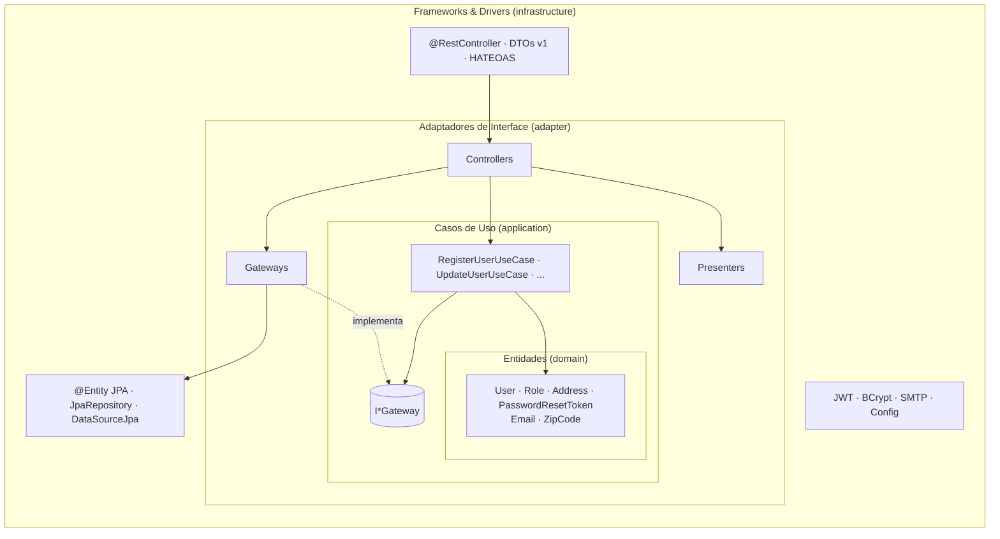
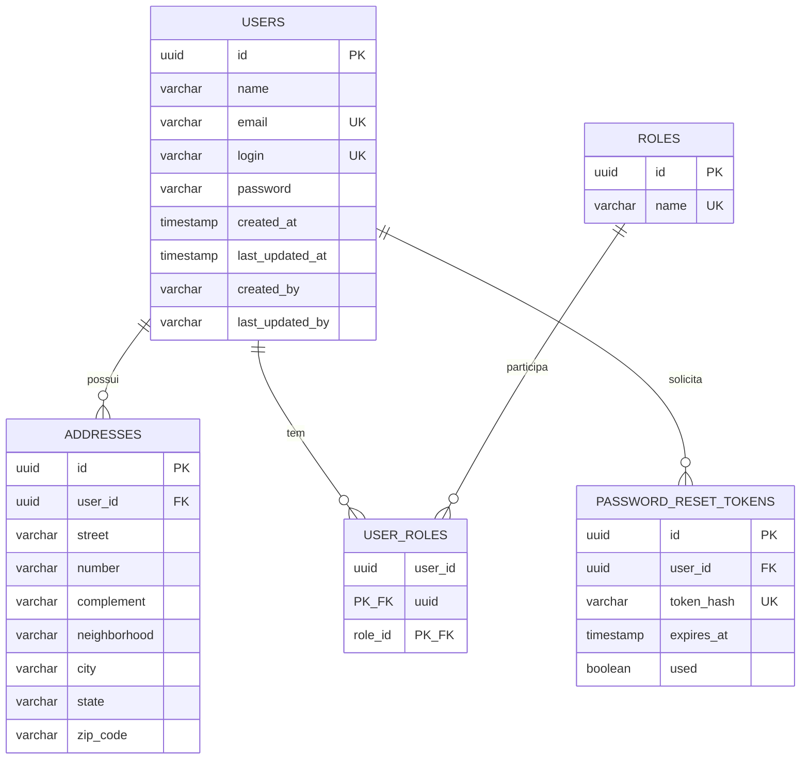

# Relatório Técnico — Tech Challenge Fase 2

## Sistema de Gestão de Restaurantes

**Aluno:**

- Felipe Dias Mac Dowell

**Curso:** Pós-Tech — Arquitetura e Desenvolvimento Java
**Stack:** Java 21 · Spring Boot 3.5.x · Spring Data JPA · PostgreSQL · Docker
**Arquitetura:** Clean Architecture
**Versão do relatório:** 1.0

> Documento vivo, organizado pelas etapas de desenvolvimento. Cada etapa do Sumário de
> Progresso abaixo corresponde a uma seção homônima neste relatório.
>
> Esta é a **primeira versão** do relatório da Fase 2. Ela define a arquitetura, o modelo de
> domínio e as decisões técnicas de um **projeto novo**, construído desde o início sobre a
> **Clean Architecture** de Robert C. Martin. As seções descrevem o desenho acordado pela
> equipe; à medida que cada etapa for concluída, o texto correspondente passa a refletir o
> código entregue.

---

## Sumário de Progresso

| #   | Etapa                                              | Status |
| --- | -------------------------------------------------- | ------ |
| 1   | Setup do Projeto e Estrutura de Pacotes            | ✅     |
| 2   | Camada de Entidades (domínio)                      | ✅     |
| 3   | Camada de Casos de Uso e Gateways                  | ⏳     |
| 4   | Adaptadores de Interface (Controllers, Gateways, Presenters) | ⏳ |
| 5   | Persistência com JPA (infraestrutura)              | ⏳     |
| 6   | Migrations e Seeds (Flyway)                        | ⏳     |
| 7   | API REST, Segurança e JWT (infraestrutura)         | ⏳     |
| 8   | Tratamento de Erros (ProblemDetail)                | ⏳     |
| 9   | Documentação Swagger                               | ⏳     |
| 10  | Execução com Docker Compose                        | ⏳     |
| 11  | Testes — unitários (100% cobertura) e de integração | ⏳    |
| 12  | Entregáveis (Postman, README)                      | ⏳     |

**Progresso:** 2 de 12 etapas concluídas.
**Legenda:** ✅ concluída · 🔄 em andamento · ⏳ pendente.

---

## Mapa dos Entregáveis Obrigatórios

| Entregável obrigatório                    | Onde encontrar               |
| ----------------------------------------- | ---------------------------- |
| Descrição detalhada da arquitetura        | Visão Geral da Arquitetura   |
| Modelagem das entidades e relacionamentos | Etapas 2 e 5                 |
| Estrutura do banco de dados (tabelas)     | Etapas 5 e 6                 |
| Descrição dos endpoints (com exemplos)    | Etapa 7                      |
| Documentação Swagger                      | Etapa 9                      |
| Coleção Postman                           | Etapa 12                     |
| Passo a passo com Docker Compose          | Etapa 10                     |

---

## Visão Geral da Arquitetura

### Padrão arquitetural adotado

O projeto adota a **Clean Architecture**, conforme descrita por Robert C. Martin em
*Clean Architecture: A Craftsman's Guide to Software Structure and Design* (2017). A ideia
central é organizar o sistema em **camadas concêntricas**, em que as camadas internas contêm
as regras de negócio e as externas contêm os detalhes técnicos — interface HTTP, banco de
dados, frameworks — e garantir que **as dependências apontem sempre para dentro**.

A escolha se justifica por três razões:

1. **Independência de framework.** As regras de negócio e a camada que as adapta não
   importam nada do Spring, do JPA ou do Hibernate. O núcleo compila e é testado sem
   framework no classpath; o Spring existe apenas na camada mais externa.
2. **Regras de negócio no domínio.** As entidades são responsáveis pela própria consistência:
   é a entidade que recusa um e-mail inválido, um nome em branco ou um usuário sem papel —
   não um objeto de transporte da API nem uma anotação de validação.
3. **Banco de dados como detalhe.** A persistência é uma implementação atrás de uma interface
   definida pelo núcleo. O JPA é usado com todas as suas facilidades — mapeamento,
   cascade, auditoria — mas confinado à infraestrutura, com entidades JPA separadas das
   entidades de domínio.

### As quatro camadas

| Camada                         | Pacote                                                                                  | Responsabilidade                                                                                                                                                                                                                          |
| ------------------------------ | --------------------------------------------------------------------------------------- | ----------------------------------------------------------------------------------------------------------------------------------------------------------------------------------------------------------------------------------------- |
| **Entidades** (Entities)       | `domain/entity`, `domain/vo`, `domain/exception`                                        | Objetos de negócio com seus invariantes. Criados por fábrica estática `create(...)` que valida os dados. VOs de valor (`Email`, `ZipCode`). Exceções de domínio. **Nenhuma dependência além do JDK.**                                    |
| **Casos de Uso** (Use Cases)   | `application/usecase`, `application/gateway`, `application/dto`                         | Uma classe por ação que o sistema oferece, com `create(gateways...)` e `run(dto)`. Orquestram as entidades e requisitam dados pelas **interfaces de gateway**, declaradas aqui porque é o caso de uso quem define o que precisa.        |
| **Adaptadores de Interface**   | `adapter/controller`, `adapter/gateway`, `adapter/presenter`                            | **Controllers** coordenam: instanciam o gateway com a origem de dados recebida, instanciam o caso de uso, entregam o resultado ao presenter. **Gateways** implementam as interfaces do núcleo e traduzem entidade ↔ dados externos, dependendo apenas de uma interface de origem de dados. **Presenters** preparam a saída para o cliente. |
| **Frameworks & Drivers**       | `infrastructure/web`, `infrastructure/persistence`, `infrastructure/security`, `infrastructure/mail`, `infrastructure/config` | Os detalhes: `@RestController`, DTOs HTTP, HATEOAS, handler de erros; entidades JPA, `JpaRepository` e a implementação da origem de dados; JWT, BCrypt, SMTP; configuração do Spring, OpenAPI e Flyway. **Só aqui existe Spring.**        |



### A regra de dependência

**O código só pode apontar para dentro.** Camadas internas não conhecem as externas; as
externas dependem de abstrações definidas nas internas (inversão de dependência). Na prática:

- `domain` não importa nada do projeto nem de bibliotecas;
- `application` importa apenas `domain`;
- `adapter` importa `application` e `domain`;
- `infrastructure` importa qualquer camada — é a única que conhece Spring, JPA e Hibernate.

Essa regra não é convenção: é verificada em build por testes de arquitetura (Etapa 11).

### Fluxo de uma requisição

```
Cliente HTTP
    │
    ▼
[@RestController]  ─UserRegistrationRequest→DTO─►  [UserController]  (adapter)
 (infrastructure/web)                                   │
                                                        │ cria UserGateway(IUserDataSource)
                                                        │ cria RegisterUserUseCase.create(gateway)
                                                        ▼
                                              [RegisterUserUseCase].run(dto)
                                                        │
                                                        │ User.create(...) ── valida invariantes
                                                        │ gateway.findByEmail / insert
                                                        ▼
                                                  [UserGateway]  (adapter)
                                                        │ traduz entidade ↔ DTO
                                                        ▼
                                              [UserDataSourceJpa]  (infrastructure)
                                                        │ JpaRepository / Hibernate
                                                        ▼
                                                   PostgreSQL
                                                        │
    ┌───────────────────────────────────────────────────┘
    ▼
[UserPresenter.toDTO]  ──►  [UserController]  ──►  [@RestController] monta UserResponse + links
```

Em caso de erro em qualquer ponto, a exceção de domínio sobe até o handler global da
infraestrutura e é convertida em uma resposta padronizada `ProblemDetail` (Etapa 8).

---

## Etapa 1 — Setup do Projeto e Estrutura de Pacotes

### Stack e dependências

| Tecnologia            | Versão       | Uso                                                     | Camada           |
| --------------------- | ------------ | ------------------------------------------------------- | ---------------- |
| Java                  | 21 (LTS)     | Linguagem                                               | todas            |
| Spring Boot           | 3.5.x        | Framework base                                          | `infrastructure` |
| Spring Web            | (gerenciado) | API REST                                                | `infrastructure` |
| Spring Data JPA       | (gerenciado) | Persistência (Hibernate)                                | `infrastructure` |
| Spring Validation     | (gerenciado) | Validação sintática dos DTOs HTTP                       | `infrastructure` |
| Spring Security       | (gerenciado) | Autenticação JWT                                        | `infrastructure` |
| Spring Mail           | (gerenciado) | E-mail de recuperação de senha                          | `infrastructure` |
| Spring HATEOAS        | (gerenciado) | Links de navegação nas respostas REST                   | `infrastructure` |
| Spring Boot Actuator  | (gerenciado) | Observabilidade (health, info, metrics)                 | `infrastructure` |
| PostgreSQL            | 16           | Banco relacional                                        | `infrastructure` |
| Flyway                | (gerenciado) | Migração e versionamento de schema                      | `infrastructure` |
| springdoc-openapi     | 2.8.x        | Documentação Swagger                                    | `infrastructure` |
| jjwt                  | 0.12.x       | Geração/validação de JWT                                | `infrastructure` |
| JUnit 5 + Mockito     | (gerenciado) | Testes unitários                                        | testes           |
| Testcontainers        | 1.20.x       | Testes de integração da persistência com PostgreSQL real | testes          |
| ArchUnit              | 1.4.x        | Testes automatizados da regra de dependência            | testes           |
| JaCoCo                | 0.8.x        | Cobertura de testes unitários — build falha abaixo de 100% | testes        |
| Maven Surefire / Failsafe | (gerenciado) | Separação entre testes unitários (`test`) e de integração (`integration-test`) | testes |

A coluna "Camada" registra o compromisso central do projeto: **toda biblioteca de framework
é dependência exclusiva de `infrastructure`**. `domain`, `application` e `adapter` compilam
apenas com o JDK. Não há Lombok nem geradores de código no núcleo — construtores, fábricas
e acessores são escritos à mão, o que mantém as regras de negócio legíveis sem processador de
anotações.

### Estrutura de pacotes

Raiz: `com.postech.restaurantes`

```
src/main/java/com/postech/restaurantes/
├── RestaurantesApplication.java
│
├── domain/                        # ENTIDADES — zero dependências
│   ├── entity/                    # User, Role, Address, PasswordResetToken
│   ├── vo/                        # Email, ZipCode
│   └── exception/                 # DuplicateResourceException, ResourceNotFoundException, ...
│
├── application/                   # CASOS DE USO — depende só de domain
│   ├── usecase/                   # RegisterUserUseCase, AuthenticateUseCase, ...
│   ├── gateway/                   # IUserGateway, IRoleGateway, IPasswordEncoder, IMailGateway, ...
│   └── dto/                       # records de entrada/saída dos casos de uso
│
├── adapter/                       # ADAPTADORES DE INTERFACE — depende de application e domain
│   ├── controller/                # UserController, AuthController (orquestração)
│   ├── gateway/                   # UserGateway, RoleGateway (implementam I*Gateway)
│   ├── datasource/                # IUserDataSource, IRoleDataSource (interfaces de origem de dados)
│   └── presenter/                 # UserPresenter, AuthPresenter
│
└── infrastructure/                # FRAMEWORKS & DRIVERS — único lugar com Spring/JPA
    ├── web/                       # @RestController v1, DTOs Request/Response, assemblers HATEOAS, handler de erros
    ├── persistence/               # @Entity JPA, JpaRepository, *DataSourceJpa, mapeadores JPA ↔ domínio
    ├── security/                  # JWT, filtro, BCrypt, UserDetailsService
    ├── mail/                      # implementação SMTP de IMailGateway
    └── config/                    # SecurityConfig, OpenApiConfig, JpaAuditingConfig, composição de beans
```

Cada pacote nasce com um `package-info.java` que documenta sua regra de dependência — o
que faz a estrutura compilar vazia e deixa a intenção de cada camada registrada no código,
não só neste relatório.

### O que foi entregue nesta etapa

Projeto em `fase-02/restaurantes/`:

| Artefato | Conteúdo |
| -------- | -------- |
| `pom.xml` | Dependências da tabela acima; Surefire executando os unitários (exclui `*IT`) e Failsafe executando os `*IT` na fase `integration-test`; JaCoCo com `prepare-agent`, relatório na fase `test` e `check` na fase `verify` exigindo **100% de linhas e ramos** (exclusões: `RestaurantesApplication` e `infrastructure/config/*Config`). |
| `src/main/java` | `RestaurantesApplication` e os 19 pacotes da estrutura, cada um com `package-info.java`. |
| `src/test/java` | `ArchitectureTest` (ArchUnit) com **8 regras**, ativas desde o primeiro build graças a `allowEmptyShould(true)`: arquitetura em anéis (`onionArchitecture`), `domain` sem dependências do projeto, `application` só de `domain`, `adapter` nunca de `infrastructure`, nenhum framework fora de `infrastructure`, sufixo `UseCase`, prefixo `I` em `application.gateway` e `adapter.datasource`. |
| `application.yml` | Datasource PostgreSQL por variáveis de ambiente; JPA com `ddl-auto: validate` e `open-in-view: false`; Flyway; JWT; mail; springdoc; Actuator com exposição controlada. |
| `Dockerfile`, `docker-compose.yml`, `.env.example`, `.dockerignore`, `.gitignore` | Build multi-stage (Maven → JRE 21 Alpine), serviço `db` (postgres:16-alpine com healthcheck) e `app`, variáveis documentadas. |
| `README.md`, `CHANGELOG.md` | Instruções de execução e teste; histórico por etapa. |

**Verificação.** `mvn verify` com JDK 21: compilação limpa, 8 regras de ArchUnit verdes,
Failsafe sem ITs ainda, JaCoCo `check` aprovado — **BUILD SUCCESS**. A regra de
dependência está, portanto, protegendo o projeto antes de existir a primeira classe de
negócio. A primeira execução da regra revelou um detalhe útil: o ArchUnit enxerga os
`package-info` como classes, então as regras de nomenclatura os excluem explicitamente.

---

## Etapa 2 — Camada de Entidades (domínio)

### Princípio

Cada entidade é responsável pela própria consistência. Não existe, em nenhum ponto do
sistema, uma instância de `User` com e-mail inválido ou sem papel — porque a única forma de
obter uma é pela fábrica `create(...)`, e ela recusa dados inválidos lançando
`IllegalArgumentException`. Os setters aplicam a mesma validação, de modo que a entidade não
pode ser corrompida depois de criada.

### Entidades

| Entidade             | Invariantes garantidos pela própria entidade                                                                                  |
| -------------------- | ----------------------------------------------------------------------------------------------------------------------------- |
| `User`               | nome não vazio; e-mail válido e normalizado (`Email`); login não vazio; hash de senha presente; **ao menos um papel**; endereços válidos |
| `Role`               | nome pertence ao conjunto `ROLE_OWNER`, `ROLE_CUSTOMER`, `ROLE_ADMIN`                                                          |
| `Address`            | rua, cidade e UF obrigatórios; UF com 2 letras; CEP válido e normalizado (`ZipCode`)                                          |
| `PasswordResetToken` | hash do token presente; expiração no futuro na criação; `markUsed()` só pode ser chamado uma vez                                |

`User` é a **raiz do agregado**: carrega `Set<Role>` e `List<Address>`, e é através dele que
endereços são substituídos (`replaceAddresses`) e papéis atribuídos (`replaceRoles`).

### VOs de valor

| VO         | Invariante                                    |
| ---------- | --------------------------------------------- |
| `Email`    | formato válido; normalizado para minúsculas   |
| `ZipCode`  | 8 dígitos; formatação `00000-000` sob demanda |

A normalização do e-mail para minúsculas dentro de `Email.of(...)` é o que torna a regra de
e-mail único correta por construção: `Joao@x.com` e `joao@x.com` produzem o mesmo valor
antes de qualquer consulta.

### Exemplo

```java
// domain/entity/User.java — sem Spring, sem JPA, sem Lombok (trecho)
public final class User {
    private final UUID id;
    private String name;
    private Email email;
    private String login;
    private String passwordHash;
    private final Set<Role> roles = new LinkedHashSet<>();
    private final List<Address> addresses = new ArrayList<>();
    private final LocalDateTime createdAt;
    private final LocalDateTime lastUpdatedAt;

    private User(UUID id, LocalDateTime createdAt, LocalDateTime lastUpdatedAt) { ... }

    /** Usuário novo, ainda sem id nem auditoria. */
    public static User create(String name, String email, String login, String passwordHash,
                              Set<Role> roles, List<Address> addresses) {
        return fill(new User(null, null, null), name, email, login, passwordHash, roles, addresses);
    }

    /** Usuário reconstruído a partir da origem de dados, com id e auditoria conhecidos. */
    public static User restore(UUID id, String name, String email, String login, String passwordHash,
                               Set<Role> roles, List<Address> addresses,
                               LocalDateTime createdAt, LocalDateTime lastUpdatedAt) {
        User user = new User(Guard.requireNonNull(id, "Id do usuário inválido"), createdAt, lastUpdatedAt);
        return fill(user, name, email, login, passwordHash, roles, addresses);
    }

    private static User fill(User user, String name, String email, String login, String passwordHash,
                             Set<Role> roles, List<Address> addresses) {
        user.setName(name);
        user.setEmail(Email.of(email));      // valida formato e normaliza para minúsculas
        user.setLogin(login);
        user.changePasswordHash(passwordHash);
        user.replaceRoles(roles);            // exige ao menos um papel
        user.replaceAddresses(addresses);
        return user;
    }

    public void setName(String name) {
        this.name = Guard.requireNonBlank(name, "Nome inválido");
    }

    public void replaceRoles(Set<Role> newRoles) {
        Guard.require(newRoles != null && !newRoles.isEmpty(), "Usuário deve ter ao menos um papel");
        Guard.require(newRoles.stream().noneMatch(Objects::isNull), "Papel inválido");
        roles.clear();
        roles.addAll(newRoles);
    }
    // demais setters validam do mesmo modo; getters devolvem visões imutáveis das coleções
}
```

`create` é usado para entidades novas (sem id); `restore` reconstrói uma entidade a partir
da origem de dados, com id conhecido. Ambos passam pela mesma validação.

### Exceções de domínio

| Exceção                          | Situação                                                  |
| -------------------------------- | --------------------------------------------------------- |
| `ResourceNotFoundException`      | usuário ou papel inexistente                               |
| `DuplicateResourceException`     | e-mail ou login já cadastrado                              |
| `InvalidPasswordException`       | senha atual incorreta ou confirmação divergente            |
| `ForbiddenOperationException`    | autocadastro solicitando papel privilegiado (`ROLE_ADMIN`) |
| `InvalidOrExpiredTokenException` | token de redefinição inexistente, expirado ou já usado     |
| `InvalidCredentialsException`    | login ou senha incorretos                                  |

São exceções não verificadas, sem nenhuma anotação: quem as traduz para HTTP é a
infraestrutura (Etapa 8). Todas estendem a base abstrata `DomainException`, o que permite ao
handler tratá-las por família quando conveniente.

### O que foi entregue nesta etapa

Pacote `domain` completo, com **15 classes e zero imports** fora do JDK:

| Tipo | Decisões de implementação |
| ---- | ------------------------- |
| `Guard` | Utilitário de invariantes (`requireNonNull`, `requireNonBlank`, `require`, `trimToNull`). Concentra as verificações para que as entidades leiam como regras, não como `if`s. Toda violação é `IllegalArgumentException`. |
| `Email`, `ZipCode` | `record`s com construtor compacto: validam e normalizam na construção (minúsculas / só dígitos), então a igualdade por valor do record já embute a normalização — `Email.of("Joao@x.com").equals(Email.of("joao@x.com"))` é verdadeiro. |
| `RoleName` | Enum com `from(String)` tolerante a caixa e `isPrivileged()` (só `ROLE_ADMIN`). |
| `Role` | Identidade de negócio pelo nome: `equals`/`hashCode` ignoram o id, permitindo comparar um papel recém-criado com um restaurado do banco dentro de um `Set`. |
| `Address` | Rua, cidade, UF (2 letras, normalizada para maiúsculas) e CEP obrigatórios; número, complemento e bairro opcionais com "em branco vira ausente". |
| `User` | Raiz do agregado. `create` (sem id/auditoria) e `restore` (com id, `createdAt`, `lastUpdatedAt`) passam pelo mesmo `fill`, então não há caminho que produza instância inválida. `replaceRoles`/`replaceAddresses` substituem as coleções por completo; `getRoles`/`getAddresses` devolvem visões imutáveis. O domínio recebe o **hash** da senha — nunca a senha nem o algoritmo. |
| `PasswordResetToken` | Guarda só o hash do token. O instante de referência é parâmetro (`create(..., now)`, `isExpired(now)`, `isUsable(now)`), mantendo a entidade sem relógio e os testes determinísticos. `markUsed()` é de uso único e a segunda chamada é `IllegalStateException` — violação de estado, não de argumento. |
| `DomainException` + 6 subclasses | `RuntimeException` com mensagem; sem anotação e sem código HTTP. |

**Testes unitários — 111 casos em 8 classes** (`GuardTest`, `EmailTest`, `ZipCodeTest`,
`RoleNameTest`, `RoleTest`, `AddressTest`, `UserTest`, `PasswordResetTokenTest`,
`DomainExceptionsTest`), sem mocks e sem Spring. Cada invariante tem um teste que prova a
recusa (`assertThrows`) e um que prova a aceitação; os casos de "em branco" usam
`@ParameterizedTest` com `@NullAndEmptySource`. Cobertura medida pelo JaCoCo no pacote
`domain`: **170/170 linhas, 44/44 ramos, 83/83 métodos** — 100%.

**Verificação.** `mvn verify`: 119 testes (111 unitários + 8 regras de ArchUnit), **BUILD
SUCCESS**, regra de cobertura aprovada. Os testes pegaram um defeito real antes do primeiro
uso: a verificação "nenhum elemento nulo" usava `contains(null)`, que em coleções imutáveis
(`Set.of`, `List.of`) lança `NullPointerException` em vez de responder `false`. Foi trocada
por `stream().noneMatch(Objects::isNull)`.

---

## Etapa 3 — Camada de Casos de Uso e Gateways

### Casos de uso

Cada ação que o sistema oferece é uma classe própria, instanciada por `create(...)` com as
interfaces de que depende e executada por `run(...)`. O caso de uso **orquestra**: consulta
gateways, cria ou altera entidades, aplica as regras de aplicação e devolve a entidade
resultante. Ele não sabe de HTTP, de JSON nem de banco de dados.

| Caso de uso              | Regras aplicadas                                                                                                                                               |
| ------------------------ | -------------------------------------------------------------------------------------------------------------------------------------------------------------- |
| `RegisterUserUseCase`    | rejeita `ROLE_ADMIN` no autocadastro (`ForbiddenOperationException`); garante unicidade de e-mail e login; aplica hash na senha via `IPasswordEncoder`; resolve papéis via `IRoleGateway`; cria `User` |
| `UpdateUserUseCase`      | atualiza nome, e-mail e login (revalidando unicidade, ignorando o próprio registro) e substitui endereços; **não** altera senha                                |
| `ChangePasswordUseCase`  | confere a senha atual, valida que nova senha e confirmação coincidem, grava o novo hash                                                                        |
| `DeleteUserUseCase`      | remove o usuário (endereços, tokens e vínculos de papel caem por cascade)                                                                                       |
| `FindUserByIdUseCase`    | consulta por id; `ResourceNotFoundException` se inexistente                                                                                                    |
| `SearchUsersUseCase`     | listagem paginada, com busca parcial por nome sem diferenciar maiúsculas; ordenação por propriedades permitidas                                                |
| `AuthenticateUseCase`    | busca por login, compara hash via `IPasswordEncoder`, emite token via `ITokenIssuer`; `InvalidCredentialsException` em falha                                   |
| `ForgotPasswordUseCase`  | se o e-mail existir, gera token de uso único, persiste o hash e envia por `IMailGateway`; **resposta idêntica exista ou não o e-mail**                          |
| `ResetPasswordUseCase`   | valida token (existe, não expirou, não usado), confere confirmação, grava novo hash e marca o token como usado                                                  |

### Regra de negócio × regra de aplicação

A distinção orienta onde cada regra mora:

- **Regra de negócio** (vale em qualquer contexto): e-mail válido, ao menos um papel, CEP com
  8 dígitos → **na entidade**.
- **Regra de aplicação** (depende do ponto de entrada): `ROLE_ADMIN` proibido *no autocadastro
  público*, resposta idêntica no "esqueci minha senha" → **no caso de uso**.

### Gateways (interfaces)

Declaradas em `application/gateway`, em termos de domínio — recebem e devolvem entidades e
VOs, nunca tipos de framework:

| Interface                      | Operações                                                                                        |
| ------------------------------ | ------------------------------------------------------------------------------------------------ |
| `IUserGateway`                 | `findById`, `findByLogin`, `findByEmail`, `search(name, PageRequest)`, `insert`, `update`, `delete` |
| `IRoleGateway`                 | `findByNames(Set<RoleName>)`                                                                     |
| `IPasswordResetTokenGateway`   | `findByTokenHash`, `insert`, `update`                                                            |
| `IPasswordEncoder`             | `encode`, `matches`                                                                              |
| `ITokenIssuer`                 | `issue(User)` → `IssuedToken(token, expiresAt)`                                                  |
| `IMailGateway`                 | `sendPasswordReset(Email, rawToken)`                                                             |

A paginação é expressa por tipos próprios de `application/dto` (`PageRequest`, `PageResult<T>`),
não por `Pageable`/`Page` do Spring — a tradução acontece na infraestrutura.

### Exemplo

```java
// application/usecase/RegisterUserUseCase.java
public class RegisterUserUseCase {
    private final IUserGateway userGateway;
    private final IRoleGateway roleGateway;
    private final IPasswordEncoder passwordEncoder;

    private RegisterUserUseCase(IUserGateway userGateway, IRoleGateway roleGateway,
                                IPasswordEncoder passwordEncoder) {
        this.userGateway = userGateway;
        this.roleGateway = roleGateway;
        this.passwordEncoder = passwordEncoder;
    }

    public static RegisterUserUseCase create(IUserGateway userGateway, IRoleGateway roleGateway,
                                             IPasswordEncoder passwordEncoder) {
        return new RegisterUserUseCase(userGateway, roleGateway, passwordEncoder);
    }

    public User run(NewUserDTO dto) {
        if (dto.roles().contains(RoleName.ROLE_ADMIN)) {
            throw new ForbiddenOperationException("Autocadastro não pode conceder ROLE_ADMIN");
        }
        Email email = Email.of(dto.email());
        if (userGateway.findByEmail(email).isPresent()) {
            throw new DuplicateResourceException("E-mail já cadastrado");
        }
        if (userGateway.findByLogin(dto.login()).isPresent()) {
            throw new DuplicateResourceException("Login já cadastrado");
        }
        Set<Role> roles = roleGateway.findByNames(dto.roles());
        User user = User.create(dto.name(), dto.email(), dto.login(),
                                passwordEncoder.encode(dto.password()), roles,
                                Address.fromDTOs(dto.addresses()));
        return userGateway.insert(user);
    }
}
```

---

## Etapa 4 — Adaptadores de Interface (Controllers, Gateways, Presenters)

Esta camada disciplina a comunicação entre o núcleo e o mundo exterior. Ela **não contém
regra de negócio**; contém tradução e orquestração.

### Controllers (adapter/controller)

O controller de adaptação é o ponto de entrada do núcleo. Ele recebe uma **origem de dados
por interface** (`IUserDataSource`), e com ela:

1. instancia o gateway (`UserGateway.create(dataSource)`);
2. instancia o caso de uso (`RegisterUserUseCase.create(gateway, ...)`);
3. executa `run(dto)`;
4. entrega a entidade ao presenter e devolve o DTO de saída.

É o controller quem "sabe quem sabe": conhece os componentes e a ordem em que se
combinam, mas não a lógica de nenhum deles. Como recebe a origem de dados de fora, o mesmo
controller funciona com JPA, com um mapa em memória nos testes, ou com qualquer outra
implementação.

```java
// adapter/controller/UserController.java
public class UserController {
    private final IUserDataSource userDataSource;
    private final IRoleDataSource roleDataSource;
    private final IPasswordEncoder passwordEncoder;

    public static UserController create(IUserDataSource userDataSource,
                                        IRoleDataSource roleDataSource,
                                        IPasswordEncoder passwordEncoder) { ... }

    public UserDTO register(NewUserDTO dto) {
        var userGateway = UserGateway.create(userDataSource);
        var roleGateway = RoleGateway.create(roleDataSource);
        var useCase = RegisterUserUseCase.create(userGateway, roleGateway, passwordEncoder);
        User user = useCase.run(dto);
        return UserPresenter.toDTO(user);
    }
}
```

### Gateways (adapter/gateway)

Implementam as interfaces `I*Gateway` do núcleo. São **tradutores**: recebem uma entidade,
convertem para o DTO que a origem de dados entende, chamam a interface `I*DataSource` e
reconstroem a entidade (`User.restore(...)`) com o resultado. O gateway não sabe se a origem
de dados é um banco relacional, um serviço remoto ou memória — ele depende apenas da interface.

### Interfaces de origem de dados (adapter/datasource)

`IUserDataSource`, `IRoleDataSource` e `IPasswordResetTokenDataSource` definem, em termos de
DTOs simples (records), as operações que a infraestrutura precisa oferecer. É o contrato que
a Etapa 5 implementa com JPA.

### Presenters (adapter/presenter)

Preparam a saída. `UserPresenter.toDTO(user)` produz o `UserDTO` que o cliente pode consumir —
e é o único lugar onde se decide o que **não** sai: a senha (hash) nunca cruza para fora. O
presenter retira do controller a obrigação de adaptar entidades e garante um formato padrão
de retorno, independentemente de quem consome (REST hoje, outro canal amanhã).

---

## Etapa 5 — Persistência com JPA (infraestrutura)

### Entidades JPA separadas das entidades de domínio

Anotar as entidades de domínio com `@Entity` acoplaria o núcleo ao Hibernate e faria as regras
de negócio dependerem do ciclo de vida do ORM. Por isso a persistência tem **as próprias
classes**: `UserJpaEntity`, `RoleJpaEntity`, `AddressJpaEntity`, `PasswordResetTokenJpaEntity`,
em `infrastructure/persistence`, com todas as anotações de mapeamento. A tradução entre elas e
os DTOs da origem de dados é responsabilidade de `UserDataSourceJpa`.

### Decisões de mapeamento

| Decisão | Detalhe |
| ------- | ------- |
| **Relacionamentos declarativos** | `@OneToMany(mappedBy = "user", cascade = ALL, orphanRemoval = true)` para endereços; `@ManyToMany` + `@JoinTable(name = "user_roles")` para papéis. Substituir a lista de endereços na entidade JPA remove os órfãos automaticamente. |
| **Identificadores UUID** | Chaves primárias `UUID`, geradas pelo banco via `DEFAULT gen_random_uuid()`. A entidade JPA declara `@Id @GeneratedValue(strategy = GenerationType.UUID)`. Ids aleatórios evitam enumeração de recursos pela API. |
| **Auditoria** | `@EnableJpaAuditing` + `@EntityListeners(AuditingEntityListener.class)` em uma superclasse `AuditableJpaEntity` com `created_at`, `last_updated_at`, `created_by`, `last_updated_by`. O `AuditorAware` lê o login autenticado no `SecurityContextHolder`, com fallback `"system"` para requisições anônimas e seeds. |
| **Schema é do Flyway** | `spring.jpa.hibernate.ddl-auto: validate` — o Hibernate confere o mapeamento contra o schema migrado e nunca o altera. |
| **Sem sessão aberta na view** | `spring.jpa.open-in-view: false`. Todo mapeamento JPA → DTO acontece dentro da transação do data source. |
| **N+1** | A consulta paginada usa `@EntityGraph(attributePaths = {"roles", "addresses"})`, carregando as associações da página inteira em uma consulta. |
| **Senha fora da listagem** | A página é lida por uma projeção sem a coluna `password`; `findById` e `findByLogin` carregam a entidade inteira, porque alimentam a gravação e a autenticação. |
| **Ordenação** | `Sort` do Spring Data é montado a partir do `PageRequest` do núcleo. Apenas `id`, `name`, `email`, `login`, `createdAt` e `lastUpdatedAt` são aceitos; `password` é rejeitado no data source. |
| **Transação** | `@Transactional` fica no `*DataSourceJpa` — o único componente que conhece a unidade de trabalho do Hibernate. |

### Modelo relacional

| Tabela                  | Tipo                     | Responsabilidade                                                   |
| ----------------------- | ------------------------ | ------------------------------------------------------------------ |
| `users`                 | Entidade forte           | Identidade e credenciais do usuário                                |
| `roles`                 | Entidade forte (lookup)  | Papéis de autorização                                              |
| `user_roles`            | Tabela associativa       | Resolve o N:M entre usuários e papéis                              |
| `addresses`             | Entidade                 | Endereços do usuário (1:N)                                         |
| `password_reset_tokens` | Entidade                 | Tokens de uso único para redefinição de senha (1:N com `users`)    |

Esquema normalizado até a 3ª Forma Normal / BCNF: papéis e endereços em tabelas próprias
(1FN), sem dependências parciais na única chave composta (`user_roles`, 2FN), sem dependências
transitivas em `users` (3FN), e todo determinante (`email`, `login`) é chave candidata (BCNF).



Todas as FKs usam `ON DELETE CASCADE`: remover um usuário remove endereços, tokens e vínculos
de papel sem deixar órfãos — no banco, independentemente do cascade do ORM.

---

## Etapa 6 — Migrations e Seeds (Flyway)

O schema é **gerenciado exclusivamente pelo Flyway**, por scripts SQL versionados em
`src/main/resources/db/migration`, aplicados na inicialização. O Hibernate apenas valida.

| Versão | Arquivo                                  | Conteúdo                                                                                      |
| ------ | ---------------------------------------- | --------------------------------------------------------------------------------------------- |
| V1     | `V1__create_schema.sql`                  | DDL de `users`, `roles`, `user_roles`, `addresses`, `password_reset_tokens` (PKs `UUID`, colunas de auditoria, FKs com cascade) + seed dos papéis |
| V2     | `V2__seed_demo_users.sql`                | Usuários de demonstração: um dono, um cliente e um administrador, com senhas em hash BCrypt   |

| Login              | Senha           | Papel            |
| ------------------ | --------------- | ---------------- |
| `dono.restaurante` | `dono12345`     | `ROLE_OWNER`     |
| `cliente.demo`     | `cliente12345`  | `ROLE_CUSTOMER`  |
| `admin.demo`       | `admin12345`    | `ROLE_ADMIN`     |

> Os seeds são apenas para teste; remova-os antes de um ambiente real. O `admin.demo` existe
> porque `ROLE_ADMIN` não pode ser obtido pelo autocadastro público — a seed é a via legítima
> de criar um administrador nesta fase.

Regras: migrations aplicadas são imutáveis (o Flyway valida o checksum); toda mudança entra
como uma nova migration `V<n>__descricao.sql`; o histórico fica em `flyway_schema_history` e
no `CHANGELOG.md` do módulo.

---

## Etapa 7 — API REST, Segurança e JWT (infraestrutura)

### Endpoints

A camada HTTP (`infrastructure/web`) é fina: valida sintaticamente o DTO de entrada (Bean
Validation), converte para o DTO do caso de uso, chama o controller de adaptação e monta a
resposta com links HATEOAS. Versionamento por path (`/api/v1/...`).

| Método   | Rota                              | Caso de uso              | Sucesso                    | Autorização                |
| -------- | --------------------------------- | ------------------------ | -------------------------- | -------------------------- |
| `POST`   | `/api/v1/auth/login`              | `AuthenticateUseCase`    | `200 OK` + token           | Pública                    |
| `POST`   | `/api/v1/auth/forgot-password`    | `ForgotPasswordUseCase`  | `202 Accepted`             | Pública                    |
| `POST`   | `/api/v1/auth/reset-password`     | `ResetPasswordUseCase`   | `204 No Content`           | Pública                    |
| `POST`   | `/api/v1/users`                   | `RegisterUserUseCase`    | `201 Created` + `Location` | Pública (sem `ROLE_ADMIN`) |
| `GET`    | `/api/v1/users/{id}`              | `FindUserByIdUseCase`    | `200 OK`                   | Dono ou `ROLE_ADMIN`       |
| `GET`    | `/api/v1/users?name=&page=&size=&sort=` | `SearchUsersUseCase` | `200 OK` (`PagedModel`)    | Autenticado                |
| `PUT`    | `/api/v1/users/{id}`              | `UpdateUserUseCase`      | `200 OK`                   | Dono ou `ROLE_ADMIN`       |
| `PATCH`  | `/api/v1/users/{id}/password`     | `ChangePasswordUseCase`  | `204 No Content`           | Dono ou `ROLE_ADMIN`       |
| `DELETE` | `/api/v1/users/{id}`              | `DeleteUserUseCase`      | `204 No Content`           | Dono ou `ROLE_ADMIN`       |

**Exemplo — cadastro** (`POST /api/v1/users`):

```json
{
  "name": "João Silva",
  "email": "joao.silva@email.com",
  "login": "joao.silva",
  "password": "senhaSegura123",
  "roles": ["ROLE_CUSTOMER"],
  "addresses": [
    {
      "street": "Rua das Flores",
      "number": "100",
      "complement": "Apto 21",
      "neighborhood": "Centro",
      "city": "São Paulo",
      "state": "SP",
      "zipCode": "01001-000"
    }
  ]
}
```

Resposta `201 Created`:

```json
{
  "id": "7295577e-afe6-4875-8bbf-d21c21860711",
  "name": "João Silva",
  "email": "joao.silva@email.com",
  "login": "joao.silva",
  "roles": [{ "id": "e19edd91-3b6e-4225-a721-ebfd6a5a576b", "name": "ROLE_CUSTOMER" }],
  "addresses": [{ "id": "a0d64f5e-e511-4b52-871d-582d7a8b18d0", "street": "Rua das Flores",
                  "number": "100", "complement": "Apto 21", "neighborhood": "Centro",
                  "city": "São Paulo", "state": "SP", "zipCode": "01001000" }],
  "createdAt": "2026-09-15T10:00:00",
  "lastUpdatedAt": "2026-09-15T10:00:00",
  "_links": {
    "self":  { "href": "http://localhost:8080/api/v1/users/7295577e-afe6-4875-8bbf-d21c21860711" },
    "users": { "href": "http://localhost:8080/api/v1/users" }
  }
}
```

**Exemplo — login** (`POST /api/v1/auth/login`):

```json
{ "login": "joao.silva", "password": "senhaSegura123" }
```

Resposta `200 OK`:

```json
{ "token": "eyJhbGciOiJIUzI1NiJ9...", "type": "Bearer", "expiresIn": 3600000 }
```

### Segurança

Autenticação **stateless** com JWT assinado em HMAC-SHA256 (`JWT_SECRET` com no mínimo
256 bits, expiração via `JWT_EXPIRATION`). A regra de login vive no `AuthenticateUseCase`;
a infraestrutura fornece `IPasswordEncoder` (BCrypt) e `ITokenIssuer` (jjwt), e o
`JwtAuthenticationFilter` valida o `Bearer` a cada requisição e popula o contexto de segurança.

**Autorização por posse.** Operações por id aplicam
`@PreAuthorize("hasRole('ADMIN') or @userSecurity.isSelf(#id, authentication)")`: um usuário
comum só lê, altera ou exclui o próprio cadastro (`403` caso contrário); `ROLE_ADMIN` acessa
qualquer um. Isso fecha a falha de referência direta a objeto (IDOR); o UUID aleatório
complementa a defesa dificultando a descoberta de ids, mas não a substitui.

**Recuperação de senha.** Token de 32 bytes de `SecureRandom` em Base64 URL, enviado por
e-mail; o banco guarda apenas o hash SHA-256. Uso único e com expiração. A resposta do
"esqueci minha senha" é idêntica exista ou não o e-mail, para não revelar quais endereços
estão cadastrados.

---

## Etapa 8 — Tratamento de Erros (ProblemDetail)

O `GlobalExceptionHandler` (`@RestControllerAdvice`, em `infrastructure/web`) traduz as
exceções de domínio e as do próprio Spring para **ProblemDetail (RFC 7807)**, com `timestamp`
e um `type` próprio por categoria. Um `JwtAuthenticationEntryPoint` estende o padrão ao 401 de
acesso sem token.

| Exceção / situação                                       | HTTP | Título                                            |
| -------------------------------------------------------- | ---- | ------------------------------------------------- |
| `MethodArgumentNotValidException` (Bean Validation)      | 400  | Requisição inválida (com mapa `errors` por campo) |
| `MethodArgumentTypeMismatchException` (`{id}` não é UUID) | 400 | Requisição inválida                               |
| `HttpMessageNotReadableException` (corpo malformado)     | 400  | Requisição inválida                               |
| `IllegalArgumentException` (invariante de entidade/VO)   | 400  | Requisição inválida                               |
| `InvalidPasswordException`                               | 400  | Senha inválida                                    |
| `InvalidOrExpiredTokenException`                         | 400  | Token inválido ou expirado                        |
| `InvalidCredentialsException`                            | 401  | Falha na autenticação                             |
| acesso sem token (entry point)                           | 401  | Não autenticado                                   |
| `ForbiddenOperationException`                            | 403  | Operação não permitida                            |
| `AccessDeniedException` (recurso de outro usuário)       | 403  | Acesso negado                                     |
| `ResourceNotFoundException`                              | 404  | Recurso não encontrado                            |
| `DuplicateResourceException`                             | 409  | Conflito de dados                                 |
| `Exception` (não prevista)                               | 500  | Erro inesperado — resposta genérica, exceção completa no log em nível ERROR |

Princípio: resposta vaga para o cliente, registro detalhado para quem opera. Mensagens de
parser ou de exceções internas nunca são repassadas na resposta.

---

## Etapa 9 — Documentação Swagger

OpenAPI gerada pelo springdoc a partir dos `@RestController` e dos DTOs HTTP. A
`OpenApiConfig` registra o esquema de segurança Bearer JWT, habilitando o botão **Authorize**.

- Swagger UI: `http://localhost:8080/swagger-ui.html`
- OpenAPI JSON: `http://localhost:8080/v3/api-docs`

---

## Etapa 10 — Execução com Docker Compose

### Variáveis de ambiente

| Variável         | Padrão                              | Descrição                     |
| ---------------- | ----------------------------------- | ----------------------------- |
| `DB_NAME`        | `restaurantes-app`                  | Nome do banco                 |
| `DB_USER`        | `postgres`                          | Usuário do banco              |
| `DB_PASSWORD`    | `postgres`                          | Senha do banco                |
| `DB_HOST`        | `localhost` (local) / `db` (compose)| Host do banco                 |
| `DB_PORT`        | `5432`                              | Porta do banco                |
| `JWT_SECRET`     | *(valor de exemplo)*                | Segredo de assinatura do JWT  |
| `JWT_EXPIRATION` | `3600000`                           | Expiração do token em ms      |
| `MAIL_HOST`      | `localhost` / `host.docker.internal`| SMTP para recuperação de senha |
| `MAIL_PORT`      | `1025`                              | Porta do SMTP                 |

### Passo a passo

```bash
# 1. (Opcional) criar seu .env a partir do exemplo
cp .env.example .env

# 2. Subir apenas o banco (útil durante o desenvolvimento)
docker compose up -d db

# 3. Subir aplicação + banco juntos
docker compose up --build

# 4. Encerrar (adicione -v para apagar os dados do banco)
docker compose down
```

Aplicação em `http://localhost:8080`; Swagger em `http://localhost:8080/swagger-ui.html`.

> O Docker também é pré-requisito para `mvn verify`: os testes de integração da Etapa 11
> sobem um PostgreSQL 16 via Testcontainers, com a mesma imagem `postgres:16-alpine` do
> `docker-compose.yml`.

---

## Etapa 11 — Testes: unitários (100% de cobertura) e de integração

A suíte tem **dois compromissos**, ambos verificados no build:

1. **Testes unitários com 100% de cobertura.** Toda linha e todo ramo de `domain`,
   `application` e `adapter` — e das classes de `infrastructure` que contêm lógica — são
   exercitados por testes unitários isolados, sem contexto Spring e sem banco. A meta é
   imposta pelo JaCoCo: o `mvn verify` **falha** se a cobertura de linhas ou de ramos ficar
   abaixo de 100%.
2. **Testes de integração que provam que a aplicação funciona.** Com o contexto Spring
   completo, PostgreSQL real (Testcontainers), migrations aplicadas pelo Flyway, segurança
   JWT ativa e requisições HTTP de verdade, cada endpoint é exercitado de ponta a ponta —
   do `@RestController` ao banco e de volta. Eles garantem que os componentes que os testes
   unitários isolaram por mocks realmente se encaixam.

A arquitetura torna os dois compromissos viáveis: como as camadas internas não conhecem
framework, os testes unitários são rápidos e não precisam de infraestrutura; e como toda a
infraestrutura está em um só pacote, os testes de integração sabem exatamente o que precisam
subir.

### Testes unitários (cobertura 100%)

| Nível                     | Alvo                                                       | Ferramentas         | Característica                                                                                                   |
| ------------------------- | ---------------------------------------------------------- | ------------------- | ---------------------------------------------------------------------------------------------------------------- |
| **Entidades**             | `User`, `Role`, `Address`, `PasswordResetToken`, `Email`, `ZipCode` | JUnit 5     | Sem mocks. Cada invariante tem um teste que prova que a entidade o recusa (`assertThrows`) e um que prova que aceita o valor válido. |
| **Casos de uso**          | cada `*UseCase`                                            | JUnit 5 + Mockito   | Mocks das interfaces `I*Gateway`; sem contexto Spring. Um comportamento por teste; todo `if` tem os dois caminhos cobertos. |
| **Adaptadores**           | controllers, gateways, presenters                          | JUnit 5 + Mockito   | Mocks de `I*DataSource`; verifica tradução entidade ↔ DTO e a orquestração do controller (gateway → caso de uso → presenter). |
| **Infraestrutura com lógica** | `*DataSourceJpa` (mapeamento), `GlobalExceptionHandler`, `JwtService`, `JwtAuthenticationFilter`, `AuditorProvider`, `UserSecurity`, assemblers HATEOAS | JUnit 5 + Mockito | Classes instanciadas diretamente, com `JpaRepository` e `SecurityContext` mockados. Configurações puramente declarativas (`@Configuration` sem lógica) são excluídas do cálculo. |
| **Arquitetura**           | regra de dependência                                       | ArchUnit            | Roda no build; falha se alguém importar Spring fora de `infrastructure`.                                         |

**Como o 100% é imposto.** O plugin `jacoco-maven-plugin` roda na fase `verify` com uma
regra `check` de `LINE` e `BRANCH` em `1.00` (100%). O relatório fica em
`target/site/jacoco/index.html`. A única exclusão prevista é `RestaurantesApplication` e as
classes `@Configuration` que apenas declaram beans — tudo o que contém um `if`, um `map` ou
uma exceção entra na conta.

```xml
<execution>
  <id>check-coverage</id>
  <goals><goal>check</goal></goals>
  <configuration>
    <rules>
      <rule>
        <element>BUNDLE</element>
        <limits>
          <limit><counter>LINE</counter><value>COVEREDRATIO</value><minimum>1.00</minimum></limit>
          <limit><counter>BRANCH</counter><value>COVEREDRATIO</value><minimum>1.00</minimum></limit>
        </limits>
      </rule>
    </rules>
    <excludes>
      <exclude>**/RestaurantesApplication.class</exclude>
      <exclude>**/infrastructure/config/*Config.class</exclude>
    </excludes>
  </configuration>
</execution>
```

### Testes de integração (componentes funcionando juntos)

Executados com `@SpringBootTest(webEnvironment = RANDOM_PORT)` e um único contêiner
PostgreSQL 16 compartilhado pela suíte (Testcontainers, `@ServiceConnection`). O Flyway
aplica as migrations reais no contêiner; a segurança JWT fica ativa; as chamadas são feitas
com `TestRestTemplate` contra a porta real. Nenhum bean é mockado, exceto o SMTP, substituído
por um `IMailGateway` em memória que captura o e-mail enviado.

| Suíte                          | O que garante                                                                                                                                                                  |
| ------------------------------ | ------------------------------------------------------------------------------------------------------------------------------------------------------------------------------ |
| `ApplicationContextIT`         | O contexto sobe com todos os beans; migrations V1–V2 aplicadas; `ddl-auto: validate` aceita o mapeamento JPA contra o schema real; `/actuator/health` responde `UP`.             |
| `UserDataSourceJpaIT`          | Persistência contra o banco real: inserção com UUID gerado pelo banco, cascade de endereços, `orphanRemoval`, N:M de papéis, projeção sem `password`, ordenação permitida e rejeitada, auditoria preenchida (`created_by`, `last_updated_at`). |
| `AuthFlowIT`                   | Login com seed (200), credenciais inválidas (401), acesso sem token (401), token expirado/forjado (401), token válido em endpoint protegido (200).                             |
| `UserLifecycleIT`              | Fluxo completo de um usuário: cadastro (201 + `Location`), login, consulta própria (200), consulta de outro (403), consulta via admin (200), atualização (200) com senha preservada e reautenticação, troca de senha (204) e login com a nova, exclusão (204) e 404 em seguida — verificando no banco que não restaram órfãos. |
| `UserSearchIT`                 | Listagem e busca paginada: `page`/`size`/`sort`, links HATEOAS `first`/`next`/`last`, bloco `page`, busca parcial sem diferenciar maiúsculas, `sort=password` ignorado.       |
| `PasswordResetFlowIT`          | "Esqueci minha senha" com e-mail existente e inexistente (mesma resposta 202), token capturado do `IMailGateway` de teste, redefinição (204), login com a nova senha, reuso do token (400), token expirado (400). |
| `ErrorContractIT`              | Cada erro previsto na Etapa 8 devolve `ProblemDetail` com `type`, `title`, `status`, `timestamp` e, no 400 de validação, o mapa `errors`; id malformado e corpo malformado devolvem 400; erro interno devolve 500 genérico sem vazar a mensagem. |
| `SwaggerIT`                    | `/v3/api-docs` público (200) e contendo todos os endpoints; `/swagger-ui.html` acessível.                                                                                       |

Os testes de integração têm sufixo `IT` e rodam na fase `integration-test` via
`maven-failsafe-plugin`, separados dos unitários (`maven-surefire-plugin`, fase `test`). Assim
`mvn test` continua rápido (unitários + ArchUnit, sem Docker) e `mvn verify` executa tudo e
aplica a regra de cobertura.

```bash
mvn test      # unitários + ArchUnit (segundos, sem Docker)
mvn verify    # + integração com Testcontainers + verificação de 100% de cobertura
```

### Convenções

- Estrutura **arrange / act / assert** em todo teste, com os três blocos visíveis.
- `@DisplayName` descreve a regra em linguagem de negócio
  (`"Recusa autocadastro com ROLE_ADMIN"`, não `testRegister3`).
- Nomes de método no formato `deve<Comportamento>Quando<Condição>`.
- Testes independentes entre si, sem estado compartilhado. Unitários rápidos o bastante para
  rodar a cada commit; de integração isolados por transação ou limpeza de tabelas entre
  classes, para que a ordem de execução nunca importe.
- Um teste unitário **nunca** sobe contexto Spring nem toca em banco; um teste de integração
  **nunca** mocka um bean da aplicação (só o SMTP).

### Regras de arquitetura (ArchUnit)

| Regra                                                                                | Protege                                      |
| ------------------------------------------------------------------------------------ | -------------------------------------------- |
| `domain` não depende de nenhum outro pacote do projeto                               | pureza das entidades                         |
| `application` depende apenas de `domain`                                             | casos de uso sem infraestrutura              |
| `adapter` não depende de `infrastructure`                                            | adaptadores agnósticos de framework          |
| nenhum tipo fora de `infrastructure` importa `org.springframework..`, `jakarta.persistence..`, `org.hibernate..` | a regra de dependência inteira |
| classes em `..usecase..` têm sufixo `UseCase` e método público `run`                 | convenção dos casos de uso                   |
| interfaces em `..gateway..` do `application` têm prefixo `I`                         | convenção dos gateways                       |

---

## Etapa 12 — Entregáveis (Postman, README)

- **Coleção Postman** (`postman/Restaurantes.postman_collection.json`, formato v2.1), com um
  request por caso de cada endpoint — sucesso e cada erro previsto — e scripts de teste que
  salvam `{{token}}`, `{{adminToken}}` e `{{userId}}` para execução de cima a baixo. Validada
  com Newman contra a aplicação em execução.
- **Prints** de cada request em `postman/prints/`, gerados a partir da mesma execução.
- **README** com stack, pré-requisitos, execução com Docker Compose, variáveis de ambiente,
  fluxo de autenticação, tabela de endpoints, Swagger, uso da coleção e execução dos testes.

---

## Decisões Técnicas (registro consolidado)

- **Testes em dois níveis obrigatórios:** unitários com **100% de cobertura** de linhas e
  ramos (JaCoCo bloqueia o build abaixo disso) e de integração com contexto Spring completo,
  PostgreSQL real via Testcontainers e requisições HTTP de ponta a ponta, cobrindo todos os
  endpoints e fluxos. Etapa 11.
- **Clean Architecture:** quatro camadas concêntricas (Entidades, Casos de Uso, Adaptadores
  de Interface, Frameworks & Drivers) com dependência sempre para dentro, verificada por
  ArchUnit. Detalhado na Visão Geral e na Etapa 11.
- **Entidades validam os próprios invariantes:** fábrica `create(...)` e setters validados;
  nenhuma instância inválida existe no sistema. Etapa 2.
- **Um caso de uso por ação,** com `create(...)`/`run(...)`, dependendo apenas de interfaces
  de gateway. Regras de negócio na entidade; regras de aplicação no caso de uso. Etapa 3.
- **Controller como orquestrador:** recebe a origem de dados por interface, instancia
  gateway e caso de uso, delega ao presenter. Etapa 4.
- **JPA confinado à infraestrutura,** com entidades JPA separadas das de domínio;
  relacionamentos, cascade e auditoria declarativos. Etapa 5.
- **Identificadores UUID gerados pelo banco,** para impedir enumeração de recursos. Etapa 5.
- **Schema versionado com Flyway** (`ddl-auto: validate`). Etapa 6.
- **Autenticação stateless com JWT** e senha em BCrypt; **autorização por posse** para evitar
  IDOR; autocadastro não concede `ROLE_ADMIN`. Etapa 7.
- **Padrão de erros ProblemDetail (RFC 7807).** Etapa 8.
- **Versionamento de API por path** (`/api/v1/...`). Etapa 7.
- **HATEOAS** nas respostas REST; **Actuator** para monitoramento. Etapa 7.
- **Sem Lombok nem geração de código no núcleo.** Etapa 1.
- **Paginação expressa em tipos próprios** (`PageRequest`, `PageResult`) no núcleo;
  `Pageable`/`Page` do Spring só na infraestrutura. Etapa 3.

---

## Referências Bibliográficas

**Arquitetura e código**

- MARTIN, R. *Clean Architecture: A Craftsman's Guide to Software Structure and Design*.
  Prentice Hall, 2017. Camadas concêntricas, regra de dependência, casos de uso, entidades
  e a tese de que banco de dados e frameworks são detalhes.
- MARTIN, R. *The Clean Architecture*. The Clean Code Blog, 2012. Artigo original com o
  diagrama dos anéis (Entities, Use Cases, Interface Adapters, Frameworks & Drivers).
- MARTIN, R. *Clean Code: A Handbook of Agile Software Craftsmanship*. Prentice Hall, 2009.
  Nomes, funções curtas, tratamento de erros por exceções e testes limpos.
- MARTIN, R. *Agile Principles, Patterns, and Practices in C#*. Pearson, 2006. Princípios
  SOLID, em especial a inversão de dependência usada nos gateways.
- MARTIN, R. *The Clean Coder: A Code of Conduct for Professional Programmers*. Prentice
  Hall, 2011. Responsabilidade profissional sobre a qualidade do que se entrega.

**Casos de uso e padrões**

- COCKBURN, A. *Writing Effective Use Cases*. Addison-Wesley, 2000.
- FREEMAN, E.; ROBSON, E. *Use a Cabeça! Padrões de Projeto (Head First Design Patterns)*.

**Banco de dados**

- DATE, C. J. *Introdução a Sistemas de Bancos de Dados*. Modelo relacional, formas normais
  e integridade referencial.
- MACHADO, Felipe Nery Rodrigues. *Banco de Dados: Projeto e Implementação*. Projeto de
  banco em três níveis e modelo entidade-relacionamento.
