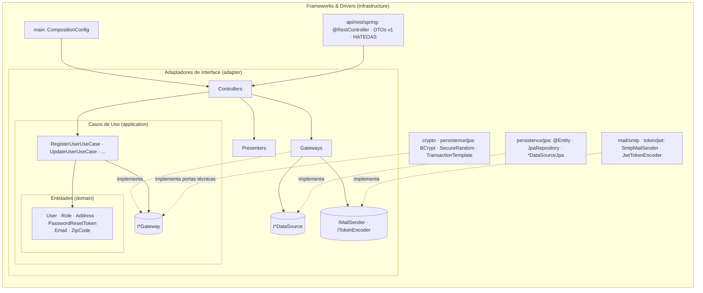
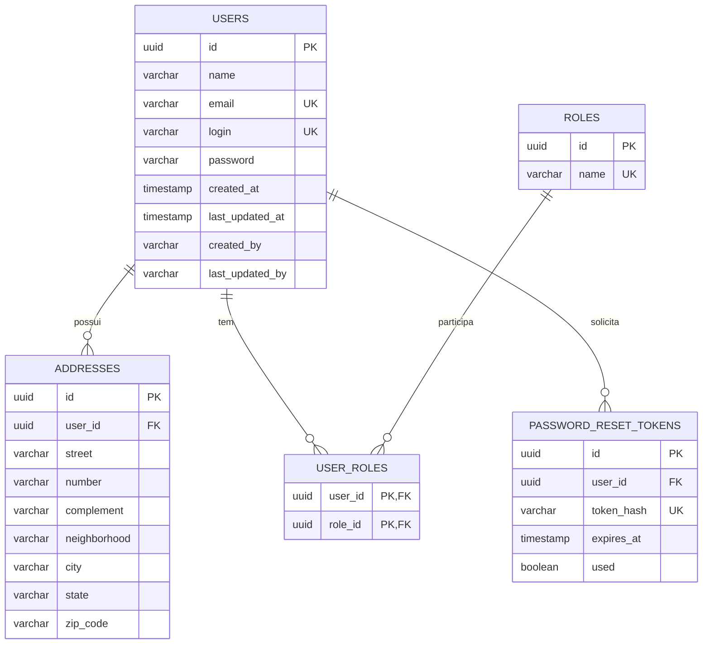
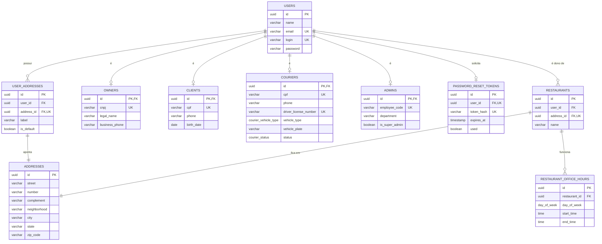

# Relatório Técnico — Tech Challenge Fase 2

## Sistema de Gestão de Restaurantes

**Aluno:**

- Felipe Dias Mac Dowell

**Curso:** Pós-Tech — Arquitetura e Desenvolvimento Java
**Stack:** Java 21 · Spring Boot 3.5.x · Spring Data JPA · PostgreSQL · Docker
**Arquitetura:** Clean Architecture
**Versão do relatório:** 2.0

| Versão | Conteúdo |
| --- | --- |
| 1.0 | Etapas 1 a 16: base do sistema (arquitetura, usuário, autenticação, persistência, erros, documentação, testes, execução) e módulo de restaurantes |
| 2.0 | **Modelo de Dados v2**: documentos do novo modelo no projeto, enums, divergências modelo → schema e as Etapas 17 a 25, que adequam `users`, `password_reset_tokens`, `owners`, `clients`, `couriers`, `admins`, `restaurants` e `restaurant_office_hours` ao modelo |

> Documento vivo, organizado pelas etapas de desenvolvimento. Cada etapa do Sumário de
> Progresso abaixo corresponde a uma seção homônima neste relatório.
>
> O relatório registra a arquitetura, o modelo de domínio e as decisões técnicas de um
> **projeto novo**, construído desde o início sobre a **Clean Architecture** de Robert C. Martin.
> A Visão Geral e as tabelas de referência descrevem o código **como ele está**; a seção de cada
> etapa diz o que ela entregou, qual conceito sustenta cada decisão e o resultado real do build —
> com os nomes de classes e pacotes da época (a Etapa 13 traz a correspondência para a
> infraestrutura, a Etapa 14, para os gateways de serviço, e a Etapa 15, para a API REST).
>
> A correlação detalhada entre o que as aulas da Fase 2 ensinam, o que os autores de referência
> dizem e como o projeto implementa cada camada está em [`docs/arquitetura/`](../docs/arquitetura/README.md).

---

## Sumário de Progresso

| #   | Etapa                                              | Status |
| --- | -------------------------------------------------- | ------ |
| 1   | Setup do Projeto e Estrutura de Pacotes            | ✅     |
| 2   | Camada de Entidades (domínio)                      | ✅     |
| 3   | Camada de Casos de Uso e Gateways                  | ✅     |
| 4   | Adaptadores de Interface (Controllers, Gateways, Presenters) | ✅ |
| 5   | Persistência com JPA (infraestrutura)              | ✅     |
| 6   | Migrations e Seeds (Flyway)                        | ✅     |
| 7   | API REST, Segurança e JWT (infraestrutura)         | ✅     |
| 8   | Tratamento de Erros (ProblemDetail)                | ✅     |
| 9   | Documentação Swagger                               | ✅     |
| 10  | Execução com Docker Compose                        | ✅     |
| 11  | Testes — unitários (100% cobertura) e de integração | ✅    |
| 12  | Entregáveis (Postman, README)                      | ✅     |
| 13  | Infraestrutura em módulos substituíveis            | ✅     |
| 14  | Revisão de conformidade e documentação da arquitetura | ✅  |
| 15  | API REST em `api/rest/spring`, organizada como MVC | ✅  |
| 16  | Módulo de Gestão de Restaurantes (`restaurants` - Imagem 2) | ✅  |
| 17  | Reorganização dos pacotes do agregado de usuário   | ⏳     |
| 18  | Endereços via `user_addresses` e endereço próprio do restaurante | ⏳ |
| 19  | Token de redefinição único por usuário (`password_reset_tokens`) | ⏳ |
| 20  | Perfis de usuário no domínio (`owners`, `clients`, `couriers`, `admins`) | ⏳ |
| 21  | Usuário composto por perfis (papel derivado)       | ⏳     |
| 22  | Perfis em usuário existente e status do entregador | ⏳     |
| 23  | Restaurante alinhado ao modelo v2 e à regra de posse (`restaurants`) | ⏳ |
| 24  | Horário de funcionamento por dia (`restaurant_office_hours`) | ⏳ |
| 25  | Revisão de conformidade do modelo de dados v2      | ⏳     |

**Progresso:** 16 de 25 etapas concluídas. As Etapas 17 a 25 adequam o projeto ao Modelo de
Dados v2 e estão planejadas na seção "Modelo de Dados v2 — adequação planejada".
**Legenda:** ✅ concluída · 🔄 em andamento · ⏳ pendente.

---

## Mapa dos Entregáveis Obrigatórios

| Entregável obrigatório                    | Onde encontrar               |
| ----------------------------------------- | ---------------------------- |
| Descrição detalhada da arquitetura        | Visão Geral da Arquitetura   |
| Modelagem das entidades e relacionamentos | Etapas 2, 5 e 16             |
| Estrutura do banco de dados (tabelas)     | Etapas 5, 6 e 16             |
| Modelo de dados v2 (documento de referência) | "Modelo de Dados v2 — adequação planejada" e [`docs/modelo-dados/`](../docs/modelo-dados/README.md) |
| Descrição dos endpoints (com exemplos)    | Etapas 7 e 16                |
| Documentação Swagger                      | Etapa 9                      |
| Coleção Postman                           | Etapas 12 e 16               |
| Passo a passo com Docker Compose          | Etapa 10                     |
| Correlação aulas × autores × código       | Etapa 14 e [`docs/arquitetura/`](../docs/arquitetura/README.md) |

---

## Escopo do Tech Challenge Fase 2 e estado

As Etapas 1 a 15 deste relatório constroem a **base** do sistema — arquitetura, agregado de usuário,
autenticação, persistência, erros, documentação, testes e execução — e a deixam pronta para as
features de restaurante e cardápio. O escopo funcional do enunciado ainda não está completo:

| Requisito funcional do enunciado | Estado | Onde |
| --- | --- | --- |
| Usuários (herdado da Fase 1): cadastro, consulta, atualização, exclusão, troca de senha, login | ✅ | Etapas 2 a 8 |
| Tipo de usuário: distinguir "Dono de Restaurante" e "Cliente" | ✅ catálogo fixo (`ROLE_OWNER`, `ROLE_CUSTOMER`, `ROLE_ADMIN`) e tabela de associação `user_roles`; no modelo v2, perfis em tabelas próprias (`owners`, `clients`, `couriers`, `admins`) | Etapas 2, 5, 6; v2: 20 e 21 |
| Tipo de usuário: associar o tipo a usuários **existentes** | 🔄 parcial — o tipo é escolhido no cadastro; alterar o tipo de um usuário já cadastrado ainda não é possível (`UpdateUserDTO` não tem papéis) | Etapa 3; v2: 22 |
| Tipo de usuário: CRUD do catálogo (campo "nome do tipo") | ⏳ pendente — **ponto de atenção:** o modelo v2 fixa os tipos no schema (uma tabela por perfil) e não tem catálogo editável; a forma de atender a este requisito precisa ser decidida pelo autor | — |
| Cadastro de restaurante (nome, endereço, horário de funcionamento, dono - Imagem 2) | ✅ com ajustes planejados ao modelo v2 (endereço próprio, posse, horário por dia) | Etapa 16; v2: 18, 21, 23, 24 |
| Cadastro de itens do cardápio (nome, descrição, preço, só no local, caminho da foto) | ⏳ pendente | — |

| Requisito técnico e de entrega | Estado | Onde |
| --- | --- | --- |
| Clean Architecture em camadas | ✅ quatro camadas, regra de dependência verificada no build | Visão Geral, Etapas 11, 13 e 14 |
| Testes unitários com 80% de cobertura | ✅ **100%** de linhas e ramos, com o build falhando abaixo disso | Etapa 11 |
| Testes de integração dos componentes | ✅ 89 testes com PostgreSQL real e HTTP de ponta a ponta | Etapa 11 |
| Documentação do projeto (arquitetura, endpoints, execução) | ✅ README, este relatório, Swagger e `docs/arquitetura/` | Etapas 9, 12 e 14 |
| Coleção Postman | ✅ 67 requests (52 da Etapa 12 + 15 de restaurantes da Etapa 16), com um print por request | Etapas 12 e 16 |
| Docker Compose com aplicação e banco | ✅ aplicação, PostgreSQL e Mailpit | Etapa 10 |
| Repositório aberto | ✅ público no GitHub (`felipe11dias/postech-fase2-restaurantes-app`), uma branch por etapa | — |
| Vídeo de apresentação | ⏳ pendente — depende das features | — |

As features pendentes seguem as mesmas regras já verificadas no build: cada uma ganha o próprio
subpacote em cada camada (*screaming architecture*), com entidade que valida seus invariantes,
casos de uso com `create`/`run`, gateway no adaptador, módulo de persistência próprio e request
por caso na coleção Postman.

---

## Visão Geral da Arquitetura

### Padrão arquitetural adotado

O projeto adota a **Clean Architecture**, conforme descrita por Robert C. Martin em
*Clean Architecture: A Craftsman's Guide to Software Structure and Design* (2017). A ideia
central é organizar o sistema em **camadas concêntricas**, em que as camadas internas contêm
as regras de negócio e as externas contêm os detalhes técnicos — interface HTTP, banco de
dados, frameworks — e garantir que **as dependências apontem sempre para dentro**.

A escolha se justifica por três razões:

1. **Independência de framework.** As regras de negócio e a camada que as adapta não
   importam nada do Spring, do JPA ou do Hibernate. O núcleo compila e é testado sem
   framework no classpath; o Spring existe apenas na camada mais externa.
2. **Regras de negócio no domínio.** As entidades são responsáveis pela própria consistência:
   é a entidade que recusa um e-mail inválido, um nome em branco ou um usuário sem papel —
   não um objeto de transporte da API nem uma anotação de validação.
3. **Banco de dados como detalhe.** A persistência é uma implementação atrás de uma interface
   definida pelo núcleo. O JPA é usado com todas as suas facilidades — mapeamento,
   cascade, auditoria — mas confinado à infraestrutura, com entidades JPA separadas das
   entidades de domínio.

### As quatro camadas

| Camada                         | Pacote                                                                                  | Responsabilidade                                                                                                                                                                                                                          |
| ------------------------------ | --------------------------------------------------------------------------------------- | ----------------------------------------------------------------------------------------------------------------------------------------------------------------------------------------------------------------------------------------- |
| **Entidades** (Entities)       | `domain/entity`, `domain/vo`, `domain/exception`                                        | Objetos de negócio com seus invariantes. Criados por fábrica estática `create(...)` (novo) ou `restore(...)` (já existente), ambas validando os dados. VOs de valor (`Email`, `ZipCode`). Exceções de domínio. **Nenhuma dependência além do JDK.**                                    |
| **Casos de Uso** (Use Cases)   | `application/usecase`, `application/gateway`, `application/dto`                         | Uma classe por ação que o sistema oferece, com `create(gateways...)` e `run(dto)`. Orquestram as entidades e requisitam dados pelas **interfaces de gateway**, declaradas aqui porque é o caso de uso quem define o que precisa.        |
| **Adaptadores de Interface**   | `adapter/controller`, `adapter/gateway`, `adapter/datasource`, `adapter/service`, `adapter/presenter` | **Controllers** coordenam: a cada operação instanciam os gateways com as origens de dados e os serviços recebidos, instanciam o caso de uso, executam-no numa unidade de trabalho e entregam o resultado ao presenter. **Gateways** implementam as interfaces do núcleo e traduzem entidade ↔ mundo externo, dependendo apenas de interfaces: de origem de dados (`I*DataSource`) ou de serviço externo (`IMailSender`, `ITokenEncoder`). **Presenters** preparam a saída para o cliente. |
| **Frameworks & Drivers**       | `infrastructure/main`, `infrastructure/api/rest/spring`, `infrastructure/persistence/jpa`, `infrastructure/token/jwt`, `infrastructure/crypto`, `infrastructure/mail/smtp` | Os detalhes, cada um como módulo substituível (Etapa 13): `@RestController`, DTOs HTTP, HATEOAS, handler de erros e Spring Security; entidades JPA, `JpaRepository` e a implementação da origem de dados; JWT; BCrypt; SMTP; e a composição que liga tudo. **Só aqui existe Spring.**        |



As setas sólidas são dependências de código; as tracejadas, implementação de interface — todas
apontam para dentro. O gateway do adaptador é o **tradutor** (Aulas 02 e 05): converte entidade em
registro da origem de dados, pedido de e-mail em assunto e corpo, usuário em dados do token. A
infraestrutura só transporta. As únicas portas do núcleo implementadas direto pela infraestrutura
são as **técnicas** — hash de senha, geração de token aleatório e unidade de trabalho —, em que não
há tradução a fazer (Etapa 14). O `main` cria tudo e liga as pontas.

### A regra de dependência

**O código só pode apontar para dentro.** Camadas internas não conhecem as externas; as
externas dependem de abstrações definidas nas internas (inversão de dependência). Na prática:

- `domain` não importa nada do projeto nem de bibliotecas;
- `application` importa apenas `domain`;
- `adapter` importa `application` e `domain`;
- `infrastructure` importa qualquer camada — é a única que conhece Spring, JPA e Hibernate.

Essa regra não é convenção: é verificada em build por testes de arquitetura (Etapa 11).

### Fluxo de uma requisição

O cadastro de usuário (`POST /api/v1/users`), com os nomes reais das classes:

```
Cliente HTTP
    │
    ▼
[UserRestController.register]         infrastructure/api/rest/spring/controller — Bean Validation (só sintaxe)
    │ NewUserRequest.toDTO() → NewUserDTO
    ▼
[UserController.register]             adapter/controller           — o "maestro"
    │ cria UserGateway.create(userDataSource), RoleGateway.create(roleDataSource)
    │ cria RegisterUserUseCase.create(userGateway, roleGateway, passwordEncoder)
    │ executa run(dto) dentro de IUnitOfWork.execute(...)          — atomicidade
    ▼
[RegisterUserUseCase.run]             application/usecase/user     — regras de aplicação
    │ User.create(...)                domain                       — invariantes
    │ userGateway.findByEmail / findByLogin / insert
    ▼
[UserGateway]                         adapter/gateway              — traduz User ↔ UserData
    │ IUserDataSource.insert(userData)
    ▼
[UserDataSourceJpa]                   infrastructure/persistence/jpa — JpaRepository / Hibernate
    │
    ▼
PostgreSQL ── volta ──►  [UserPresenter.toView(user)]  adapter/presenter — UserView, sem senha
                              │
                              ▼
                        [UserModelAssembler]  infrastructure/api/rest/spring/assembler — UserResponse + links, 201 + Location
```

O "esqueci minha senha" percorre o mesmo caminho com um **serviço** no lugar da origem de dados:
`AuthController` cria `PasswordResetMailGateway.create(mailSender)`; o caso de uso pede
`IMailGateway.sendPasswordReset(email, token, validade)`; o gateway monta assunto e corpo em
português e chama `IMailSender.send(to, subject, body)`, que o `SmtpMailSender` apenas transporta.
O passo a passo de cada camada, com as aulas e os autores que o sustentam, está em
[`docs/arquitetura/`](../docs/arquitetura/README.md).

Em caso de erro em qualquer ponto, a exceção de domínio sobe até o handler global da
infraestrutura e é convertida em uma resposta padronizada `ProblemDetail` (Etapa 8).

---

## Etapa 1 — Setup do Projeto e Estrutura de Pacotes

### Stack e dependências

| Tecnologia            | Versão       | Uso                                                     | Camada           |
| --------------------- | ------------ | ------------------------------------------------------- | ---------------- |
| Java                  | 21 (LTS)     | Linguagem                                               | todas            |
| Spring Boot           | 3.5.x        | Framework base                                          | `infrastructure` |
| Spring Web            | (gerenciado) | API REST                                                | `infrastructure` |
| Spring Data JPA       | (gerenciado) | Persistência (Hibernate)                                | `infrastructure` |
| Spring Validation     | (gerenciado) | Validação sintática dos DTOs HTTP                       | `infrastructure` |
| Spring Security       | (gerenciado) | Autenticação JWT                                        | `infrastructure` |
| Spring Mail           | (gerenciado) | E-mail de recuperação de senha                          | `infrastructure` |
| Spring HATEOAS        | (gerenciado) | Links de navegação nas respostas REST                   | `infrastructure` |
| Spring Boot Actuator  | (gerenciado) | Observabilidade (health, info, metrics)                 | `infrastructure` |
| PostgreSQL            | 16           | Banco relacional                                        | `infrastructure` |
| Flyway                | (gerenciado) | Migração e versionamento de schema                      | `infrastructure` |
| springdoc-openapi     | 2.8.x        | Documentação Swagger                                    | `infrastructure` |
| jjwt                  | 0.12.x       | Geração/validação de JWT                                | `infrastructure` |
| JUnit 5 + Mockito     | (gerenciado) | Testes unitários                                        | testes           |
| Testcontainers        | 1.20.x       | Testes de integração da persistência com PostgreSQL real | testes          |
| ArchUnit              | 1.4.x        | Testes automatizados da regra de dependência            | testes           |
| JaCoCo                | 0.8.x        | Cobertura de testes unitários — build falha abaixo de 100% | testes        |
| Maven Surefire / Failsafe | (gerenciado) | Separação entre testes unitários (`test`) e de integração (`integration-test`) | testes |

A coluna "Camada" registra o compromisso central do projeto: **toda biblioteca de framework
é dependência exclusiva de `infrastructure`**. `domain`, `application` e `adapter` compilam
apenas com o JDK. Não há Lombok nem geradores de código no núcleo — construtores, fábricas
e acessores são escritos à mão, o que mantém as regras de negócio legíveis sem processador de
anotações.

### Estrutura de pacotes

Raiz: `com.postech.restaurantes`

```
src/main/java/com/postech/restaurantes/
├── RestaurantesApplication.java
│
├── domain/                        # ENTIDADES — zero dependências
│   ├── entity/
│   │   ├── user/                  # User (raiz), Role, RoleName, PasswordResetToken
│   │   └── address/               # Address (compartilhado por usuário e, adiante, restaurante)
│   ├── vo/                        # Email, ZipCode
│   └── exception/                 # DuplicateResourceException, ResourceNotFoundException, ...
│
├── application/                   # CASOS DE USO — depende só de domain
│   ├── usecase/
│   │   ├── user/                  # RegisterUserUseCase, UpdateUserUseCase, SearchUsersUseCase, ...
│   │   └── auth/                  # AuthenticateUseCase, ForgotPasswordUseCase, ResetPasswordUseCase
│   ├── gateway/                   # IUserGateway, IRoleGateway, IPasswordEncoder, IMailGateway, ...
│   └── dto/
│       ├── common/                # PageRequest, PageResult, SortDirection, AddressDTO
│       ├── user/                  # NewUserDTO, UpdateUserDTO, ChangePasswordDTO
│       └── auth/                  # CredentialsDTO, ResetPasswordDTO, IssuedToken
│
├── adapter/                       # ADAPTADORES DE INTERFACE — depende de application e domain
│   ├── controller/                # UserController, AuthController (orquestração)
│   ├── gateway/                   # UserGateway, RoleGateway, PasswordResetTokenGateway (dados),
│   │                              # PasswordResetMailGateway, TokenGateway (serviços) — implementam I*Gateway
│   ├── datasource/                # IUserDataSource, IRoleDataSource, IPasswordResetTokenDataSource
│   │   └── data/                  # UserData, RoleData, AddressData, PasswordResetTokenData (records)
│   ├── service/                   # IMailSender, ITokenEncoder (serviços externos consumidos pelos gateways)
│   │   └── data/                  # TokenClaimsData (record)
│   └── presenter/                 # UserPresenter, AuthPresenter
│       └── view/                  # UserView, RoleView, AddressView, AuthView (records de saída)
│
└── infrastructure/                # FRAMEWORKS & DRIVERS — módulos substituíveis (Etapa 13)
    ├── main/                      # CompositionConfig (raiz de composição), PasswordResetProperties
    ├── api/rest/spring/           # API REST em Spring, organizada como MVC (Etapa 15)
    │   ├── controller/            # UserRestController, AuthRestController
    │   ├── dto/request/           # NewUserRequest, LoginRequest, ... (records *Request)
    │   ├── dto/response/          # UserResponse, AuthResponse, ... (records *Response)
    │   ├── assembler/             # UserModelAssembler (links HATEOAS)
    │   ├── route/                 # ApiRoutes (/api/v1/users, /api/v1/auth)
    │   ├── config/                # ForgotPasswordConfig
    │   ├── exception/             # GlobalExceptionHandler, ProblemDetailFactory, ProblemType
    │   ├── doc/                   # OpenApiConfig, ErrorResponse, customizers do springdoc
    │   ├── validation/            # @ValidPassword
    │   └── security/              # SecurityConfig, BearerTokenAuthenticationFilter, IAccessTokenReader, AuthenticatedActor, ...
    ├── persistence/jpa/           # PersistenceConfig, TransactionalUnitOfWork
    │   ├── audit/                 # AuditableJpaEntity, AuthenticatedAuditorAware, ClockDateTimeProvider
    │   └── user/                  # *JpaEntity (inclui AddressJpaEntity), SpringData*Repository, *DataSourceJpa
    ├── token/jwt/                 # JwtTokenEncoder (ITokenEncoder + IAccessTokenReader), JwtProperties, JwtConfig
    ├── crypto/                    # BCryptPasswordAdapter, SecureRandomTokenGenerator
    └── mail/smtp/                 # SmtpMailSender (IMailSender), MailProperties, MailConfig
```

> A infraestrutura chegou à forma acima na **Etapa 13**, os gateways de serviço
> (`adapter/service`), na **Etapa 14**, e a API em `api/rest/spring`, na **Etapa 15**. As subseções
> "O que foi entregue" das etapas anteriores registram os nomes e pacotes **da época**; as Etapas
> 13 a 15 trazem a correspondência.

Cada pacote nasce com um `package-info.java` que documenta sua regra de dependência — o
que faz a estrutura compilar vazia e deixa a intenção de cada camada registrada no código,
não só neste relatório.

Dentro de cada camada, entidades, casos de uso e DTOs são agrupados **por agregado ou
feature** (`user`, `auth`, `address`; depois `restaurant`, `menu`). É a *screaming
architecture* de Martin: a estrutura deve revelar o domínio, não apenas o padrão
arquitetural. As regras de ArchUnit usam padrões `..usecase..`/`..gateway..`, então continuam
válidas para qualquer subpacote.

### O que foi entregue nesta etapa

Projeto em `fase-02/restaurantes/`:

| Artefato | Conteúdo |
| -------- | -------- |
| `pom.xml` | Dependências da tabela acima; Surefire executando os unitários (exclui `*IT`) e Failsafe executando os `*IT` na fase `integration-test`; JaCoCo com `prepare-agent`, relatório na fase `test` e `check` na fase `verify` exigindo **100% de linhas e ramos** (exclusões: `RestaurantesApplication` e `infrastructure/config/*Config`). |
| `src/main/java` | `RestaurantesApplication` e os 19 pacotes da estrutura, cada um com `package-info.java`. |
| `src/test/java` | `ArchitectureTest` (ArchUnit) com **8 regras**, ativas desde o primeiro build graças a `allowEmptyShould(true)`: arquitetura em anéis (`onionArchitecture`), `domain` sem dependências do projeto, `application` só de `domain`, `adapter` nunca de `infrastructure`, nenhum framework fora de `infrastructure`, sufixo `UseCase`, prefixo `I` em `application.gateway` e `adapter.datasource`. |
| `application.yml` | Datasource PostgreSQL por variáveis de ambiente; JPA com `ddl-auto: validate` e `open-in-view: false`; Flyway; JWT; mail; springdoc; Actuator com exposição controlada. |
| `Dockerfile`, `docker-compose.yml`, `.env.example`, `.dockerignore`, `.gitignore` | Build multi-stage (Maven → JRE 21 Alpine), serviço `db` (postgres:16-alpine com healthcheck) e `app`, variáveis documentadas. |
| `README.md`, `CHANGELOG.md` | Instruções de execução e teste; histórico por etapa. |

**Verificação.** `mvn verify` com JDK 21: compilação limpa, 8 regras de ArchUnit verdes,
Failsafe sem ITs ainda, JaCoCo `check` aprovado — **BUILD SUCCESS**. A regra de
dependência está, portanto, protegendo o projeto antes de existir a primeira classe de
negócio. A primeira execução da regra revelou um detalhe útil: o ArchUnit enxerga os
`package-info` como classes, então as regras de nomenclatura os excluem explicitamente.

---

## Etapa 2 — Camada de Entidades (domínio)

### Princípio

Cada entidade é responsável pela própria consistência. Não existe, em nenhum ponto do
sistema, uma instância de `User` com e-mail inválido ou sem papel — porque a única forma de
obter uma é pela fábrica `create(...)`, e ela recusa dados inválidos lançando
`InvariantViolationException` — uma `IllegalArgumentException` cuja mensagem é escrita para o
usuário e, por isso, pode chegar à resposta HTTP (Etapa 8). Os setters aplicam a mesma
validação, de modo que a entidade não pode ser corrompida depois de criada.

### Entidades

| Entidade             | Invariantes garantidos pela própria entidade                                                                                  |
| -------------------- | ----------------------------------------------------------------------------------------------------------------------------- |
| `User`               | nome não vazio; e-mail válido e normalizado (`Email`); login não vazio; hash de senha presente; **ao menos um papel**; endereços válidos |
| `Role`               | nome pertence ao conjunto `ROLE_OWNER`, `ROLE_CUSTOMER`, `ROLE_ADMIN`                                                          |
| `Address`            | rua, cidade e UF obrigatórios; UF com 2 letras; CEP válido e normalizado (`ZipCode`)                                          |
| `PasswordResetToken` | hash do token presente; expiração no futuro na criação; `markUsed()` só pode ser chamado uma vez                                |

`User` é a **raiz do agregado**: carrega `Set<Role>` e `List<Address>`, e é através dele que
endereços são substituídos (`replaceAddresses`) e papéis atribuídos (`replaceRoles`).

### VOs de valor

| VO         | Invariante                                    |
| ---------- | --------------------------------------------- |
| `Email`    | formato válido; normalizado para minúsculas   |
| `ZipCode`  | 8 dígitos; formatação `00000-000` sob demanda |

A normalização do e-mail para minúsculas dentro de `Email.of(...)` é o que torna a regra de
e-mail único correta por construção: `Joao@x.com` e `joao@x.com` produzem o mesmo valor
antes de qualquer consulta.

### Exemplo

```java
// domain/entity/User.java — sem Spring, sem JPA, sem Lombok (trecho)
public final class User {
    private final UUID id;
    private String name;
    private Email email;
    private String login;
    private String passwordHash;
    private final Set<Role> roles = new LinkedHashSet<>();
    private final List<Address> addresses = new ArrayList<>();
    private final LocalDateTime createdAt;
    private final LocalDateTime lastUpdatedAt;

    private User(UUID id, LocalDateTime createdAt, LocalDateTime lastUpdatedAt) { ... }

    /** Usuário novo, ainda sem id nem auditoria. */
    public static User create(String name, String email, String login, String passwordHash,
                              Set<Role> roles, List<Address> addresses) {
        return fill(new User(null, null, null), name, email, login, passwordHash, roles, addresses);
    }

    /** Usuário reconstruído a partir da origem de dados, com id e auditoria conhecidos. */
    public static User restore(UUID id, String name, String email, String login, String passwordHash,
                               Set<Role> roles, List<Address> addresses,
                               LocalDateTime createdAt, LocalDateTime lastUpdatedAt) {
        User user = new User(Guard.requireNonNull(id, "Id do usuário inválido"), createdAt, lastUpdatedAt);
        return fill(user, name, email, login, passwordHash, roles, addresses);
    }

    private static User fill(User user, String name, String email, String login, String passwordHash,
                             Set<Role> roles, List<Address> addresses) {
        user.setName(name);
        user.setEmail(Email.of(email));      // valida formato e normaliza para minúsculas
        user.setLogin(login);
        user.changePasswordHash(passwordHash);
        user.replaceRoles(roles);            // exige ao menos um papel
        user.replaceAddresses(addresses);
        return user;
    }

    public void setName(String name) {
        this.name = Guard.requireNonBlank(name, "Nome inválido");
    }

    public void replaceRoles(Set<Role> newRoles) {
        Guard.require(newRoles != null && !newRoles.isEmpty(), "Usuário deve ter ao menos um papel");
        Guard.require(newRoles.stream().noneMatch(Objects::isNull), "Papel inválido");
        roles.clear();
        roles.addAll(newRoles);
    }
    // demais setters validam do mesmo modo; getters devolvem visões imutáveis das coleções
}
```

`create` é usado para entidades novas (sem id); `restore` reconstrói uma entidade a partir
da origem de dados, com id conhecido. Ambos passam pela mesma validação.

### Exceções de domínio

| Exceção                          | Situação                                                  |
| -------------------------------- | --------------------------------------------------------- |
| `ResourceNotFoundException`      | usuário ou papel inexistente                               |
| `DuplicateResourceException`     | e-mail ou login já cadastrado                              |
| `InvalidPasswordException`       | senha atual incorreta ou confirmação divergente            |
| `ForbiddenOperationException`    | autocadastro solicitando papel privilegiado (`ROLE_ADMIN`) |
| `InvalidOrExpiredTokenException` | token de redefinição inexistente, expirado ou já usado     |
| `InvalidCredentialsException`    | login ou senha incorretos                                  |

São exceções não verificadas, sem nenhuma anotação: quem as traduz para HTTP é a
infraestrutura (Etapa 8). Todas estendem a base abstrata `DomainException`, o que permite ao
handler tratá-las por família quando conveniente.

### O que foi entregue nesta etapa

Pacote `domain` completo, com **15 classes e zero imports** fora do JDK:

| Tipo | Decisões de implementação |
| ---- | ------------------------- |
| `Guard` | Utilitário de invariantes (`requireNonNull`, `requireNonBlank`, `require`, `trimToNull`). Concentra as verificações para que as entidades leiam como regras, não como `if`s. Toda violação é `IllegalArgumentException`. |
| `Email`, `ZipCode` | `record`s com construtor compacto: validam e normalizam na construção (minúsculas / só dígitos), então a igualdade por valor do record já embute a normalização — `Email.of("Joao@x.com").equals(Email.of("joao@x.com"))` é verdadeiro. |
| `RoleName` | Enum com `from(String)` tolerante a caixa e `isPrivileged()` (só `ROLE_ADMIN`). |
| `Role` | Identidade de negócio pelo nome: `equals`/`hashCode` ignoram o id, permitindo comparar um papel recém-criado com um restaurado do banco dentro de um `Set`. |
| `Address` | Rua, cidade, UF (2 letras, normalizada para maiúsculas) e CEP obrigatórios; número, complemento e bairro opcionais com "em branco vira ausente". |
| `User` | Raiz do agregado. `create` (sem id/auditoria) e `restore` (com id, `createdAt`, `lastUpdatedAt`) passam pelo mesmo `fill`, então não há caminho que produza instância inválida. `replaceRoles`/`replaceAddresses` substituem as coleções por completo; `getRoles`/`getAddresses` devolvem visões imutáveis. O domínio recebe o **hash** da senha — nunca a senha nem o algoritmo. |
| `PasswordResetToken` | Guarda só o hash do token. O instante de referência é parâmetro (`create(..., now)`, `isExpired(now)`, `isUsable(now)`), mantendo a entidade sem relógio e os testes determinísticos. `markUsed()` é de uso único e a segunda chamada é `IllegalStateException` — violação de estado, não de argumento. |
| `DomainException` + 6 subclasses | `RuntimeException` com mensagem; sem anotação e sem código HTTP. |

**Testes unitários — 111 casos em 8 classes** (`GuardTest`, `EmailTest`, `ZipCodeTest`,
`RoleNameTest`, `RoleTest`, `AddressTest`, `UserTest`, `PasswordResetTokenTest`,
`DomainExceptionsTest`), sem mocks e sem Spring. Cada invariante tem um teste que prova a
recusa (`assertThrows`) e um que prova a aceitação; os casos de "em branco" usam
`@ParameterizedTest` com `@NullAndEmptySource`. Cobertura medida pelo JaCoCo no pacote
`domain`: **170/170 linhas, 44/44 ramos, 83/83 métodos** — 100%.

**Verificação.** `mvn verify`: 119 testes (111 unitários + 8 regras de ArchUnit), **BUILD
SUCCESS**, regra de cobertura aprovada. Os testes pegaram um defeito real antes do primeiro
uso: a verificação "nenhum elemento nulo" usava `contains(null)`, que em coleções imutáveis
(`Set.of`, `List.of`) lança `NullPointerException` em vez de responder `false`. Foi trocada
por `stream().noneMatch(Objects::isNull)`.

---

## Etapa 3 — Camada de Casos de Uso e Gateways

### Casos de uso

Cada ação que o sistema oferece é uma classe própria, instanciada por `create(...)` com as
interfaces de que depende e executada por `run(...)`. O caso de uso **orquestra**: consulta
gateways, cria ou altera entidades, aplica as regras de aplicação e devolve a entidade
resultante. Ele não sabe de HTTP, de JSON nem de banco de dados.

| Caso de uso              | Regras aplicadas                                                                                                                                               |
| ------------------------ | -------------------------------------------------------------------------------------------------------------------------------------------------------------- |
| `RegisterUserUseCase`    | rejeita `ROLE_ADMIN` no autocadastro (`ForbiddenOperationException`); garante unicidade de e-mail e login; aplica hash na senha via `IPasswordEncoder`; resolve papéis via `IRoleGateway`; cria `User` |
| `UpdateUserUseCase`      | atualiza nome, e-mail e login (revalidando unicidade, ignorando o próprio registro) e substitui endereços; **não** altera senha                                |
| `ChangePasswordUseCase`  | confere a senha atual, valida que nova senha e confirmação coincidem, grava o novo hash                                                                        |
| `DeleteUserUseCase`      | remove o usuário (endereços, tokens e vínculos de papel caem por cascade)                                                                                       |
| `FindUserByIdUseCase`    | consulta por id; `ResourceNotFoundException` se inexistente                                                                                                    |
| `SearchUsersUseCase`     | listagem paginada, com busca parcial por nome sem diferenciar maiúsculas; ordenação por propriedades permitidas                                                |
| `AuthenticateUseCase`    | busca por login, compara hash via `IPasswordEncoder`, emite token via `ITokenIssuer`; `InvalidCredentialsException` em falha — com a **mesma mensagem e o mesmo custo de tempo** para login inexistente e senha incorreta |
| `ForgotPasswordUseCase`  | se o e-mail existir, gera token de uso único, persiste o hash e envia por `IMailGateway`; **resposta idêntica exista ou não o e-mail**                          |
| `ResetPasswordUseCase`   | valida token (existe, não expirou, não usado), confere confirmação, **invalida o token e só então** grava o novo hash                                            |

### Regra de negócio × regra de aplicação

A distinção orienta onde cada regra mora:

- **Regra de negócio** (vale em qualquer contexto): e-mail válido, ao menos um papel, CEP com
  8 dígitos → **na entidade**.
- **Regra de aplicação** (depende do ponto de entrada): `ROLE_ADMIN` proibido *no autocadastro
  público*, resposta idêntica no "esqueci minha senha" → **no caso de uso**.

### Gateways (interfaces)

Declaradas em `application/gateway`, em termos de domínio — recebem e devolvem entidades e
VOs, nunca tipos de framework:

| Interface                      | Operações | Implementada por |
| ------------------------------ | --------- | ---------------- |
| `IUserGateway`                 | `findById`, `findByLogin`, `findByEmail`, `search(name, PageRequest)`, `insert`, `update`, `delete` | `UserGateway` (adaptador), sobre `IUserDataSource` |
| `IRoleGateway`                 | `findByNames(Set<RoleName>)` | `RoleGateway` (adaptador), sobre `IRoleDataSource` |
| `IPasswordResetTokenGateway`   | `findByTokenHash`, `insert`, `update` | `PasswordResetTokenGateway` (adaptador), sobre `IPasswordResetTokenDataSource` |
| `ITokenIssuer`                 | `issue(User)` → `IssuedToken(token, expiresAt)` | `TokenGateway` (adaptador), sobre `ITokenEncoder` |
| `IMailGateway`                 | `sendPasswordReset(Email to, String rawToken, Duration validity)` | `PasswordResetMailGateway` (adaptador), sobre `IMailSender` |
| `IPasswordEncoder`             | `encode`, `matches`, `simulateMatch` (gasta o tempo de uma comparação quando não há hash real — o núcleo não conhece o algoritmo) | `BCryptPasswordAdapter` (infraestrutura) — porta técnica |
| `ISecureTokenGenerator`        | `generate()` → token aleatório em claro; `hash(rawToken)` → hash determinístico para persistir e consultar | `SecureRandomTokenGenerator` (infraestrutura) — porta técnica |
| `IUnitOfWork`                  | `execute(Supplier)` / `execute(Runnable)` — executa um bloco de forma atômica; usada pelo controller de adaptação ao invocar um caso de uso | `TransactionalUnitOfWork` (infraestrutura) — porta técnica |

Onde há **tradução** — entidade ↔ registro, pedido ↔ mensagem, usuário ↔ dados do token — a porta
é implementada por um gateway do adaptador, que consome a infraestrutura por uma segunda interface
(Aula 06). As três portas técnicas não têm o que traduzir e são implementadas direto (Etapa 14).

A paginação é expressa por tipos próprios de `application/dto` (`PageRequest`, `PageResult<T>`),
não por `Pageable`/`Page` do Spring — a tradução acontece na infraestrutura.

`ISecureTokenGenerator` existe por dois motivos: a escolha de algoritmo (`SecureRandom`,
SHA-256) é detalhe de infraestrutura, e o token gerado precisa ser **determinístico nos
testes** dos casos de uso — com um mock, o teste sabe exatamente qual hash deve ter sido
persistido e qual valor em claro deve ter ido para o e-mail.

### Exemplo

```java
// application/usecase/RegisterUserUseCase.java
public final class RegisterUserUseCase {
    private final IUserGateway userGateway;
    private final IRoleGateway roleGateway;
    private final IPasswordEncoder passwordEncoder;

    private RegisterUserUseCase(IUserGateway userGateway, IRoleGateway roleGateway,
                                IPasswordEncoder passwordEncoder) { ... }

    public static RegisterUserUseCase create(IUserGateway userGateway, IRoleGateway roleGateway,
                                             IPasswordEncoder passwordEncoder) {
        return new RegisterUserUseCase(userGateway, roleGateway, passwordEncoder);
    }

    public User run(NewUserDTO dto) {
        Guard.requireNonNull(dto, "Dados de cadastro inválidos");
        Set<RoleName> roleNames = dto.roles();
        Guard.require(roleNames != null && !roleNames.isEmpty(), "Usuário deve ter ao menos um papel");
        if (roleNames.stream().anyMatch(RoleName::isPrivileged)) {
            throw new ForbiddenOperationException("Autocadastro não pode conceder papel de administrador");
        }
        Email email = Email.of(dto.email());
        if (userGateway.findByEmail(email).isPresent()) {
            throw new DuplicateResourceException("E-mail já cadastrado");
        }
        String login = Guard.requireNonBlank(dto.login(), "Login inválido");
        if (userGateway.findByLogin(login).isPresent()) {
            throw new DuplicateResourceException("Login já cadastrado");
        }
        Set<Role> roles = roleGateway.findByNames(roleNames);
        if (roles.size() != roleNames.size()) {
            throw new ResourceNotFoundException("Papel inexistente");
        }
        String rawPassword = Guard.requireNonBlank(dto.password(), "Senha inválida");
        User user = User.create(dto.name(), email.value(), login, passwordEncoder.encode(rawPassword),
                roles, AddressDTO.toEntities(dto.addresses()));
        return userGateway.insert(user);
    }
}
```

A conversão de endereços fica em `AddressDTO.toEntities(...)` — na camada de aplicação, que
conhece o domínio — e não em um `Address.fromDTOs(...)`, que faria o domínio conhecer um DTO
de fora e violaria a regra de dependência.

### O que foi entregue nesta etapa

Pacote `application` completo — **10 DTOs, 7 interfaces de gateway e 9 casos de uso** —
importando apenas `domain` e o JDK:

| Componente | Decisões de implementação |
| ---------- | ------------------------- |
| `PageRequest` / `PageResult<T>` | Records próprios de paginação: página base 0, tamanho 1–100, ordenação opcional. `PageResult.map(...)` permite ao presenter converter o conteúdo sem perder os metadados; o conteúdo é copiado e imutável. |
| `AddressDTO`, `NewUserDTO`, `UpdateUserDTO`, `ChangePasswordDTO`, `CredentialsDTO`, `ResetPasswordDTO`, `IssuedToken`, `SortDirection` | Records de transporte. Só `IssuedToken` valida (token não vazio, expiração presente); os demais são validados por quem os consome. |
| Casos de uso | Todos `final`, com construtor privado, `create(...)` recebendo apenas interfaces e `run(...)`. Nenhum `@Service`, nenhum `@Transactional`: a transação é aberta pela origem de dados, na infraestrutura. |
| `RegisterUserUseCase` | Rejeita papel privilegiado **antes** de qualquer consulta; unicidade de e-mail (já normalizado pelo VO) e de login; confere que todos os papéis pedidos existem (`ResourceNotFoundException` se algum faltar); a senha só chega ao `IPasswordEncoder` depois de validada. |
| `UpdateUserUseCase` | Unicidade revalidada com `Optional.filter(other -> !other.getId().equals(id))` — o próprio registro não conta como duplicata. Senha intocada. |
| `ChangePasswordUseCase` / `ResetPasswordUseCase` | Ordem das verificações escolhida para falhar cedo e barato: senha atual (ou token) → nova senha não vazia → confirmação → só então o hash e a gravação. |
| `SearchUsersUseCase` | Lista fixa `SORTABLE_PROPERTIES`; propriedade fora dela (inclusive `password`) cai em `name ASC` em vez de erro, preservando o contrato de `200` para `sort` desconhecido. |
| `AuthenticateUseCase` | Login inexistente e senha incorreta lançam a mesma `InvalidCredentialsException` com a mesma mensagem, para não revelar quais logins existem. |
| `ForgotPasswordUseCase` | Recebe `Duration` de validade e `Clock` na criação (validados). E-mail inexistente retorna em silêncio sem tocar nos gateways de token e e-mail — a resposta é idêntica ao caso de sucesso. Persiste só o hash; o valor em claro vai apenas para `IMailGateway`. |

**Testes unitários — 70 casos em 10 classes** (`PageRequestTest`, `PageResultTest`, `DtoTest`,
`RegisterUserUseCaseTest`, `UpdateUserUseCaseTest`, `ChangePasswordUseCaseTest`,
`UserQueryUseCasesTest` com `@Nested` para Find/Delete/Search, `AuthenticateUseCaseTest`,
`ForgotPasswordUseCaseTest`, `ResetPasswordUseCaseTest`), com **Mockito** para as interfaces
de gateway e `Clock.fixed` para o tempo — sem contexto Spring, sem banco. `ArgumentCaptor`
verifica o que foi entregue aos gateways (o hash persistido, o token em claro enviado, a
ordenação sanitizada). Uma armadilha do JUnit 5 documentada no código: em classes `@Nested` o
inicializador de campo roda **antes** do `@BeforeEach` externo, então o caso de uso é criado
em um `@BeforeEach` aninhado.

**Revisão de código da etapa.** Antes de fechar, o diff passou por uma revisão focada em
falhas reais, que apontou cinco problemas — todos corrigidos com teste correspondente:

| Achado | Correção |
| ------ | -------- |
| `ResetPasswordUseCase` gravava a senha **antes** de marcar o token como usado. Como cada gateway é a própria transação, uma falha entre as duas escritas deixaria a senha trocada e o token reutilizável. | Ordem invertida: o token é invalidado e persistido primeiro; se a gravação da senha falhar, o efeito é "peça um novo token". Teste com `InOrder` e um teste em que `tokenGateway.update` lança e a senha permanece intacta. |
| `RegisterUserUseCase`: `"roles": [null]` passava pela checagem nulo/vazio e estourava `NullPointerException` (500) em `RoleName::isPrivileged`. | `Guard.require(roleNames.stream().noneMatch(Objects::isNull), ...)` → 400. |
| `AddressDTO.toEntities`: `"addresses": [null]` produzia NPE (500) no `map`. | Mesma guarda → `IllegalArgumentException("Endereço inválido")` → 400. |
| `AuthenticateUseCase`: login inexistente retornava **sem** executar o BCrypt; a diferença de latência (~1 ms × ~100 ms) permitia enumerar logins apesar da mensagem única. | Quando o login não existe, a senha é comparada contra um hash BCrypt fixo (`DUMMY_HASH`), igualando o custo dos dois caminhos; o resultado dessa comparação é ignorado. |
| Senha nula chegava ao `IPasswordEncoder`; o `BCryptPasswordEncoder` lança `IllegalArgumentException("rawPassword cannot be null")`, que viraria 400 com mensagem interna em vez de 401 — e, no login, revelaria que o login existe. | `AuthenticateUseCase` trata login/senha em branco como `InvalidCredentialsException` antes de qualquer consulta; `ChangePasswordUseCase` trata senha atual em branco como `InvalidPasswordException`. |

**Revisão de arquitetura da etapa.** Em seguida o código foi confrontado com as referências
deste relatório (regra de dependência, entidades donas dos invariantes, "frameworks e banco
são detalhes", *screaming architecture*). Conformidades verificadas por grep e ArchUnit: zero
imports fora do JDK em `domain`/`application`, nenhum `now()` no domínio, casos de uso sem
anotação. Dois ajustes saíram da revisão:

| Achado | Correção |
| ------ | -------- |
| A correção do tempo constante no login tinha colocado um **hash BCrypt** constante dentro do caso de uso — o núcleo passou a conhecer o algoritmo, contrariando a própria documentação de `IPasswordEncoder`. Trocar o encoder (Argon2, PBKDF2) quebraria o efeito silenciosamente. | `IPasswordEncoder.simulateMatch(rawPassword)`: a interface promete "gaste o mesmo tempo"; a implementação, na infraestrutura, sabe qual hash fictício usar. O caso de uso volta a não saber nada de BCrypt. |
| Estrutura "gritava" Clean Architecture, não o domínio: nove casos de uso num só pacote, e o escopo da fase (restaurantes, cardápio) triplicaria isso. | Subpacotes por agregado/feature em cada camada (`domain/entity/user`, `application/usecase/auth`, ...), com `package-info` próprio. Regras de ArchUnit inalteradas. |

Dois pontos ficaram registrados como decisões conscientes, sem mudança: a auditoria
(`createdAt`/`lastUpdatedAt`) vive na entidade de domínio apenas para leitura, porque a API a
expõe; e a lista `SORTABLE_PROPERTIES` usa os nomes dos atributos do domínio — o data source
JPA deve **traduzi-los**, não repassá-los. Um terceiro ponto foi encaminhado para a Etapa 4:
casos de uso com mais de uma escrita (`ResetPasswordUseCase`) precisam de uma porta de
unidade de trabalho (`IUnitOfWork`) usada pelo controller de adaptação, já que
`@Transactional` fica confinado ao data source.

**Verificação.** `mvn verify`: 196 testes (188 unitários + 8 regras de ArchUnit), **BUILD
SUCCESS**. Cobertura acumulada (`domain` + `application`): 100% de linhas, ramos e
métodos.

---

## Etapa 4 — Adaptadores de Interface (Controllers, Gateways, Presenters)

Esta camada disciplina a comunicação entre o núcleo e o mundo exterior. Ela **não contém
regra de negócio**; contém tradução e orquestração.

### Controllers (adapter/controller)

O controller de adaptação é o ponto de entrada do núcleo. Ele recebe as **origens de dados e os
serviços externos por interface** (`IUserDataSource`, `IMailSender`, `ITokenEncoder`) e as portas
técnicas (`IPasswordEncoder`, `ISecureTokenGenerator`, `IUnitOfWork`), e a cada operação:

1. instancia os gateways (`UserGateway.create(dataSource)`, `PasswordResetMailGateway.create(mailSender)`);
2. instancia o caso de uso (`RegisterUserUseCase.create(gateway, ...)`);
3. executa `run(dto)`;
4. entrega a entidade ao presenter e devolve o DTO de saída.

É o controller quem "sabe quem sabe": conhece os componentes e a ordem em que se
combinam, mas não a lógica de nenhum deles. Como recebe a origem de dados e os serviços de fora, o mesmo
controller funciona com JPA, com um mapa em memória nos testes, ou com qualquer outra
implementação — e é ele quem instancia os gateways, como a Aula 02 (p. 9) prescreve.

```java
// adapter/controller/UserController.java (trecho)
public final class UserController {
    private final IUserDataSource userDataSource;
    private final IRoleDataSource roleDataSource;
    private final IPasswordEncoder passwordEncoder;
    private final IUnitOfWork unitOfWork;

    public static UserController create(IUserDataSource userDataSource, IRoleDataSource roleDataSource,
                                        IPasswordEncoder passwordEncoder, IUnitOfWork unitOfWork) { ... }

    public UserView register(NewUserDTO dto) {
        var useCase = RegisterUserUseCase.create(userGateway(), RoleGateway.create(roleDataSource), passwordEncoder);
        return UserPresenter.toView(unitOfWork.execute(() -> useCase.run(dto)));
    }

    public void changePassword(UUID id, ChangePasswordDTO dto) {
        var useCase = ChangePasswordUseCase.create(userGateway(), passwordEncoder);
        unitOfWork.execute(() -> useCase.run(id, dto));
    }

    private UserGateway userGateway() {
        return UserGateway.create(userDataSource);
    }
}

// adapter/controller/AuthController.java (trecho) — gateways de serviço, criados do mesmo jeito
public AuthView login(CredentialsDTO credentials) {
    var useCase = AuthenticateUseCase.create(userGateway(), passwordEncoder,
            TokenGateway.create(tokenEncoder));
    return AuthPresenter.toView(unitOfWork.execute(() -> useCase.run(credentials)));
}

public void forgotPassword(String email) {
    var useCase = ForgotPasswordUseCase.create(userGateway(), tokenGateway(), tokenGenerator,
            PasswordResetMailGateway.create(mailSender), resetTokenValidity, clock);
    unitOfWork.execute(() -> useCase.run(email));
}
```

O `execute` da unidade de trabalho envolve **cada** `run`: é o controller — e não o caso de uso — que
demarca a atomicidade, porque o caso de uso não deve saber que existe transação; e é
`IUnitOfWork`, e não `@Transactional`, porque o adaptador não pode conhecer o Spring.

### Gateways (adapter/gateway)

Implementam as interfaces `I*Gateway` do núcleo. São **tradutores**: recebem uma entidade,
convertem para o DTO que a origem de dados entende, chamam a interface `I*DataSource` e
reconstroem a entidade (`User.restore(...)`) com o resultado. O gateway não sabe se a origem
de dados é um banco relacional, um serviço remoto ou memória — ele depende apenas da interface.

Os gateways de **serviço** fazem o mesmo papel diante de um serviço externo (Etapa 14):
`PasswordResetMailGateway` transforma "token + validade" no assunto e no corpo do e-mail e os
entrega a `IMailSender`; `TokenGateway` transforma o `User` em `TokenClaimsData` (id, login, nomes
dos papéis) e pede a `ITokenEncoder` o token codificado. É o *Adapter* de Freeman e Robson (cap. 7):
converter a interface que o cliente espera na que o fornecedor oferece.

### Interfaces de origem de dados (adapter/datasource)

`IUserDataSource`, `IRoleDataSource` e `IPasswordResetTokenDataSource` definem, em termos de
DTOs simples (records), as operações que a infraestrutura precisa oferecer. É o contrato que
a Etapa 5 implementa com JPA.

### Interfaces de serviço externo (adapter/service)

`IMailSender` (`send(to, subject, body)` — só transporte, falha não se propaga) e `ITokenEncoder`
(`encode(TokenClaimsData)` — só codificação) são o par de `adapter/datasource` para o que não é
origem de dados. Implementadas pelos módulos `mail/smtp` e `token/jwt` (Etapa 14).

### Presenters (adapter/presenter)

Preparam a saída. `UserPresenter.toView(user)` produz a `UserView` que o cliente pode consumir —
e é o único lugar onde se decide o que **não** sai: a senha (hash) nunca cruza para fora.
Os modelos de saída chamam-se *views* (`UserView`, `RoleView`, `AddressView`, `AuthView`)
para não se confundirem com os DTOs de **entrada** dos casos de uso. O
presenter retira do controller a obrigação de adaptar entidades e garante um formato padrão
de retorno, independentemente de quem consome (REST hoje, outro canal amanhã).

### Unidade de trabalho (decisão desta etapa)

A revisão de arquitetura da Etapa 3 deixou registrado que casos de uso com mais de uma
escrita (`ResetPasswordUseCase`) não eram atômicos, porque `@Transactional` fica confinado ao
data source. Pelo princípio orientador, a solução tinha de ser consistente com a
arquitetura: a **transação** é detalhe de infraestrutura (Martin), mas a **demarcação** —
"estas escritas acontecem juntas ou nenhuma" — é regra de aplicação. Por isso:

- a porta `IUnitOfWork` é declarada em `application/gateway`, ao lado das demais;
- quem a usa é o **controller de adaptação**, envolvendo cada `run` — o caso de uso continua
  sem saber que transação existe;
- a implementação (Etapa 5) usa o `TransactionTemplate` do Spring, em `infrastructure`.

A ordem "token antes da senha" adotada na Etapa 3 permanece como defesa em profundidade.

### O que foi entregue nesta etapa

Pacote `adapter` completo — **3 interfaces de origem de dados + 4 records, 3 gateways, 2
presenters + 4 views, 2 controllers** — importando apenas `application`, `domain` e o JDK:

| Componente | Decisão e conceito que a sustenta |
| ---------- | --------------------------------- |
| `adapter/datasource` (`IUserDataSource`, `IRoleDataSource`, `IPasswordResetTokenDataSource`) | Contrato em termos de **records simples** (`UserData`, `RoleData`, `AddressData`, `PasswordResetTokenData`), sem entidade de domínio nem tipo de framework. É a interface que o gateway consome e a infraestrutura implementa — inversão de dependência (SOLID/DIP): o detalhe depende da abstração. |
| `adapter/gateway` (`UserGateway`, `RoleGateway`, `PasswordResetTokenGateway`) | Implementam `I*Gateway` do núcleo e **traduzem** entidade ↔ record: `toData` desmonta o agregado (e-mail já normalizado, CEP sem máscara, papéis pelo nome), `toEntity` reconstrói com `restore(...)`, que revalida os invariantes — um registro corrompido no banco não vira entidade inválida em memória. Recebem a origem de dados por `create(dataSource)`, como o curso prescreve. |
| `adapter/presenter` (`UserPresenter`, `AuthPresenter`) | Únicos pontos que decidem o que sai. `UserView` não tem campo para o hash — a omissão é estrutural, não um `if`. `PageResult.map` preserva os metadados da página. `AuthPresenter` acrescenta o esquema `Bearer`: convenção de apresentação, não do núcleo. |
| `adapter/controller` (`UserController`, `AuthController`) | O "maestro": recebe origens de dados e serviços técnicos **por interface**, monta gateway + caso de uso por operação, executa em `IUnitOfWork` e entrega ao presenter. Nenhuma regra de negócio; todas as dependências validadas na criação. |
| `IUnitOfWork` | Porta de unidade de trabalho (ver acima). |
| ArchUnit | Três regras novas: records de `adapter.datasource.data` terminam em `Data`; views terminam em `View`; **toda classe em `adapter.gateway` implementa uma interface de `application.gateway`** — um gateway sem porta no núcleo não compila o build. A regra de prefixo `I` passou a mirar exatamente o pacote `adapter.datasource` (os records ficam em `data`). |

**Testes unitários — 45 casos em 5 classes** (`UserGatewayTest`, `RoleAndTokenGatewaysTest`,
`PresentersTest`, `UserControllerTest`, `AuthControllerTest`). Gateways e presenters com
mocks de `I*DataSource`; os controllers são testados "de ponta a ponta dentro do núcleo" — origens
de dados mockadas, mas casos de uso, gateways e presenters **reais** — provando a
orquestração sem repetir os testes de regra. Uma `CountingUnitOfWork` de teste confirma que cada
operação passa exatamente uma vez pela unidade de trabalho.

**Verificação.** `mvn verify`: 242 testes (231 unitários + 11 regras de ArchUnit), **BUILD
SUCCESS**. Cobertura acumulada (`domain` + `application` + `adapter`): **487/487 linhas,
126/126 ramos, 211/211 métodos, 50 classes** — 100%.

---

## Etapa 5 — Persistência com JPA (infraestrutura)

### Entidades JPA separadas das entidades de domínio

Anotar as entidades de domínio com `@Entity` acoplaria o núcleo ao Hibernate e faria as regras
de negócio dependerem do ciclo de vida do ORM. Por isso a persistência tem **as próprias
classes**: `UserJpaEntity`, `RoleJpaEntity`, `PasswordResetTokenJpaEntity` em
`infrastructure/persistence/user` e `AddressJpaEntity` em `infrastructure/persistence/address`
— os subpacotes espelham `domain/entity/user` e `domain/entity/address`, de modo que cada
agregado novo (restaurante, cardápio) ganhe o seu também aqui. Elas não têm nenhuma invariante:
são mapeamento e nada mais. A tradução entre elas e os records da origem de dados é
responsabilidade dos `*DataSourceJpa`.

### Decisões de mapeamento

| Decisão | Detalhe |
| ------- | ------- |
| **Relacionamentos declarativos** | `@OneToMany(mappedBy = "user", cascade = ALL, orphanRemoval = true)` para endereços; `@ManyToMany` + `@JoinTable(name = "user_roles")` para papéis. `replaceAddresses` troca a coleção inteira e o `orphanRemoval` apaga os que saíram — é a tradução literal de `User.replaceAddresses`, que também substitui a lista como um todo. Consequência assumida: endereço trocado recebe um id novo. |
| **Papéis são catálogo** | O vínculo N:M aponta para linhas que já existem em `roles` (resolvidas por id antes de gravar); a origem de dados nunca cria um papel. |
| **Identificadores UUID** | Chaves primárias `UUID`. A entidade JPA declara `@Id @GeneratedValue(strategy = GenerationType.UUID)` — nas linhas criadas pela aplicação quem emite o valor é o Hibernate, antes do `INSERT`; o `DEFAULT gen_random_uuid()` da migration atende seeds e inserções manuais. Ids aleatórios evitam enumeração de recursos pela API. |
| **Auditoria é de quem grava** | `AuditableJpaEntity` (`@MappedSuperclass` + `@EntityListeners(AuditingEntityListener.class)`) concentra as quatro colunas, todas preenchidas pelo listener. Auditoria é **metadado de gravação**, não regra: nenhuma invariante depende de quando ou por quem uma linha foi escrita, e `User.create` sequer recebe um instante — quem recebe é `PasswordResetToken`, porque ali o tempo **é** regra (o token vence). O **instante** vem do `ClockDateTimeProvider`, ligado ao mesmo `Clock` injetado nos casos de uso, para que a aplicação tenha um relógio só; o **autor** vem do `AuthenticatedAuditorAware` — login autenticado, ou `"system"` para requisição anônima, migration e seed. A origem de dados **não** escreve essas colunas, e há teste guardando isso. |
| **Schema é do Flyway** | `spring.jpa.hibernate.ddl-auto: validate` — o Hibernate confere o mapeamento contra o schema migrado e nunca o altera. |
| **Sem sessão aberta na view** | `spring.jpa.open-in-view: false`. Todo mapeamento JPA → record acontece dentro da transação da origem de dados. |
| **N+1 e paginação, sem escolher entre os dois** | Paginar e fazer `join fetch` na mesma consulta faz o Hibernate trazer todas as linhas e recortar a página em memória. Por isso a busca usa **duas consultas**: a primeira pagina só os ids no banco; a segunda carrega os usuários daquela página com `@EntityGraph(attributePaths = {"roles", "addresses"})`, em um único `select`. `findById`, `findByLogin` e `findByEmail` usam o mesmo grafo. |
| **Senha fora da resposta, por construção** | A leitura traz o registro inteiro, hash inclusive: o gateway reconstrói o agregado com `User.restore(...)`, e hash de senha é invariante — uma projeção sem ele exigiria afrouxar a entidade para acomodar uma otimização de consulta, que é exatamente o detalhe mandando na regra. Quem decide o que sai é o presenter, e `UserView` **não tem campo** de senha: a garantia é estrutural, não depende de lembrar de projetar. |
| **Ordenação é traduzida, não repassada** | A origem de dados mantém um mapa `propriedade do núcleo → atributo JPA` e monta o `Sort` a partir dele. Propriedade fora do mapa — `password` inclusive — cai em `name`: o caso de uso já filtra, e a origem de dados filtra de novo, porque é ela quem emite o `ORDER BY`. |
| **Transação** | `@Transactional` fica nos `*DataSourceJpa` e em `TransactionalUnitOfWork` — os únicos componentes que conhecem a unidade de trabalho do Hibernate. Nenhum caso de uso é anotado. |

### Modelo relacional

| Tabela                  | Tipo                     | Responsabilidade                                                   |
| ----------------------- | ------------------------ | ------------------------------------------------------------------ |
| `users`                 | Entidade forte           | Identidade e credenciais do usuário                                |
| `roles`                 | Entidade forte (lookup)  | Papéis de autorização                                              |
| `user_roles`            | Tabela associativa       | Resolve o N:M entre usuários e papéis                              |
| `addresses`             | Entidade                 | Endereços do usuário (1:N)                                         |
| `password_reset_tokens` | Entidade                 | Tokens de uso único para redefinição de senha (1:N com `users`)    |

Esquema normalizado até a 3ª Forma Normal / BCNF: papéis e endereços em tabelas próprias
(1FN), sem dependências parciais na única chave composta (`user_roles`, 2FN), sem dependências
transitivas em `users` (3FN), e todo determinante (`email`, `login`) é chave candidata (BCNF).



Todas as FKs usam `ON DELETE CASCADE`: remover um usuário remove endereços, tokens e vínculos
de papel sem deixar órfãos — no banco, independentemente do cascade do ORM.

### Unidade de trabalho: a implementação da porta da Etapa 4

`TransactionalUnitOfWork` implementa `IUnitOfWork` com o `TransactionTemplate` do Spring.
A divisão fecha o desenho começado na etapa anterior: a **demarcação** ("estas escritas
acontecem juntas ou nenhuma") é regra de aplicação e vive no controlador de adaptação; o
**mecanismo** — transação JDBC, propagação, rollback — é detalhe e vive aqui. É por isso que
nenhum caso de uso leva `@Transactional`: a anotação arrastaria o Spring para dentro do núcleo,
e o núcleo deixaria de compilar sem o framework.

### O que foi entregue nesta etapa

Pacote `infrastructure/persistence` completo — **1 superclasse de auditoria + 4 entidades JPA,
3 repositórios Spring Data, 3 origens de dados, a unidade de trabalho e o `AuditorAware`** —
e, com ele, a primeira implementação concreta das interfaces que o adaptador declarou:

| Componente | Decisão e conceito que a sustenta |
| ---------- | --------------------------------- |
| `UserJpaEntity`, `RoleJpaEntity`, `AddressJpaEntity`, `PasswordResetTokenJpaEntity` | Classes **separadas** das entidades de domínio, com todas as anotações do ORM e nenhuma regra. O banco é detalhe (Martin): trocar o Hibernate por outra coisa reescreve este pacote e não toca em nenhuma camada de dentro. O token referencia o dono **por identidade** (`user_id`), como o domínio o modela, em vez de inventar uma associação navegável que ninguém percorre. |
| `SpringData*Repository` | Detalhe de acesso, invisível para o núcleo. A busca paginada é deliberadamente dividida em duas consultas para não pagar paginação em memória (ver acima). |
| `UserDataSourceJpa`, `RoleDataSourceJpa`, `PasswordResetTokenDataSourceJpa` | Implementam as interfaces de `adapter/datasource` — inversão de dependência na prática: a seta de código aponta para dentro, contra a seta do fluxo de controle. São o único lugar que sabe que existe um banco relacional, e traduzem record ↔ entidade JPA. |
| `AuditableJpaEntity` + `AuthenticatedAuditorAware` | Auditoria é da camada que grava (ver acima). Consultar o `SecurityContextHolder` é assunto do contexto de execução, e por isso fica confinado à infraestrutura. |
| `TransactionalUnitOfWork` | Implementa `IUnitOfWork` da Etapa 4 (ver acima). |
| `PersistenceConfig` | Só liga a auditoria (`@EnableJpaAuditing`). Configuração puramente declarativa, sem regra — por isso fica fora da medição de cobertura. |
| ArchUnit | Três regras novas: classe anotada com `@Entity` **só existe em `infrastructure.persistence`** e termina em `JpaEntity`; o sufixo `JpaEntity` é exclusivo desse pacote; toda implementação de uma interface de `adapter.datasource` mora ali e termina em `DataSourceJpa`. Uma anotação de ORM numa entidade de domínio passa a quebrar o build, e não apenas a revisão. |

**Correção na regra de anéis concêntricos.** Com `infrastructure` finalmente povoado, a regra
de *onion architecture* acusou 53 violações — ela tratava `adapter` e `infrastructure` como
dois adaptadores **irmãos**, e o DSL proíbe que irmãos se conheçam. O desenho correto é o dos
anéis: Frameworks & Drivers é o anel externo e depende, para dentro, dos Adaptadores de
Interface. A regra passou a declarar `infrastructure` como o único adaptador, com `adapter`
no anel interno; a fronteira entre `application` e `adapter` continua garantida pelas regras
explícitas, que são mais precisas que o DSL.

**Testes unitários — 48 casos em 5 classes** (`JpaEntitiesTest`, `UserDataSourceJpaTest`,
`RoleAndTokenDataSourcesJpaTest`, `TransactionalUnitOfWorkTest`,
`AuthenticatedAuditorAwareTest`). Repositórios Spring Data mockados: nenhum teste desta etapa
sobe contexto nem banco. Verificam a tradução nos dois sentidos, a tradução da ordenação
(inclusive a recusa de `password`), a segunda consulta que não acontece quando a página vem
vazia, e que a unidade de trabalho confirma no sucesso e desfaz na falha.

**Verificação.** `mvn verify`: 290 testes (276 unitários + 14 regras de ArchUnit), **BUILD
SUCCESS**. Cobertura acumulada (`domain` + `application` + `adapter` + `infrastructure`):
**670/670 linhas, 140/140 ramos, 300/300 métodos, 60 classes** — 100%.

> Os **testes de integração** com Testcontainers, que provam este mapeamento contra um
> PostgreSQL real, são entregues na Etapa 6 — antes das migrations não existe schema para o
> `ddl-auto: validate` conferir.

---

## Etapa 6 — Migrations e Seeds (Flyway)

O schema é **gerenciado exclusivamente pelo Flyway**, por scripts SQL versionados em
`src/main/resources/db/migration`, aplicados na inicialização. O Hibernate apenas valida.

| Versão | Arquivo                                  | Conteúdo                                                                                      |
| ------ | ---------------------------------------- | --------------------------------------------------------------------------------------------- |
| V1     | `V1__create_schema.sql`                  | DDL de `users`, `roles`, `user_roles`, `addresses`, `password_reset_tokens` (PKs `UUID`, colunas de auditoria, FKs com cascade), três índices e o seed do catálogo de papéis |
| V2     | `V2__seed_demo_users.sql`                | Usuários de demonstração: um dono, um cliente e um administrador, com senhas em hash BCrypt, seus vínculos de papel e um endereço |

Índices criados em V1: `LOWER(name)` em `users` — a expressão exata que a busca paginada usa —
e as duas FKs mais percorridas (`addresses.user_id`, `password_reset_tokens.user_id`).

| Login              | Senha           | Papel            |
| ------------------ | --------------- | ---------------- |
| `dono.restaurante` | `dono12345`     | `ROLE_OWNER`     |
| `cliente.demo`     | `cliente12345`  | `ROLE_CUSTOMER`  |
| `admin.demo`       | `admin12345`    | `ROLE_ADMIN`     |

> Os seeds são apenas para teste; remova-os antes de um ambiente real. O `admin.demo` existe
> porque `ROLE_ADMIN` não pode ser obtido pelo autocadastro público — a seed é a via legítima
> de criar um administrador nesta fase.

Regras: migrations aplicadas são imutáveis (o Flyway valida o checksum); toda mudança entra
como uma nova migration `V<n>__descricao.sql`; o histórico fica em `flyway_schema_history` e
no `CHANGELOG.md` do módulo.

### Testes de integração: a outra metade da rede de proteção

Com o schema existindo, entra o segundo nível de teste exigido pelo projeto. Um PostgreSQL
`postgres:16-alpine` real sobe pelo Testcontainers, o Flyway aplica as migrations e o contexto
Spring inteiro é levantado — **nenhum bean da aplicação é mockado**. O `ddl-auto: validate` faz
dessa subida uma verificação em si: qualquer divergência entre as entidades JPA da Etapa 5 e o
DDL desta etapa impede o contexto de iniciar, e toda a suíte falha.

| Classe | O que prova |
| ------ | ----------- |
| `SchemaMigrationIT` | As duas migrations aplicadas e registradas no histórico; exatamente as cinco tabelas do modelo; o catálogo com os três papéis de `RoleName`; os três usuários de demonstração com o papel previsto, senha em hash e `created_by = system`; o endereço da seed lido junto com o agregado; e o `ON DELETE CASCADE` agindo **no banco**, por comando SQL direto, sem passar pelo ORM. |
| `UserPersistenceIT` | O agregado de usuário de ponta a ponta: gravação e leitura completa, reconstrução da entidade de domínio pelo gateway, consulta por login e por e-mail, autor da auditoria preenchido, substituição de endereços removendo os órfãos, troca de papel sem tocar no catálogo, identidade e data de criação preservadas na atualização, busca paginada sem diferenciar caixa, ordenação chegando ao `ORDER BY`, propriedade não permitida caindo no padrão, e exclusão em cascata. |
| `PasswordResetTokenPersistenceIT` | Gravação e recuperação pelo hash, consumo registrado sem reescrever o resto, unicidade do hash imposta pelo banco e tokens apagados junto com o dono. |
| `TransactionalUnitOfWorkIT` | A promessa da unidade de trabalho onde ela é observável: bloco concluído confirma tudo; exceção no meio desfaz inclusive o que já havia sido gravado. |

**Container único.** As classes compartilham um único container, iniciado no carregamento de
`IntegrationTestSupport` e removido pelo Ryuk ao fim da execução. Com `@Testcontainers` +
`@Container`, a extensão do JUnit encerra o container ao fim da **primeira** classe, enquanto o
Spring reaproveita o contexto em cache — as classes seguintes passam a apontar para um banco
morto. Os testes são escritos para conviver com o banco compartilhado: cada um cria seus
próprios dados com marcas únicas, em vez de depender do estado deixado por outro.

### O que foi entregue nesta etapa

| Componente | Decisão e conceito que a sustenta |
| ---------- | --------------------------------- |
| `V1__create_schema.sql` | O schema é do Flyway, versionado e imutável — o mesmo DDL em toda máquina e em todo ambiente. O Hibernate valida e nunca altera: sem `ddl-auto: update`, não há schema que dependa de qual código subiu primeiro. |
| `V2__seed_demo_users.sql` | Seeds de demonstração com senha **em hash**: o valor em claro não é persistido nem em migration. `admin.demo` existe porque `ROLE_ADMIN` é proibido no autocadastro público — a migration é a via legítima de criar um administrador nesta fase. O vínculo de papel é resolvido pelo **nome**, não pelo id gerado em V1, então a migration não depende de valores que ela não controla. |
| `IntegrationTestSupport` + 4 classes `*IT` | O segundo nível de teste (ver acima). Rodam só no `mvn verify`, pelo Failsafe, e exigem Docker; o `mvn test` continua rápido e sem dependência externa. |

**Verificação.** `mvn verify`: **290 testes unitários** (276 + 14 regras de ArchUnit) e
**27 testes de integração** contra PostgreSQL real — **BUILD SUCCESS**. Cobertura pelos testes
unitários, sem contar os de integração: **670/670 linhas, 140/140 ramos, 300/300 métodos** — 100%.

---

## Etapa 7 — API REST, Segurança e JWT (infraestrutura)

### Endpoints

A camada HTTP (`infrastructure/web`) é fina: valida sintaticamente o DTO de entrada (Bean
Validation), converte para o DTO do caso de uso, chama o controller de adaptação e monta a
resposta com links HATEOAS. Versionamento por path (`/api/v1/...`).

| Método   | Rota                              | Caso de uso              | Sucesso                    | Autorização                |
| -------- | --------------------------------- | ------------------------ | -------------------------- | -------------------------- |
| `POST`   | `/api/v1/auth/login`              | `AuthenticateUseCase`    | `200 OK` + token           | Pública                    |
| `POST`   | `/api/v1/auth/forgot-password`    | `ForgotPasswordUseCase`  | `202 Accepted`             | Pública                    |
| `POST`   | `/api/v1/auth/reset-password`     | `ResetPasswordUseCase`   | `204 No Content`           | Pública                    |
| `POST`   | `/api/v1/users`                   | `RegisterUserUseCase`    | `201 Created` + `Location` | Pública (sem `ROLE_ADMIN`) |
| `GET`    | `/api/v1/users/{id}`              | `FindUserByIdUseCase`    | `200 OK`                   | Dono ou `ROLE_ADMIN`       |
| `GET`    | `/api/v1/users?name=&page=&size=&sort=` | `SearchUsersUseCase` | `200 OK` (`PagedModel`)    | `ROLE_ADMIN`               |
| `PUT`    | `/api/v1/users/{id}`              | `UpdateUserUseCase`      | `200 OK`                   | Dono ou `ROLE_ADMIN`       |
| `PATCH`  | `/api/v1/users/{id}/password`     | `ChangePasswordUseCase`  | `204 No Content`           | Dono ou `ROLE_ADMIN`       |
| `DELETE` | `/api/v1/users/{id}`              | `DeleteUserUseCase`      | `204 No Content`           | Dono ou `ROLE_ADMIN`       |

**Exemplo — cadastro** (`POST /api/v1/users`):

```json
{
  "name": "João Silva",
  "email": "joao.silva@email.com",
  "login": "joao.silva",
  "password": "senhaSegura123",
  "roles": ["ROLE_CUSTOMER"],
  "addresses": [
    {
      "street": "Rua das Flores",
      "number": "100",
      "complement": "Apto 21",
      "neighborhood": "Centro",
      "city": "São Paulo",
      "state": "SP",
      "zipCode": "01001-000"
    }
  ]
}
```

Resposta `201 Created`:

```json
{
  "id": "7295577e-afe6-4875-8bbf-d21c21860711",
  "name": "João Silva",
  "email": "joao.silva@email.com",
  "login": "joao.silva",
  "roles": [{ "id": "e19edd91-3b6e-4225-a721-ebfd6a5a576b", "name": "ROLE_CUSTOMER" }],
  "addresses": [{ "id": "a0d64f5e-e511-4b52-871d-582d7a8b18d0", "street": "Rua das Flores",
                  "number": "100", "complement": "Apto 21", "neighborhood": "Centro",
                  "city": "São Paulo", "state": "SP", "zipCode": "01001000" }],
  "createdAt": "2026-09-15T10:00:00",
  "lastUpdatedAt": "2026-09-15T10:00:00",
  "_links": {
    "self":  { "href": "http://localhost:8080/api/v1/users/7295577e-afe6-4875-8bbf-d21c21860711" },
    "users": { "href": "http://localhost:8080/api/v1/users" }
  }
}
```

**Exemplo — login** (`POST /api/v1/auth/login`):

```json
{ "login": "joao.silva", "password": "senhaSegura123" }
```

Resposta `200 OK`:

```json
{
  "token": "eyJhbGciOiJIUzI1NiJ9...",
  "type": "Bearer",
  "expiresAt": "2026-09-15T11:00:00"
}
```

A expiração sai como **instante absoluto**, e não como "vale por N milissegundos": um prazo
relativo depende de quando a resposta chegou e de o relógio do cliente estar certo. É o
presenter quem decide isso — a `AuthView` já carrega `expiresAt`, e a borda HTTP só o repassa.

### Segurança

Autenticação **stateless** com JWT assinado em HMAC-SHA256 (`JWT_SECRET` com no mínimo
256 bits, expiração via `JWT_EXPIRATION`). A regra de login vive no `AuthenticateUseCase`;
a infraestrutura fornece `IPasswordEncoder` (BCrypt) e `ITokenIssuer` (jjwt), e o
`JwtAuthenticationFilter` valida o `Bearer` a cada requisição e popula o contexto de segurança.

**Autorização por posse.** Operações por id aplicam
`@PreAuthorize("hasRole('ADMIN') or @userSecurity.isSelf(#id, authentication)")`: um usuário
comum só lê, altera ou exclui o próprio cadastro (`403` caso contrário); `ROLE_ADMIN` acessa
qualquer um. Isso fecha a falha de referência direta a objeto (IDOR); o UUID aleatório
complementa a defesa dificultando a descoberta de ids, mas não a substitui.

**Recuperação de senha.** Token de 32 bytes de `SecureRandom` em Base64 URL, enviado por
e-mail; o banco guarda apenas o hash SHA-256. Uso único e com expiração. A resposta do
"esqueci minha senha" é idêntica exista ou não o e-mail, para não revelar quais endereços
estão cadastrados. SHA-256 puro, e não BCrypt, porque o segredo já tem 256 bits de entropia:
não há dicionário a encarecer, e a consulta pelo hash precisa ser determinística.

**401 e 403 querem dizer coisas diferentes.** Sem credenciais a resposta é `401`
("identifique-se"); com credenciais válidas mas sem direito ao recurso, `403` ("você não
pode"). O padrão do Spring, sem login por formulário nem básico, devolveria `403` nos dois
casos — um `HttpStatusEntryPoint` corrige isso.

### O que foi entregue nesta etapa

| Componente | Decisão e conceito que a sustenta |
| ---------- | --------------------------------- |
| `infrastructure/web/user` e `.../auth` | Dois `@RestController` finos: validam a sintaxe do corpo, convertem para o DTO do caso de uso, delegam ao controller de adaptação e devolvem a representação. Nenhuma regra de negócio — trocar REST por outro canal não reescreve nada de dentro. Subpacotes por feature, como nas demais camadas. |
| `*Request` / `*Response` separados dos DTOs do núcleo | A segunda fronteira de mapeamento prometida no desenho. Bean Validation (`@NotBlank`, `@Email`, `@Size`) vive **só** aqui: é validação **sintática**, e a consistência continua sendo do domínio — "as duas senhas conferem" é regra e ficou no caso de uso, não em uma anotação. Papel desconhecido é convertido por `RoleName.from`, para que o erro seja a mensagem do domínio e não um erro de formato do Jackson. |
| `UserResponse.from(UserView)` | A resposta nasce da view, que não tem campo de senha: não existe caminho de código capaz de serializar o hash. |
| `UserModelAssembler` | HATEOAS é característica do canal REST, não do caso de uso — por isso nenhum rastro dele chega à `UserView`. `PagedModel` preserva os metadados do `PageResult` do núcleo e dá os links `self`/`first`/`last` e, quando existem, `prev`/`next`, repetindo a busca e a ordenação pedidas: o cliente percorre a listagem seguindo links, sem montar URL. (Os links de navegação faltavam na entrega original e foram acrescentados na Etapa 11, quando a suíte passou a verificá-los.) |
| `BCryptPasswordAdapter` | Implementa `IPasswordEncoder`; é o único lugar que conhece BCrypt. `simulateMatch` gasta o tempo de uma comparação real contra um hash descartável, de modo que "login inexistente" não responda mais rápido que "senha errada". |
| `JwtTokenIssuer` | Implementa `ITokenIssuer` e também **lê** o token: emitir e validar o mesmo formato é uma responsabilidade só. Para o núcleo o token é texto opaco com uma expiração. O instante vem do `Clock` injetado, o que torna a expiração verificável em teste. Recusa devolve vazio sem dizer o motivo — a explicação só ajudaria quem está sondando. |
| `JwtAuthenticationFilter` | Apenas **traduz** o `Bearer` em contexto de segurança; nunca decide se a requisição passa. Token inválido segue anônimo, e quem recusa é a configuração — assim a regra de "o que exige autenticação" fica em um lugar só. |
| `UserSecurity` + `@PreAuthorize` | Fecha a referência direta a objeto (IDOR): conhecer o id de outra pessoa não dá acesso a ela. O UUID aleatório dificulta descobrir ids — dificultar não é impedir, e a verificação é o que impede. |
| `SecureRandomTokenGenerator`, `SmtpMailGateway` | Implementam `ISecureTokenGenerator` e `IMailGateway`. O token em claro existe em um lugar só: o corpo do e-mail. |
| `CompositionConfig` | A raiz de composição — o único ponto onde o núcleo é amarrado às implementações concretas. Os controllers de adaptação são objetos comuns, criados pelas fábricas estáticas e recebendo tudo por interface: não são componentes do Spring e não sabem que ele existe. É aqui que a inversão de dependência deixa de ser desenho e vira montagem. |

**Correção na auditoria (Etapa 5).** O primeiro `POST /api/v1/users` de verdade falhou com
`created_at` nulo, e o defeito era de desenho, não de código: a Etapa 5 dizia que o instante
"vem do núcleo", mas `User.create` nunca recebeu instante nenhum — só `restore` os carrega, ao
reconstruir o que já estava gravado. Auditoria é metadado de gravação, e passou a ser escrita
inteiramente pelo listener, com o instante vindo do mesmo `Clock` da aplicação. A tabela da
Etapa 5 foi reescrita, e um teste impede que a origem de dados volte a carimbar essas colunas.

**Testes unitários — 57 casos em 7 classes**, com o controller de adaptação mockado: provam a
delegação, a conversão nas duas bordas, a montagem dos links, a emissão e leitura do token
(inclusive expirado, adulterado e com outra assinatura), o filtro, a regra de posse e o e-mail.

**Testes de integração — 18 casos em 2 classes**, por HTTP de verdade, com a cadeia de filtros
inteira: é a única forma de provar que o `@PreAuthorize` está mesmo ligado — um teste de
unidade do controller passaria igual com a anotação apagada. `UserApiIT` cobre cadastro
público, `401` sem token, `403` no cadastro alheio, acesso do administrador, listagem paginada,
atualização, troca de senha e exclusão. `AuthApiIT` cobre o ciclo completo de recuperação:
pedir, capturar o token no e-mail (único bean mockado), redefinir, entrar com a senha nova e
ver o mesmo token ser recusado na segunda vez.

**Revisão de código da etapa.** Antes de fechar, o diff passou por uma revisão focada em
falhas reais, que apontou seis problemas — dois de segurança. Conferidas as etapas seguintes,
nenhuma resolveria cinco deles: a Etapa 8 traduz exceções para `ProblemDetail`, o que melhora
o corpo da resposta sem corrigir causa nenhuma. Todos foram corrigidos aqui, com teste
correspondente:

| Achado | Correção |
| ------ | -------- |
| **`GET /api/v1/users` aberto a qualquer autenticado.** Devolvia e-mail, login e endereço residencial de todos os cadastros — entregando de uma vez o que a regra de posse recusava um a um nas operações por id. | `@PreAuthorize("hasRole('ADMIN')")`. Listar o conjunto de cadastros é operação administrativa; um usuário comum enxerga o próprio cadastro e nada mais — a mesma regra, aplicada com consistência. Teste de integração: `403` para usuário comum, `200` para administrador. |
| **Segredo do JWT padrão, versionado e aceito na subida.** A validação conferia só o tamanho, e o valor de exemplo tinha 60 bytes. Quem subisse sem `JWT_SECRET` ficava com um segredo público, e quem conhece o segredo assina um token com `ROLE_ADMIN`. | `application.yml` sem valor padrão; `JwtProperties` recusa também os valores de exemplo publicados, com mensagem que diz como gerar um segredo. Verificado com a aplicação empacotada: sem `JWT_SECRET` e com o valor de exemplo, **a subida falha**; com um segredo próprio, sobe. Os testes de integração fornecem o próprio segredo (`IntegrationTestProperties`). |
| **`@Size(max = 72)` conta caracteres; o BCrypt limita 72 bytes.** Senha de 40 caracteres acentuados (80 bytes) passava na borda e fazia o codificador lançar `IllegalArgumentException` — o usuário não conseguia se cadastrar. | `@ValidPassword`: mínimo de 8 caracteres e máximo de **72 bytes em UTF-8**, com mensagem que explica o limite. O limite é detalhe do BCrypt e fica onde o BCrypt vive, na infraestrutura; aplicado aos três campos de senha nova. Testado com o motor de Bean Validation real e por HTTP (`400`, não `500`). |
| **`PUT` respondia com o `lastUpdatedAt` anterior à edição.** O listener carimba o instante só no flush, e o registro era traduzido de volta antes disso. A asserção que pegaria o defeito tinha sido removida ao corrigir a precisão de nanossegundos. | `saveAndFlush` na origem de dados, para que a auditoria esteja aplicada quando o registro volta. O teste novo expôs ainda um desvio de 1 µs: o PostgreSQL guarda microssegundos e arredonda, e a resposta levava os nanossegundos do Java — por isso o `ClockDateTimeProvider` passou a carimbar já em microssegundos. Teste de integração: o instante devolvido é posterior ao anterior e **exatamente** igual ao gravado. |
| **Falha de SMTP transformava o "esqueci minha senha" em oráculo de contas.** Só há envio quando o e-mail existe; com o SMTP fora do ar, e-mail cadastrado dava `500` e desconhecido dava `202`. | O contrato foi declarado na porta `IMailGateway` — falha de transporte não se propaga — e honrado por `SmtpMailGateway`, que registra em ERROR sem o destinatário no log. Resposta vaga para o cliente, registro detalhado para quem opera. Verificado com a aplicação real e SMTP inexistente: `202` nos dois casos. |
| **`JwtTokenIssuer.read` lançava `NullPointerException` em token assinado sem `sub`.** O `catch` cobria `JwtException` e `IllegalArgumentException`, e `UUID.fromString(null)` escapava — `500` onde deveria ser `401`. | `sub` e `login` passam a ser obrigatórios: ausência de qualquer um devolve vazio, como toda outra recusa. Testes com token assinado sem cada um deles. |

Um resíduo ficou registrado como decisão consciente: o e-mail é enviado **dentro** da unidade
de trabalho, então uma falha de commit depois do envio deixa o usuário com um token que não
valida. É incômodo — basta pedir outro —, não é brecha, e o custo de um gancho pós-commit não
se justifica nesta fase.

**Verificação.** `mvn verify`: **363 testes unitários** e **50 de integração** — **BUILD
SUCCESS**. Cobertura pelos testes unitários: **848/848 linhas, 196/196 ramos, 372/372
métodos** — 100%.

> Exceção de domínio ainda responde `500`: a tradução para `ProblemDetail` é a Etapa 8. Os
> testes de integração registram isso explicitamente onde esbarram no assunto.

---

## Etapa 8 — Tratamento de Erros (ProblemDetail)

O `GlobalExceptionHandler` (`@RestControllerAdvice`, em `infrastructure/web/error`) traduz as
exceções de domínio e as do próprio Spring para **ProblemDetail (RFC 9457, sucessora da
7807)**, com `timestamp` e um `type` próprio por categoria. Um `JwtAuthenticationEntryPoint`
estende o padrão ao 401 de acesso sem token.

| Exceção / situação                                       | HTTP | `type` (`urn:restaurantes:problema:…`) | Detalhe na resposta |
| -------------------------------------------------------- | ---- | -------------------------------------- | ------------------- |
| `MethodArgumentNotValidException` (Bean Validation)      | 400  | `requisicao-invalida`   | fixo, mais o mapa `errors` por campo |
| `MethodArgumentTypeMismatchException` (`{id}` não é UUID) | 400 | `requisicao-invalida`   | cita o parâmetro, nunca o valor |
| `HttpMessageNotReadableException` (corpo malformado)     | 400  | `requisicao-invalida`   | fixo — a mensagem do parser não sai |
| `InvariantViolationException` (invariante de entidade/VO) | 400 | `requisicao-invalida`   | a mensagem do domínio |
| outra `IllegalArgumentException` (biblioteca)            | 400  | `requisicao-invalida`   | fixo; exceção no log em WARN |
| `InvalidPasswordException`                               | 400  | `senha-invalida`        | a mensagem do domínio |
| `InvalidOrExpiredTokenException`                         | 400  | `token-invalido`        | a mensagem do domínio |
| `InvalidCredentialsException`                            | 401  | `falha-na-autenticacao` | a mensagem do domínio (a mesma para login e senha) |
| acesso sem token (entry point)                           | 401  | `nao-autenticado`       | fixo, igual para token ausente, expirado ou adulterado |
| `ForbiddenOperationException`                            | 403  | `operacao-nao-permitida`| a mensagem do domínio |
| `AccessDeniedException` (recurso de outro usuário)       | 403  | `acesso-negado`         | fixo |
| `ResourceNotFoundException`                              | 404  | `recurso-nao-encontrado`| a mensagem do domínio |
| `DuplicateResourceException`                             | 409  | `conflito-de-dados`     | a mensagem do domínio |
| `DataIntegrityViolationException` (restrição única no banco) | 409 | `conflito-de-dados`  | fixo, sem o nome da restrição; exceção no log em WARN |
| `Exception` (não prevista)                               | 500  | `erro-inesperado`       | fixo; exceção completa no log em ERROR |
| demais exceções do Spring MVC (405, 415, rota inexistente) | conforme o caso | `about:blank` | o padrão do Spring, acrescido do `timestamp` |

Princípio: resposta vaga para o cliente, registro detalhado para quem opera. Mensagens de
parser ou de exceções internas nunca são repassadas na resposta.

**Exemplo** — cadastro com CEP de três dígitos (`POST /api/v1/users`):

```json
{
  "type": "urn:restaurantes:problema:requisicao-invalida",
  "title": "Requisição inválida",
  "status": 400,
  "detail": "CEP deve ter 8 dígitos",
  "instance": "/api/v1/users",
  "timestamp": "2026-09-25T17:10:42.118"
}
```

### O que foi entregue nesta etapa

| Componente | Decisão e conceito que a sustenta |
| ---------- | --------------------------------- |
| `GlobalExceptionHandler` | O **único** lugar que transforma "o que deu errado" em "que status e que corpo". O núcleo lança exceções de domínio sem saber que HTTP existe; os controllers não capturam nada. Estende `ResponseEntityExceptionHandler` para que as exceções do próprio Spring MVC (405, 415, rota inexistente) também saiam como `ProblemDetail` em vez de caírem no tratamento genérico como 500. Uma entrada por linha da tabela acima, cada uma legível e verificável isoladamente. |
| `InvariantViolationException` (domínio) | A especificação pedia duas coisas incompatíveis: `IllegalArgumentException` → 400 **e** nunca repassar mensagem interna. O `Guard` lança esse tipo com mensagens escritas para o usuário, mas bibliotecas também — o BCrypt diz "password cannot be more than 72 bytes", o `Assert` do Spring diz "'beans' must not be empty". A subclasse própria resolve sem heurística: a mensagem dela vai para a resposta, a das outras não. Estende `IllegalArgumentException`, então todo teste e todo código que já a tratavam como tal continuam certos; e fica em `domain/exception`, só com JDK. |
| `ProblemType` | Catálogo das categorias: `type`, título e status em um lugar só. O `type` é **URN**, e não URL: a RFC aceita identificadores não resolvíveis, e uma URL que não leva a lugar nenhum prometeria uma documentação que não existe. É nele — e não no título, que pode ser reescrito — que o cliente deve se apoiar. |
| `ProblemDetailFactory` | Um formato só para todas as respostas de erro, venham do handler ou da cadeia de segurança. O `timestamp` vem do `Clock` da aplicação: continua havendo um relógio só no sistema. Também carimba as respostas que o Spring monta sozinho. |
| `JwtAuthenticationEntryPoint` | O 401 é decidido na cadeia de filtros, antes do Spring MVC — fora do alcance do handler. Sem ele, seria a única resposta de erro sem corpo. O detalhe é o mesmo para token ausente, expirado ou adulterado. |
| Mapa `errors` | Campo → lista ordenada de mensagens. Um campo pode violar duas restrições ao mesmo tempo (senha vazia é "em branco" **e** "curta"), e a ordem das violações não é garantida: com mapa campo → texto único, a segunda colidiria com a primeira. |
| `spring.web.locale: pt_BR` fixo | As mensagens do Bean Validation seguem o idioma da requisição. Sem fixá-lo, a API responderia em português nesta máquina e em inglês dentro do container. |
| `DataIntegrityViolationException` → 409 | Linha acrescentada à especificação. O caso de uso confere e-mail e login únicos antes de gravar, mas duas requisições simultâneas passam juntas pela conferência, e quem desempata é a restrição única do banco. É o mesmo conflito e recebe o mesmo 409 — sem o nome da restrição, que descreveria o schema. |

**Testes unitários — 26 casos em 4 classes**, sem contexto Spring: cada exceção entra no
handler e o que se verifica é o status, a categoria e, principalmente, **o que vai e o que não
vai para o detalhe** — mensagem de biblioteca, nome de restrição, texto do parser, valor do
parâmetro inválido e nome da classe da exceção inesperada nunca aparecem.

**Testes de integração — `ErrorHandlingIT`, 14 casos**, percorrendo a tabela por HTTP real:
cada linha é provocada pelo caminho de verdade — Bean Validation, objeto de valor, caso de
uso, `@PreAuthorize`, restrição do banco, roteamento do Spring — e a resposta é conferida no
formato completo: `Content-Type: application/problem+json`, `type`, `title`, `status`,
`detail`, `instance` e `timestamp` em ISO-8601. Os pontos que as etapas anteriores deixaram
anotados como "vira isto na Etapa 8" foram apertados para o status exato: login com senha
antiga → 401; token reutilizado → 400 `token-invalido`; consulta a cadastro excluído → 404.

**Verificação.** `mvn verify`: **389 testes unitários** e **64 de integração** — **BUILD
SUCCESS**. Cobertura pelos testes unitários: **930/930 linhas, 204/204 ramos, 404/404
métodos** — 100%.

---

## Etapa 9 — Documentação Swagger

OpenAPI gerada pelo springdoc a partir dos `@RestController` e dos DTOs HTTP. A
`OpenApiConfig` registra o esquema de segurança Bearer JWT, habilitando o botão **Authorize**.

- Swagger UI: `http://localhost:8080/swagger-ui.html`
- OpenAPI JSON: `http://localhost:8080/v3/api-docs`

**Como usar.** Chame `POST /api/v1/auth/login` com o exemplo já preenchido (`admin.demo` /
`admin12345`), copie o `token` da resposta, clique em **Authorize** e cole só o token — o
prefixo `Bearer` é incluído. As operações protegidas têm um cadeado; o token fica guardado
mesmo se a página for recarregada.

### Ponto de partida: o documento gerado sem configuração estava errado

Antes de qualquer anotação, o documento que o springdoc publicava sozinho foi lido e
comparado com a aplicação. Não era só incompleto — **afirmava coisas falsas**:

| O que o documento dizia | O que a API faz |
| ----------------------- | --------------- |
| Nenhum esquema de segurança, nenhuma operação protegida | Cinco das nove operações exigem token |
| `POST /api/v1/users` responde `200` | Responde `201` com `Location` — o springdoc não infere o status de um `ResponseEntity.created(...)` |
| Nenhuma resposta de erro | Cada operação tem de dois a seis casos de erro, todos em ProblemDetail |
| Título "OpenAPI definition", versão "v0" | — |

Isso orientou a decisão central da etapa: documentação é **contrato**, e contrato que ninguém
confere diverge do código em silêncio. Por isso a entrega não é só o documento, mas o documento
**conferido contra a aplicação rodando**.

### O que foi entregue nesta etapa

| Componente | Decisão e conceito que a sustenta |
| ---------- | --------------------------------- |
| `@ErrorResponse(type = ProblemType.X, description = "…")` | Cada caso de erro é declarado pela **categoria**, não pelo número. O código HTTP documentado sai de `ProblemType.status()` — o mesmo catálogo que o `GlobalExceptionHandler` usa para responder. Com `@ApiResponse(responseCode = "403")` o número seria uma cópia, e cópia envelhece; assim existe **um lugar só** onde "acesso negado é 403" está escrito, e documentação e comportamento não podem divergir. |
| `ErrorResponseOperationCustomizer` | Converte cada `@ErrorResponse` em resposta ProblemDetail com exemplo real da categoria (`type`, `title`, `status`). Casos com o mesmo código viram uma resposta só com um exemplo nomeado para cada um — a troca de senha documenta os dois `400` (senha atual incorreta e senha nova inválida), em vez de perder um deles. |
| `ProblemDetailOpenApiCustomizer` | Registra o esquema `ProblemDetail`, montado à mão: gerado a partir da classe do Spring, descreveria um mapa `properties` que a API nunca produz, porque em execução `timestamp` e `errors` saem achatados no corpo. O campo `type` é enumerado a partir do próprio `ProblemType` — o catálogo documentado é o mesmo que o handler usa. Serve ainda de rede de segurança: um erro declarado de outro jeito nunca fica documentado com o formato do tipo de retorno. |
| `ApiDocumentation` (pacote `web/doc`) | O nome do esquema de segurança é usado pela configuração e pelos controllers. Se morasse na `OpenApiConfig`, criaria um ciclo entre `config` e `web.user` — a `SecurityConfig` já importa os caminhos dos controllers. Num pacote neutro, as duas pontas dependem dele e nenhuma da outra: o **Princípio das Dependências Acíclicas** de Martin. |
| `@SecurityRequirement` por operação | O cadeado vai só nas cinco operações protegidas; o autocadastro e os três endpoints de autenticação ficam abertos, como na `SecurityConfig`. |
| `@ResponseStatus(CREATED)` no cadastro | Não muda o comportamento — o `ResponseEntity.created` já responde 201 —, mas é o que o springdoc lê. Sem ele, o documento seguiria dizendo 200. |
| Exemplos nos corpos de requisição | O *Try it out* vem preenchido com dados válidos: o login de exemplo é o administrador de demonstração, e o cadastro de exemplo passa em todas as validações. |
| `springdoc.swagger-ui` | Token preservado ao recarregar (`persist-authorization`), tags e operações em ordem estável, tempo de cada requisição visível. |

**Testes unitários — 22 casos em 2 classes** (`ErrorResponseOperationCustomizerTest`,
`ProblemDetailOpenApiCustomizerTest`), com documentos OpenAPI e controllers de exemplo
montados no próprio teste.

**Testes de integração — `OpenApiDocumentationIT`, 9 casos.** Leem o documento que a
aplicação publica e o confrontam com a aplicação rodando:

- **o cadeado bate com a segurança real** — cada operação é chamada sem token: a marcada como
  protegida tem de responder 401, e a marcada como pública não pode;
- **os exemplos funcionam** — um cadastro montado só com os exemplos do documento é aceito
  (201), e o login de exemplo autentica;
- **todo exemplo de erro é coerente** com o código da resposta em que aparece;
- o cadastro é documentado como 201, os nove endpoints estão presentes sob a tag certa, todo
  erro é ProblemDetail, e a interface do Swagger é pública.

Conferido também visualmente na aplicação empacotada: o Swagger UI mostra o cadeado nas
cinco operações protegidas e o exemplo certo em cada código de erro.

**Verificação.** `mvn verify`: **411 testes unitários** e **73 de integração** — **BUILD
SUCCESS**. Cobertura pelos testes unitários: **998/998 linhas, 222/222 ramos, 426/426
métodos** — 100%.

---

## Etapa 10 — Execução com Docker Compose

### Serviços

| Serviço   | Imagem                    | Porta no host (padrão) | Papel |
| --------- | ------------------------- | ---------------------- | ----- |
| `app`     | construída pelo `Dockerfile` (`maven:3.9.16-eclipse-temurin-21-noble` → `eclipse-temurin:21.0.11_10-jre-alpine-3.23`) | `APP_PORT` (`8080`) | A API. Sobe depois que o banco está saudável. |
| `db`      | `postgres:16.15-alpine3.24` | `DB_PORT` (`5432`) | Banco, com volume próprio `restaurantes-fase2_postgres_data`. |
| `mailpit` | `axllent/mailpit:v1.31.2` | `MAILPIT_UI_PORT` (`8025`, web), `MAIL_PORT` (`1025`, SMTP) | SMTP de testes: recebe os e-mails de redefinição de senha e os mostra em `http://localhost:8025`, sem entregar nada a ninguém. |

Todas as portas são publicadas **só em `127.0.0.1`**: o banco usa senha de exemplo e a caixa
do Mailpit mostra tokens de redefinição de senha — nenhum dos dois pode ficar alcançável pela
rede local. Todas as imagens têm versão exata, sem tag móvel.

### Variáveis de ambiente

| Variável         | Padrão                              | Descrição                     |
| ---------------- | ----------------------------------- | ----------------------------- |
| `JWT_SECRET`     | **obrigatória, sem padrão**         | Segredo de assinatura do JWT (≥ 256 bits; o valor do `.env.example` é recusado de propósito) |
| `JWT_EXPIRATION` | `3600000`                           | Expiração do token em ms      |
| `DB_NAME`        | `restaurantes-app`                  | Nome do banco                 |
| `DB_USER`        | `postgres`                          | Usuário do banco              |
| `DB_PASSWORD`    | `postgres`                          | Senha do banco                |
| `DB_HOST`        | `localhost` — no Compose, fixo em `db` | Host do banco                 |
| `DB_PORT`        | `5432`                              | Porta do banco no host        |
| `MAIL_HOST`      | `localhost` — no Compose, fixo em `mailpit` | SMTP para recuperação de senha |
| `MAIL_PORT`      | `1025`                              | Porta do SMTP no host         |
| `MAIL_FROM`      | `no-reply@restaurantes.postech`     | Remetente                     |
| `PASSWORD_RESET_TOKEN_EXPIRATION_MINUTES` | `30`       | Validade do token de redefinição (até a Etapa 12, `MAIL_RESET_TOKEN_EXPIRATION_MINUTES`) |
| `APP_PORT`       | `8080`                              | Porta da API no host          |
| `MAILPIT_UI_PORT` | `8025`                             | Porta da interface do Mailpit no host |

`DB_HOST` e `MAIL_HOST` só valem para rodar a aplicação **fora** do Docker; dentro do Compose,
ela fala com os serviços pelo nome, nas portas internas (`db:5432`, `mailpit:1025`). As
portas do `.env` são as do **host**: a aplicação na IDE as usa para chegar aos serviços, e o
Compose as usa para publicá-los — a mesma variável com o mesmo significado nos dois lados.
Se a Fase 1 estiver rodando (ela ocupa `5432` e `8080`), basta `DB_PORT=5433` e
`APP_PORT=8081` no `.env`. As credenciais de um SMTP real (`MAIL_USERNAME`, `MAIL_PASSWORD`,
`MAIL_SMTP_AUTH`, `MAIL_SMTP_STARTTLS`) valem só fora do Docker: no Compose, o e-mail vai
sempre para o Mailpit.

### Passo a passo

```bash
# 1. Criar o .env e gerar um segredo JWT próprio (o do exemplo é recusado na subida)
cp .env.example .env
#    edite JWT_SECRET no .env — por exemplo, com o valor de: openssl rand -base64 48

# 2. Subir tudo: aplicação, banco e Mailpit (o primeiro build leva alguns minutos)
docker compose up --build

# 3. Conferir
#    API:      http://localhost:8080          (saúde: /actuator/health)
#    Swagger:  http://localhost:8080/swagger-ui.html
#    E-mails:  http://localhost:8025          (token de redefinição de senha)

# 4. Encerrar — os dados do banco são mantidos; com -v, são apagados
docker compose down
```

Para desenvolver com a aplicação na IDE, suba só os serviços de apoio com
`docker compose up -d db mailpit`; os valores `localhost` do `.env.example` já apontam para
eles.

### Nome do projeto Compose

O `docker-compose.yml` declara `name: restaurantes-fase2` no topo. Sem isso o Compose deriva
o nome do projeto da pasta (`restaurantes`) — o mesmo da Fase 1 —, e as duas fases passam a
compartilhar o volume `restaurantes_postgres_data`. O efeito foi observado na Etapa 7: o banco
da Fase 2 subiu sobre o histórico do Flyway da Fase 1 e a aplicação recusou iniciar por
divergência de checksum. Com nome próprio, cada fase tem os próprios containers e volumes, e
nenhuma apaga ou corrompe os dados da outra.

> O Docker também é pré-requisito para `mvn verify`: os testes de integração da Etapa 11
> sobem um PostgreSQL 16 via Testcontainers, com a mesma imagem, na mesma versão exata
> (`postgres:16.15-alpine3.24`), do `docker-compose.yml`.

### O que foi entregue nesta etapa

Os arquivos de execução existiam desde a Etapa 1, mas nunca tinham sido executados de ponta a
ponta. Revisados antes de rodar, tinham quatro problemas — e um quinto apareceu ao seguir o
próprio passo a passo:

| Componente | Decisão e conceito que a sustenta |
| ---------- | --------------------------------- |
| `name: restaurantes-fase2`, sem `container_name` | Isola a Fase 2 da Fase 1 (ver acima). O `container_name` fixo também saiu: nome de container é **global** no Docker, e `restaurantes-db` colidiria com o container da Fase 1 mesmo com o projeto renomeado. O Compose gera nomes já prefixados (`restaurantes-fase2-db-1`). |
| Serviço `mailpit` | A recuperação de senha entrega o token **só** por e-mail — é o que a torna segura. Sem um SMTP, o recurso existia no código e era impossível de usar: o padrão anterior, `host.docker.internal:1025`, não tinha nada escutando. O Mailpit recebe os e-mails e os mostra numa interface, sem entregar nada a ninguém; é também o que a coleção Postman da Etapa 12 vai usar. Versão fixada (`v1.31.2`): `latest` faria o mesmo `docker compose up` produzir ambientes diferentes em dias diferentes. |
| `MAIL_HOST`/`MAIL_PORT` fixos no Compose | O defeito que o passo a passo revelou: o `.env.example` traz `MAIL_HOST=localhost` (para quem roda fora do Docker), e o Compose usava o `.env` para interpolar o host do SMTP. Dentro do container da aplicação, `localhost` é ela mesma — e como falha de SMTP não derruba a requisição (Etapa 7), **todo e-mail se perderia em silêncio**. Agora o SMTP do Compose é fixo, como o `DB_HOST` já era: dentro do Compose, os serviços se encontram pelo nome. |
| `Dockerfile` | Execução como usuário **sem privilégio** — se a aplicação for comprometida, o invasor não é root no container. Estágio de execução só com o JRE. Repositório Maven num cache do BuildKit, para o rebuild não baixar as dependências de novo; testes nem compilados na imagem. `HEALTHCHECK` no `/actuator/health`, decidido pelo código HTTP, com `start-period` cobrindo a subida do Spring e as migrations. Heap limitado a 75% da memória do container. Imagens base com versão exata. |
| `management.health.mail.enabled: false` | Com o indicador de e-mail ligado, o SMTP fora do ar faria o `/actuator/health` responder `503`, e o healthcheck daria o container como `unhealthy` por causa de um serviço **opcional**. Isso contradiria a decisão da Etapa 7, de que falha de SMTP é registrada e não derruba nada. A saúde fica com o que de fato impede a API de funcionar: banco (`db`) e disco (`diskSpace`). O `HealthIT` prova isso com um SMTP real e inalcançável. Com isso, o ajuste equivalente que o `AuthApiIT` fazia ficou redundante e saiu. |
| `.dockerignore` e `.env.example` | O contexto de build deixa de enviar o relatório e o PDF, e o `.env` nunca entra numa camada da imagem. O `.env.example` passa a dizer quais variáveis valem dentro e fora do Docker. |

**Revisão de código da etapa.** Antes de fechar, o diff passou por uma revisão focada em
falhas reais, que apontou nove pontos — um de segurança. Nenhuma etapa seguinte trata do
ambiente de execução, então todos foram corrigidos aqui:

| Achado | Correção e conceito |
| ------ | ------------------- |
| **Portas publicadas em todas as interfaces.** O Mailpit (`8025`, `1025`) e o PostgreSQL (`5432`, senha de exemplo) ficavam alcançáveis pela rede local. Numa rede compartilhada, qualquer um pedia a redefinição de senha de outra pessoa e lia o token na interface do Mailpit. | Todas as portas presas a `127.0.0.1`. É a mesma regra da Etapa 7 — o token de redefinição só pode chegar ao dono do e-mail —, aplicada ao ambiente e não só ao código. Verificado com `docker compose port`. |
| **Portas do host fixas, colidindo com a Fase 1.** O nome do projeto separava volume e containers, mas `5432` e `8080` são recursos da máquina; com a Fase 1 rodando, o `up` falhava com *"port is already allocated"*, e trocar o `DB_PORT` no `.env` não mudava nada. | A porta do host vem do `.env` (`DB_PORT`, `APP_PORT`, `MAIL_PORT`, `MAILPIT_UI_PORT`). `DB_PORT` e `MAIL_PORT` passam a ter um significado só — a porta em que o serviço aparece no host —, o mesmo que a aplicação fora do Docker já usava. Verificado subindo a pilha em portas alternativas. |
| **O `.env.example` listava credenciais de SMTP que o Compose não repassa.** Quem as preenchesse para o Compose continuaria mandando e-mail para o Mailpit sem saber. | As credenciais foram para a seção "só fora do Docker", com a regra escrita no `.env.example`, no `docker-compose.yml` e na tabela de variáveis: o Compose é o ambiente de demonstração, e provedor real é configuração de quem roda fora. |
| **A saúde sem o e-mail não tinha teste.** A regra era garantida só indiretamente, pelo contexto do `AuthApiIT`. | `HealthIT`, com SMTP **real** apontado para uma porta onde nada escuta: a saúde é `UP` e `200`; é pública sem expor componentes; e, autenticado, mostra `db` e `diskSpace`, sem `mail`. Conferido ao contrário: religando o indicador, os três testes falham (`503`). |
| **A documentação dizia que a saúde dependia só do banco** e que um orquestrador reiniciaria o container. O Actuator também conta o disco, e o Compose não reinicia container `unhealthy`. | Texto corrigido no `application.yml`, no `CLAUDE.md` e nesta seção: banco e disco, e o efeito real é o container marcado `unhealthy`. |
| **`-DskipTests` ainda compilava todos os testes na imagem.** Custo a cada build, e um teste que não compilasse quebraria o `docker compose up`. | `-Dmaven.test.skip=true`: os testes nem compilam na imagem; quem os roda é o `mvn verify`. |
| **A camada de `dependency:go-offline` não cobria tudo o que o `package` usa**, e parte das dependências era baixada de novo a cada build. | O repositório Maven fica num cache do BuildKit (`RUN --mount=type=cache`), que sobrevive entre builds independentemente de qual camada mudou. |
| **O healthcheck dependia do formato do JSON** (`grep '"status":"UP"'`), embora o Actuator já responda `503` quando algo está `DOWN`. | `wget` sem `grep`: o código de saída já é o veredito. Um ajuste de formatação do JSON não pode derrubar um container saudável. |
| **Só o Mailpit tinha versão fixada.** A justificativa escrita para ele — o mesmo `up` produzir o mesmo ambiente — valia igual para `postgres:16-alpine` e para as imagens base do `Dockerfile`, que eram tags móveis. | Versão exata em todas: `postgres:16.15-alpine3.24`, `maven:3.9.16-eclipse-temurin-21-noble`, `eclipse-temurin:21.0.11_10-jre-alpine-3.23` (as mesmas que as tags móveis resolviam na verificação, conferidas pelo digest). O Testcontainers usa a mesma versão do Postgres do Compose: o banco dos testes é o banco em que a aplicação roda. Regra aplicada com consistência, não só onde foi escrita. |

De passagem, o `autenticar` que `UserApiIT` e `ErrorHandlingIT` repetiam foi para a
`WebIntegrationTestSupport`, em vez de ganhar uma terceira cópia no `HealthIT`.

**Verificação — o passo a passo executado literalmente**, contra os containers:

| Passo | Resultado |
| ----- | --------- |
| `cp .env.example .env` e `docker compose up --build` **sem** trocar o segredo | `db` e `mailpit` saudáveis; `app` encerra com *"Segredo do JWT é o valor de exemplo publicado no repositório; gere um próprio…"* — a recusa é clara e diz o que fazer |
| Segredo gerado com `openssl rand -base64 48` e `docker compose up` | os três serviços `healthy`; o processo da aplicação roda como `app`, não root |
| Swagger UI, `/actuator/health`, login do administrador e listagem | `200`, `{"status":"UP"}`, `200`, `200` |
| Cadastro → "esqueci minha senha" → token lido **no e-mail do Mailpit** → redefinição → login com a senha nova / com a antiga | `201` → `202` → token de 43 caracteres → `204` → `200` / `401` |
| `docker compose down` e `up` | o usuário cadastrado continua lá; o Flyway reporta *"Schema is up to date. No migration necessary"* |
| `docker compose down -v` | remove `restaurantes-fase2_postgres_data`; o volume e o container da Fase 1 continuam intactos |

**Verificação das correções da revisão**, de novo contra os containers:

| Passo | Resultado |
| ----- | --------- |
| Build da imagem com o cache do BuildKit vazio / depois de alterar uma classe | 2min47s / **20s** — a alteração de código não baixa dependência nenhuma |
| `.env` com `APP_PORT=18080`, `DB_PORT=15432`, `MAIL_PORT=11025`, `MAILPIT_UI_PORT=18025` e `docker compose up` | os três serviços `healthy`, publicados em `127.0.0.1:18080`, `127.0.0.1:15432`, `127.0.0.1:11025` e `127.0.0.1:18025` |
| As mesmas portas pelo IP de rede da máquina / por `127.0.0.1` | recusadas / alcançáveis |
| Recuperação de senha completa nas portas alternativas, com o token lido no Mailpit | `201` → `202` → token de 43 caracteres → `204` → senha nova `200` / antiga `401` |
| Mailpit parado por 45 s | `app` continua `healthy`, `/actuator/health` `200` |
| Banco parado / de volta | `app` fica `unhealthy` (`503`) / volta a `healthy` sozinha |
| `docker compose config` com o `.env.example` | portas padrão `8080`, `5432`, `8025`, `1025`, todas em `127.0.0.1` |

`mvn verify` segue verde — **411 testes unitários** e **76 de integração** (os 3 novos do
`HealthIT`), cobertura 100% (998/998 linhas, 222/222 ramos). Nenhuma classe Java de produção
nova nesta etapa: a entrega é o ambiente de execução e a sua verificação.

---

## Etapa 11 — Testes: unitários (100% de cobertura) e de integração

A suíte tem **dois compromissos**, ambos verificados no build:

1. **Testes unitários com 100% de cobertura.** Toda linha e todo ramo de `domain`,
   `application` e `adapter` — e das classes de `infrastructure` que contêm lógica — são
   exercitados por testes unitários isolados, sem contexto Spring e sem banco. A meta é
   imposta pelo JaCoCo: o `mvn verify` **falha** se a cobertura de linhas ou de ramos ficar
   abaixo de 100%.
2. **Testes de integração que provam que a aplicação funciona.** Com o contexto Spring
   completo, PostgreSQL real (Testcontainers), migrations aplicadas pelo Flyway, segurança
   JWT ativa e requisições HTTP de verdade, cada endpoint é exercitado de ponta a ponta —
   do `@RestController` ao banco e de volta. Eles garantem que os componentes que os testes
   unitários isolaram por mocks realmente se encaixam.

A arquitetura torna os dois compromissos viáveis: como as camadas internas não conhecem
framework, os testes unitários são rápidos e não precisam de infraestrutura; e como toda a
infraestrutura está em um só pacote, os testes de integração sabem exatamente o que precisam
subir.

### Testes unitários (cobertura 100%)

| Nível                     | Classes de teste                                           | Ferramentas         | Característica                                                                                                   |
| ------------------------- | ---------------------------------------------------------- | ------------------- | ---------------------------------------------------------------------------------------------------------------- |
| **Entidades e VOs**       | `UserTest`, `RoleTest`, `RoleNameTest`, `AddressTest`, `PasswordResetTokenTest`, `EmailTest`, `ZipCodeTest`, `GuardTest`, `DomainExceptionsTest` | JUnit 5 | Sem mocks. Cada invariante tem um teste que prova que a entidade o recusa (`assertThrows`) e um que prova que aceita o valor válido. |
| **DTOs do núcleo**        | `PageRequestTest`, `PageResultTest`, `DtoTest`             | JUnit 5             | Limites de paginação, cálculo de páginas, `hasNext`/`hasPrevious`, validação do `IssuedToken`.                    |
| **Casos de uso**          | um `*UseCaseTest` por intenção do ator (`UserQueryUseCasesTest` reúne busca por id, listagem e exclusão) | JUnit 5 + Mockito | Mocks das interfaces `I*Gateway`; sem contexto Spring. Um comportamento por teste; todo `if` tem os dois caminhos cobertos. |
| **Adaptadores**           | `UserControllerTest`, `AuthControllerTest`, `UserGatewayTest`, `RoleAndTokenGatewaysTest`, `PresentersTest` | JUnit 5 + Mockito | Mocks de `I*DataSource`; verifica tradução entidade ↔ record e a orquestração do controller (unidade de trabalho → caso de uso → presenter). |
| **Infraestrutura com lógica** | persistência (`UserDataSourceJpaTest`, `RoleAndTokenDataSourcesJpaTest`, `JpaEntitiesTest`, `TransactionalUnitOfWorkTest`, `AuthenticatedAuditorAwareTest`, `ClockDateTimeProviderTest`); segurança HTTP (`BearerTokenAuthenticationFilterTest`, `ProblemDetailAuthenticationEntryPointTest`, `SecurityComponentsTest`, `AuthenticatedActorTest`); token (`JwtTokenIssuerTest`); criptografia (`CryptoComponentsTest`); e-mail (`SmtpMailGatewayTest`); composição (`PasswordResetPropertiesTest`); web (`UserRestControllerTest`, `AuthRestControllerTest`, `UserWebMappingTest`, `ValidPasswordTest`, `GlobalExceptionHandlerTest`, `ProblemDetailFactoryTest`); OpenAPI (`ErrorResponseOperationCustomizerTest`, `ProblemDetailOpenApiCustomizerTest`) | JUnit 5 + Mockito | Classes instanciadas diretamente, com `JpaRepository`, `SecurityContext` e `MailSender` mockados. Configurações puramente declarativas (`infrastructure/**/*Config`) são excluídas do cálculo. |
| **Arquitetura**           | `ArchitectureTest` (14 regras)                             | ArchUnit            | Regra de dependência e nomenclatura do código de produção.                                                        |
| **Convenções da suíte**   | `TestConventionsTest` (7 regras)                           | ArchUnit            | As convenções abaixo, verificadas sobre as próprias classes de teste.                                            |

**Como o 100% é imposto.** O `jacoco-maven-plugin` roda a regra `check` de `LINE` e `BRANCH`
em `1.00` na fase `verify`. O gate é **dos testes unitários**: o Surefire e o Failsafe recebem
agentes distintos, que gravam arquivos distintos (`jacoco.exec` e `jacoco-it.exec`), e o
`check` lê só o primeiro. A cobertura da integração sai em relatório separado, informativo
(`target/site/jacoco-it`). Os dois agentes usam `append=false`, para que nenhum arquivo acumule
execuções anteriores. As únicas exclusões são `RestaurantesApplication` e as classes
`infrastructure/**/*Config`, que só declaram beans (regra verificada desde a Etapa 13) — tudo o que contém um `if`, um `map` ou
uma exceção entra na conta.

```xml
<configuration>
  <excludes>
    <exclude>**/RestaurantesApplication.class</exclude>
    <exclude>**/infrastructure/**/*Config.class</exclude>
  </excludes>
</configuration>
<executions>
  <execution>                      <!-- testes unitários: alimentam o gate -->
    <id>prepare-agent</id>
    <goals><goal>prepare-agent</goal></goals>
    <configuration><append>false</append></configuration>
  </execution>
  <execution>                      <!-- testes de integração: outro arquivo, fora do gate -->
    <id>prepare-agent-integration</id>
    <goals><goal>prepare-agent-integration</goal></goals>
    <configuration><append>false</append></configuration>
  </execution>
  <execution>
    <id>check-coverage</id>
    <phase>verify</phase>
    <goals><goal>check</goal></goals>
    <configuration>
      <rules>
        <rule>
          <element>BUNDLE</element>
          <limits>
            <limit><counter>LINE</counter><value>COVEREDRATIO</value><minimum>1.00</minimum></limit>
            <limit><counter>BRANCH</counter><value>COVEREDRATIO</value><minimum>1.00</minimum></limit>
          </limits>
        </rule>
      </rules>
    </configuration>
  </execution>
</executions>
```

### Testes de integração (componentes funcionando juntos)

Todos estendem uma de duas bases, que apontam para um único contêiner PostgreSQL
`16.15-alpine3.24` compartilhado pela suíte (Testcontainers, `@ServiceConnection`, iniciado em
bloco `static` — ver `SharedPostgres`) e fornecem o segredo do JWT de teste:
`IntegrationTestSupport` (`@SpringBootTest` sem servidor, para a persistência) e
`WebIntegrationTestSupport` (`RANDOM_PORT` + `TestRestTemplate`, para as chamadas HTTP). O
Flyway aplica as migrations reais; a segurança JWT fica ativa. Nenhum bean da aplicação é
substituído, exceto o `JavaMailSender`: o `SmtpMailGateway` **real** roda e monta o e-mail, e o
dublê só captura o que seria enviado — o teste lê o token do corpo do e-mail, como o usuário faria.

| Suíte                          | O que garante                                                                                                                                                                  |
| ------------------------------ | ------------------------------------------------------------------------------------------------------------------------------------------------------------------------------ |
| `SchemaMigrationIT`            | Migrations V1–V2 aplicadas e registradas; exatamente as cinco tabelas; catálogo com os três papéis; usuários de demonstração com papel, senha em hash e `created_by = system`; `ON DELETE CASCADE` agindo no banco por SQL direto. O contexto só sobe se o `ddl-auto: validate` aceitar o mapeamento JPA contra esse schema. |
| `UserPersistenceIT`            | Persistência do agregado contra o banco real: leitura inteira com papéis e endereços, reconstrução de entidade válida, busca por login e e-mail, substituição de endereços sem órfãos, N:M de papéis sem tocar no catálogo, identidade preservada na atualização, instante de alteração devolvido igual ao gravado, busca paginada sem diferenciar maiúsculas, ordenação traduzida, propriedade não permitida caindo no nome, exclusão em cascata. |
| `PasswordResetTokenPersistenceIT` | Token recuperado pelo hash, consumo gravado, hash único, cascata na exclusão do dono.                                                                                        |
| `TransactionalUnitOfWorkIT`    | O bloco concluído confirma todas as escritas; exceção no meio desfaz também o que já havia sido gravado.                                                                        |
| `HealthIT`                     | `/actuator/health` público, sem expor componentes a anônimo; `UP` com o SMTP real inalcançável; componentes `db` e `diskSpace`, sem `mail`.                                     |
| `JwtAuthenticationIT`          | Token do administrador expirado, assinado com outra chave ou sem assinatura (`alg: none`) → `401`; o mesmo formato com a chave certa e dentro da validade → `200` (controle).    |
| `AuthApiIT`                    | Login da seed (`200`, JWT com expiração); senha errada e login inexistente com a mesma resposta; "esqueci minha senha" com `202` para e-mail existente, inexistente e com SMTP fora do ar; redefinição com o token lido do e-mail (`204`), senha antiga deixando de valer; token reusado e token vencido (`400 token-invalido`). |
| `UserApiIT`                    | Cadastro público (`201` + `Location`, sem senha no corpo); `401` sem token ou com token malformado; posse (`403` no cadastro alheio, `200` para o dono e o administrador); listagem só do administrador; senha de 80 bytes recusada na borda; atualização preservando senha e papéis; **autor da auditoria** em cada gravação (`system` no autocadastro, depois quem alterou); troca de senha; exclusão. |
| `UserSearchIT`                 | Busca por trecho do nome sem diferenciar maiúsculas; o cliente percorre todas as páginas **seguindo os links** `next`, e `first`/`prev`/`last` apontam para onde devem; ordenação decrescente chega ao banco; `sort=password` ignorado (`200`, ordenação padrão); tamanho de página fora do limite → `400`. |
| `UserLifecycleIT`              | O cenário principal de sucesso encadeado: cadastro → login → consulta pelo `Location` → atualização (endereço substituído, senha preservada) → troca de senha → pedido de redefinição pendente → exclusão → `404` e login recusado — e, no banco, **nenhuma linha restante** em `users`, `addresses`, `user_roles` e `password_reset_tokens`. |
| `ErrorHandlingIT`              | Cada categoria da Etapa 8 como `ProblemDetail` com `type`, `title`, `status`, `detail`, `instance` e `timestamp`: validação (`400` com o mapa `errors`), corpo malformado, id que não é UUID, invariante do domínio, papel inexistente, senha atual incorreta, token desconhecido, credenciais erradas, sem token, `ROLE_ADMIN` no autocadastro, cadastro alheio, inexistente, e-mail repetido, método não suportado. |
| `OpenApiDocumentationIT`       | O documento declara os nove endpoints e o esquema Bearer; o cadeado de cada operação bate com o `401` real; exemplos de erro coerentes com o código; os exemplos de corpo são aceitos pela API; Swagger UI público. |

O `500` genérico (exceção inesperada, sem vazar a mensagem) é provado no teste unitário do
`GlobalExceptionHandler`, não por HTTP: provocá-lo de fora exigiria substituir um bean da
aplicação, justamente o que a convenção proíbe.

Os testes de integração têm sufixo `IT` e rodam na fase `integration-test` via
`maven-failsafe-plugin`, separados dos unitários (`maven-surefire-plugin`, fase `test`). Assim
`mvn test` continua rápido (unitários + ArchUnit, sem Docker) e `mvn verify` executa tudo e
aplica a regra de cobertura.

```bash
mvn test      # unitários + ArchUnit (segundos, sem Docker)
mvn verify    # + integração com Testcontainers + verificação de 100% de cobertura
```

### Convenções

As marcadas com ✔ são verificadas no build pelo `TestConventionsTest`; as demais, na revisão.

- Estrutura **arrange / act / assert** em todo teste, com os três blocos visíveis.
- ✔ `@DisplayName` em todo `@Test` e `@ParameterizedTest`, descrevendo a regra em linguagem de
  negócio (`"Recusa autocadastro com ROLE_ADMIN"`, não `testRegister3`).
- ✔ Nomes de método `deve<Comportamento>[Quando<Condição>]`, ou `naoDeve…` para a negação.
- ✔ Um teste unitário (`*Test`) **nunca** sobe contexto Spring nem toca em banco: não depende de
  Testcontainers, `spring-boot-test`, contexto de teste do Spring nem JDBC.
- ✔ Todo teste de integração (`*IT`) estende uma das duas bases, e **nunca** substitui um bean da
  aplicação: `@MockitoBean` só em `JavaMailSender`, `@MockitoSpyBean` em nada.
- ✔ Nenhuma classe usa `@Testcontainers`: o contêiner é único e compartilhado.
- Testes independentes entre si. O banco é compartilhado e **não é limpo** entre classes: cada
  teste cria os próprios dados com uma marca única e consulta só por ela. Isolar por transação
  não serviria aos testes HTTP — a requisição roda em outra thread, com transação própria, e o
  rollback do teste não a alcançaria. A independência é conferida rodando a suíte inteira em
  ordem aleatória de classes e de métodos:

```bash
mvn verify -Djunit.jupiter.testclass.order.default='org.junit.jupiter.api.ClassOrderer$Random' \
           -Djunit.jupiter.testmethod.order.default='org.junit.jupiter.api.MethodOrderer$Random' \
           -Djunit.jupiter.execution.order.random.seed=2026
```

### Regras de arquitetura (ArchUnit)

| Regra (`ArchitectureTest`)                                                            | Protege                                      |
| ------------------------------------------------------------------------------------ | -------------------------------------------- |
| camadas concêntricas só apontam para dentro (DSL de *onion architecture*)            | a regra de dependência como um todo          |
| `domain` não depende de nenhum outro pacote do projeto                               | pureza das entidades                         |
| `application` depende apenas de `domain`                                             | casos de uso sem infraestrutura              |
| `adapter` não depende de `infrastructure`                                            | adaptadores agnósticos de framework          |
| Spring, JPA, Hibernate, springdoc, jjwt, Bean Validation, Jakarta Mail e Flyway só em `infrastructure` | os frameworks como detalhe      |
| classes em `..usecase..` têm sufixo `UseCase` e `run` como **único** método público de instância | um caso de uso, uma intenção do ator |
| tipos em `application.gateway` são interfaces com prefixo `I`                        | convenção das portas do núcleo               |
| tipos em `adapter.datasource` são interfaces com prefixo `I`                         | contrato da origem de dados                  |
| tipos em `adapter.datasource.data` são records com sufixo `Data`                     | registro da origem de dados é só dado        |
| tipos em `adapter.presenter.view` são records com sufixo `View`                      | saída do núcleo passa pelo presenter         |
| classe anotada com `@Entity` reside em `infrastructure.persistence.jpa`              | ORM nunca anota entidade de domínio          |
| o sufixo `JpaEntity` é exclusivo desse pacote                                        | entidade JPA não se confunde com a de domínio |
| toda implementação de `I*DataSource` termina em `DataSourceJpa`                      | persistência é detalhe substituível          |
| toda classe em `adapter.gateway` implementa uma interface de `application.gateway`   | gateway sempre tem porta no núcleo           |

### O que foi entregue nesta etapa

As etapas anteriores entregaram os testes junto com o código, como exige o gate de 100%. Esta
etapa foi uma **auditoria da suíte contra a especificação acima**, escrita antes do código:
cada garantia prometida foi procurada num teste que de fato a verificasse. A especificação
previa oito suítes com outros nomes (`ApplicationContextIT`, `AuthFlowIT`, `ErrorContractIT`…);
a suíte real se organizou pelo pacote que exercita, e as tabelas acima passaram a descrever o
que existe. O que a auditoria encontrou:

| Achado | O que foi feito e conceito que o sustenta |
| ------ | ----------------------------------------- |
| **O gate de 100% não media só os testes unitários.** O Surefire e o Failsafe recebiam o mesmo agente do JaCoCo, gravando no mesmo arquivo: uma linha coberta só por teste de integração passava no `check`. Provado rodando um único `*IT`, sem nenhum unitário — o `check` leu 28% de cobertura vinda dele. E o arquivo **acumulava** execuções anteriores: um teste apagado continuaria "cobrindo" pelos dados velhos. | Agentes e arquivos separados (`jacoco.exec` para o gate, `jacoco-it.exec` informativo) e `append=false`. É o compromisso 1 como a especificação o escreve: 100% **pelos testes unitários**, rápidos e isolados (F.I.R.S.T., *Clean Code* cap. 9). Com a medição corrigida, o resultado se manteve em 100% — a cobertura nunca dependeu da integração, e agora o build prova isso. |
| **A listagem não tinha links de navegação.** A página devolvia só `users`; a especificação (e a tabela de tecnologias: "links de navegação nas respostas REST") prometia `first`/`next`/`last`. Sem eles, o cliente precisa montar URL para paginar. | `UserModelAssembler` passa a dar `self`, `first`, `last` e, quando existem, `prev`/`next`, repetindo a busca e a ordenação pedidas. Os parâmetros chegam decodificados e são codificados uma só vez — reaproveitar a query string crua codificaria de novo o que já veio codificado (testado com `João & Maria`). A regra de "tem próxima/anterior" já era do núcleo (`PageResult.hasNext`/`hasPrevious`); o canal só a traduz em link. |
| **"Token inválido ou expirado" só testava lixo.** O teste mandava `token.que.nao.vale`; nenhum teste provava que um token **expirado** ou **forjado** com outra chave é recusado — os dois ataques que importam. | `JwtAuthenticationIT`: expirado, outra chave e `alg: none`, todos se passando pelo administrador, contra a listagem administrativa; e um **controle** com o mesmo formato e a chave certa, que responde `200`. Sem o controle, os três passariam também se o token do teste estivesse apenas malformado. O teste antigo foi renomeado para o que de fato verifica. |
| **Busca por HTTP sem teste de ponta a ponta.** Busca parcial, maiúsculas, ordenação proibida e navegação só eram provadas na persistência, não do parâmetro da URL até o `ORDER BY`. | `UserSearchIT`, incluindo o cliente que percorre as páginas **só seguindo links**. Revelou uma expectativa errada minha, não um defeito: `sort=password,desc` volta em ordem **crescente** — o caso de uso descarta o pedido inteiro, direção inclusive, como a Etapa 3 especifica. |
| **Token de redefinição vencido, senha preservada na atualização e autor da auditoria não tinham teste por HTTP.** | `AuthApiIT` ganhou o token vencido (o vencimento é empurrado para trás no banco; quem decide que venceu continua sendo a aplicação). `UserApiIT` ganhou a senha e os papéis preservados no `PUT` e o **autor** gravado em cada alteração. Este último mostrou um comportamento que vale registrar: um `PUT` idêntico ao estado gravado não gera `UPDATE`, e o autor anterior continua — "última alteração" é de dado, não de pedido. |
| **Nenhum teste encadeava o ciclo de vida.** Cada passo era provado isolado; nada provava que o estado deixado por um é o que o seguinte precisa, nem que a exclusão não deixa órfãos. | `UserLifecycleIT`: o cenário principal de sucesso de Cockburn, do cadastro à exclusão, conferindo no banco que nada restou nas quatro tabelas. |
| **Convenções só no papel.** `@DisplayName`, nome `deve…`, unitário sem contexto, integração sem dublê de bean — tudo escrito no `CLAUDE.md`, nada verificado. A auditoria achou os 393 testes em conformidade (12 usam `naoDeve…`, negação natural da convenção, agora aceita por escrito). | `TestConventionsTest`, 7 regras ArchUnit sobre as classes de **teste**, no mesmo espírito da regra de dependência: convenção que o build não verifica vale até o primeiro esquecimento. Conferido ao contrário, com arquivos que violavam de propósito cinco delas: as cinco falharam. |
| **A regra de caso de uso não conferia o `run`.** A especificação diz "sufixo `UseCase` e método público `run`"; a regra só olhava o sufixo. | A regra passou a exigir `run` como **único** método público de instância: um caso de uso é uma intenção do ator, e um segundo método público seria outro caso de uso escondido. Os nove já cumpriam. |
| **Independência declarada, não verificada.** | A suíte inteira rodou em ordem aleatória de classes e de métodos com duas sementes (`11` e `2026`), confirmado pela ordem das classes no log: verde nas duas. |
| **Texto da especificação desatualizado.** Citava `JwtService` e `AuditorProvider` (hoje `JwtTokenIssuer` e `AuthenticatedAuditorAware`), "projeção sem `password`" (a leitura traz o agregado inteiro e quem esconde a senha é o presenter — Etapa 5), "`IMailGateway` em memória" (o dublê é o `JavaMailSender`, e o gateway real roda) e "isolados por transação" (impossível nos testes HTTP). | Texto alinhado ao código, com a razão de cada diferença. |

**Verificação.** `mvn clean verify`: **422 testes unitários** (411 + 4 do assembler + 7 regras
de convenção) e **89 de integração** (76 + 13 novos) — **BUILD SUCCESS**. Cobertura **só dos
testes unitários**, agora medida em separado: **1016/1016 linhas, 226/226 ramos, 427/427
métodos** — 100%. A integração, sozinha, cobre 956/1016 linhas (94%) e 151/226 ramos (67%); os
ramos que ela não alcança são, em sua maioria, recusas defensivas que só um teste unitário
provoca (argumento nulo, falha de biblioteca), e é por isso que os dois compromissos existem.

---

## Etapa 12 — Entregáveis (Postman, README)

- **Coleção Postman** (`postman/Restaurantes.postman_collection.json`, formato v2.1), com um
  request por caso de cada endpoint — sucesso e cada erro previsto — e scripts de teste que
  salvam `{{token}}`, `{{adminToken}}` e `{{userId}}` para execução de cima a baixo. Validada
  com Newman contra a aplicação em execução.
- **Prints** de cada request em `postman/prints/`, gerados a partir da mesma execução.
- **README** com stack, pré-requisitos, execução com Docker Compose, variáveis de ambiente,
  fluxo de autenticação, tabela de endpoints, Swagger, uso da coleção e execução dos testes.

### O que foi entregue nesta etapa

| Componente | Decisão e conceito que a sustenta |
| ---------- | --------------------------------- |
| Coleção Postman — 52 requests em 9 pastas | Uma pasta por operação, e dentro dela o cenário principal de sucesso seguido de cada extensão de erro — a mesma organização de Cockburn que a especificação dos casos de uso seguiu. Os casos vêm do próprio catálogo `@ErrorResponse` da Etapa 9, o mesmo que a OpenAPI publica: coleção, documentação e handler descrevem os mesmos erros. Cada request confere o status e, nos erros, o `type` do `ProblemDetail` — o identificador em que o cliente se apoia (Etapa 8). |
| Execução de cima a baixo, repetível | Cada execução cria os próprios usuários, com login e e-mail únicos, e os exclui ao fim: roda quantas vezes quiser contra o mesmo banco (o *R* de F.I.R.S.T., *Clean Code* cap. 9). Requisição **essencial** — login, cadastro — confere o status *antes* de ler o corpo e, se falhar, **interrompe** a execução com o motivo, em vez de gravar `undefined` como token e deixar dezenas de falhas sem relação aparente com a causa. |
| Casos de acesso negado miram um cadastro descartável | Os `403` de consulta, atualização, troca de senha e exclusão usam um segundo cliente criado pela própria coleção, nunca um usuário da seed. Um teste de autorização existe para o dia em que a regra regredir — e nesse dia ele não pode ser o agente do dano (*The Clean Coder*: primeiro, não causar mal). O administrador exclui esse cadastro ao fim, o que também cobre o sucesso da exclusão administrativa. |
| Recuperação de senha pelo Mailpit | O token só existe no e-mail (Etapa 7). A coleção faz o que o usuário faria: busca a mensagem na API do Mailpit e lê o token no corpo. Assim o fluxo completo — pedir, confirmação divergente, token desconhecido, redefinir, reusar, entrar com a senha nova — roda sem intervenção. |
| Prints (`postman/prints/`, 52) | Gerados por `postman/gerar-prints.js` a partir **de uma execução do Newman**, como a especificação pede: cada imagem é o request, a resposta e os testes daquela chamada (tokens abreviados). O Chrome headless mede a altura real da página antes de fotografá-la. Os prints antigos só são substituídos depois que todos os novos forem gerados; request sem resposta vira um print que mostra a falha. O script está versionado para que restaurante e cardápio entrem na coleção e nos prints do mesmo jeito. |
| README | Descreve o que **existe**: restaurante, cardápio e o CRUD do catálogo de tipos de usuário aparecem como pendentes, em vez de prometidos. Passo a passo com a geração do segredo JWT (`openssl` ou PowerShell, testados), usuários da seed, regras de acesso, endpoints, catálogo de erros, uso da coleção com a versão validada do Newman (`newman@6`) e testes. Para rodar fora do Docker, diz como **carregar** o `.env` — Maven e IDE não o leem, e sem isso uma porta trocada no `.env` levaria a aplicação a outro PostgreSQL. |

**Revisão de código da etapa.** O diff passou por uma revisão focada em falhas reais, que apontou
dez pontos, todos corrigidos antes de fechar:

| Achado | Correção |
| ------ | -------- |
| Os `403` miravam `cliente.demo`, da seed, e a troca de senha enviava a senha real dele: com a regra de posse regredida, a coleção trocaria a senha e excluiria o usuário de demonstração. | Segundo cadastro descartável como alvo; a seed nunca é tocada. Conferido: depois de duas execuções, `cliente.demo` entra normalmente e nenhum cadastro da coleção sobra no banco. |
| O gerador de prints apagava os prints antes de saber se o Chrome funcionava — com o caminho padrão (só Windows), apagaria os 50 e quebraria. | Confere o Chrome e os argumentos antes de tudo; gera numa pasta temporária e só então substitui. Conferido com `CHROME_PATH` inválido: recusa com mensagem, 50 prints antes e depois. |
| O gerador quebrava em request sem resposta (`ECONNREFUSED`). | O print mostra "sem resposta" e o motivo (`connect ECONNREFUSED 127.0.0.1:1`). |
| O README mandava rodar `mvn spring-boot:run` "com as variáveis do `.env`", que o Maven não lê. | Comandos para exportar o `.env` em bash e PowerShell, ambos conferidos. |
| O relatório não tinha sido atualizado na etapa. | Esta seção, ✅ no Sumário de Progresso e contador 12/12. |
| Login que falhasse gravava `"undefined"` como token, e tudo depois falhava em cascata. | Requisições essenciais interrompem a execução. Conferido com a API apontada para outro serviço: para no primeiro request, com `adminToken não foi obtido (status 405)`. Revelou ainda que o script lia o corpo antes do status — uma resposta que não fosse JSON o quebrava antes de ele poder parar. |
| O mapa de pastas do gerador supunha exatamente dois níveis. | Percorre pastas em qualquer profundidade e aceita request na raiz. |
| `npx newman` sem versão. | `newman@6` no README e na descrição da coleção. |
| A pasta temporária do gerador nunca era removida. | Removida em `finally`, mesmo quando a geração falha. |
| Nada dizia como gerar os prints de novo. | Comandos no README e no `CLAUDE.md`. |

**Observado na execução.** Um `DELETE /api/v1/auth/login` **sem** token responde `401`, não `405`:
só o `POST` das rotas de autenticação é público, e a segurança decide antes do roteamento — um
anônimo não descobre quais métodos existem. O caso de `405` da coleção usa o token do
administrador. E as exceções do próprio Spring MVC (405, 415, rota inexistente) saem com
`type: about:blank` e título em inglês, como a Etapa 8 decidiu — válido pela RFC 9457, mas é o
único ponto em que a API não fala português.

**Verificação.** Com a pilha do Docker Compose no ar, `npx newman@6 run` executou os **52
requests** com **108 asserções** e **nenhuma falha**, duas vezes seguidas; os prints são da
segunda. A versão anterior da coleção também foi executada com a aplicação fora do Docker
(`mvn spring-boot:run` contra o banco e o Mailpit do Compose), inclusive a recuperação de senha.
Nenhuma classe Java mudou nesta etapa: o `mvn verify` da Etapa 11 continua valendo (422
unitários, 89 de integração, cobertura unitária 100%).

---

## Etapa 13 — Infraestrutura em módulos substituíveis

O núcleo (`domain`, `application`, `adapter`) tinha as fronteiras verificadas no build desde a
Etapa 1. A `infrastructure`, não: era um único anel em que tudo podia importar tudo, organizado por
nomes genéricos (`config`, `security`, `persistence`) que não diziam **qual porta** cada pacote
atende nem **qual tecnologia** o implementa. Martin trata frameworks, web e banco como *detalhes* —
plugins das regras de negócio (*Clean Architecture*, caps. 17 e 30–32) —, e um plugin só merece o
nome se puder ser trocado sozinho. O mapa de dependências mostrou que nenhum podia:

| Acoplamento encontrado | Efeito ao trocar a tecnologia |
| --- | --- |
| A auditoria da persistência (`AuthenticatedAuditorAware`) lia o `SecurityContextHolder` do Spring Security | trocar a autenticação quebrava a persistência |
| `persistence.address` ↔ `persistence.user` se importavam | **ciclo** entre pacotes — nenhuma regra o pegava |
| O filtro HTTP dependia do `JwtTokenIssuer` concreto | trocar o formato do token mexia na cadeia HTTP |
| `security/` misturava Spring Security HTTP, jjwt, BCrypt e SecureRandom | quatro motivos de mudança num pacote só |
| `config/` importava propriedades de JWT e de e-mail, filtro, *entry point* e controllers | todo módulo novo editava o mesmo pacote |
| A validade do token de redefinição morava em `MailProperties` | política de autenticação dentro do módulo de SMTP |

### Estrutura

```
infrastructure/
  main/          composição: CompositionConfig, PasswordResetProperties
  web/           entrega HTTP (Spring MVC)
    api/user/, api/auth/     error/     doc/     validation/
    security/    SecurityConfig, BearerTokenAuthenticationFilter, IAccessTokenReader, AuthenticatedActor, ...
  persistence/jpa/           PersistenceConfig, TransactionalUnitOfWork
    audit/       AuditableJpaEntity, AuthenticatedAuditorAware, ClockDateTimeProvider
    user/        *JpaEntity (inclui AddressJpaEntity), SpringData*Repository, *DataSourceJpa
  token/jwt/     JwtTokenIssuer, JwtProperties, JwtConfig
  crypto/        BCryptPasswordAdapter, SecureRandomTokenGenerator
  mail/smtp/     SmtpMailGateway, MailProperties, MailConfig
```

O pacote diz o **papel** e o subpacote a **tecnologia** (*screaming architecture*, cap. 21). Trocar
JPA por JDBC é criar `persistence/jdbc` ao lado; trocar o JWT por um token opaco é criar
`token/<outro>`. Cada módulo tem um `package-info.java` dizendo qual porta implementa, qual
tecnologia usa e o que é preciso para substituí-lo.

### O que foi entregue nesta etapa

| Decisão | Conceito que a sustenta |
| ------- | ----------------------- |
| **Só `main` liga os módulos.** `CompositionConfig` monta os controllers de adaptação, fornece o `Clock` e liga um módulo ao outro; nenhum módulo importa um irmão. | O componente Main é o mais sujo do sistema e o único que conhece todos os outros (cap. 26). Os demais continuam plugáveis porque só ele os conhece. |
| **A web não conhece JWT.** O filtro lê o `Bearer` pela porta `IAccessTokenReader`, declarada em `web/security`, e o `JwtTokenIssuer` a implementa junto com `ITokenIssuer`. O filtro e o *entry point* perderam o `Jwt` do nome (`BearerTokenAuthenticationFilter`, `ProblemDetailAuthenticationEntryPoint`). | DIP: a interface pertence a quem a consome (*Agile PPP*). CCP: emitir e ler o mesmo formato mudam juntos, então ficam no mesmo módulo (cap. 13). Nomes revelam intenção (*Clean Code* cap. 2): uma classe que não sabe o que é JWT não pode se chamar `Jwt…`. O teste do filtro passou a usar um leitor falso — nenhum JWT em cena. |
| **A persistência não conhece segurança.** `web/security/AuthenticatedActor` sabe quem está autenticado; `AuthenticatedAuditorAware` recebe um `Supplier<Optional<String>>`; o `main` liga um ao outro. O comportamento é o mesmo (`system` quando não há autor). | Uma fronteira entre dois detalhes é desenhada como qualquer outra: por uma abstração, e cruzada só onde tudo se encontra — no Main. |
| **O ciclo sumiu.** `AddressJpaEntity` foi para `persistence/jpa/user`: é mapeamento do **agregado** usuário (a chave estrangeira é dele). | ADP (cap. 14): pacotes num ciclo formam um bloco só, que ninguém troca, testa ou entende separadamente. |
| **Cada módulo traz a própria configuração** (`JwtConfig`, `MailConfig`, `PersistenceConfig`, `SecurityConfig`, `OpenApiConfig`); `config/` deixou de existir. | CCP e OCP no nível de componente: apagar um módulo não deixa referência em outro lugar, e acrescentar um não edita um pacote central. |
| **A validade do token é política de autenticação.** `main/PasswordResetProperties` (`PASSWORD_RESET_TOKEN_EXPIRATION_MINUTES`) substitui o campo em `MailProperties`, e o caso de uso passa a validade ao e-mail: `IMailGateway.sendPasswordReset(to, token, validity)`. | Uma fonte de verdade. O caso de uso é quem calcula o vencimento; se o texto do e-mail tivesse configuração própria, o token poderia valer 30 minutos e a mensagem dizer 60. |
| **Substituibilidade verificada no build:** `InfrastructureModulesTest`, 14 regras ArchUnit. | Uma estrutura de pastas é só intenção; o que a sustenta é a regra que quebra o build (o mesmo raciocínio da regra de dependência desde a Etapa 1). |

**Um desvio consciente do escopo.** A etapa era para ficar só na infraestrutura, mas a validade do
token não tinha como sair do módulo de e-mail sem uma de três coisas: o e-mail depender do `main`
(um plugin conhecendo a composição), duas propriedades que precisariam concordar, ou a porta
`IMailGateway` passar a receber a validade. Foi a terceira — a única que mantém uma fonte de verdade
—, com um parâmetro `Duration` (JDK) na porta e a chamada correspondente no `ForgotPasswordUseCase`.

### Regras novas (`InfrastructureModulesTest`)

| Regra | Protege |
| --- | --- |
| nenhum ciclo entre pacotes, no projeto inteiro | ADP |
| `persistence`, `crypto` e `mail` não dependem de nenhum outro módulo | cada um trocável sozinho |
| `token` só conhece, de `web`, `IAccessTokenReader` e `AuthenticatedUser` — a porta que implementa | trocar o formato do token não toca a web |
| `web` não depende de `main`, `persistence`, `token`, `crypto` nem `mail` | a entrega HTTP fala por portas |
| JPA, Hibernate, Spring Data e transação só em `persistence` (e em `main`, para ligar o `AuditorAware`) | o banco é um detalhe |
| jjwt só em `token.jwt`; Spring Mail só em `mail.smtp` | cada biblioteca no seu módulo |
| Spring Security só em `web` e, dele, só `spring-security-crypto` em `crypto` | autenticação HTTP não vaza |
| Spring MVC, HATEOAS, Servlet, Bean Validation e springdoc só em `web` | a web é um detalhe |
| classe `*Config` é `@Configuration` e toda `@Configuration` termina em `Config` | sustenta a exclusão `**/infrastructure/**/*Config.class` do JaCoCo sem esconder lógica |

As regras foram conferidas ao contrário: sete classes temporárias, cada uma violando uma delas
(ciclo `audit ↔ user`, persistência conhecendo a web, token conhecendo o filtro, web conhecendo o
JWT, e-mail conhecendo o `main`, jjwt fora do módulo, `@Configuration` sem o sufixo), fizeram
falhar exatamente as sete regras visadas.

### De → para

| Antes (etapas 5 a 12) | Agora |
| --- | --- |
| `infrastructure/config/CompositionConfig` | `infrastructure/main/CompositionConfig` |
| `infrastructure/config/{SecurityConfig, OpenApiConfig, PersistenceConfig}` | `web/security`, `web/doc`, `persistence/jpa` |
| `infrastructure/security/{JwtTokenIssuer, JwtProperties}` | `infrastructure/token/jwt` |
| `infrastructure/security/{BCryptPasswordAdapter, SecureRandomTokenGenerator}` | `infrastructure/crypto` |
| `infrastructure/security/JwtAuthenticationFilter` | `web/security/BearerTokenAuthenticationFilter` |
| `infrastructure/security/JwtAuthenticationEntryPoint` | `web/security/ProblemDetailAuthenticationEntryPoint` |
| `infrastructure/security/{AuthenticatedUser, UserSecurity}` | `infrastructure/web/security` |
| `infrastructure/persistence/{user, address}` | `infrastructure/persistence/jpa/user` |
| `infrastructure/persistence/{AuditableJpaEntity, AuthenticatedAuditorAware, ClockDateTimeProvider}` | `infrastructure/persistence/jpa/audit` |
| `infrastructure/persistence/TransactionalUnitOfWork` | `infrastructure/persistence/jpa` |
| `infrastructure/mail/*` | `infrastructure/mail/smtp` |
| `infrastructure/web/{user, auth}` | `infrastructure/web/api/{user, auth}` |
| `MAIL_RESET_TOKEN_EXPIRATION_MINUTES` | `PASSWORD_RESET_TOKEN_EXPIRATION_MINUTES` |

### Verificação

| Verificação | Resultado |
| --- | --- |
| `mvn clean verify` | **441 testes unitários** (427 + 14 regras novas) e **89 de integração** — BUILD SUCCESS; cobertura unitária **1022/1022 linhas, 226/226 ramos, 431/431 métodos** |
| Movimentação | 62 classes movidas com `git mv` (histórico preservado); nenhum teste de integração precisou mudar além do pacote |
| Pilha do Compose com `PASSWORD_RESET_TOKEN_EXPIRATION_MINUTES=45` | o token grava vencimento em **45** minutos e o e-mail diz *"Ele vale por 45 minutos"* — a validade viaja da configuração ao caso de uso e dele ao texto, por uma fonte só |
| Coleção Postman (`npx newman@6`) | 52 requests, 108 asserções, nenhuma falha; `cliente.demo` intacto |

Nenhum comportamento HTTP mudou, e por isso os prints da Etapa 12 continuam valendo.

---

## Etapa 14 — Revisão de conformidade e documentação da arquitetura

Com a base pronta, a proposta do relatório e a arquitetura foram confrontadas, no estado em que
estavam ao fim da Etapa 13, com duas fontes: as **referências** do relatório (Martin, Cockburn,
Freeman, Date, Machado) e as **sete aulas da Fase 2**, que mostram em código como cada camada deve
ser montada. Cada regra das aulas foi extraída com a página, procurada no código (grep e ArchUnit)
e no texto do relatório. A etapa teve duas saídas: as **correções** do que divergia e uma
**documentação por camada** que registra a correlação aula × autor × código.

### Resultado da revisão

| Fonte | Regra | Estado encontrado | Correção | Conceito |
| --- | --- | --- | --- | --- |
| Aula 02 (pp. 8–9), Aula 05 (pp. 7–9), Aula 07 (p. 7) | O gateway é o **tradutor** e mora no adaptador; a origem de dados é consumida por interface; o controller instancia os gateways | Atendida na persistência (`UserGateway` sobre `IUserDataSource`). **Não** no e-mail e no token: o `SmtpMailGateway` (infraestrutura) montava assunto e texto, e o `JwtTokenIssuer` (infraestrutura) recebia o `User` e decidia os claims. Trocar o SMTP obrigaria a reescrever o texto do e-mail — contradizendo a Etapa 13 | `PasswordResetMailGateway` e `TokenGateway` no adaptador; `SmtpMailSender` e `JwtTokenEncoder` só transportam e codificam; o `AuthController` cria os gateways a cada operação, como faz com o `UserGateway` | *Adapter* (Freeman, cap. 7); CCP (Martin, cap. 13): o texto muda com a política de conta, não com o transporte |
| Aula 06 (p. 7) | O caso de uso consome o gateway por uma interface, e **o gateway consome o serviço externo por outra** | Não havia a segunda interface: a infraestrutura implementava a porta do núcleo diretamente | `adapter/service` — `IMailSender`, `ITokenEncoder` e o record `TokenClaimsData`, o par de `adapter/datasource` para serviços | DIP (*Agile PPP*; Martin, cap. 11) |
| Aulas 02 (p. 11) e 06 (pp. 6–7) | Framework só na camada externa — nem nas regras nem na adaptação | Atendida desde a Etapa 1 e verificada no build | — | Independência de framework (Martin, cap. 32) |
| Aula 03 (pp. 5–14) | Entidade valida na criação; caso de uso com `create` + `run`; testes com gateway mockado | Atendida. Diferenças conscientes: `restore` para reconstruir sem pular a validação; `Optional` em vez de `null` quando não encontra | — (registradas em `docs/arquitetura/`) | *Clean Code*, caps. 6 e 7 |
| Aula 04 (pp. 5–11) | Testes com nomes descritivos, isolados, rápidos, AAA | Atendida e verificada pelo `TestConventionsTest` | — | F.I.R.S.T. (*Clean Code*, cap. 9) |
| Aula 05 (p. 7) | O controller da aula captura a exceção de negócio e devolve `null` | Divergência consciente: a exceção sobe até o handler global e vira `ProblemDetail` | — (registrada) | `null` apaga o motivo; o núcleo continua sem saber que HTTP existe |
| O relatório como especificação | O texto descreve o código como ele é | Desatualizado: abertura ("desenho acordado"), fluxo com `UserRegistrationRequest` e `UserPresenter.toDTO` e sem unidade de trabalho, assinatura antiga de `IMailGateway`, "RFC 7807", "UUID gerado pelo banco" | Abertura, Visão Geral (camadas, diagrama, fluxo com nomes reais), Etapas 1, 3 e 4 e Decisões Técnicas alinhadas ao código | Princípio orientador: relatório e código não podem divergir |
| Enunciado da Fase 2 | Tipos de usuário (CRUD), restaurante, cardápio, cobertura de 80%, vídeo | O relatório não dizia o que falta | Seção "Escopo do Tech Challenge Fase 2 e estado" | Transparência de escopo |
| Referências | Toda referência listada sustenta alguma decisão | Freeman listado e nunca citado; as aulas ausentes | Freeman citado no *Adapter* e no *Strategy*; aulas e enunciado nas referências | — |

### O desvio mantido: portas técnicas sem gateway

`IPasswordEncoder`, `ISecureTokenGenerator` e `IUnitOfWork` continuam implementadas direto pela
infraestrutura. Pelo formato das aulas, cada uma teria um gateway no adaptador — mas um gateway
que recebe texto e devolve texto só **repassa** a chamada: não há tradução nenhuma, e a camada
seria indireção sem propósito (*Clean Code*: cada função faz uma coisa, num nível de abstração). O
critério ficou explícito e é o mesmo para toda porta futura: **havendo tradução, há gateway**.
E-mail (o que o usuário lê) e token (quem é o portador) têm; hash, número aleatório e transação não
têm. O princípio da Aula 06 — depender de abstração, não de implementação — é atendido nos dois
casos: o caso de uso só conhece interfaces.

A regra do build congela essa lista: uma porta nova do núcleo implementada pela infraestrutura
quebra o build até ganhar um gateway ou entrar, com justificativa, na lista das técnicas.

### Documentação da arquitetura por camada

[`docs/arquitetura/`](../docs/arquitetura/README.md) tem um documento por parte da Clean
Architecture, todos com as mesmas seis seções: **o que a aula ensina** (resumo com aula e página —
as apostilas são material exclusivo do curso, então são citadas, não transcritas), **o que os
autores dizem** (livro e capítulo), **como o projeto implementa** (com links para o código),
**padrões adotados e por quê**, **desvios conscientes** e **como o build verifica**.

| Documento | Aulas | Autores |
| --- | --- | --- |
| `00-visao-geral.md` — as quatro camadas, o fluxo real, o diagrama | 01, 02, 07 | Martin, *Clean Architecture* caps. 1–2, 21, 22 |
| `01-entidades.md` — `User`, `Role`, `Address`, `PasswordResetToken`, VOs, `Guard` | 02, 03 | Martin cap. 20; *Clean Code* caps. 6–7 |
| `02-casos-de-uso.md` — os 9 casos de uso como cenário principal + extensões, as portas | 02, 03, 07 | Cockburn; Martin caps. 11 e 20 |
| `03-adaptadores.md` — controllers, gateways de dados e de serviço, presenters, unidade de trabalho | 02, 05, 06, 07 | Martin caps. 22–23; Freeman caps. 1 e 7 |
| `04-frameworks-drivers.md` — os módulos, o Main, o schema Flyway | 02, 06 | Martin caps. 17, 26, 30–32; Date; Machado |
| `05-principios.md` — SOLID e princípios de componentes → código → regra | 01, 06, 07 | *Agile PPP*; Martin caps. 7–14; *Clean Coder* |
| `06-testes.md` — a pirâmide, o gate de 100%, as convenções | 03, 04, 06 | *Clean Code* cap. 9; *Clean Coder* cap. 8; Martin cap. 28 |

Os `package-info.java` das camadas e dos subpacotes principais resumem o papel de cada um (aula e
conceito do autor) e apontam para o documento correspondente — a documentação fica perto do código,
e o detalhe, num lugar só.

### O que foi entregue nesta etapa

| Decisão | Conceito que a sustenta |
| --- | --- |
| **Gateways de serviço no adaptador** (`PasswordResetMailGateway`, `TokenGateway`), consumindo `IMailSender` e `ITokenEncoder` de `adapter/service` | O gateway é o tradutor (Aulas 02 e 05); *Adapter* (Freeman, cap. 7); DIP — o gateway consome o serviço por interface (Aula 06) |
| **Infraestrutura só transporta e codifica**: `SmtpMailSender` e `JwtTokenEncoder`, sem import do domínio | CCP (Martin, cap. 13): o texto do e-mail muda com a política de conta, não com o transporte |
| **Portas técnicas sem gateway**, com critério explícito — havendo tradução, há gateway | *Clean Code*: uma camada que só repassa não faz nada; a Aula 06 continua atendida, porque o caso de uso só conhece interfaces |
| **"Esqueci minha senha" aceito na requisição e processado em fila** (`ForgotPasswordConfig`) | A resposta idêntica é regra de aplicação (Etapa 3), e o tempo de resposta também é resposta. Concorrência é detalhe de entrega e fica na borda (Martin, cap. 32) |
| **E-mail só depois do commit** (`MailOutbox`, no controller) | O que não se desfaz fica fora da unidade de trabalho; demarcar o que vem depois do commit é orquestração, o papel do controller (Aula 05) |
| **SMTP com timeouts; JWT em HS256 fixo** | Um detalhe não pode travar o sistema nem mudar de comportamento sozinho com a configuração (Martin, cap. 17: a fronteira protege do que muda) |
| **Documentação por camada** (`docs/arquitetura/`) e `package-info` com resumo e link | A documentação fica perto do código e diz *por quê*; o detalhe, num lugar só |
| **Regras de build novas** | Uma decisão que não quebra o build quando violada é só intenção (o mesmo raciocínio desde a Etapa 1) |

### De → para

| Antes (até a Etapa 13) | Agora |
| --- | --- |
| `mail/smtp/SmtpMailGateway` implementa `IMailGateway` e monta o texto | `adapter/gateway/PasswordResetMailGateway` implementa `IMailGateway` e monta o texto; `mail/smtp/SmtpMailSender` implementa `IMailSender` e só transporta |
| `token/jwt/JwtTokenIssuer` implementa `ITokenIssuer` (recebe `User`) e `IAccessTokenReader` | `adapter/gateway/TokenGateway` implementa `ITokenIssuer` (`User` → `TokenClaimsData`); `token/jwt/JwtTokenEncoder` implementa `ITokenEncoder` e `IAccessTokenReader`, sem import do domínio |
| `AuthController.create(..., ITokenIssuer, ..., IMailGateway, ...)` | `AuthController.create(..., ITokenEncoder, ..., IMailSender, ...)` — gateways criados por operação; e-mail entregue depois do commit |
| `forgot-password` processado dentro da requisição | aceito (202) e processado na fila `forgotPasswordExecutor` |
| `SmtpMailGatewayTest`, `JwtTokenIssuerTest` | `SmtpMailSenderTest`, `JwtTokenEncoderTest`, `ServiceGatewaysTest` (novo), `SmtpTimeoutIT` (novo) |

As portas do núcleo (`IMailGateway`, `ITokenIssuer`) e os casos de uso não mudaram.

### Regras de build

| Regra | Onde | Protege |
| --- | --- | --- |
| Tudo em `adapter.datasource` **e** `adapter.service` é interface com prefixo `I`; seus subpacotes `data` só têm records com sufixo `Data` | `ArchitectureTest` (regras existentes, generalizadas — continuam 14) | o mesmo formato para origens de dados e serviços |
| `infraestrutura_so_conhece_portas_tecnicas`: nenhuma classe de `infrastructure` **depende** de porta de `application.gateway`, exceto `IPasswordEncoder`, `ISecureTokenGenerator` e `IUnitOfWork` | `InfrastructureModulesTest` | o gateway como tradutor. Proíbe depender, não só implementar: uma lambda num `@Bean` não é classe para o ArchUnit, mas o tipo de retorno do método é uma dependência |
| `transporte_nao_conhece_o_dominio`: `mail` e `token` não dependem de `domain` | `InfrastructureModulesTest` (16 regras no total) | a infraestrutura só transporta e codifica o que o gateway traduziu |

As regras foram conferidas ao contrário: uma classe temporária em `infrastructure/main` devolvendo
um `IMailGateway` por lambda e outra em `mail/smtp` recebendo um `Email` fizeram falhar exatamente as
duas regras visadas — a primeira passaria na versão anterior da regra, que só olhava `implement`.
Removidas as classes, o build voltou a passar.

### Revisão de código da etapa

Antes de fechar, o diff da etapa passou por uma revisão focada em falhas reais. Os treze achados
foram corrigidos:

| Achado | Correção |
| --- | --- |
| **O tempo de resposta do "esqueci minha senha" revelava quem tem conta.** Só o e-mail cadastrado gerava token, gravava e falava com o SMTP; o desconhecido voltava na hora. A resposta era idêntica no corpo, não na latência. | A requisição valida a sintaxe e entrega o pedido a uma fila (2 threads, 100 lugares, excedente descartado com aviso); o processamento acontece fora dela. O `AuthApiIT` prende o envio numa trava de 10 s e exige a resposta antes de 5 s. |
| **SMTP sem limite de espera.** O Jakarta Mail espera para sempre por padrão; um servidor que descarta pacotes prenderia threads e a conexão do banco. | `connectiontimeout`, `timeout` e `writetimeout` de 5 s em `application.yml`, conferidos pelo `SmtpTimeoutIT` na configuração que a aplicação montou. |
| **E-mail enviado antes do commit.** Se o commit falhasse, o usuário receberia um token que não existe, e a transação ficava aberta durante o envio. | `MailOutbox` no controller: o caso de uso pede, a caixa guarda, o controller entrega depois de `unitOfWork.execute`. Testes: nada sai durante a transação, e nada sai se o commit falha. |
| **A regra de portas técnicas não pegava lambda, e nada impedia `mail`/`token` de voltar a importar o domínio.** | Regra trocada de `implement` para `dependOn`; regra nova `transporte_nao_conhece_o_dominio`. |
| **O escopo marcava ✅ "associar o tipo ao usuário"**, mas o enunciado pede a associação a usuários existentes, e o tipo só é escolhido no cadastro. | Linha dividida: distinção ✅, associação a usuários existentes 🔄 parcial; README alinhado. |
| **A Etapa 14 não tinha a subseção "O que foi entregue nesta etapa"**, exigida pelo `CLAUDE.md`. | Esta subseção, com o conceito de cada decisão. |
| **"HMAC-SHA256" era falso**: o jjwt escolhe o algoritmo pelo tamanho do segredo (HS384 na execução do Newman). | `signWith(key, Jwts.SIG.HS256)`; teste com segredo longo exige HS256 no cabeçalho. |
| O índice de `docs/arquitetura/` listava aulas diferentes das que os documentos resumem. | Coluna alinhada à seção 1 de cada documento. |
| O log de falha do SMTP perdeu o contexto ("Falha ao enviar e-mail"). | O log traz o assunto — qual mensagem falhou —, ainda sem o destinatário. |
| "Ele vale por 1 minutos"; validade fracionária virava "0 minutos". | `describe(validity)`: singular e plural, e segundos quando não é minuto inteiro. |
| Teste de assunto duplicado, um deles comparando a constante com ela mesma. | Um teste só, com o texto literal. |
| Caso de teste ainda chamado "emissor" para o `ITokenEncoder`. | "codificador de token". |
| A ordenação dos papéis no token não tinha teste. | `deveOrdenarOsPapeis`. |

### Verificação

| Verificação | Resultado |
| --- | --- |
| `mvn clean verify` | **458 testes unitários** e **91 de integração** — BUILD SUCCESS; cobertura unitária **1065/1065 linhas, 232/232 ramos, 449/449 métodos** |
| Pilha do Compose + coleção Postman (`npx newman@6`) | 52 requests, 108 asserções, nenhuma falha; a busca no Mailpit repete até o e-mail chegar |
| E-mail no Mailpit | assunto e corpo **idênticos** aos da Etapa 13 (o texto mudou de lugar, não de conteúdo): "Redefinição de senha", "Ele vale por 30 minutos" |
| Token de acesso | mesmos claims de antes — `sub`, `login`, `roles`, `iat`, `exp` —, agora montados pelo `TokenGateway`; algoritmo `HS256` |
| Documentação | todo link relativo de `docs/arquitetura/` aponta para arquivo existente; toda classe do projeto citada existe no código |

Nenhum status nem corpo de resposta HTTP mudou, e por isso os prints da Etapa 12 continuam valendo.

---

## Etapa 15 — API REST em `api/rest/spring`, organizada como MVC

A entrega HTTP morava em `infrastructure/web`, e as classes da API ficavam em `web/api/user` e
`web/api/auth`. No mesmo pacote de feature conviviam `@RestController`, corpos de requisição e de
resposta, o assembler HATEOAS e configuração. Isso tinha dois problemas:
- o pacote não dizia que se trata de uma **API REST** nem que a tecnologia é **Spring**;
- o papel de cada classe não se lia pelo pacote.

Era também o único módulo da infraestrutura sem o subpacote de tecnologia que a Etapa 13
estabeleceu (`persistence/jpa`, `token/jwt`, `mail/smtp`).

### Estrutura

```
infrastructure/api/rest/spring/
  controller/      UserRestController, AuthRestController
  dto/request/     NewUserRequest, UpdateUserRequest, ChangePasswordRequest, AddressRequest,
                   LoginRequest, ForgotPasswordRequest, ResetPasswordRequest
  dto/response/    UserResponse, AddressResponse, RoleResponse, AuthResponse
  assembler/       UserModelAssembler (links HATEOAS)
  route/           ApiRoutes — /api/v1/users, /api/v1/auth
  config/          ForgotPasswordConfig
  exception/       GlobalExceptionHandler, ProblemDetailFactory, ProblemType
  doc/             OpenApiConfig, ApiDocumentation, @ErrorResponse, customizers do springdoc
  validation/      @ValidPassword
  security/        SecurityConfig, BearerTokenAuthenticationFilter, AuthenticatedUser, IAccessTokenReader, ...
```

O caminho segue o padrão da Etapa 13: o pacote diz o papel (`api`), o subpacote o estilo (`rest`)
e o seguinte a tecnologia (`spring`). Dentro do módulo, um pacote por **papel da classe**, como no
MVC. Restaurante e cardápio entram nos mesmos pacotes.

### O que foi entregue nesta etapa

| Decisão | Conceito que a sustenta |
| --- | --- |
| **`api/rest/spring` no lugar de `web`**, com `security`, `exception`, `doc` e `validation` dentro | Plugin por módulo (Martin, cap. 17): o nome diz o papel e a tecnologia, e trocar a tecnologia é criar `api/rest/<outra>` ao lado. Tudo o que muda junto quando o Spring MVC é trocado fica junto (CCP, cap. 13) |
| **Organização por papel (MVC) dentro do módulo** | A web é um detalhe (cap. 31); dentro de um detalhe, a organização segue a convenção do framework. A *screaming architecture* (cap. 21) continua onde está o domínio: `domain`, `application` e `adapter` seguem por agregado. Desvio consciente, registrado em `docs/arquitetura/04-frameworks-drivers.md` |
| **Caminhos base em `route/ApiRoutes`**, fora dos controllers | Com controller e assembler em pacotes diferentes, `linkTo(UserRestController.class)` no assembler formaria um ciclo (o controller usa o assembler): ADP (cap. 14). O assembler passou a montar os links com `BasicLinkBuilder.linkToCurrentMapping().slash(ApiRoutes.USERS)`, que dá a mesma URL. De quebra, a `SecurityConfig` deixou de depender dos controllers, e as rotas estão num lugar só |
| **`error` → `exception`** | Nome que diz o que o pacote trata: exceções traduzidas em ProblemDetail |
| **Teste de mapeamento dividido** (`UserDtoMappingTest` e `UserModelAssemblerTest`) | Cada teste no pacote do que testa; o assembler agora confere a URL completa (`http://localhost/api/v1/users/{id}`) |
| **Organização verificada no build** — 7 regras novas | Uma estrutura de pastas é só intenção; o que a sustenta é a regra que quebra o build |

### Regras novas (`InfrastructureModulesTest`, agora 23)

| Regra | Protege |
| --- | --- |
| `controllers_rest_ficam_em_controller` e `pacote_controller_so_tem_controllers_rest` | `@RestController` só em `controller`, com sufixo `RestController`, e nada mais ali |
| `dto_request_so_tem_records_Request`, `dto_response_so_tem_records_Response` e `corpos_http_ficam_em_dto` | corpos HTTP são records com o sufixo do seu papel, e só nos pacotes de DTO |
| `tratamento_de_erros_fica_em_exception` | `@RestControllerAdvice` só em `exception` — o único lugar que traduz exceção em status |
| `pacote_assembler_so_tem_assemblers` | `assembler` só com `*Assembler` |

As regras que falavam de `web` passaram a falar de `api`: `api_nao_conhece_implementacoes`,
`spring_security_so_na_api` e `http_e_documentacao_so_na_api`.

Conferência ao contrário: sete classes temporárias fizeram falhar exatamente as oito regras
visadas. Uma delas foi o assembler voltando a referenciar o controller, que fez falhar
`nenhum_ciclo_entre_pacotes`. Removidas as classes, o build voltou a passar.

### De → para

| Antes (Etapas 7 a 14) | Agora (`infrastructure/api/rest/spring/…`) |
| --- | --- |
| `web/api/{user,auth}/*RestController` | `controller/` |
| `web/api/{user,auth}/*Request` | `dto/request/` |
| `web/api/{user,auth}/*Response` | `dto/response/` |
| `web/api/user/UserModelAssembler` | `assembler/` |
| `web/api/auth/ForgotPasswordConfig` | `config/` |
| `UserRestController.BASE_PATH`, `AuthRestController.BASE_PATH` | `route/ApiRoutes.USERS`, `ApiRoutes.AUTH` |
| `web/error/*` | `exception/` |
| `web/{doc,security,validation}/*` | `doc/`, `security/`, `validation/` |
| `web/api/user/UserWebMappingTest` | `dto/UserDtoMappingTest` e `assembler/UserModelAssemblerTest` |
| `infrastructure/web/*IT`, `WebFixtures` | `infrastructure/api/rest/spring/` |

As 53 classes foram movidas com `git mv` (histórico preservado). Nenhuma URL, status ou corpo de
resposta mudou.

### Verificação

| Verificação | Resultado |
| --- | --- |
| `mvn clean verify` | **465 testes unitários** (458 + 7 regras novas) e **91 de integração** — BUILD SUCCESS; cobertura unitária **1066/1066 linhas, 232/232 ramos, 450/450 métodos** |
| Pilha do Compose + coleção Postman (`npx newman@6`) | 52 requests, 108 asserções, nenhuma falha; links HATEOAS idênticos aos de antes |
| Referências | nenhuma ocorrência de `infrastructure.web` ou `web/api` no código nem nos documentos do estado atual |

---

## Etapa 16 — Módulo de Gestão de Restaurantes

Primeira feature de negócio depois da base: o agregado de restaurante, implementado de ponta a
ponta nas quatro camadas (PRs #17 a #19). O relatório de autoria do módulo, com as justificativas
de quem o escreveu, está em
[`docs/relatorio-academico-modulo-restaurantes.md`](../docs/relatorio-academico-modulo-restaurantes.md);
o diagrama de arquitetura lógica que o acompanha está em `arquitetura-logica.md` e
`docs/arquitetura-logica.png`. Esta seção registra o que foi entregue e o que fica pendente
frente às convenções do projeto e ao Modelo de Dados v2.

### Estrutura

```
domain/entity/restaurant/          Restaurant (create/restore; nome, dono, endereço, horário)
application/usecase/restaurant/    Create, FindById, Search, Update, DeleteRestaurantUseCase
application/dto/restaurant/        CreateRestaurantDTO, UpdateRestaurantDTO
application/gateway/               IRestaurantGateway
adapter/controller/                RestaurantController
adapter/gateway/                   RestaurantGateway (Restaurant ↔ RestaurantData)
adapter/datasource/                IRestaurantDataSource, data/RestaurantData
adapter/presenter/                 RestaurantPresenter, view/RestaurantView
infrastructure/persistence/jpa/restaurant/   RestaurantJpaEntity, SpringDataRestaurantRepository, RestaurantDataSourceJpa
infrastructure/api/rest/spring/    RestaurantRestController, Create/UpdateRestaurantRequest,
                                   RestaurantResponse, RestaurantModelAssembler, ApiRoutes.RESTAURANTS
db/migration/                      V3__create_restaurant_schema.sql
```

### O que foi entregue nesta etapa

| Item | Detalhe |
| --- | --- |
| Tabela `restaurants` (V3) | `user_id → users ON DELETE RESTRICT`, `address_id → addresses ON DELETE RESTRICT`, `name`, `office_hour_start`, `office_hour_end`, auditoria; índices em `user_id`, `address_id` e `LOWER(name)` |
| Entidade `Restaurant` | Invariantes: nome não vazio, dono e endereço informados, horários de abertura e fechamento informados e diferentes |
| Regras de aplicação | O dono deve existir e ter `ROLE_OWNER` ou `ROLE_ADMIN`; o endereço deve ser um dos endereços do dono |
| Endpoints | `POST /api/v1/restaurants`, `PUT` e `DELETE /api/v1/restaurants/{id}` com `hasRole('OWNER') or hasRole('ADMIN')`; `GET /api/v1/restaurants` (paginado, filtro por nome) e `GET /api/v1/restaurants/{id}` públicos |
| Testes | Unitários de todas as camadas (gate de 100% mantido) e `RestaurantLifecycleIT` com PostgreSQL real |
| Postman | 15 requests novos (53 a 67), com um print por request |

### Pendências frente às convenções e ao Modelo de Dados v2

| Pendência | Por que importa | Resolve |
| --- | --- | --- |
| Escrita autorizada só por papel (`hasRole('OWNER') or hasRole('ADMIN')`), sem regra de posse; o corpo do `PUT` escolhe livremente o `userId` | Um dono altera ou exclui o restaurante de outro dono e pode transferi-lo — o mesmo IDOR que a Etapa 7 fechou para usuários com `@userSecurity.isSelf` | Etapa 23 |
| Administrador aceito como dono do restaurante | No modelo v2, ser dono é ter perfil em `owners` | Etapa 21 |
| `ON DELETE RESTRICT` em `user_id` | Usuário dono de restaurante não pode ser excluído; o modelo v2 pede `CASCADE` | Etapa 23 |
| Restaurante usa um endereço **do dono** | No modelo v2, `restaurants.address_id` é `UNIQUE`: o restaurante tem endereço próprio | Etapa 18 |
| Horário único (`office_hour_start/end`) para todos os dias | O modelo v2 tem `restaurant_office_hours`, um intervalo por dia da semana | Etapa 24 |
| Seção da etapa ausente na v1.0 do relatório | O Sumário marcava a etapa, mas não havia a seção — registrada aqui | — |

---

## Modelo de Dados v2 — adequação planejada

O autor definiu uma nova versão do modelo de banco, exportada do dbdiagram. Os dois documentos
estão no projeto, como referência — não são migrations e o Flyway não os executa:

- [`docs/modelo-dados/postech-2-restaurantes.sql`](../docs/modelo-dados/postech-2-restaurantes.sql) — DDL do modelo;
- [`docs/modelo-dados/postech-2-restaurantes.pdf`](../docs/modelo-dados/postech-2-restaurantes.pdf) — diagrama ER;
- [`docs/modelo-dados/README.md`](../docs/modelo-dados/README.md) — escopo e divergências, em resumo.

**Escopo desta adequação:** `users`, `password_reset_tokens`, `owners`, `clients`, `couriers`,
`admins`, `restaurants` e `restaurant_office_hours`. Entra também `user_addresses`, porque é por
ela que `users` se liga a endereço no novo modelo. Ficam para depois `addresses` (a atual mantém
cidade e UF em texto), `cities`, `states`, `cuisines`, `restaurant_cuisines`, `products`,
`product_option_groups`, `product_option_values` e `images`.

### Atual × v2

| Tabela | Hoje | Modelo v2 | Etapa |
| --- | --- | --- | --- |
| `users` | identidade, credenciais e auditoria; endereços em `addresses.user_id` (1:N); papéis em `user_roles` | mesmas colunas; endereços via `user_addresses`; tipo do usuário pelas tabelas de perfil | 18, 21 |
| `user_addresses` | não existe | `user_id` (CASCADE), `address_id` `UNIQUE`, `label` ("Casa", "Trabalho"), `is_default`, auditoria; índice em `user_id` | 18 |
| `roles`, `user_roles` | catálogo de papéis e associação N:M | **não existem** — o papel é derivado do perfil | 21 |
| `password_reset_tokens` | vários tokens por usuário | `user_id` `UNIQUE`: um token por usuário | 19 |
| `owners` | não existe | PK = FK `users.id` (CASCADE); `cnpj` (14, `UNIQUE`), `legal_name`, `business_phone` (20), auditoria | 20, 21 |
| `clients` | não existe | PK = FK `users.id`; `cpf` (11, `UNIQUE`), `phone` (20), `birth_date` opcional, auditoria | 20, 21 |
| `couriers` | não existe | PK = FK `users.id`; `cpf` (11, `UNIQUE`), `phone` (20), `driver_license_number` (`UNIQUE`, opcional), `vehicle_type`, `vehicle_plate` (8, opcional), `status` (padrão `OFFLINE`), auditoria | 20, 21, 22 |
| `admins` | não existe | PK = FK `users.id`; `employee_code` (`UNIQUE`), `department` opcional, `is_super_admin` (padrão `false`), auditoria | 20, 21 |
| `restaurants` | `user_id` RESTRICT; `address_id` do dono; `office_hour_start/end` | `user_id` CASCADE; `address_id` `UNIQUE` (endereço próprio); sem colunas de horário | 18, 23, 24 |
| `restaurant_office_hours` | não existe | `restaurant_id` (CASCADE), `day_of_week`, `start_time`, `end_time`, auditoria; `UNIQUE (restaurant_id, day_of_week, start_time)` | 24 |



As colunas de auditoria (`created_at`, `last_updated_at`, `created_by`, `last_updated_by`) existem
em todas as tabelas do diagrama, exceto `password_reset_tokens`, e foram omitidas para leitura.
`ADDRESSES` aparece como está hoje (cidade e UF em texto); `city_id` vem com a etapa de
`cities`/`states`, fora deste escopo.

### Enums

O modelo cria três tipos `ENUM` no PostgreSQL. Cada um vira um tipo do domínio — nenhum valor
desses domínios circula como `String` solta no núcleo.

| Tipo no banco | Valores | Tipo no domínio | Regra que carrega | Usado em |
| --- | --- | --- | --- | --- |
| `courier_vehicle_type` | `ON_FOOT`, `BICYCLE`, `MOTORCYCLE`, `CAR` | `CourierVehicleType` (`domain/entity/courier`) | `requiresLicense()`: `MOTORCYCLE` e `CAR` exigem CNH (`driver_license_number`) e placa (`vehicle_plate`), como dizem os `COMMENT ON COLUMN` do modelo; `ON_FOOT` e `BICYCLE` não as aceitam | `couriers.vehicle_type` |
| `courier_status` | `OFFLINE`, `AVAILABLE`, `BUSY` | `CourierStatus` (`domain/entity/courier`) | Todo entregador nasce `OFFLINE` (padrão do banco e da fábrica `create`) | `couriers.status` |
| `day_of_week` | `MONDAY`, `TUESDAY`, `WEDNESDAY`, `THURSDAY`, `FRIDAY`, `SATURDAY`, `SUNDAY` | `java.time.DayOfWeek` | Mesmos sete valores, com os mesmos nomes; já é do JDK — o domínio pode usá-lo, e criar um enum igual seria duplicação | `restaurant_office_hours.day_of_week` |

**Como o enum chega ao banco sem quebrar a regra de dependência.** A regra
`infraestrutura_so_conhece_portas_tecnicas` proíbe a entidade JPA de importar tipos do domínio.
Por isso o caminho é o mesmo que o `RoleName` já percorre:

1. o record `*Data` carrega o **nome** do valor (`String`);
2. o gateway do adaptador converte nos dois sentidos — `CourierVehicleType.from(String)`,
   recusando valor desconhecido com `InvariantViolationException`, como `RoleName.from`;
   `DayOfWeek.valueOf` para o dia da semana;
3. a entidade JPA mapeia a coluna como `String` com `columnDefinition` igual ao nome do tipo
   (`"courier_vehicle_type"`, `"courier_status"`, `"day_of_week"`) e
   `@ColumnTransformer(write = "?::<tipo>")`, para o PostgreSQL aceitar o texto na coluna `ENUM`.

O ponto a confirmar na etapa: o `ddl-auto: validate` aceitar a coluna `ENUM` declarada assim. O
teste de integração sobe o contexto contra o schema real e responde por isso; se não aceitar, a
alternativa é um enum espelho dentro do módulo `persistence/jpa` com
`@JdbcTypeCode(SqlTypes.NAMED_ENUM)` — sem nunca importar o enum do domínio.

### Divergências modelo → schema físico

O modelo é **lógico**: diz quais tabelas, colunas e relações existem. A migration é o schema
**físico** e precisa decidir o que o export do dbdiagram não diz ou diz de forma que o
PostgreSQL não aceita como pretendido. Cada decisão abaixo preserva a intenção do modelo.

| Ponto do modelo | No schema físico | Conceito |
| --- | --- | --- |
| `ALTER TABLE addresses ADD FOREIGN KEY (id) REFERENCES user_addresses (address_id)` (idem para `restaurants`) | Direção invertida no export: quem referencia é `user_addresses.address_id` e `restaurants.address_id`, ambos `REFERENCES addresses (id) ON DELETE RESTRICT` | Integridade referencial (Date): a chave estrangeira fica na tabela que depende |
| Colunas de auditoria, `expires_at` e `used` sem `NOT NULL` | `NOT NULL` mantido onde já existe (`created_at`, `last_updated_at`, `expires_at`, `used DEFAULT FALSE`); `created_by`/`last_updated_by` continuam opcionais | Restrição de integridade (Date): o listener de auditoria e o domínio sempre preenchem; o banco não deve aceitar o que a aplicação nunca grava |
| `varchar` sem tamanho | Tamanho definido, alinhado ao que já existe (`name` 150, `email` 150, `login` 50) e ao conteúdo (`label` 50, `legal_name` 150, `employee_code` 50, `department` 100, `driver_license_number` 11) | Domínio do atributo (Machado): o tamanho é parte da definição da coluna |
| `is_default` sem garantia de unicidade | Índice único parcial `user_addresses (user_id) WHERE is_default` — no máximo um endereço padrão por usuário | Restrição declarada no banco (Date), além da invariante na entidade |
| Perfis com PK = FK para `users` | Especialização **sobreposta** (um usuário pode ter vários perfis) e **total** (todo usuário tem ao menos um) | Generalização/especialização mapeada em uma tabela por subtipo (Machado) |
| `cpf` único em `clients` e em `couriers`, separadamente | Se o mesmo usuário é cliente e entregador, o CPF dos dois perfis é o mesmo — invariante do agregado `User` | Uma pessoa, um CPF: a regra que cruza dois perfis do mesmo usuário mora na raiz do agregado |
| `addresses` referenciada, não referenciadora | O `CASCADE` de `users`/`restaurants` apaga `user_addresses`/`restaurants`, mas não alcança `addresses`: quem remove o endereço é a aplicação, pela cascata JPA da parte do agregado | Endereço é parte do agregado (não existe sem dono); sem a remoção explícita, sobraria linha órfã |

Fora do escopo, registrados para as etapas de cardápio: `products.price double` (no PostgreSQL,
`double precision`; valor monetário pede `numeric(10,2)`, como `additional_price`),
`images.content blob` (no PostgreSQL, `bytea`) e `products`/`images` sem colunas de auditoria.

### Política de migração

- **V1 a V3 nunca são editadas.** Cada etapa traz a sua migration (V4 em diante), que leva o
  banco existente do estado atual ao novo.
- **Dado exigido pelo modelo e inexistente no banco não é inventado.** CPF, CNPJ e telefone dos
  perfis só são preenchidos, na migration, para os usuários da seed (`V2`), com valores de
  demonstração. Se sobrar usuário sem perfil, a migration **falha com mensagem clara** — em vez de
  gravar dado falso para cumprir um `NOT NULL`.
- **Toda migration é exercitada pelos ITs** (banco limpo do Testcontainers) e pela pilha do
  Compose sobre o volume existente (banco com dados da coleção Postman).

### Etapas planejadas

Cada etapa é uma fatia vertical — domínio, casos de uso, adaptadores, infraestrutura, migration,
API e coleção — para que o build termine verde em cada uma (gate de 100%, ArchUnit, ITs). Toda
etapa fecha com: `mvn verify` verde, coleção validada com `npx newman@6`, entrada no
`CHANGELOG.md`, `docs/arquitetura/` atualizado onde houver decisão nova e a seção "O que foi
entregue" com o conceito que sustenta cada decisão. Ordem: a 17 destrava o build; 18 e 19
fecham `users`/`password_reset_tokens`; 20 a 22, os perfis; 23 e 24, o restaurante.

---

## Etapa 17 — Reorganização dos pacotes do agregado de usuário

**Objetivo.** Concluir a reorganização iniciada fora de etapa e ainda não commitada: `Role` e
`RoleName` em `domain/entity/role`, `PasswordResetToken` em `domain/entity/password`, e as
entidades JPA em `persistence/jpa/user/{address,password,role}`. Ela não compila contra o código
atual: `CreateRestaurantUseCase`, `UpdateRestaurantUseCase`, `RestaurantControllerTest`,
`CreateRestaurantUseCaseTest`, `UpdateRestaurantUseCaseTest` e `SchemaMigrationIT` ainda
importam `domain.entity.user.RoleName`/`Role`.

| Camada | Mudança |
| --- | --- |
| domain | Pacotes `role` e `password` com `package-info`; `user` passa a importar os dois |
| application, adapter | Imports corrigidos, inclusive no módulo de restaurantes |
| infrastructure | Subpacotes JPA por parte do agregado, com `package-info` |
| testes | Testes movidos para os pacotes espelhados (`domain/entity/role`, `domain/entity/password`) |

**Migration:** nenhuma. **Comportamento:** nenhum muda — `refactor`.
**Conceito:** *screaming architecture* (Martin, cap. 21) e ADP — os pacotes novos não podem
formar ciclo com `user` (`nenhum_ciclo_entre_pacotes`).
**Pronto quando:** build verde e nenhuma ocorrência de `domain.entity.user.Role`.

## Etapa 18 — Endereços via `user_addresses` e endereço próprio do restaurante

**Objetivo.** Ligar usuário e endereço pela associativa `user_addresses` (rótulo e endereço
padrão) e dar ao restaurante um endereço só dele (`restaurants.address_id UNIQUE`).

**Migration V4.**
1. Cria `user_addresses` (`id`, `user_id → users ON DELETE CASCADE`, `address_id UNIQUE →
   addresses ON DELETE RESTRICT`, `label VARCHAR(50)`, `is_default BOOLEAN NOT NULL DEFAULT FALSE`,
   auditoria), índice em `user_id` e índice único parcial `(user_id) WHERE is_default`.
2. Para cada linha de `addresses` com `user_id`, cria a linha associativa; o endereço padrão de
   cada usuário é o de menor `id` (critério determinístico, registrado na migration).
3. Para cada restaurante, **copia** o endereço que ele usa hoje (que é do dono) para uma linha nova
   de `addresses` e repõe `restaurants.address_id`; depois `UNIQUE (address_id)`.
4. Remove `addresses.user_id` e o índice `idx_addresses_user_id`.

| Camada | Mudança |
| --- | --- |
| domain | Parte `UserAddress` (rótulo opcional, padrão, `Address`); `User` passa a ter `List<UserAddress>`; invariante: havendo endereços, **exatamente um** é o padrão |
| application | `NewUserDTO`/`UpdateUserDTO` com endereços rotulados; `CreateRestaurantDTO`/`UpdateRestaurantDTO` com `AddressDTO` no lugar de `addressId`; sai a regra "o endereço pertence ao dono" |
| adapter | `UserAddressData`; `UserGateway` e `RestaurantGateway` traduzem as novas estruturas; `RestaurantData` carrega o endereço |
| infrastructure | `UserAddressJpaEntity` em `persistence/jpa/user/address`, com `@OneToOne(cascade = ALL, orphanRemoval = true)` para `AddressJpaEntity`; restaurante com o mesmo mapeamento; requests/responses com `label`, `isDefault` e o endereço do restaurante no corpo |

**Postman:** cadastro/atualização de usuário com rótulos; cadastro de restaurante com endereço no corpo.
**Testes:** invariante do padrão (nenhum, dois, um); remoção de usuário e de restaurante não deixa
endereço órfão (IT conferindo `addresses` por `JdbcTemplate`, que a API não expõe).
**Conceito:** agregado — o endereço não existe sem dono (Etapa 5); integridade referencial e
restrição declarada (Date).

## Etapa 19 — Token de redefinição único por usuário

**Objetivo.** Aplicar `password_reset_tokens.user_id UNIQUE`: cada usuário tem no máximo um token.

**Migration V5.** Mantém só o token mais recente de cada usuário (os demais apenas deixam de
valer — tokens são efêmeros), cria `UNIQUE (user_id)` e remove `idx_reset_tokens_user_id`,
redundante com o índice da restrição.

| Camada | Mudança |
| --- | --- |
| domain | `PasswordResetToken.reissue(tokenHash, expiresAt, now)`: troca o hash, renova a validade e zera `used` |
| application | `IPasswordResetTokenGateway.findByUserId`; `ForgotPasswordUseCase` reemite o token existente em vez de inserir outro — um pedido novo **invalida** o anterior |
| adapter, infrastructure | Busca por usuário na origem de dados e no repositório |

**Concorrência:** dois pedidos simultâneos para o mesmo e-mail podem tentar inserir ao mesmo
tempo; um vence e o outro viola a unicidade dentro da fila do `forgotPasswordExecutor`, onde fica
no log — a resposta ao cliente continua 202 e idêntica (Etapa 14).
**Testes:** reemissão com token usado, vencido e válido; o token antigo é recusado após a reemissão.
**Conceito:** regra no banco e no núcleo dizendo a mesma coisa (Date); o "esqueci minha senha"
continua sem revelar quem tem conta.

## Etapa 20 — Perfis de usuário no domínio

**Objetivo.** Criar, só no domínio e de forma aditiva, os tipos que representam `owners`,
`clients`, `couriers` e `admins`, com os enums do modelo. Nada é ligado ainda; o build segue verde
com os testes de domínio.

| Elemento | Invariantes |
| --- | --- |
| VO `Cpf` | 11 dígitos, sem máscara, dígitos verificadores válidos |
| VO `Cnpj` | 14 dígitos, sem máscara, dígitos verificadores válidos |
| VO `Phone` | só dígitos, de 10 a 13 (fixo, celular, com DDI); cabe em `varchar(20)` |
| VO `LicensePlate` | padrão antigo (`ABC1234`) ou Mercosul (`ABC1D23`), normalizado em maiúsculas sem hífen |
| `CourierVehicleType` | `ON_FOOT`, `BICYCLE`, `MOTORCYCLE`, `CAR`; `requiresLicense()`; `from(String)` |
| `CourierStatus` | `OFFLINE`, `AVAILABLE`, `BUSY`; `from(String)` |
| `OwnerProfile` | `Cnpj`, razão social não vazia, telefone comercial |
| `ClientProfile` | `Cpf`, telefone, data de nascimento opcional e não futura (instante por parâmetro) |
| `CourierProfile` | `Cpf`, telefone, tipo de veículo, status; CNH e placa obrigatórias se `requiresLicense()` e ausentes caso contrário |
| `AdminProfile` | código de funcionário não vazio, departamento opcional, `superAdmin` |
| `RoleName` | ganha `ROLE_COURIER`; `ROLE_CUSTOMER` passa a `ROLE_CLIENT`, o nome do modelo |

Cada perfil em pacote próprio (`domain/entity/owner`, `client`, `courier`, `admin`), com
`create`/`restore`, setters que revalidam e `Guard`. **Conceito:** VOs que validam e normalizam
(Etapa 2); vocabulário único — o nome do conceito no código é o do modelo (Martin, *Clean Code*,
cap. 2: "use nomes do domínio do problema").

## Etapa 21 — Usuário composto por perfis (papel derivado)

**Objetivo.** Ligar os perfis ao agregado `User` e retirar `roles`/`user_roles`: o papel passa a
ser consequência do perfil que o usuário tem.

**Migration V6.**
1. `CREATE TYPE courier_vehicle_type` e `courier_status` (valores do modelo).
2. Cria `owners`, `clients`, `couriers`, `admins` (PK = FK `users.id ON DELETE CASCADE`,
   auditoria), com as restrições do modelo e um `CHECK` em `couriers` para CNH e placa
   obrigatórias quando o veículo é `MOTORCYCLE` ou `CAR`.
3. Cria os perfis dos usuários da seed (dono → `owners`, cliente → `clients`, admin → `admins`)
   com dados de demonstração.
4. Verifica que todo usuário tem ao menos um perfil; se não, `RAISE EXCEPTION` com a contagem e a
   orientação — nunca inventa CPF ou CNPJ.
5. `DROP TABLE user_roles, roles`.

| Camada | Mudança |
| --- | --- |
| domain | `User` agrega os perfis (opcionais, ao menos um); `getRoles()` derivado; invariante de CPF igual entre cliente e entregador; saem `Role` e o pacote `role` (fica o `RoleName`, agora derivado) |
| application | `NewUserDTO` com blocos `client`, `owner`, `courier` (ao menos um); saem `IRoleGateway` e a resolução de papéis; autocadastro nunca cria `AdminProfile` (o perfil de admin vem da seed); `Create/UpdateRestaurantUseCase` passam a exigir **perfil de dono** — admin deixa de servir como dono |
| adapter | `OwnerData`, `ClientData`, `CourierData`, `AdminData` dentro de `UserData`; saem `RoleGateway`, `IRoleDataSource`, `RoleData`; `UserView` com os perfis e os papéis derivados |
| infrastructure | `persistence/jpa/user/{owner,client,courier,admin}` com `@OneToOne(mappedBy, cascade = ALL, orphanRemoval = true)` e `@MapsId`; enums mapeados como descrito em "Enums"; saem `RoleJpaEntity`, `SpringDataRoleRepository`, `RoleDataSourceJpa`; requests com os blocos de perfil; o JWT continua com os nomes de papel, agora derivados |

**Postman:** autocadastro de cliente, de dono e de entregador; casos de erro de cada perfil (CPF
inválido, CNPJ duplicado, entregador de moto sem CNH). **Testes:** `SchemaMigrationIT` sobre os
perfis da seed; regra `ROLE_ADMIN` proibido no autocadastro preservada.
**Conceito:** especialização em uma tabela por subtipo (Machado); informação única — papel e
perfil não podem discordar porque o papel é calculado (3FN, Date); regra de entrada no caso de uso.

## Etapa 22 — Perfis em usuário existente e status do entregador

**Objetivo.** Atender ao requisito ainda parcial "associar o tipo a usuários existentes" e dar ao
entregador a troca de status.

| Operação | Regra |
| --- | --- |
| Incluir perfil (`PUT /api/v1/users/{id}/profiles/{tipo}`) | Posse (o próprio ou admin); perfil de admin só por admin |
| Alterar dados do perfil (mesmo `PUT`) | Posse; mesmas invariantes do cadastro |
| Remover perfil (`DELETE /api/v1/users/{id}/profiles/{tipo}`) | Não remove o último perfil; não remove o perfil de dono enquanto houver restaurante dele |
| Status do entregador (`PATCH /api/v1/users/{id}/profiles/courier/status`) | Posse; valor de `CourierStatus` |

Caminhos em `ApiRoutes`, posse com `@userSecurity.isSelf`, `@ErrorResponse` por categoria, um
request por sucesso e por erro na coleção. **Conceito:** regra que depende do ponto de entrada
no caso de uso; invariante (ao menos um perfil) na entidade.

## Etapa 23 — Restaurante alinhado ao modelo v2 e à regra de posse

**Objetivo.** Fechar as pendências da Etapa 16 que não dependem de endereço nem de horário.

**Migration V7.** Recria a FK `restaurants.user_id → users` com `ON DELETE CASCADE`.

| Ponto | Mudança |
| --- | --- |
| Posse | `@restaurantSecurity.isOwner(#id, authentication)` (como `UserSecurity.isSelf`) no `PUT` e no `DELETE`: dono só nos próprios restaurantes; admin em todos |
| Dono do restaurante | No cadastro, o dono é o usuário autenticado; só o admin indica outro `userId`. Na atualização, a troca de dono é operação de admin |
| Exclusão de usuário | `DeleteUserUseCase` remove os restaurantes do usuário pelo `IRestaurantGateway`, na mesma unidade de trabalho, para que o endereço de cada restaurante seja removido pela cascata JPA; o `CASCADE` do banco fica como rede de segurança |
| Listagem por dono | `GET /api/v1/restaurants?ownerId=` usando o índice existente em `user_id` |

**Postman:** dono tentando alterar e excluir restaurante de outro dono (403), alvo descartável
criado pela própria coleção. **Conceito:** autorização por posse contra IDOR (Etapa 7); a mesma
regra aceita para usuário vale para restaurante (princípio orientador do projeto).

## Etapa 24 — Horário de funcionamento por dia

**Objetivo.** Trocar o horário único por `restaurant_office_hours`: intervalos por dia da semana.

**Migration V8.**
1. `CREATE TYPE day_of_week` (valores do modelo).
2. Cria `restaurant_office_hours` (`restaurant_id → restaurants ON DELETE CASCADE`,
   `day_of_week`, `start_time`, `end_time`, auditoria) e `UNIQUE (restaurant_id, day_of_week, start_time)`.
3. Converte o horário atual de cada restaurante em sete linhas (segunda a domingo), com o mesmo
   início e fim — o comportamento de hoje é "o mesmo horário todos os dias".
4. Remove `office_hour_start` e `office_hour_end` de `restaurants`.

| Camada | Mudança |
| --- | --- |
| domain | Parte `OfficeHour` (`java.time.DayOfWeek`, início, fim) na lista do `Restaurant`; invariantes: início diferente do fim; fim antes do início significa que o expediente vira a meia-noite (semântica atual preservada); nenhum intervalo sobreposto no mesmo dia; ao menos um horário |
| application, adapter | DTOs, `RestaurantData` e view com a lista de horários; dia convertido por `DayOfWeek.valueOf` no gateway |
| infrastructure | `OfficeHourJpaEntity` em `persistence/jpa/restaurant`, `@OneToMany(cascade = ALL, orphanRemoval = true)`; `day_of_week` mapeado como descrito em "Enums"; requests/responses com a lista |

**Postman:** cadastro com horários diferentes por dia; horários sobrepostos (400).
**Conceito:** 1FN — um atributo multivalorado (horário por dia) vira tabela própria (Date);
invariante do agregado na raiz.

## Etapa 25 — Revisão de conformidade do modelo de dados v2

**Objetivo.** Conferir as Etapas 17 a 24 contra o modelo e contra as referências, como a
Etapa 14 fez para a base.

- Quadro final "modelo v2 × schema real", tabela por tabela, com cada divergência justificada.
- ArchUnit estendido aos pacotes novos (perfis, endereço do usuário, horários) e conferência ao
  contrário (classe temporária que viola cada regra nova).
- `docs/arquitetura/` (01 a 06) e `package-info` atualizados; relatório sincronizado com o código.
- Testes em ordem aleatória; coleção Postman completa e prints regenerados da mesma execução.

---

## Decisões Técnicas (registro consolidado)

**Planejadas (Modelo de Dados v2, Etapas 17 a 25 — ainda não implementadas):**

- **Tipo de usuário por especialização:** perfis em `owners`, `clients`, `couriers` e `admins`
  (PK = FK para `users`), especialização sobreposta e total; o papel do JWT é derivado do perfil e
  `roles`/`user_roles` deixam de existir. Etapas 20 a 22.
- **Enums do banco como tipos do domínio:** `CourierVehicleType` e `CourierStatus` no domínio;
  `java.time.DayOfWeek` para `day_of_week`; a JPA guarda o nome e o gateway converte, sem a
  infraestrutura importar o domínio. Seção "Enums".
- **Endereço sempre parte de um agregado:** do usuário via `user_addresses` (rótulo, um padrão) e do
  restaurante por `address_id` único; a aplicação remove o endereço, já que o cascade do banco não o
  alcança. Etapas 18 e 23.
- **Um token de redefinição por usuário:** pedido novo reemite e invalida o anterior. Etapa 19.
- **Posse também no restaurante:** dono só altera e exclui os próprios restaurantes. Etapa 23.
- **Horário por dia da semana** em tabela própria, com invariantes de intervalo no agregado. Etapa 24.
- **Migrations nunca inventam dado:** o que o modelo exige e o banco não tem só é preenchido para a
  seed; fora dela, a migration falha com mensagem clara.

**Implementadas:**

- **API REST em `infrastructure/api/rest/spring`, organizada como MVC:** um pacote por papel da
  classe (controller, dto/request, dto/response, assembler, exception…), caminhos em `route/ApiRoutes`,
  organização verificada por ArchUnit. Por feature continuam `domain`, `application` e `adapter`.
  Etapa 15.
- **Gateway onde há tradução; a infraestrutura só transporta:** e-mail e token passam por gateways
  do adaptador (`PasswordResetMailGateway`, `TokenGateway`) que consomem serviços por interface
  (`IMailSender`, `ITokenEncoder`); só as portas técnicas (`IPasswordEncoder`,
  `ISecureTokenGenerator`, `IUnitOfWork`) são implementadas direto pela infraestrutura — regra
  verificada por ArchUnit. Cada camada documentada em `docs/arquitetura/`. Etapa 14.
- **"Esqueci minha senha" com o mesmo tempo de resposta para qualquer e-mail:** a requisição só
  valida e enfileira; o processamento acontece em fila própria, e o e-mail sai depois do commit
  (`MailOutbox`). SMTP com timeouts; JWT em HS256 fixo. Etapa 14.
- **Infraestrutura em módulos substituíveis:** o pacote diz o papel, o subpacote a tecnologia;
  nenhum módulo conhece outro, só o Main os liga; sem ciclos; cada biblioteca confinada ao seu
  módulo — tudo verificado por ArchUnit. Etapa 13.

- **Testes em dois níveis obrigatórios:** unitários com **100% de cobertura** de linhas e
  ramos (JaCoCo bloqueia o build abaixo disso) e de integração com contexto Spring completo,
  PostgreSQL real via Testcontainers e requisições HTTP de ponta a ponta, cobrindo todos os
  endpoints e fluxos. Etapa 11.
- **Clean Architecture:** quatro camadas concêntricas (Entidades, Casos de Uso, Adaptadores
  de Interface, Frameworks & Drivers) com dependência sempre para dentro, verificada por
  ArchUnit. Detalhado na Visão Geral e na Etapa 11.
- **Entidades validam os próprios invariantes:** fábricas `create(...)` e `restore(...)` e setters validados;
  nenhuma instância inválida existe no sistema. Etapa 2.
- **Um caso de uso por ação,** com `create(...)`/`run(...)`, dependendo apenas de interfaces
  de gateway. Regras de negócio na entidade; regras de aplicação no caso de uso. Etapa 3.
- **Controller como orquestrador:** recebe origens de dados e serviços por interface, instancia
  gateways e caso de uso a cada operação, envolve o `run` na unidade de trabalho e delega ao
  presenter. Etapas 4 e 14.
- **JPA confinado à infraestrutura,** com entidades JPA separadas das de domínio;
  relacionamentos, cascade e auditoria declarativos. Etapa 5.
- **Identificadores UUID,** para impedir enumeração de recursos: gerados na aplicação pelo
  Hibernate (`@GeneratedValue(strategy = UUID)`), com `DEFAULT gen_random_uuid()` no banco para
  inserção direta por SQL, como a seed. Etapas 5 e 6.
- **Schema versionado com Flyway** (`ddl-auto: validate`). Etapa 6.
- **Autenticação stateless com JWT** e senha em BCrypt; **autorização por posse** para evitar
  IDOR; autocadastro não concede `ROLE_ADMIN`. Etapa 7.
- **Padrão de erros ProblemDetail (RFC 9457, sucessora da 7807).** Etapa 8.
- **Versionamento de API por path** (`/api/v1/...`). Etapa 7.
- **HATEOAS** nas respostas REST; **Actuator** para monitoramento. Etapa 7.
- **Sem Lombok nem geração de código no núcleo.** Etapa 1.
- **Paginação expressa em tipos próprios** (`PageRequest`, `PageResult`) no núcleo;
  `Pageable`/`Page` do Spring só na infraestrutura. Etapa 3.

---

## Referências Bibliográficas

**Arquitetura e código**

- MARTIN, R. *Clean Architecture: A Craftsman's Guide to Software Structure and Design*.
  Prentice Hall, 2017. Camadas concêntricas, regra de dependência, casos de uso, entidades
  e a tese de que banco de dados e frameworks são detalhes.
- MARTIN, R. *The Clean Architecture*. The Clean Code Blog, 2012. Artigo original com o
  diagrama dos anéis (Entities, Use Cases, Interface Adapters, Frameworks & Drivers).
- MARTIN, R. *Clean Code: A Handbook of Agile Software Craftsmanship*. Prentice Hall, 2009.
  Nomes, funções curtas, tratamento de erros por exceções e testes limpos.
- MARTIN, R. *Agile Principles, Patterns, and Practices in C#*. Pearson, 2006. Princípios
  SOLID, em especial a inversão de dependência usada nos gateways.
- MARTIN, R. *The Clean Coder: A Code of Conduct for Professional Programmers*. Prentice
  Hall, 2011. Responsabilidade profissional sobre a qualidade do que se entrega.

**Casos de uso e padrões**

- COCKBURN, A. *Writing Effective Use Cases*. Addison-Wesley, 2000.
- FREEMAN, E.; ROBSON, E. *Use a Cabeça! Padrões de Projeto (Head First Design Patterns)*.
  O *Adapter* (cap. 7) é o papel de cada gateway do adaptador — converter a interface que o caso de
  uso espera na que a infraestrutura oferece —, e o *Strategy* (cap. 1), a troca de origens de dados
  e serviços por composição, atrás de uma interface.

**Material do curso**

- FIAP. Pós-Tech Arquitetura e Desenvolvimento Java — Fase 2, Aulas 01 a 07 (Clean Architecture:
  fundamentos, camadas, entidades e casos de uso, Clean Code e testes, adaptadores, princípios e
  revisão). Apostilas de uso exclusivo do curso: citadas por aula e página, sem transcrição; a
  correlação com o projeto está em `docs/arquitetura/` e na Etapa 14.
- FIAP. Tech Challenge — Fase 2 (enunciado). Requisitos funcionais, técnicos e entregáveis da fase.

**Banco de dados**

- DATE, C. J. *Introdução a Sistemas de Bancos de Dados*. Modelo relacional, formas normais
  e integridade referencial.
- MACHADO, Felipe Nery Rodrigues. *Banco de Dados: Projeto e Implementação*. Projeto de
  banco em três níveis e modelo entidade-relacionamento.
